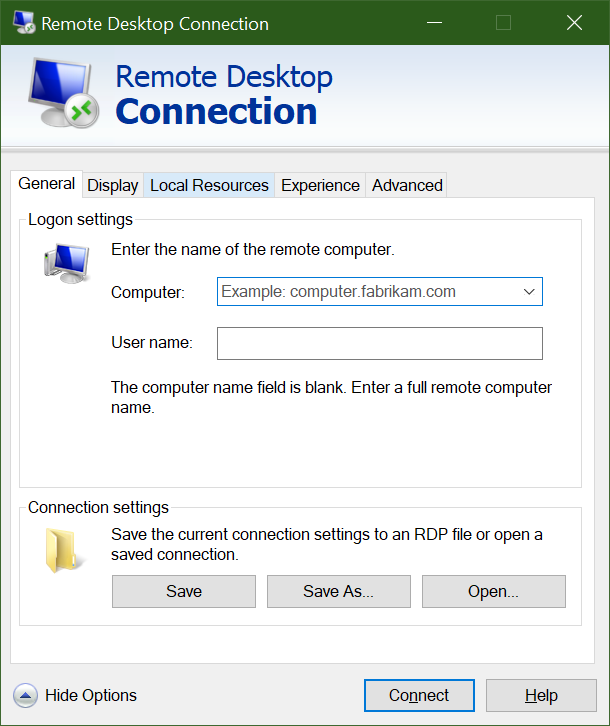

Now that you have a Windows VM in Azure, the next thing you’ll do is put your applications and data on those VMs to process our traffic videos. 

However, unless you’ve set up a site-to-site VPN to Azure, your Azure VMs won’t be accessible from your local network. If you’re just getting started with Azure, it’s unlikely that you have a working site-to-site VPN, so how can you transfer files to Azure VMs? One easy way is to use Azure’s Remote Desktop Connections feature to share your local drives with your new Azure VMs.

Now that we have a new Windows virtual machine, we need to install our custom software onto it. There are several options to choose from:

- Remote Desktop Protocol (RDP)
- Custom scripts
- Custom VM images (with the software preinstalled)

Let's look at the simplest approach for Windows VMs: Remote Desktop.

## What is the Remote Desktop Protocol?

Remote Desktop Protocol (RDP) provides remote connectivity to the UI of Windows-based computers. RDP lets you sign in to a remote physical or virtual Windows computer and control that computer as if you were seated at the console. An RDP connection allows you to carry out most operations that you can do from a physical computer's console, except for some power and hardware-related functions.

An RDP connection requires an RDP client. Microsoft provides RDP clients for the following operating systems:

- Windows (built-in)
- macOS
- iOS
- Android

The following screenshot displays the Remote Desktop Protocol client in Windows 10.

There are also open-source Linux clients, such as Remmina, that allow you to connect to a Windows PC from an Ubuntu distribution.

## Connecting to an Azure VM

As we learned a moment ago, Azure VMs communicate on a virtual network. They can also have an optional public IP address assigned to them. With a public IP, we can communicate with the VM over the Internet. Alternatively, we can set up a virtual private network (VPN) that connects our on-premises network to Azure, letting us securely connect to the VM without exposing a public IP. This approach is covered in another module, and is fully documented if you're interested in exploring that option.

One thing to be aware of with public IP addresses in Azure is they're often dynamically allocated. That means the IP address can change over time; for VMs, this happens when the VM is restarted. You can pay more to assign static addresses if you want to connect directly to an IP address instead of a name and need to ensure that the IP address won't change.

### How do you connect to a VM in Azure using RDP?

Connecting to a VM in Azure using RDP is a simple process. In the Azure portal, you'll go to your VM's properties, and at the top, select **Connect**. This shows you the IP addresses assigned to the VM and give you the option to download a **preconfigured.rdp** file that Windows then opens in the RDP client. You can choose to connect over the public IP address of the VM in the RDP file. Instead, if you're connecting over VPN or ExpressRoute, you can select the internal IP address. You can also select the port number for the connection.

If you're using a static public IP address for the VM, you can save the **.rdp** file to your desktop. If you're using dynamic IP addressing, the **.rdp** file only remains valid while the VM is running. If you stop and restart the VM, you must download another **.rdp** file.

> [!TIP]
> You can also enter the public IP address of the VM into the Windows RDP client and select **Connect**.

When you connect, you'll typically receive two warnings. These are:

- **Publisher warning**: caused by the **.rdp** file not being publicly signed
- **Certificate warning**: caused by the machine certificate not being trusted

In test environments, you can ignore these warnings. In production environments, the **.rdp** file can be signed using **RDPSIGN.EXE** and the machine certificate placed in the client's **Trusted Root Certification Authorities** store.

Let's try using RDP to connect to our VM.
