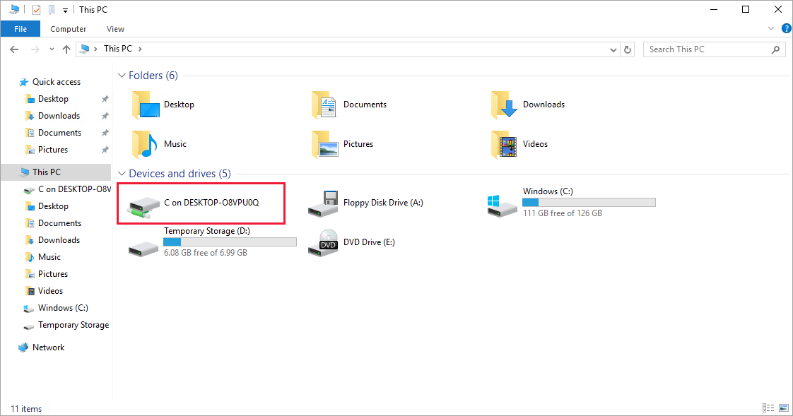
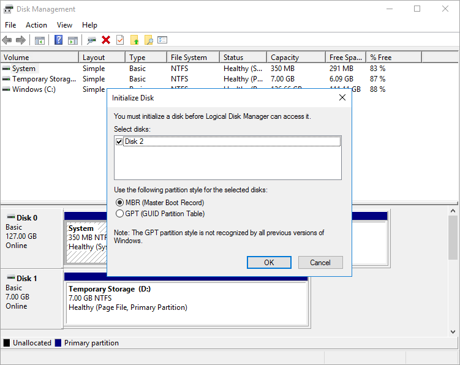

We have our Windows VM deployed and running, but it's not configured to do any work.

Recall our scenario is a video-processing system. Our platform receives files through FTP. The traffic cameras upload video clips to a known URL, which is mapped to a folder on the server. The custom software on each Windows VM runs as a service and watches the folder and processes each uploaded clip. It then passes the normalized video to our algorithms running on other Azure services.

There are a few things we'd need to configure to support this scenario:

- Install FTP and open the ports it needs to communicate
- Install the proprietary video codec unique to the city's camera system
- Install our transcoding service that processes uploaded videos

Many of these are typical administrative tasks we won't actually cover here, and we don't have software to install. Instead, we will walk through the steps and show you how you *could* install custom or third-party software using Remote Desktop. Let's start by getting the connection information.

## Connect to the VM with Remote Desktop Protocol

To connect to an Azure VM with an RDP client, you'll need:

- Public IP address of the VM (or private if the VM is configured to connect to your network)
- Port number

You can enter this information into the RDP client, or download a pre-configured **RDP** file.

> [!NOTE]
> An **RDP** file is a text file that contains a set of name/value pairs that define the connection parameters for an RDP client to connect to a remote computer using the Remote Desktop Protocol.

### Download the RDP file

1. In the [Azure portal](https://portal.azure.com/learn.docs.microsoft.com?azure-portal=true), ensure the **Overview** pane for the virtual machine that you created earlier is open. You can also find the VM on the Azure **home** page under **All Resources** if you need to open it. The **Overview** pane has a lot of information about the VM.

    - Determine whether the VM is running
    - Stop or restart it
    - Get the public IP address to connect to the VM
    - Get the activity of the CPU, disk, and network

1. In the top menu bar, select **Connect**, and select the **RDP** tab. The **Connect with RDP** pane appears for your virtual machine.

1. Note the **IP address** and **Port number** settings, then select **Download RDP File** and save it to your computer.

1. Before we connect, let's adjust a few settings. On Windows, find the file using Explorer, right-click it, and select **Edit** (you might need to select **Show more options** to find the **Edit** option). On macOS, you'll need to open the file first with the RDP client, then right-click on the item in the displayed list and select **Edit**.

1. You can adjust a variety of settings to control the experience in connecting to the Azure VM. The settings you'll want to examine are:

    - **Display**: By default, it'll be full screen. You can change this to a lower resolution, or use all your monitors if you have more than one.
    - **Local Resources**: You can share local drives with the VM, allowing you to copy files from your PC to the VM. Click the **More** button under **Local devices and resources** to select what is shared.
    - **Experience**: Adjust the visual experience based on your network quality.

1. Share your Local C: drive so it will be visible to the VM.

1. Switch back to the **General** tab, and select **Save** to save the changes. You can always come back and edit this file later to try other settings.

### Connect to the Windows VM

1. Select **Connect**.

1. On the **Remote Desktop Connection** dialog box, note the security warning and the remote computer IP address, and then select **Connect** to start the connection to the VM.

1. In the **Windows Security** dialog box, enter your username and password that you created in the previous exercise.

    > [!NOTE]
    > If you are using a Windows client to connect to the VM, it will default to known identities on your machine. Select the **More choices** option, and then select **Use a different account** that lets you enter a different username/password combination.

1. In the second **Remote Desktop Connection** dialog box, note the certificate errors, and then select **Yes**.

### Install worker roles

The first time you connect to a Windows server VM, it will launch Server Manager. This allows you to assign a worker role for common web or data tasks. You can also launch the Server Manager through the Start Menu.

This is where we'd add the Web Server role to the server. This will install IIS and as part of the configuration you'd turn off HTTP requests and enable the FTP server. Or, we could ignore IIS and install a third-party FTP server. We'd then configure the FTP server to allow access to a folder on our big data drive we added to the VM.

Because we aren't going to actually configure that here, just close Server Manager.

## Install custom software

We have two approaches we can use to install software. First, this VM is connected to the internet. If the software you need has a downloadable installer, you can open a web browser in the RDP session, download the software, and install it. Second, if your software is custom, like our custom service, you can copy it from your local machine over to the VM to install it. Let's look at this latter approach.

1. Open File Explorer. In the sidebar, select **This PC**. You should see several drives:

    - Windows (C:) drive representing the OS
    - Temporary Storage (D:) drive
    - Your local C: drive (it will have a different name than the following screenshot)

    

With access to your local drive, you can copy the files for the custom software onto the VM and install the software. We won't actually do that because it's just a simulated scenario, but you can imagine how it would work.

The more interesting thing to observe in the list of drives is what is *missing*. Notice that our **Data** drive is not present. Azure added a VHD but didn't initialize it.

## Initialize data disks

Any additional drives you create from scratch will need to be initialized and formatted. The process for doing this is identical to a physical drive.

1. Launch the Disk Management tool from the **Start** menu. You may have to go to the **Computer Management** tool first, then **Disk Management**, or try searching for *Disk Management* in the **Start** Menu.

1. The Disk Management tool will display a warning that it has detected an uninitialized disk.

    

1. Select **OK** to initialize the disk. It'll then appear in the list of volumes, where you can format it and assign a drive letter.

1. Open File Explorer, and you should now have your data drive.

1. Go ahead and close the RDP client to disconnect from the VM. The server will continue to run.

RDP allows you to work with the Azure VM just like a local computer. With Desktop UI access, you can administer this VM as you would any Windows computer; installing software, configuring roles, adjusting features and other common tasks. However, it's a manual process. If you always need to install some software, you might consider automating the process using scripting.
