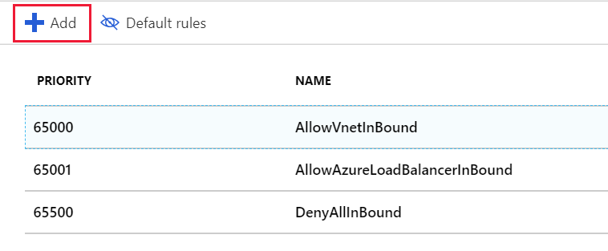
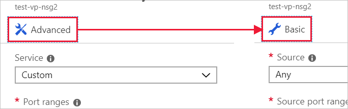
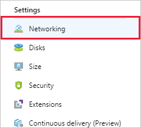
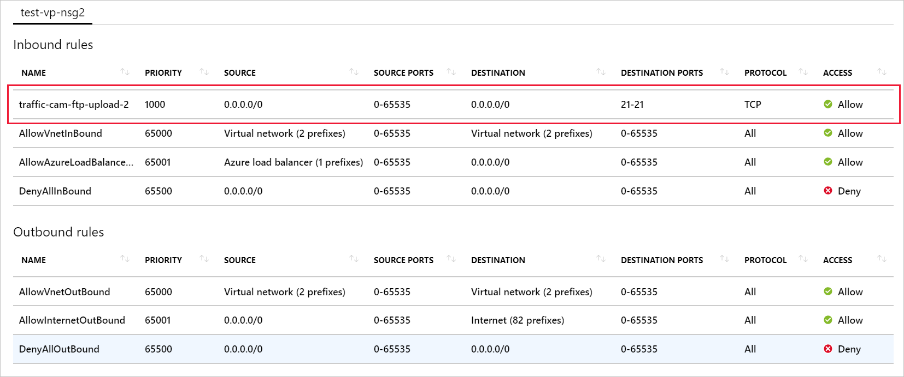

Our server is ready to process video data; the last thing we need to do is open the ports that the traffic cameras will use to upload video files to our server.

## Create a network security group

Azure should have created a security group for us because we indicated we wanted Remote Desktop access. But let's create a new security group so you can walk through the entire process. This is particularly important if you decide to create your virtual network _before_ your VMs. As mentioned earlier, security groups are _optional_ and not necessarily created with the network.

> [!NOTE]
> Since this is _supposed_ to be the second VM, we would already have a security group to apply to our network, but let's pretend for a moment that we don't, or that the rules are different for this VM.

1. In the [Azure portal](https://portal.azure.com/learn.docs.microsoft.com?azure-portal=true), click the **Create a resource** button in the left corner sidebar to start a new resource creation.

1. Type "Network security group" into the filter box and select the matching item in the list.

1. Make sure the **Resource Manager** deployment model is selected and click **Create**.

1. Provide a **Name** for your security group. Again, naming conventions are a good idea here, let's use "test-vp-nsg2" for "Test Video Processor Network Security Group #2".

1. Select the proper **Subscription** and use your existing **Resource group**, "<rgn>[sandbox resource group name]</rgn>".

1. Finally, put it into the same **Location** as the VM / Virtual Network. This is important - you won't be able to apply this resource if it's in a different location.

1. Click **Create** to create the group.

## Add a new inbound rule to our Network Security Group

Deployment should complete quickly.

1. Find the new security group resource and select it in the Azure portal.

1. On the overview page, you'll find that it has some default rules created to lock down the network.

    On the inbound side:

    - All inbound traffic from one VNet to another is allowed. This lets resources on the VNet talk to each other.
    - Azure Load balancer "probe" requests to ensure the VM is alive
    - All other inbound traffic is denied.

    On the outbound side:
    - All in-network traffic on the VNet is allowed.
    - All outbound traffic to the Internet is allowed.
    - All other outbound traffic is denied.

> [!NOTE]
> These default rules are set with high priority values, which means that they get evaluated _last_. They cannot be changed or deleted, but you can _override_ them by creating more specific rules to match your traffic with a lower priority value.

1. Click the **Inbound security rules** section in the **Settings** panel for the security group.

1. Click **+ Add** to add a new security rule.

    

    There are two ways to enter the information necessary for a security rule: basic and advanced. You can switch between them by clicking the button at the top of the "add" panel.

    

    The advanced mode provides the ability to completely customize the rule, however, if you just need to configure a known protocol, the basic mode is a bit easier to work with.

1. The panel starts in **Advanced** mode, click the **Basic** button at the top to switch to basic mode which has less options to fill out.

1. Add the information for our FTP rule.

    - Set the **Service** to be FTP. This will set your port range up for you.
    - Set the **Priority** to "1000". It has to be a lower number than the default **Deny** rule. You can start the range at any value, but it's recommended you give yourself some space in case an exception needs to be created later.
    - Give the rule a name, we'll use "traffic-cam-ftp-upload-2".
    - Give the rule a description.

1. Switch back to the **Advanced** mode by clicking the **Advanced** button at the top. Notice that our settings are still present. We can use this panel to create more fine-grained settings. In particular, we would likely restrict the **Source** to be a specific IP address or range of IP addresses specific to the cameras. If you know the current IP address of your local computer, you can try that. Otherwise, leave the setting as "Any" so you can test the rule.

1. Click **Add** to create the rule. This will update the list of inbound rules - notice they are in priority order, which is how they will be examined.

## Apply the security group

Recall that we can apply the security group to a network interface to guard a single VM, or to a subnet where it would apply to any resources on that subnet. The latter approach tends to be the most common so let's do that. We could get to this resource in Azure through either the virtual network resource or indirectly through the VM, which is using the virtual network.

1. Switch to the **Overview** panel for the virtual machine. You can find the VM under **All Resources**.

1. Select the **Networking** item in the **Settings** section.

    

1. In the networking properties, you will find information about the networking applied to the VM including the **Virtual network/subnet**. This is a clickable link to get to the resource. Click it to open the virtual network. This link is _also_ available on the **Overview** panel of the VM. Either of these will open the **Overview** of the virtual network.

1. In the **Settings** section, select the **Subnets** item.

1. We should have a single subnet defined (default) from when we created the VM + network earlier. Click the item in the list to open the details.

1. Click the **Network security group** entry.

1. Select your new security group: **test-vp-nsg2**.

1. Click **Save** to save the change. It will take a minute to apply to the network.

## Verify the rules

Let's validate the change.

1. Switch back to the **Overview** panel for the virtual machine. You can find the VM under **All Resources**.

1. Select the **Networking** item in the **Settings** section.

1. In the **Overview** panel for the network, there is a link for **Effective security rules** that will quickly show you how rules are going to be evaluated. Click the link to open the analysis and make sure you see your FTP rule.

    

1. This rule would let you connect to an FTP server; if we had added the FTP worker role and configured folders, you would be able to use an FTP client to connect to the server.

## One more thing

Security rules are tricky to get right. We actually made a mistake when we applied this new security group - we lost our Remote Desktop access! To fix this, you can add another rule to the security group to support RDP access. Make sure to restrict the inbound TCP/IP addresses for the rule to be the ones you own.

> [!WARNING]
> Always make sure to lock down ports used for administrative access. An even better approach is to create a VPN to link the virtual network to your private network and only allow RDP or SSH requests from that address range. You can also change the port used by RDP to be something other than the default 3389. Keep in mind that changing ports is not sufficient to stop attacks, it simply makes it a little harder to discover.