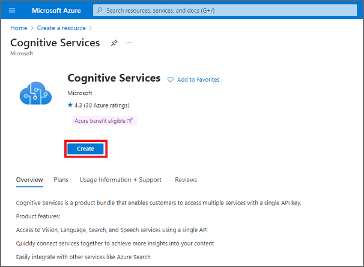
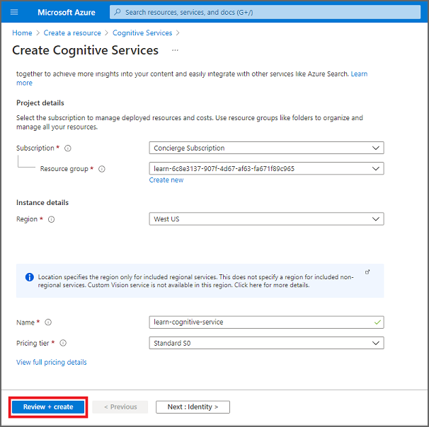

Azure Cognitive Services is a product bundle that allows customers to access multiple services—such as vision, language, and speech—by using a single API key.

For your company's transcription department, you'll focus on Azure Cognitive Services' speech-to-text features to transcribe your clients' audio files into text that you can return to your clients.

However, before you can create an application that uses Azure Cognitive Services like as speech to text, you need to create an Azure Cognitive Services account.

In the next unit, you'll complete an exercise that uses the Azure Command Line Interface (CLI) to create an Azure Cognitive Services account. However, you can also use the Azure portal, which we describe in the following section.

## Create an Azure Cognitive Services account using the Azure portal

1. Sign into the [Azure portal](https://portal.azure.com/?azure-portal=true).

1. On the home page, select **Create a resource**.

1. When the **Create a resource** page is displayed, enter **Cognitive Services** in the search box, then select **Cognitive Services** when it's displayed.

    

1. When the **Cognitive Services** page is displayed, select **Create**.

    

1. When the **Create Cognitive Services** page is displayed, enter the following information:

    1. Choose your **Subscription** from the drop-down menu.

    1. Choose a **Resource group** from the drop-down menu, or select the **Create new** link to create a new resource group.

    1. Choose the **Region** that's closest to you.

    1. Enter a unique name for the **Name**.

    1. Choose a **Pricing tier** from the drop-down menu. (You can select the **View full pricing details** link to review pricing details for the tiers.)

    1. After you've reviewed the terms in the **Responsible AI Notice**, select the box to acknowledge that you've read and understood all the terms.

    1. After you've entered the preceding information, select **Review + create**.

    

1. If the information that you have entered looks good and you see the **Validation Passed** notification, select **Create**.
