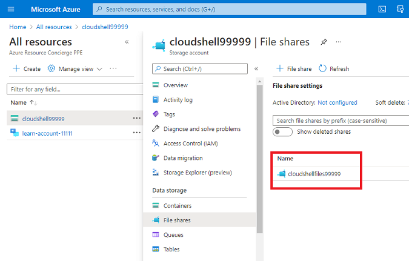
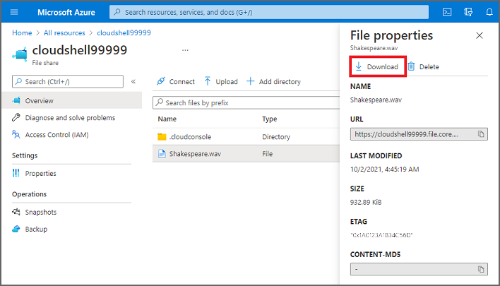

In order to listen to the WAV file that your application created, you'll first need to download it. To do so, use the following steps.

1. In the Cloud Shell on the right, use the following command to copy the WAV file to your temporary cloud drive:

    ```bash
    cp Shakespeare.wav ~/clouddrive
    ```

1. Sign in to the [Azure portal](https://portal.azure.com/learn.docs.microsoft.com?azure-portal=true) with the same account you used to activate the sandbox.

1. Select **All resources** on the Azure portal home page.

1. When the **All resources** page is displayed, select your **cloudshellNNNNN** storage account, then select **File shares**, then select your **cloudshellfilesNNNNN** file share.

    [](../media/5-cloud-shell-file-shares.png#lightbox)

1. When your **cloudshellfilesNNNNN** file shares page is displayed, select **Browse**, then select the **Shakespeare.wav** file, then select the **Download** icon.

    [](../media/5-cloud-shell-file-download.png#lightbox)

1. Download the **Shakespeare.wav** file to your computer, where you can listen to it with your operating system's audio player.
