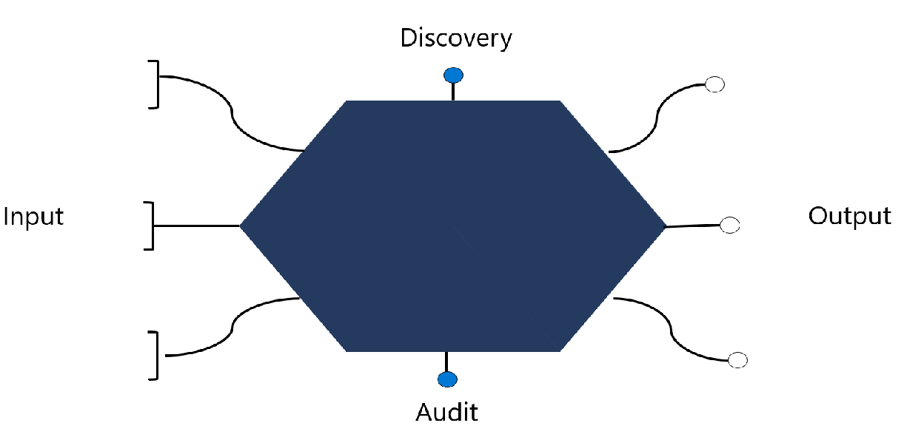
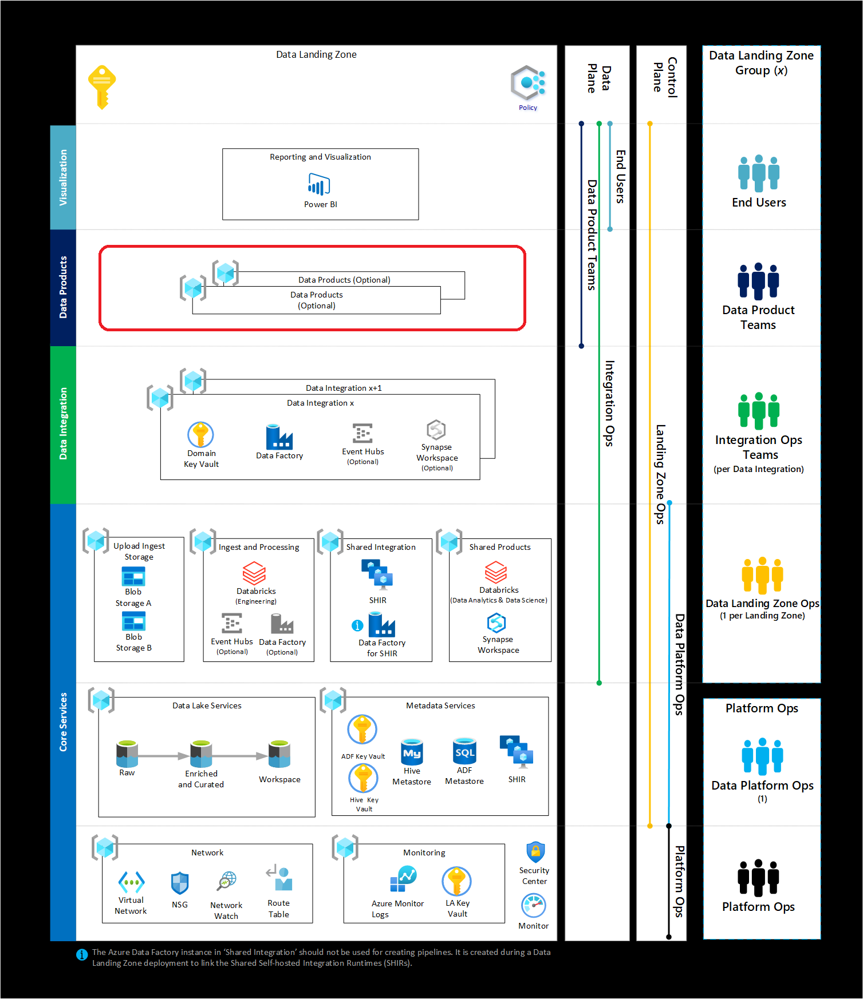
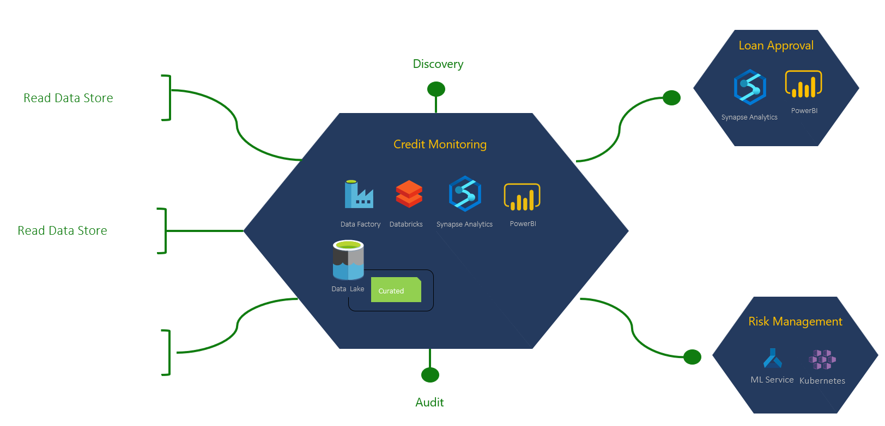
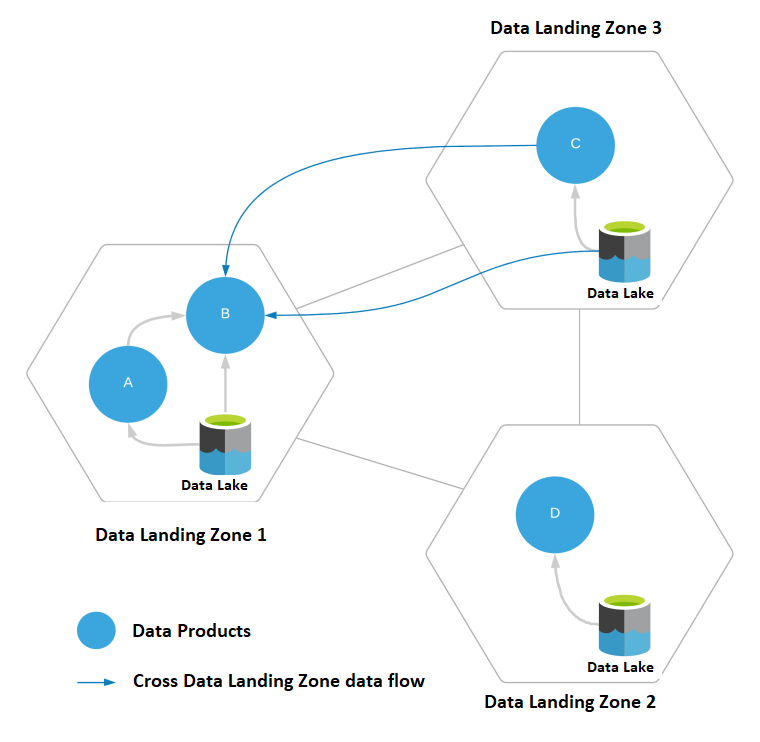
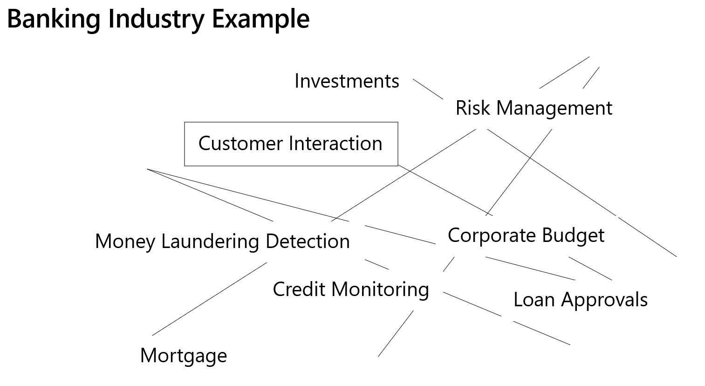

A data product landing zone serves as a design area where all data products could be hosted. A data product brings all siloed, hidden, non-discoverable data together in a systematic domain driven approach. It makes this dataset available as a high quality data asset to the consumer. A data product is similar to software product who has an owner.  The business values it serves is in the form of data as a business critical service.

## Significance

At a high level, data products are computed or polyglot persistence services that might be required depending on certain use cases. A data product is anything that drives business value, for example, reports, workbooks, bespoke database, or data API. It can use other services and technologies that aren't part of data landing zone core services. Data products fulfill a specific need within a business with data. Data products manage, organize and make sense of the data across domains and present the insights gained from the data products.

Examples of Data Products include:

- Functions
- App Service
- Logic Apps
- Azure Analysis Services
- Azure AI services
- Azure Machine Learning
- Azure SQL DB
- Azure MySQL
- Azure Cosmos DB

A data product is a result of data from one or many data integrations and/or other data products.

## Typical data product components are shown below

## Cross-product flow

A data product could also use data services from other data products as below and provide a composite product as depicted below 

### Here is an example for a banking data product

## Other references

<a href="/azure/cloud-adoption-framework/scenarios/data-management">Data Management and Analytics</a>
