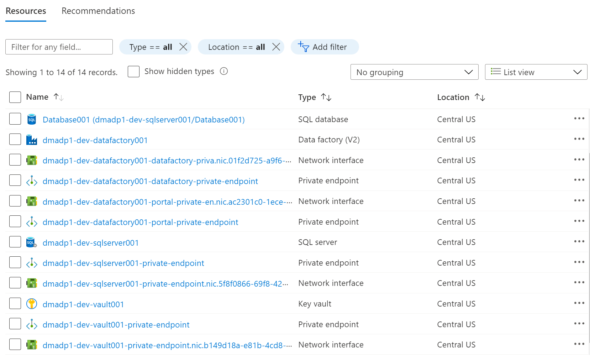

This module walks you through the process of provisioning a "Data Product" with in a "Data landing zone" into your own Azure subscription

## Step 1 - Complete Prerequisites

- A Data Management Landing Zone deployed. Refer to Exercise 1 for details.
- A Data Landing Zone deployed. Refer to Exercise 2 for details.

## Step 2 - Initiate the workflow to complete the data management landing zone using the portal wizard UI

In this Step 2, provide the following information

- Subscription: Select the subscription to deploy the Data Product to. 

- Resource Group: Type “dev-dp001” on the dropdown and select the resource group that has the DLZ prefix you created earlier plus the “-dev-dp001” suffix.

- Location: Select from the dropdown. If there are no organizational policies influencing the location, it's a good idea to pick a region that is physically close to you. Verify that this region is supported for Enterprise Scale Analytics. A list of supported region 's available here and navigate to “Supported Regions”

- Environment: We recommend you choose Development

- Data Product Name: A prefix added to all the deployed data product resources to make them unique within the subscription. The length can be a max of 10 alphanumeric characters.

## Step 3 - select next for General Settings

In this step 3, provide the following information

- Create Data Processing Service: Select Data Factory from the dropdown menu.

- Connect to Purview Account: Select from the dropdown the Azure Purview you created when deploying the Data Management Landing Zone.

- SQL Flavor: Select “SQL Server” from the dropdown menu.

- Password: Enter a strong password for your Azure SQL Server account, and confirm it.

- Enable Azure Cosmos DB: Leave this option unchecked

- Enable role assignments: This selection is optional, but you should Check this option to add required permissions.

## Step 4 - select next for Connectivity Settings

In this Step 4, provide the following information

- Virtual Network: Select the Virtual Network of your Data Landing Zone.

- Subnet: Select the “DataIntegration” Subnet. (Follow the note on the beginning of the Virtual Network section)

- DNS A-Records are deployed through Azure Policy: Select No and proceed to select the subscription and all the other requested DNS Zones.

## Step 5 - select "Review + Create" for final review and create

## Step 6 - Validation after deployment

You can use the details here to validate the deployment.

### Resource Group Name - XXXX-dev-dp001

## Other references

<a href="/azure/cloud-adoption-framework/scenarios/data-management">Data Management and Analytics</a>
