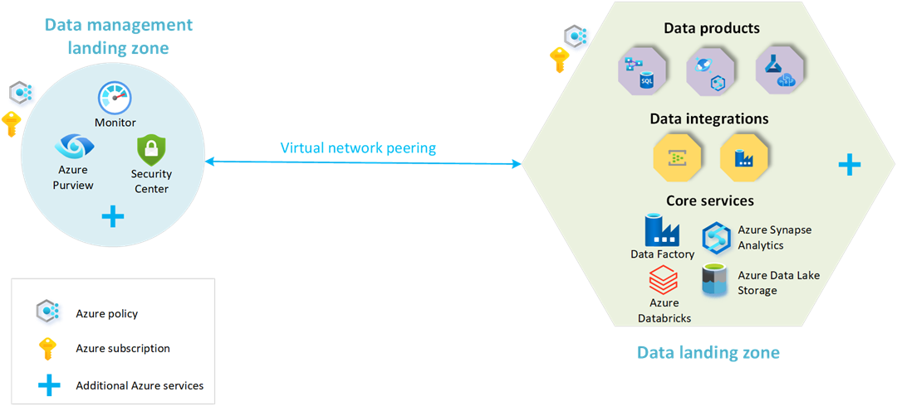
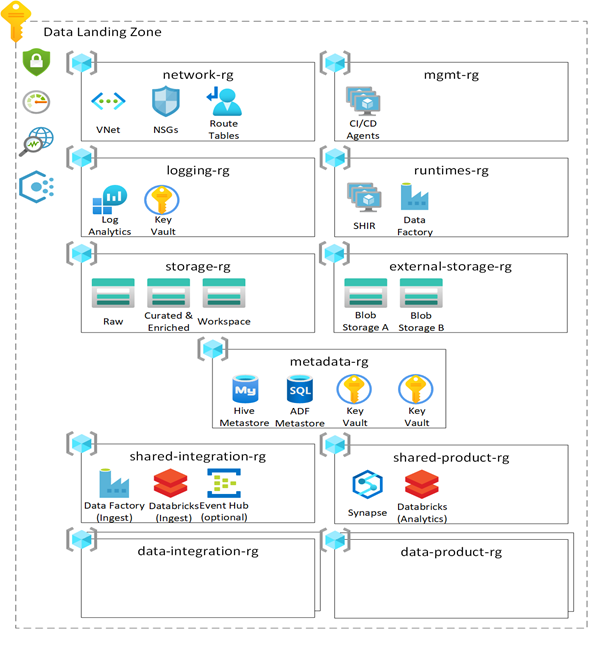

#

The data landing zone is classified as a hosting area for the data centric workloads. It's always connected to the data management landing zone via networking components to allow for centralized governance and monitoring.

## Significance

A data landing zone has several layers to enable agility to service data integrations and data products within it.

These layers are

- Core Services Layer, which provides plumbing and foundational services
- Data Integration Layer, which provides gateway for ingestion and enrichment for data from external sources
- Data Product Layer, which provides a path to host and build data as a product with well - defined ownership with in an enterprise
- Data Visualization Layer, which provides a path to host and build data consumption service

Let's discuss each layer below.

### Core Services

Core Services is deployed in a separate resource group. The first one is the networking, which consists of Network Security Groups, Network Watcher, and Virtual Network. The Virtual Network is automatically peered with the Data Management Landing Zone VNet and Connectivity Subscription VNet.

The second is Enterprise Data Lake that consists of Azure Data Lake Storage Gen2 instance to store data in three zones namely Raw, Curated & enriched and Workspace. This pattern enables best practice data separation and unlock use cases on advanced data analytics and AI/ML. A separate space is also allocated to absorb any staging of data from external sources

The third is logging and monitoring for centralized logging and monitoring

The fourth is Meta Data service whose main objective is to enable storing business metadata and capture technical metadata. The technical metadata is captured through Azure Purview instance in the "Data Management" landing zone. This layer consists of a Virtual machine to function as Self-hosted integration runtime used by the Azure Purview instance. The types of data that you'll store in the data landing zone will help determine any other services that should be here. For example, if you're storing sensitive (personal data) data, you might include a tokenization engine. The tokenization engine will ensure that all sensitive (personal data) data can be tokenized as it's ingested into the data lake. An Azure Database for MySQL database will be provisioned. The Azure Databricks engineering workspaces and Azure Databricks analytics and data science workspace use it as their external Apache Hive meta store.
  
The fifth layer is upload ingest storage to enable storing any data from third party publishers. Third party data publishers need to land their data into the platform so integration ops can pull it into their Data Lakes

The sixth layer is for data ingestion and processing to enable automatic ingestion of data using various technologies. The service generally consists of an instance of Azure Databricks. It could also use Event Hubs or IoT Hub for real-time streaming to Event Hubs.

The last 2 are called shared integration and shared products to enable shared services used across multiple data warehouses for fast data integration

### Data Products

Data Products are compute or polyglot persistence services that may be required depending on the use case. We therefore expect multiple resource groups by data product. Data products fulfill a specific need within a business with data.  Data products manage, organize and make sense of the data across domains and present the insights gained from the data products. A data product is a result of data from one or many data integrations and/or other data products.

### Data Integration

A data integration is responsible for data ingestion and enrichment only from external sources such as metrics, finance, and CRM. This layer can operate in both real-time, batch and micro-batch. This layer is a special type of data product and is represented as an empty resource group

Details of Data Integration will be covered in next module

### Data Visualization

For every data landing zone, an empty visualization resource group will be created. This group can be filled with services required to implement your visualization solution.
