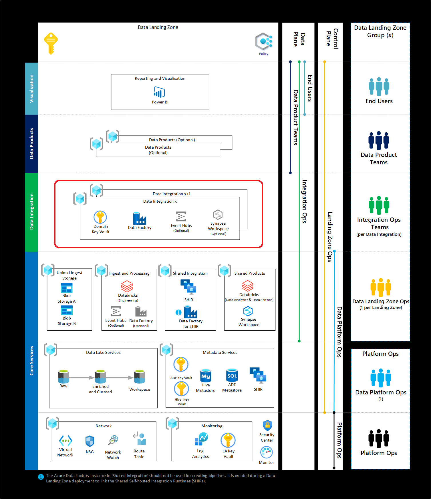

A data integration landing zone serves as a design area where all data integration flows are hosted. It's a special type of data product, which provides data orchestration from external sources. The external data sources include telemetry data, finance, and CRM etc..This layer can operate in both real-time, batch and micro-batch.

## Significance

A data integration zone provides a centralized location. It's a zone to host data flow orchestration to allow for seamless data curation, filtering, transformation and security. If there was real-time analytics use case, it will host services like Azure Event Hubs while for batch processing Azure Data Factory is sufficient.

## Other references

<a href="/azure/cloud-adoption-framework/scenarios/data-management">Data Management and Analytics</a>
