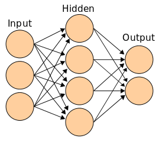

Azure Databricks provide capabilities to build deep learning algorithms that can be used to solve complex problems. Artificial neural networks make it possible to build such types of algorithms.

## What are artificial neural networks?

Artificial neural networks are simpler representation of complex and dense neuron networks of a human brain. It is computing system consisting of several simple and interconnected elements or neurons that process complex data inputs with human-like precision and generates desired output.

## What is a neuron?

An artificial neuron is a mathematical function conceived as a model of biological neurons. The artificial neuron receives one or more inputs (*features* X0, X1, X2, ...), sums them with different weights (W0, W1, W2 ...) and uses this sum as an argument for a nonlinear function (f also called *activation function*). 

X0 typically equals to 1, and it's called *bias*. 
The weights of each of the neurons are determined when we train the neural network. Initially, these weights are randomly initialized.

## Common use cases for deep learning

Some of the use cases for deep learning techniques are listed below.

- **Speech recognition**. Deep learning solutions are used in several speech recognition programs where a machine produces results based on speech commands. Examples include, Microsoft's Cortana or Amazon's Alexa.

- **Image recognition**. Several platforms use image recognition programs to identify and analyze images and pictures. For example, Facebook's facial recognition feature uses deep learning programs to identify faces in a picture to give tagging suggestions.

- **Health predictions**. Several medical organizations use deep learning tools to analyze large and complex data sets to make health-related predictions. These predictions help pharmaceutical companies to work towards innovating new methods and medication to address problems.

- **Security**. Deep learning is being widely used by large companies to mitigate cyber security threats. These techniques are efficient in detecting cyber attacks and alerting the organizations to take preventive methods.

## Azure Databricks deep learning solution

- **Deep Learning Pipelines**. An open-source high-level deep learning API framework that enables lower-level deep learning libraries using Spark MLlib Pipelines API. It currently supports TensorFlow and Keras with the TensorFlow-backend.

- **TensorFlow**. Azure Databricks uses TensorFlow libraries to provide high-level numerical computation. TesorFlow libraries can be installed and integrated with Azure Databricks to generated high performing deep learning models. It can be used to run on a single node or a distributed one.

- **Distributed deep learning**. The Horovod framework, supported by Azure Databricks, enables a complex model training by allowing you to train your neural networks on multiple machines simultaneously.

- **Integrated libraries**. Azure Databricks supports integration with several other high-level deep learning frameworks such as, MXNet, Keras, and PyTorch that allows you to train you high performing neural networks.