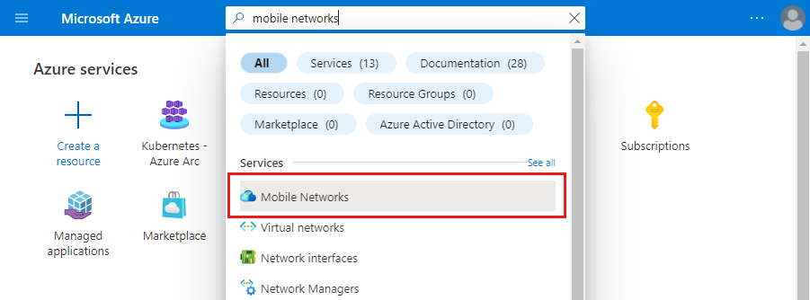
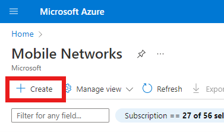
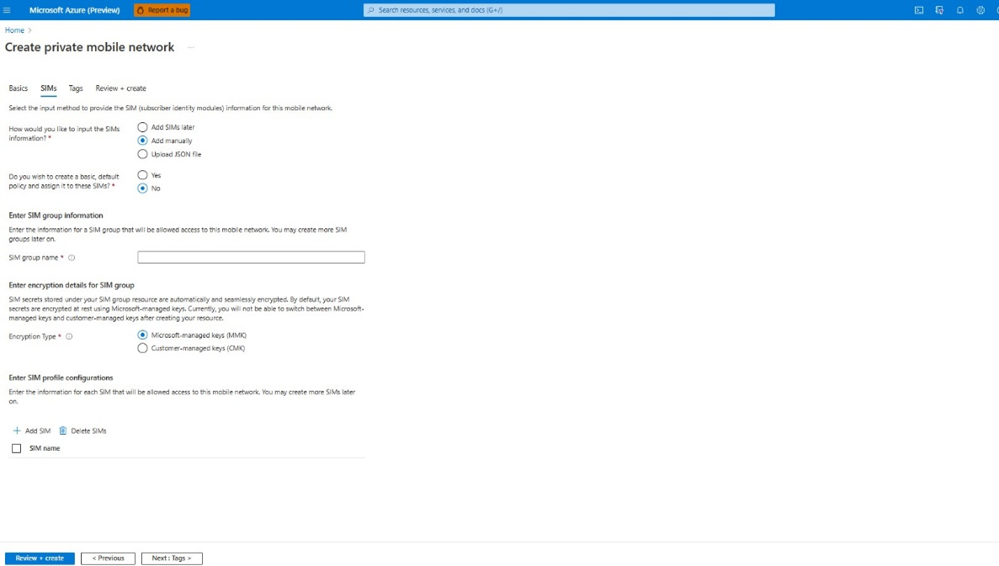
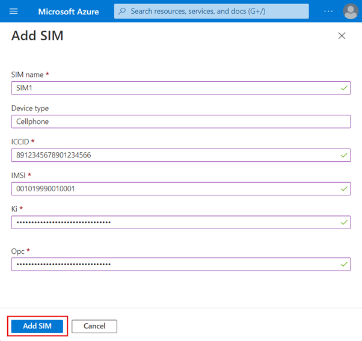
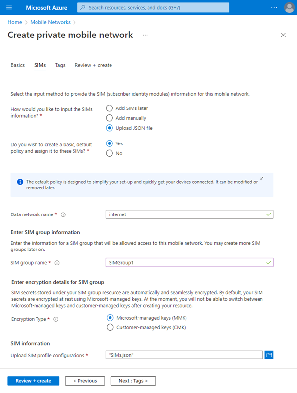
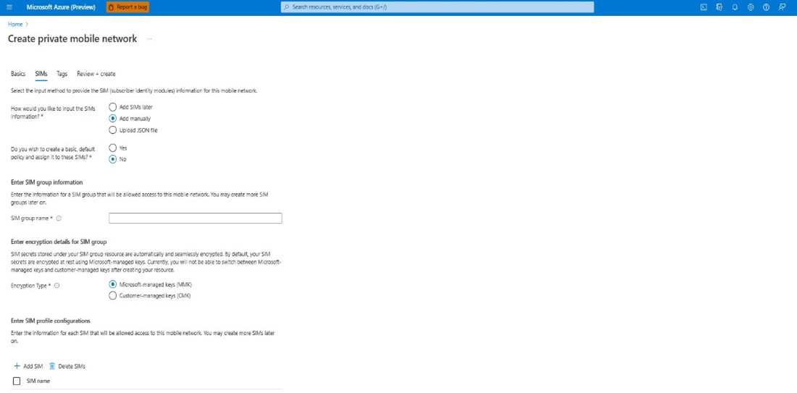

## Create a Private mobile network

In this section, lets learn:

- the prerequisites for creating a mobile network.
- deployment procedure for creating a mobile network.

### Prerequisites for creating a mobile network using Azure portal

You need to collect the following values for preparing the deployment: 

#### **Collect mobile network resource values:**

| **Value** | **Field name in Azure portal** |
|---|---|
| **The Azure subscription to use to deploy the mobile network resource. You must use the same subscription for all resources in your private mobile network deployment. You identified this subscription in **[**Complete the prerequisite tasks for deploying a private mobile network**](https://learn.microsoft.com/en-us/azure/private-5g-core/complete-private-mobile-network-prerequisites)**.** | **Project details:** Subscription |
| **The Azure resource group to use to deploy the mobile network resource. You should use a new resource group for this resource.** **It's useful to include the purpose of this resource group in its name for future identification (for example,** **rg-pmn-contoso-prod-001).** | **Project details:** Resource group |
| **The name for the private mobile network.** | **Instance details:** Mobile network name |
| **The region in which you're deploying the private mobile network.** **You can use any of East US, West US, or West Europe region.** | **Instance details:** Region |
| **The mobile country code (MCC) for the private mobile** **network.**  **Example: 999 for a private network** | **Network configuration:** Mobile country code (MCC) |
| **The mobile network code (MNC) for the private mobile** **network.** **Example: 999 for a private network** | **Network configuration:** Mobile network code (MNC) |

#### **Collect SIM and SIM group values:**

As part of creating your private mobile network, you can provision one or more SIMs that will use it.

> [!NOTE]
> If you decide not to provision SIMs at this point, you can do so after deploying your private mobile network.  Likewise, if you need more than one SIM group, you can create additional SIM groups after you've deployed your private mobile network. 

#### **Decide whether you want to use the default service and SIM policy:**

Azure Private 5G Core offers a default service and SIM policy that allow all traffic in both directions for all the SIMs you provision. They're designed to allow you to quickly deploy a private mobile network and bring SIMs into service automatically, without the need to design your own policy control configuration. 

#### **Configure custom location for AKSE cluster:**

To configure ASE and to create AKS cluster on the ASE using Azure Portal, refer to [Azure Stack Edge documentation | Microsoft Learn](https://learn.microsoft.com/en-us/azure/databox-online/) and [AP5GC on AKS -on-Prem](https://microsoft.sharepoint.com/:w:/r/teams/AzurePrivateMobileService/_layouts/15/doc2.aspx?sourcedoc=%7Bfe6ca1fe-a5ea-45ce-8f10-78c1a837812d%7D&action=view&wdAccPdf=0&wdparaid=746236E0)[https://microsoft.sharepoint.com/:w:/r/teams/AzurePrivateMobileService/_layouts/15/doc2.aspx?sourcedoc={fe6ca1fe-a5ea-45ce-8f10-78c1a837812d}&action=view&wdAccPdf=0&wdparaid=746236E0](https://microsoft.sharepoint.com/:w:/r/teams/AzurePrivateMobileService/_layouts/15/doc2.aspx?sourcedoc=%7Bfe6ca1fe-a5ea-45ce-8f10-78c1a837812d%7D&action=view&wdAccPdf=0&wdparaid=746236E0) 

For more information on each of the prerequisites, refer [Prepare to deploy a private mobile network - Azure Private 5G Core Preview | Microsoft Learn](https://learn.microsoft.com/en-us/azure/private-5g-core/complete-private-mobile-network-prerequisites) 

### Deployment procedure for creating a mobile network using Azure portal

This section helps you to create the mobile networks resource representing your private mobile network. You can also provision one or more SIMs, and / or create the default service and SIM policy.

1. Sign in to the [Azure portal](https://portal.azure.com/). 
1. In the Search bar, type mobile networks. Select the Mobile Networks from the drop-down.  

On the **Mobile Networks** page, select **Create**. 

3. Use the information you collected in [Collect private mobile network resource values](https://learn.microsoft.com/en-us/azure/private-5g-core/collect-required-information-for-private-mobile-network) to fill out the fields on the **Basics** configuration tab. Once you've done this, select **Next : SIMs >**. 

3. On the SIMs configuration tab, select your chosen input method by selecting the appropriate option next to **How would you like to input the SIMs information?** You can then input the information you collected in [Collect SIM and SIM Group values](/azure/private-5g-core/collect-required-information-for-private-mobile-network).
1. If you decide not to provision any SIMs at this point, select **Add SIMs later**. By this you can choose to add SIMs later while managing mobile networks. For more information, refer to ‘[’Management’’](https://review.learn.microsoft.com/en-us/training/modules/manage-azure-private-5g-core/?branch=pr-en-us-31182) module.

- If you select **Add manually**, a new **Add SIM** button appears under Enter SIM profile configurations. Select it, fill out the fields with the correct settings for the first SIM you want to provision, and select **Add** **SIM**. Repeat this process for each additional SIM you want to provision. 

- If you select **Upload JSON file**, the Upload SIM profile configurations field appears. Use this field to upload your chosen JSON file. 

Here is the **sample JSON file**:

[

{

        "simName": "File_01",

        "integratedCircuitCardIdentifier": "8912345678901234801",

        "authenticationKey": "00112233445566778899AABBCCDDEEFF",

        "operatorKeyCode": "00000000000000000000000000000001",

        "internationalMobileSubscriberIdentity": "001019990000101",

        "deviceType": "Mobile"

    },

    {

        "simName": "File_02",

        "integratedCircuitCardIdentifier": "8912345678901234802",

        "authenticationKey": "00112233445566778899AABBCCDDEEFF",

        "operatorKeyCode": "00000000000000000000000000000001",

        "internationalMobileSubscriberIdentity": "001019990000102",

        "deviceType": "Mobile"

}

]

4. If you're provisioning SIMs at this point, perform the following additional steps. 
   If you want to use the default service and SIM policy, set **Do you wish to create a basic, default SIM policy and assign it to these SIMs?** to **Yes**, and then enter the name of the data network into the **Data network name** field that appears. 
 If you do not want to use the default service and SIM policy, set **Do you wish to create a basic, default SIM policy and assign it to these SIMs?** to **No.**

6. Under Enter SIM group information, set SIM group name to your chosen name for the SIM group to which your SIMs will be added. 
  Under Enter encryption details for SIM group, set Encryption type to your chosen encryption type.  Once the SIM group is created, you cannot change the encryption type. 

On SIM group creation, customers can either select **Customer Managed Key** option and provide the identity and encryption key details or can select **Microsoft Managed Key (None)** which is a default one.

On selecting **Microsoft Managed Key** option, SIM group and SIM workflow will remain the same as existing. No additional encryption will be applied on the SIM secrets (Ki and OPC).

If a customer prefers to provide their own key for encryption, they have to select **Customer Managed Key** option and provide the identity and encryption key details while creating the SIM group. The provided encryption key will be used to encrypt all the SIM secrets that get added to the corresponding SIM group.

If you selected **Customer-managed keys (CMK)**, set the **Key URI** and **User-assigned identity** to those the SIM group will use for encryption. For more information on CMK requirements, refer [Manage SIM groups - Azure portal - Azure Private 5G Core Preview | Microsoft Learn.](https://learn.microsoft.com/en-us/azure/private-5g-core/manage-sim-groups)

8. Select **Review + create**. 
1. Azure validates the configuration values you've entered. You should see a message indicating that your values have passed validation. 

If the validation fails, you'll see an error message. Select the flagged tab(s) and use the error messages to correct **any invalid configuration parameters** before returning to the **Review + create** tab.

10. Once the configuration has been validated, select **Create** to create the mobile networks resource and any SIM resources. 
1. The Azure portal deploys the resources into your selected resource group. You'll see the following confirmation screen when your deployment is complete: 

> [!NOTE]
> Every deployment, success or failure, will have a correlation id.  The correlation id is an id for the log which will help the support team analyse the reason for failure.
> 

You can validate the mobile network created.

Select **Go to resource group**, and then check that your new resource group contains the correct **Mobile Networks** resource. It may also contain the following, depending on the choices you made during the procedure. 

- A **SIM group** resource (if you provisioned SIMs). 

- **Service**, **SIM Policy**, **Data Network**, and **Slice** resources (if you decided to use the default service and SIM policy). 

