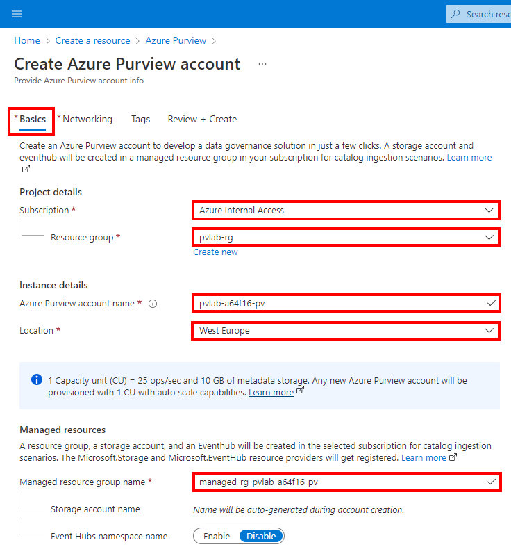
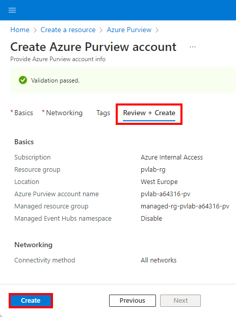

In this unit, you will use the Azure portal to create an Azure Purview account.

1. Sign in to the Azure portal, expand the portal menu and click **Create a resource**.  

2. Search the Marketplace for "Azure Purview" and click **Create**.  

3. Provide the necessary inputs on the **Basics** tab.
* Select an existing Azure susbcription.
* Select an existing resource group or create a new resource group.
* Enter a globally unique Azure Purview account name.
* Select a location.
* Optionally, overwrite the auto-generated managed resource group name.  

4. On the **Networking** tab, select **All networks**.  

5. On the **Review + Create** tab, once the message in the ribbon returns "Validation passed", verify your selections and click **Create**.  

6. Wait several minutes while your deployment is in progress. Once complete, click **Go to resource**.  

