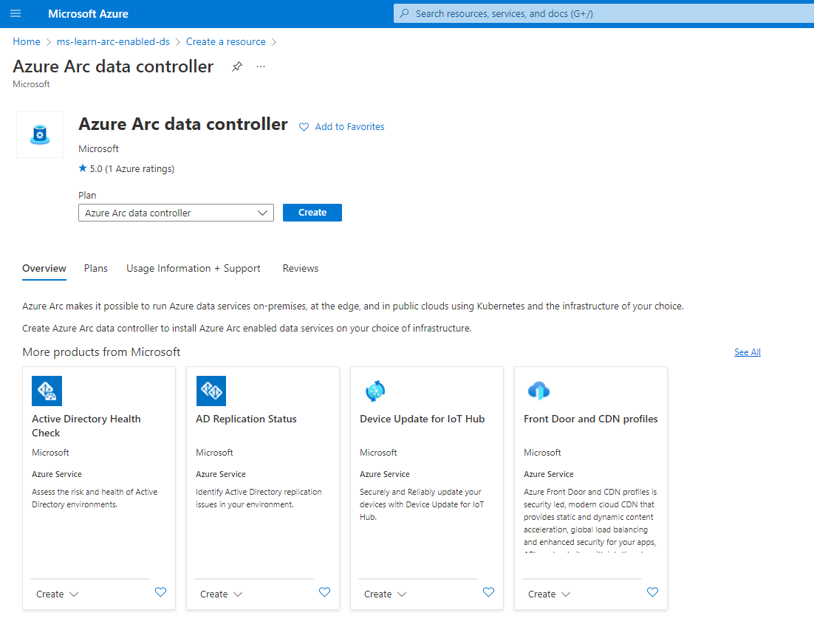
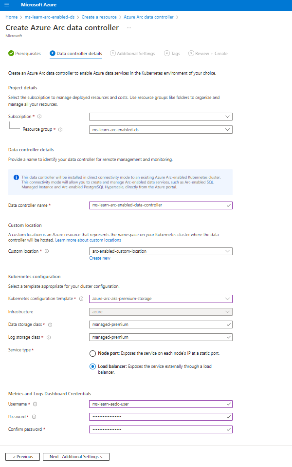
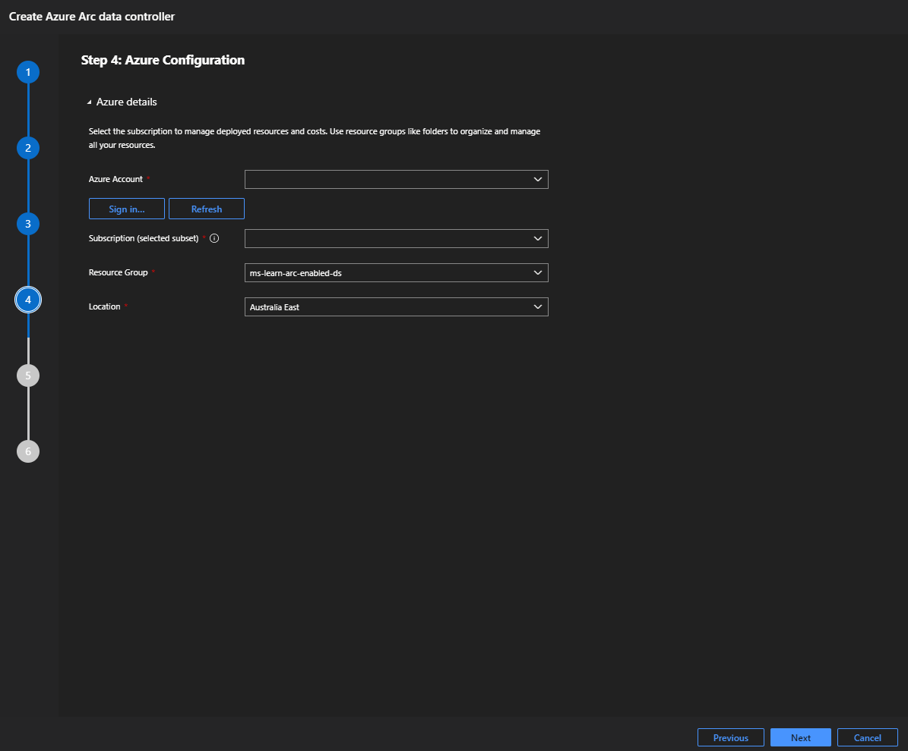
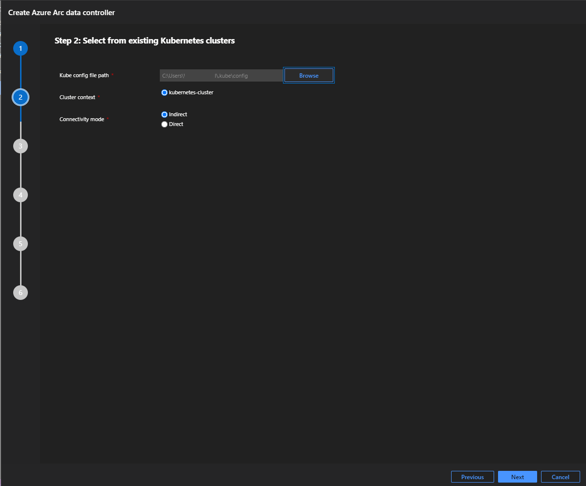
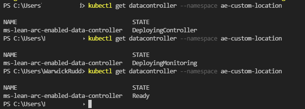
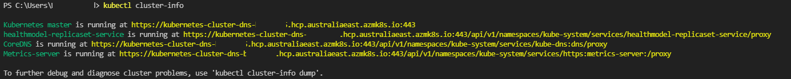
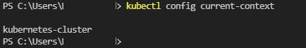

Azure Arc data controller is the Kubernetes operator that brings all of the Arc-enabled components together allowing you to get the benefits of Azure data service in your Arc-enabled environment. In this unit, we cover the prerequisites and implement an Arc data controller in your required environment.

## Prerequisites

To deploy an Arc data controller we have to have the following completed:
- Install/Upgrade **[Azure CLI](https://docs.microsoft.com/cli/azure/install-azure-cli)** to version >= 2.16.0 and <= 2.29.0.
- Add **arcdata** and associated **k8s CLI extensions**:
    - arcdata               : az extension add --name arcdata
    - connectedk8s          : az extension add --name connectedk8s
    - customlocation        : az extension add --name customlocation
    - k8s-configuration     : az extension add --name k8s-configuration
    - k8s-extension         : az extension add --name k8s-extension
- Have access to your **Kubernetes Cluster** V1.21 and above.
- **[Meet network requirements](https://docs.microsoft.com/azure/azure-arc/kubernetes/quickstart-connect-cluster?tabs=azure-cli#meet-network-requirements)**.
- **[Register providers for Azure Arc-enabled Kubernetes](https://docs.microsoft.com/azure/azure-arc/kubernetes/quickstart-connect-cluster?tabs=azure-cli#register-providers-for-azure-arc-enabled-kubernetes)**.
    - Microsoft.Kubernetes.
    - Microsoft.KubernetesConfiguration.
    - Microsoft.ExtendedLocation.

- Create a destination **Resource Group** in your Azure subscription.
- Your Kubernetes cluster is sized appropriately for your workload.

## Arc-enable your Kubernetes Cluster

To Arc-enable your kubernetes cluster, or to connect your Kubernetes cluster to Azure, execute the **[az connectedk8s](https://docs.microsoft.com/azure/azure-arc/kubernetes/quickstart-connect-cluster?tabs=azure-cli#connect-an-existing-kubernetes-cluster)** command. Before running this command, ensure you have downloaded your kubeconfig file. This prerequisite step is only required when you deploy in directly connected mode.

Confirming your Arc-enabled Kubernetes cluster is ready and available to deploy your Arc data controller, you can view the shadow object (object representation of the Arc-enabled Kubernetes cluster) in the portal:


In the image above, the resource **Kubernetes-cluster** of resource type **Kubernetes service** is our Kubernetes cluster (which could be on-premises, any public cloud, or in this instance, located in Azure). The second highlighted resource of type **Kubernetes -Azure Arc** is our shadow resource for our Arc-enabled cluster that we can manage in the Azure portal.

Enable [custom locations](https://docs.microsoft.com/azure/azure-arc/kubernetes/custom-locations#enable-custom-locations-on-cluster) on the kubernetes cluster.

Lastly, confirm **[Azure Arc agents for Kubernetes](https://docs.microsoft.com/azure/azure-arc/kubernetes/quickstart-connect-cluster?tabs=azure-cli#view-azure-arc-agents-for-kubernetes)** have been deployed.


## Deploy the Arc data controller

The deployment mode you choose has multiple methods available. In this exercise, you will choose between the **directly connected mode** or **indirectly connected mode**. You can choose which option to work through based on your connectivity mode requirement. 

Azure Arc-enabled data services are supported on Kubernetes platforms V1.21 and above. Each Kubernetes type has slightly different instructions to create your data controller. Specific instructions on each type:

- **[Azure Kubernetes Service (AKS)](https://docs.microsoft.com/azure/azure-arc/data/create-data-controller-indirect-cli?tabs=linux#create-on-azure-kubernetes-service-aks)**
- **[AKS on Azure Stack HCI](https://docs.microsoft.com/azure/azure-arc/data/create-data-controller-indirect-cli?tabs=linux#create-on-aks-on-azure-stack-hci)**
- **[Azure Red Hat OpenShift (ARO)](https://docs.microsoft.com/azure/azure-arc/data/create-data-controller-indirect-cli?tabs=linux#create-on-azure-red-hat-openshift-aro)**
- **[Red Hat Openshift Container Platform (OCP)](https://docs.microsoft.com/azure/azure-arc/data/create-data-controller-indirect-cli?tabs=linux#create-on-red-hat-openshift-container-platform-ocp)**
- **[Open source, upstream Kubernetes (kubeadm)](https://docs.microsoft.com/azure/azure-arc/data/create-data-controller-indirect-cli?tabs=linux#create-on-red-hat-openshift-container-platform-ocp)**
- **[AWS Elastic Kubernetes Service (EKS)](https://docs.microsoft.com/azure/azure-arc/data/create-data-controller-indirect-cli?tabs=linux#create-on-aws-elastic-kubernetes-service-eks)**
- **[Google Cloud Kubernetes Engine Service (GKE)](https://docs.microsoft.com/azure/azure-arc/data/create-data-controller-indirect-cli?tabs=linux#create-on-google-cloud-kubernetes-engine-service-gke)**

For the deployment options below we are using an AKS deployed Kubernetes cluster. All options related to storage classes are associated with the AKS cluster supported storage classes. The choice of Service type is going to depend on the configuration of your Kubernetes cluster. The kubernetes cluster used in this exercise is configured as a load balanced service type. If you are configired in a node port type, use node port instead of load balancer appropriately in the exercise. The type of Kubernetes cluster implemented in your environment will dictate the types of provisioned and presented storage types. You will need to know your storage classes, talk to your infrastructure team or Kubernetes admin if you are unsure. 

## Deploy in directly connected mode 

To deploy your Arc data controller, we have several options available to us:

1. GUI deployment:
    1. Azure Portal
    2. Azure Data Studio
2. CLI deployment:
    1. Azure Portal Cloud Shell
    2. Azure Data Studio terminal window

Choose which of the options you wish to walk through. All provide you with the same outcome.

## Option 1: Azure Portal GUI deployment

1. In the Azure portal, select + Create resource.
2. Search for Azure Arc data controller.
3. Select Create.

    
    
4. Select Azure Arc-enabled Kubernetes cluster (Directly connected mode) | Click Next: Data controller details.

    
    
5. Choose the Resource Group you created and into which you deployed your Azure Arc-enabled Kubernetes cluster.
6. Name your Arc data controller appropriately.
7. Select Create new custom location.

    

8. For the Kubernetes configuration template, choose the appropriate storage class. We are using an AKS cluster for this exercise, so we specify azure-arc-aks-premium-storage.

    You will likely have your Kubernetes cluster either on-premises or in a public cloud. If this is the case, you change the configuration template to a custom template and complete all of the required information, especially taking note of your infrastructure location.

    > Microsoft provides templates for various environments, such as GKE and OpenShift. If you see an option that matches your environment, Microsoft provides a configuration template for you. Otherwise, you need to specify a custom template.

    

9. For the Service type, select Load balancer. 
10. Set a user name and password for Metrics and Logs Dashboards (Kibana and Grafana) that you view locally.

    
    
11. Select Next: Additional Settings>  
    
    You may already have a Log Analytics workspace configured, or you can create a new workspace specifically for your Arc data controller. You will find the Log Analytics workspace ID and primary key (both values are required) under Settings | Agents management of your Log Analytics workspace. 

    
    
    

12. Add Tags for your Arc data controller.

   

13. On Review + Create and confirm all details are correct. Select Create.


14. You can monitor the creation of the Arc data controller with this command:

    ```PowerShell
    kubectl get datacontroller --namespace <namespace>
    ```

    
    
15. Congratulations! You have successfully deployed your Arc data controller in directly connected mode.

    

16. Validate the deployment against the Kubernetes cluster. Execute kubectl get ns in the Cloud Shell

    
    

17. Confirm all packages deployed to the Kubernetes cluster as part of the deployment. Execute `Kubectl get crd` in the Cloud Shell.

    
    

18. Review all the resources created under the Custom location type resource. Execute `Kubectl get pods --namespace <namespace>` in the Cloud Shell.

    
    

## Option 2: Azure Data Studio GUI deployment

In this deployment method we are using **[Azure Data Studio](https://docs.microsoft.com/sql/azure-data-studio/download-azure-data-studio?view=sql-server-ver15)** (ADS) and the associated ADS extensions **Azure Arc** & **Azure CLI**.

Ensure that you have navigated to your .kube directory in the ADS terminal before executing any CLI commands.

- Before using ADS for the deployment, you will need to create a custom location in your chosen subscription and resource group where you will deploy your Arc data controller. In ADS, open the terminal window and connect to your subscription and download your kube config file.

    ```PowerShell
    $Env:MySuscriptionID = 'enter your subscription id here'
    $Env:MyResourceGroup = 'enter your resource group name here'
    $Env:MyCluster = 'enter your kubernetes cluster name here'
    az account set --subscription $Env:MySuscriptionID
    az aks get-credentials --resource-group $Env:MyResourceGroup --name $Env:MyCluster
    ```

Create your custom location for your Azure Arc data controller that you will be deploying on your Azure Arc-enabled Kubernetes cluster. Using the Azure Portal Cloud shell, execute the following commands:

 1. Create the Arc-enabled kubernetes cluster custom location extension using the following command: 

    ```PowerShell
    $Env:MyNamespace = 'enter your namespace name here'
    $Env:MyCustomlocationExtension = 'enter your custom location extension name here'

    az k8s-extension create --cluster-name $Env:MyCluster `
        --resource-group $Env:MyResourceGroup `
        --name $Env:MyCustomlocationExtension `
        --cluster-type connectedClusters `
        --extension-type microsoft.arcdataservices `
        --auto-upgrade false `
        --scope cluster `
        --release-namespace $Env:MyNamespace `
        --config Microsoft.CustomLocation.ServiceAccount=sa-arc-bootstrapper
    ```

2. In the ADS terminal window confirm the creation of the newly created custom location extension:

    ```PowerShell
    az k8s-extension show --resource-group $Env:MyResourceGroup `
        --cluster-name $Env:MyCluster `
        --name $Env:MyCustomlocationExtension `
        --cluster-type connectedclusters
    ```

3. In the ADS terminal window, confirm the status of the cluster using the following kubectl CLI command. The bootstrapper pod should be in a running state :      

    ```PowerShell
    kubectl get pods --name $Env:MyNamespace
    ```

4. **[Create custom location](https://docs.microsoft.com/azure/azure-arc/kubernetes/custom-locations#create-custom-location)** following steps 2,3 & 4. The `extensionInstanceName` in step 3 relates to the extension name you used in the step above. In step 4 add the optional parameter `--location`.

5. In the ADS terminal window, confirm the creation of the Arc-enabled custom location.

    ```PowerShell
    az customlocation list -o table
    ```


6. Confirm you have Azure Data Studio downloaded and installed.
7. Open ADS and navigate to the Extensions.


8. Search for AZURE CLI. Install the Azure CLI Extension.


9. Search for Azure Arc. Install the Azure Arc Extension.


10. After installing both extensions, close and restart ADS.
11. Once ADS has restarted, navigate to the Linked Accounts section and select Add an account.


12. Sign in to your Azure subscription. You have successfully added a Linked Account to your Azure subscription. Select Close.


13. Open the terminal window and download your Arc-enabled Kubernetes Cluster config file to your workstation. You can use the command:

    ```PowerShell
    az aks get-credentials --resource-group <resourcegroupname> `
        --name <Arc-enabled Kubernetes Cluster Name> `
        --file <download location>
    ```


14. Expand the ADS Connections tab, and expand the Azure Arc controllers dropdown.
        


15. Select + Create New Azure Arc Controller, ensure Azure Arc data controller is selected, and select Select.
        


16. Confirm the deployment prerequisites are in-place. Click Next.
        


17. With your downloaded Arc-enabled Kubernetes Cluster config file in the default location, confirm your Arc-enabled Kubernetes Cluster is selected. Ensure the chosen connectivity mode is Direct. Select Next.
    


18. For the Kubernetes configuration template, choose the appropriate storage class. We are using an AKS cluster for this exercise, so we specify azure-arc-aks-premium-storage. Select Next.
    


19. Step 11 above connected us to our subscription. Confirm the Azure account is correct and the subscription is connected to the correct subscription. Choose your Resource Group you previously configured in the prerequisites section at the top of this section. Choose the location you are deploying your Arc data controller to. Select Next.
    


20. To create the Arc data controller, we need to prep with the following information:
    - Data Controller Name: Your custom name
    - Storage Class: dependent on your config profile selection above
    - Infrastructure: dependent on the location of your Kubernetes Cluster 
            


    - Custom Location: An Azure resource representing the namespace on your Kubernetes Cluster where you will host the data controller.
    - Auto-upload Metrics: Ensure you select this with the directly connected mode
    - Auto-upload Logs: Ensure you select this with the directly connected mode
    - Log Analytics workspace ID: available from your Log Analytics workspace
    - Log Analytics primary key: available from your Log Analytics workspace
    - Metrics and Logs Dashboard Credentials (Kibana and Grafana)


21. Review the configuration details, and you are ready to deploy. Select Deploy.
    


This opens up a notebook called *deploy.arc.data.controller*, which will automatically start executing each of the created cells. A prompt will request you to log in to your Azure subscription to allow the deployment to start. Once the deployment has completed, select Connect Controller in the connections tab. Enter the namespace for the data controller you just created and select connect.


You can manage your Arc data controller by right-clicking on the data controller and selecting Manage.


## Option 3: Azure Portal Cloud Shell deployment

In this exercise option, you will be creating the Arc data controller via the CLI from the Azure Portal. Ensure you have walked through the prerequisites at the start of this exercise.

1. In the Azure portal, open the Cloud Shell.
2. Set your parameters to be used during this deployment.

    ```PowerShell
    $Env:MySuscriptionID = 'enter your subscription id here'
    $Env:MyResourceGroup = 'enter resource group name here'
    $Env:MyCluster = 'enter kubernetes cluster name here'
    $Env:Mylocation = 'enter resource location here'
    $Env:MyCustomlocationExtension = 'enter custom location extension name here'
    $Env:MyCustomlocation = 'enter custom location name here'
    $Env:MyNamespace = 'enter data controller name space here'
    ```

3. Download the Kubernetes cluster kube config file.

    ```PowerShell
    az account set --subscription $Env:MySuscriptionID
    az aks get-credentials --resource-group $Env:MyResourceGroup --name $Env:MyCluster
    ```

4. Arc-enable your Kubernetes Cluster.

    ```PowerShell
    az connectedk8s connect --name $Env:MyCluster --resource-group $Env:MyResourceGroup --location $Env:Mylocation
    ```

5. Confirm your Arc-enabled Kubernetes cluster.

    ```PowerShell
    az connectedk8s list --resource-group $Env:MyResourceGroup --output table
    ```

6. Enable the Cluster-Connect and Custom-location Arc-enabled features on your Arc-enabled Kubernetes cluster.

    ```PowerShell
    az connectedk8s enable-features --name $Env:MyCluster `
        --resource-group $Env:MyResourceGroup `
        --features cluster-connect custom-locations
    ```

7. Confirm all Azure Arc Agents have been deployed and are running in the azure-arc namespace.

    ```PowerShell
    kubectl get deployments,pods --namespace azure-arc
    ```

8. Create your Arc-enabled custom location extension in your Kubernetes - Azure Arc type resource.

    ```PowerShell
    az k8s-extension create --cluster-name $Env:MyCluster `
        --resource-group $Env:MyResourceGroup `
        --name $Env:MyCustomlocationExtension `
        --cluster-type connectedClusters `
        --extension-type microsoft.arcdataservices `
        --auto-upgrade false `
        --scope cluster `
        --release-namespace $Env:MyNamespace `
        --config Microsoft.CustomLocation.ServiceAccount=sa-arc-bootstrapper
    ```

9. Confirm your newly created Arc-enabled custom location extension.

    ```PowerShell
    az k8s-extension show --resource-group $Env:MyResourceGroup `
        --cluster-name $Env:MyCluster `
        --name $Env:MyCustomlocationExtension `
        --cluster-type connectedclusters
    ```

10. Confirm your custom location namespace has been created and has the bootstrapper running.

    ```PowerShell
    kubectl get pods -n $Env:MyNamespace
    ```

11. Assign permissions to the Arc-enabled custom location extension.

    ```PowerShell
    $Env:MSI_Object_Id=(az k8s-extension show `
        --resource-group $Env:MyResourceGroup `
        --cluster-name $Env:MyCluster `
        --cluster-type connectedClusters `
        --name $Env:MyCustomlocationExtension | convertFrom-json).identity.principalId
    
    az role assignment create --assignee $Env:MSI_Object_Id `
        --role "Contributor" `
        --scope "/subscriptions/$Env:MySuscriptionID/resourceGroups/$Env:MyResourceGroup"
    
    az role assignment create --assignee $Env:MSI_Object_Id `
        --role "Monitoring Metrics Publisher" `
        --scope "/subscriptions/$Env:MySuscriptionID/resourceGroups/$Env:MyResourceGroup"
    ```

12. Create the Arc-enabled custom location.

    ```PowerShell
    $Env:HostClusterID=az connectedk8s show --name $Env:MyCluster `
        --resource-group $Env:MyResourceGroup `
        --query id -o tsv

    $Env:ExtensionID=az k8s-extension show --name $Env:MyCustomlocationExtension `
        --cluster-type connectedClusters `
        --cluster-name $Env:MyCluster `
        --resource-group $Env:MyResourceGroup `
        --query id -o tsv

    az customlocation create --name $Env:MyCustomlocation `
        --resource-group $Env:MyResourceGroup `
        --namespace $Env:MyNamespace `
        --host-resource-id $Env:HostClusterID `
        --cluster-extension-ids $Env:ExtensionID `
        --location $Env:Mylocation
    ```

13. Validate the creation of the Arc-enabled custom location.

    ```PowerShell
    az customlocation list -o table
    ```

14. Declare some parameters specific to creating the Arc data controller.

    ```PowerShell
    $Env:MyDataController = 'enter your data controller name here'
    $Env:MyConnectMode = 'direct'
    $Env:MyProfile = 'azure-arc-aks-premium-storage'  (Choose your storage profile)
    $Env:MyStorageClass = 'managed-premium' (Choose your storage class)
    $Env:arc_infrastructure = 'azure'
    $ENV:AZDATA_LOGSUI_USERNAME= 'enter Kibana dashboard username here'
    $ENV:AZDATA_LOGSUI_PASSWORD= 'enter Kibana dashboard password here'
    $ENV:AZDATA_METRICSUI_USERNAME= 'enter Grafana dashboard username here'
    $ENV:AZDATA_METRICSUI_PASSWORD= 'enter Grafana dashboard password here'
    ```

15. Create Arc data controller.

    ```PowerShell
    az arcdata dc create --name $Env:MyDataController `
        --k8s-namespace $Env:MyNamespace `
        --subscription $Env:MySuscriptionID `
        --resource-group $Env:MyResourceGroup `
        --location $Env:Mylocation `
        --connectivity-mode $Env:MyConnectMode `
        --profile-name $Env:MyProfile `
        --auto-upload-logs true `
        --auto-upload-metrics true `
        --custom-location $Env:MyCustomlocation `
        --storage-class $Env:MyStorageClass `
        --infrastructure $Env:arc_infrastructure `
        --custom-location $Env:MyCustomlocation `
        --cluster-name $Env:MyCluster
    ```

16. Monitor the deployment of your Arc data controller. Use the command: 

    ```PowerShell
    kubectl get datacontrollers --namespace $Env:MyNamespace. 

    <##
        The deployment will go through 3 states before it finishes: 

        - State = Deploying Controller
        - State = Deploying Monitoring
        - State = Ready
    ##> 
    ```

17. Confirm all resources have been deployed into your Arc-enabled custom location namespace.

    ```PowerShell
    kubectl get pods -n $Env:MyNamespace
    ```

## Option 4: Azure Data Studio Terminal window deployment

In this deployment method we are using **[Azure Data Studio](https://docs.microsoft.com/sql/azure-data-studio/download-azure-data-studio?view=sql-server-ver15)** (ADS) and the associated ADS extensions **Azure Arc** & **Azure CLI**. We will be using the CLI from the Azure Data Studio Terminal. Ensure you have walked through the prerequisites at the start of this exercise and installed the Azure Arc and Azure CLI Azure Data Studio extensions.

Ensure that you have navigated to your .kube directory in the ADS terminal before executing any CLI commands.

1. In the Azure portal, open the Cloud Shell.
2. Set your parameters to be used during this deployment.

    ```PowerShell
    $Env:MySuscriptionID= 'enter your subscription id here'
    $Env:MyResourceGroup= 'enter resource group name here'
    $Env:MyCluster= 'enter kubernetes cluster name here'
    $Env:Mylocation= 'enter resource location here'
    $Env:MyCustomlocationExtension= 'enter custom location extension name here'
    $Env:MyCustomlocation= 'enter custom location name here'
    $Env:MyNamespace= 'enter data controller name space here'
    ```

3. Download the Kubernetes cluster kube config file.

    ```PowerShell
    az account set --subscription $Env:MySuscriptionID
    az aks get-credentials --resource-group `
        $Env:MyResourceGroup --name $Env:MyCluster
    ```

4. Arc-enable your Kubernetes Cluster.

    ```PowerShell
    az connectedk8s connect --name $Env:MyCluster `
        --resource-group $Env:MyResourceGroup `
        --location $Env:Mylocation
    ```

5. Confirm your Arc-enabled Kubernetes cluster.

    ```PowerShell
    az connectedk8s list --resource-group $Env:MyResourceGroup --output table
    ```

6. Enable the Cluster-Connect and Custom-location Arc-enabled features on your Arc-enabled Kubernetes cluster.

    ```PowerShell
    az connectedk8s enable-features --name $Env:MyCluster `
        --resource-group $Env:MyResourceGroup `
        --features cluster-connect custom-locations
    ```

7. Confirm all Azure Arc Agents have been deployed and are running in the azure-arc namespace.

    ```PowerShell
    kubectl get deployments,pods --namespace azure-arc
    ```

8. Create your Arc-enabled custom location extension in your Kubernetes - Azure Arc type resource.

    ```PowerShell
    az k8s-extension create --cluster-name $Env:MyCluster `
        --resource-group $Env:MyResourceGroup `
        --name $Env:MyCustomlocationExtension `
        --cluster-type connectedClusters `
        --extension-type microsoft.arcdataservices `
        --auto-upgrade false `
        --scope cluster `
        --release-namespace $Env:MyNamespace `
        --config Microsoft.CustomLocation.ServiceAccount=sa-arc-bootstrapper
    ```

9. Confirm your newly created Arc-enabled custom location extension.

    ```PowerShell
    az k8s-extension show --resource-group $Env:MyResourceGroup `
        --cluster-name $Env:MyCluster `
        --name $Env:MyCustomlocationExtension `
        --cluster-type connectedclusters
    ```

10. Confirm your custom location namespace has been created and has the bootstrapper running.

    ```PowerShell
    kubectl get pods -n $Env:MyNamespace
    ```

11. Assign permissions to the Arc-enabled custom location extension.

    ```PowerShell
    $Env:MSI_Object_Id=(az k8s-extension show --resource-group $Env:MyResourceGroup `
        --cluster-name $Env:MyCluster `
        --cluster-type connectedClusters `
        --name $Env:MyCustomlocationExtension | convertFrom-json).identity.principalId

    az role assignment create --assignee $Env:MSI_Object_Id `
        --role "Contributor" `
        --scope "/subscriptions/$Env:MySuscriptionID/resourceGroups/$Env:MyResourceGroup"

    az role assignment create --assignee $Env:MSI_Object_Id `
        --role "Monitoring Metrics Publisher" `
        --scope "/subscriptions/$Env:MySuscriptionID/resourceGroups/$Env:MyResourceGroup"
    ```

12. Create the Arc-enabled custom location.

    ```PowerShell
    $Env:HostClusterID=az connectedk8s show --name $Env:MyCluster `
        --resource-group $Env:MyResourceGroup `
        --query id -o tsv

    $Env:ExtensionID=az k8s-extension show --name $Env:MyCustomlocationExtension `
        --cluster-type connectedClusters `
        --cluster-name $Env:MyCluster `
        --resource-group $Env:MyResourceGroup `
        --query id -o tsv

    az customlocation create --name $Env:MyCustomlocation `
        --resource-group $Env:MyResourceGroup `
        --namespace $Env:MyNamespace `
        --host-resource-id $Env:HostClusterID `
        --cluster-extension-ids $Env:ExtensionID `
        --location $Env:Mylocation
    ```

13. Validate the creation of the Arc-enabled custom location.

    ```PowerShell
    az customlocation list -o table
    ```

14. Declare some parameters specific to the creation of the Arc data controller.

    ```PowerShell
    $Env:MyDataController= 'enter your data controller name here'
    $Env:MyConnectMode = 'direct'
    $Env:MyProfile = 'azure-arc-aks-premium-storage'  (Choose your storage profile)
    $Env:MyStorageClass = 'managed-premium' (Choose your storage class)
    $Env:arc_infrastructure = 'azure'
    $ENV:AZDATA_LOGSUI_USERNAME= 'enter Kibana dashboard username here'
    $ENV:AZDATA_LOGSUI_PASSWORD= 'enter Kibana dashboard password here'
    $ENV:AZDATA_METRICSUI_USERNAME= 'enter Grafana dashboard username here'
    $ENV:AZDATA_METRICSUI_PASSWORD= 'enter Grafana dashboard password here'
    ```

15. Create Arc data controller.

    ```PowerShell
    az arcdata dc create --name $Env:MyDataController `
        --k8s-namespace $Env:MyNamespace `
        --subscription $Env:MySuscriptionID `
        --resource-group $Env:MyResourceGroup `
        --location $Env:Mylocation `
        --connectivity-mode $Env:MyConnectMode `
        --profile-name $Env:MyProfile `
        --auto-upload-logs true `
        --auto-upload-metrics true `
        --custom-location $Env:MyCustomlocation `
        --storage-class $Env:MyStorageClass`
        --infrastructure $Env:arc_infrastructure `
        --custom-location $Env:MyCustomlocation `
        --cluster-name $Env:MyCluster
    ```

16. You will be prompted for your Log Analytics Workspace ID and associated primary key. You can retrieve these from inside the portal, navigating to your Log Analytics workspace. The workspace id and primary key are available in the Settings | Agents management section.
17. Monitor the deployment of you Arc data controller. Use the command: 

    ```PowerShell
    kubectl get datacontrollers --namespace $Env:MyNamespace
    
    <##
        The deployment will go through 3 states before it finishes: 

        - State = Deploying Controller
        - State = Deploying Monitoring
        - State = Ready
    ##> 
    ``` 

18. Confirm all resources have been deployed into your Arc-enabled custom location namespace.

    ```PowerShell
    kubectl get pods -n $Env:MyNamespace
    ```

## Deploy in indirectly connected mode 

To deploy your Azure Arc data controller, we have a few options available to us:

    1. GUI deployment:
        1. Azure Data Studio
    2. CLI deployment:
        1. Azure Data Studio terminal window

Once you have deployed your data controller in indirectly connected mode, this resource will now be displayed in your Azure subscription. Use Azure Data Studio to manage and maintain your data controller. 

In preparation for configuring your environment to utilize a data controller in indirectly connected mode, your environment will need access to port 443 and the Microsoft Container Registry, allowing you to pull images. 

## Option 1: Azure Data Studio GUI deployment

In this deployment method we are using **[Azure Data Studio](https://docs.microsoft.com/sql/azure-data-studio/download-azure-data-studio?view=sql-server-ver15)** (ADS) and the associated ADS extensions **Azure Arc** & **Azure CLI**.

Ensure that you have navigated to your .kube directory in the ADS terminal before executing any CLI commands.

- You can check to see that you have a current Kubernetes connection and confirm your current context with the following commands:

    ```PowerShell
    kubectl cluster-info
    kubectl config current-context
    ```


1. Confirm you have Azure Data Studio downloaded and installed.
2. Open ADS and navigate to the Extensions.


3. Search for "Azure CLI" and install the Azure CLI Extension.


4. Search for "Azure Arc" and install the Azure Arc Extension.


5. After installing both extensions, close and restart ADS.
6. Once ADS has restarted, navigate to the Linked Accounts section and select Add an account.


7. Sign in to your Azure subscription. You have successfully added a Linked Account to your Azure subscription. Click Close.


8. Open the terminal window and download your Arc-enabled Kubernetes Cluster config file to your workstation. You can use the command:

    ```PowerShell
    az aks get-credentials --resource-group <resourcegroupname> `
        --name <Arc-enabled Kubernetes Cluster Name> `
        --file <download location>
    ```


9. Expand the ADS Connections tab, and expand the Azure Arc Controllers dropdown.
        


10. Select + Create New Azure Arc Controller, ensuring Azure Arc data controller is selected. Click Select.
        


11. Confirm the deployment prerequisites are in-place. Select Next.
        


12. With your downloaded Arc-enabled Kubernetes Cluster config file in the default location, confirm your Arc-enabled Kubernetes Cluster is selected. Ensure the chosen connectivity mode is Indirect. Select Next.
    


13. For the Kubernetes configuration template, choose the appropriate storage class. We are using an AKS cluster for this exercise, so we specify azure-arc-aks-premium-storage. Select Next.
    


14. Step 7 above connected us to our subscription. Confirm the Azure account is correct, and the subscription is connected to the right subscription. Choose the Resource Group you previously configured in the prerequisites section at the top of this section. Choose the location to which you are deploying your Arc data controller. Select Next.
    


15. To create the Arc data controller, we need to prep the following information:

    - Data Controller Namespace: Your data controller namespace
    - Storage Class: dependent on your config profile selection above
    - Infrastructure: dependent on the location of your Kubernetes Cluster 
            
    

    - Custom Location: Only required for directly connected mode 
    - Auto-upload Metrics: Only required for directly connected mode 
    - Auto-upload Logs: Only required for directly connected mode 
    - Log Analytics workspace ID: Only required for directly connected mode 
    - Log Analytics primary key: Only required for directly connected mode 
    - Metrics and Logs Dashboard Credentials (Kibana and Grafana)


16. Review the configuration details, and you are ready to deploy. Select Deploy.
    


This opens up a notebook called *deploy.arc.data.controller*, which will automatically start executing each of the created cells. As this is an indirect mode deployment, you will not be requested to log into your Azure subscription. 

17. To monitor the deployment status in the terminal window in ADS, you can execute the following commands:

    ```PowerShell
    kubectl get datacontroller --namespace 'enter your namespace here'
    ````

This command will work through the following three (3) states during the deployment:



- The following command will show all the deployed services and the status of those services in the data controller namespace:

    ```PowerShell
    kubectl get pods --namespace 'enter your namespace here'
    ```


Once the deployment has completed, select Connect Controller in the connections tab. Enter the namespace for the data controller you just created and select connect.


You can manage your Arc data controller by right-clicking on the data controller and selecting Manage.


## Option 2: Azure Data Studio Terminal deployment

In this exercise option, you will be creating the data controller onto your Kubernetes cluster located either on-premises or in the public cloud via the CLI from Azure Data Studio. Ensure you have walked through the prerequisites at the start of this exercise.

- You can check to see that you have a current Kubernetes connection and confirm your current context with the following commands:

    ```PowerShell
    kubectl cluster-info
    kubectl config current-context
    ```





1. In the Azure portal, open the Cloud Shell.
2. Set your parameters to be used during this deployment.

    ```PowerShell
    $Env:MySuscriptionID= 'enter your subscription id here'
    $Env:MyResourceGroup= 'enter resource group name here'
    $Env:Mylocation= 'enter resource location here'
    $Env:MyNamespace= 'enter data controller name space here'
    $Env:MyDataController= 'enter your data controller name here'
    $Env:MyConnectMode = 'Indirect'
    $Env:MyProfile = 'azure-arc-aks-premium-storage'  (Choose your storage profile)
    $Env:MyStorageClass = 'managed-premium' (Choose your storage class)
    $Env:arc_infrastructure = 'azure'
    $ENV:AZDATA_LOGSUI_USERNAME= 'enter Kibana dashboard username here'
    $ENV:AZDATA_LOGSUI_PASSWORD= 'enter Kibana dashboard password here'
    $ENV:AZDATA_METRICSUI_USERNAME= 'enter Grafana dashboard username here'
    $ENV:AZDATA_METRICSUI_PASSWORD= 'enter Grafana dashboard password here'
    ```

3. Download the kubernetes cluster kube config file.

    ```PowerShell
    az account set --subscription $Env:MySuscriptionID`
    az aks get-credentials --resource-group $Env:MyResourceGroup `
        --name $Env:MyCluster
    ```

4. Create Arc data controller.

    ```PowerShell
    az arcdata dc create --name $Env:MyDataController `
        --k8s-namespace $Env:MyNamespace `
        --use-k8s `
        --subscription $Env:MySuscriptionID `
        --resource-group $Env:MyResourceGroup `
        --location $Env:Mylocation `
        --connectivity-mode $Env:MyConnectMode `
        --profile-name $Env:MyProfile `
        --storage-class $Env:MyStorageClass `
        --infrastructure $Env:arc_infrastructure `
        --cluster-name $Env:MyCluster
    ```

5. Monitor the deployment of your Arc data controller. Use the command: 

    ```PowerShell
    kubectl get datacontrollers --namespace $Env:MyNamespace
    ``` 
    
The deployment will go through three (3) states before it is finished: 


6. Confirm all resources have been deployed into your data controller namespace:

    ```PowerShell
    kubectl get pods -n $Env:MyNamespace
    ```


7. Select Connect Controller in the connections tab once the deployment has been successfully completed. Enter the namespace for the data controller you just created and select connect.


8. You can manage your Arc data controller by right-clicking on the data controller and selecting Manage.


