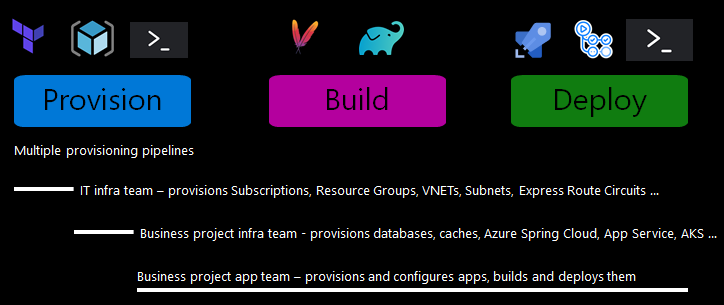

Imagine you're an infrastructure manager and have been asked to provision your Azure resources using Terraform. Once you've created your project, you plan to build/deploy your application with GitHub Actions.

## Provision, Build, and Deploy tracks

Automation typically uses three tracks - **Provision**, **Build**, and **Deploy**.
Each track can have one or more **Pipelines**.
In the below image, there are multiple pipelines in the "Provision" track with each pipeline focusing on the infrastructure for a team.

In this module's scenario, you'll use all three tracks - **PROVISIONING**, **BUILD**, and **DEPLOY** by implementing multiple pipelines:

1. Azure subscriptions, resource groups, vnets, subnets, express route circuits…

1. Databases and Azure App Service instances.

1. Java applications, and their dependencies.

There are several tools available to help you achieve these pipelines. As you're already using GitHub for your code repository, you'll use GitHub Actions with Terraform to provide the automation you need.

## Learning Goals

By the end of this module, you can:

- Create a Terraform configuration for your Azure resources
- Provision your Infrastructure and deploy your application to Azure
- Set up your project for Continuous Integration and Deployment (CI/CD)

## Prerequisites

As you complete the exercises in this module, you'll use a personal Azure and GitHub account.
