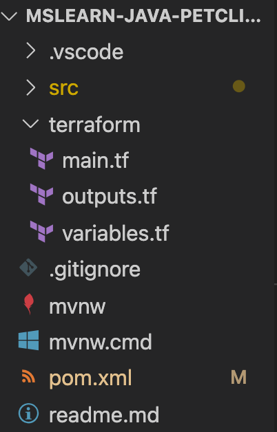
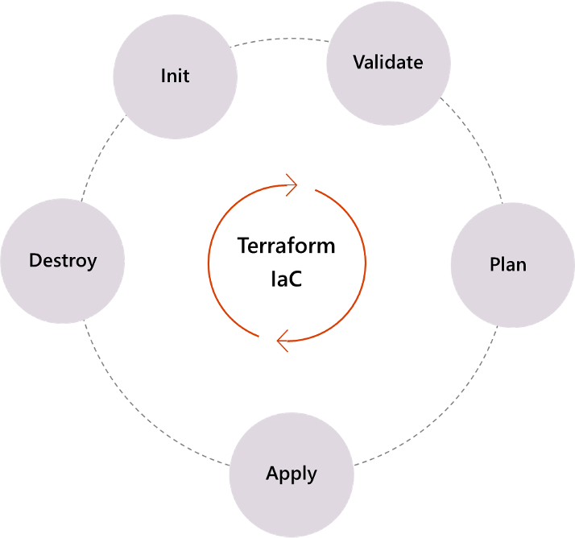

In this unit, we look at Terraform configuration and scripting.

## Why Terraform?

As an infrastructure manager, you need a tool for provisioning and managing Azure infrastructure. You also want to use *infrastructure as code* in configuration files that describe the topology of your Azure resources.

HashiCorp Terraform is great at deploying infrastructure across cloud providers. It gives developers consistent tooling to manage each infrastructure definition.

### Automate infrastructure management

By using template-based Terraform configuration files, you can define, provision, and configure Azure resources in a repeatable and predictable manner. This automation offers several benefits:

- It lowers the potential for human error as it deploys and manages infrastructure.
- It deploys the same template multiple times to create identical development, test, and production environments.
- It reduces the cost of development and test environments by creating them on an on-demand basis.

### Understand infrastructure changes before they're applied

As a resource topology becomes increasingly complex, it can be difficult to understand the meaning and effect of infrastructure changes.

By using Terraform, you can validate and preview infrastructure changes before you apply them. Team members can collaborate more effectively by understanding the proposed changes and their effect early in the development process.

## Terraform configuration files

Configuration files generate an execution plan and what the plan will do to reach the wanted state. Terraform can then build the described infrastructure. As the configuration changes, Terraform can determine what changed and create incremental execution plans.

Terraform configuration files use their own configuration language similar to YAML that's designed to allow a description of the infrastructure.

You create configuration files by using HashiCorp Configuration Language (HCL) syntax. HCL is declarative, describing an intended goal rather than the steps to reach that goal. HCL syntax allows you to specify the cloud provider, such as Azure, and the elements that make up your cloud infrastructure.

The configuration files are stored as plain text files with a *.tf* extension. They are:

- *main.tf*: (required) Defines the main structure, deploying the complete infrastructure directly or through calls to modules
- *outputs.tf*: Identifies each return value of a Terraform module
- *variables.tf*: Defines the variables in *main.tf*, whether they're required or not

### Modules

Yu can group Terraform resources into a module, which creates a larger unit of configuration. These modules are sets of configuration files that are stored in a single directory. A simple configuration consists of a single directory with one or more *.tf* files.

Modules offer many benefits. For example, modules:

- Help organize your project.
- Encapsulate complexity.
- Allow you to reuse common tasks.
- Provide consistency and ensure that you're following good practices.

### The main.tf file

Your *main.tf* file contains the main set of configuration details for your module. This file is often called a Terraform *plan*. Your Terraform plan specifies the infrastructure resources that you need. You can name this file whatever you want, but it's usually named *main.tf*.

## Terraform workflow

Terraform recommends its core "initialize, plan, and apply" workflow for automation. This workflow runs all Terraform CI/CD actions on new and updated Git pull requests.

The core actions for this workflow are:

- **Init**: Initialize a working directory with Terraform configuration files
- **Plan**: Produce a plan for changing resources to match the current configuration
- **Apply**: Apply the changes described by the plan

### State

*State* allows Terraform to know what Azure resources to add, update, or delete.

Terraform uses state to create plans and make changes to your infrastructure. Before any operation, Terraform does a refresh to update the state with the real infrastructure.

State is stored by default in a local text file named *terraform.tfstate*. Terraform manages this file by using the workflow actions that you define in your modules.

You can also store state remotely, an approach that works better in a team environment. For more information about managing state remotely, see the Summary unit at the end of this module.

## Next steps

In the next unit, we'll discuss using Terraform with either GitHub Actions or Azure Pipelines to provision and deploy your applications.
