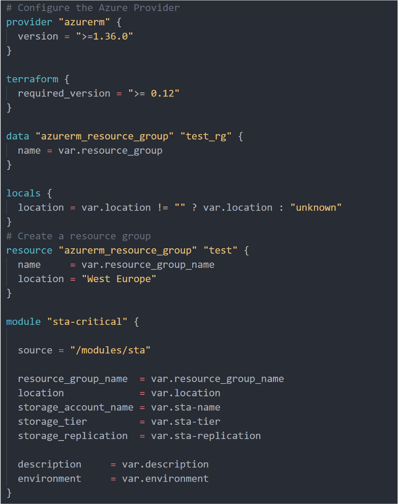

In this unit, we look at Terraform setup and scripting.

## Hashicorp Configuration Language (HCL)

Terraform uses its own configuration language, designed to allow concise descriptions of infrastructure. The Terraform language is declarative, describing an intended goal rather than the steps to reach that goal.

Using Terraform, you create configuration files using HCL syntax.
The HCL syntax allows you to specify the cloud provider - such as Azure - and the elements that make up your cloud infrastructure.


### Interpolation

<!-- elaborate-->
It's easy to interpolate Strings into your Terraform scripts by using the following Syntax:

```bash
azure_instance.web.0.id
```

### language

#### Variables

Values can be supplied as a '.tfvars' file containing simple key/value pairs, env variables, or command parameters.

#### Functions

<!-- elaborate
- String and math (all the usual)
- Count – simple method for deploying multiple resources
-C onditional "${var.env == "production" ? var.prod_subnet : var.dev_subnet}"

-->

#### Provisioners
<!-- elaborate -->
local-exec, remote-exec, file

#### Modules

A module is a set of configuration files in a single directory. Even a simple configuration consisting of a single directory with one or more.tf files is a module.

- Organize configuration
- Encapsulate configuration
- Reuse configuration
- Provide consistency and ensure good practices


### State
<!--refine-->
State is a necessary requirement for Terraform to function.
When running a `terraform plan`, Terraform must know the current state of resources to effectively determine the changes that it needs to make to reach your wanted configuration.
State can be stored local (single user – terraform.tfstate) or remote
Use `terraform taint` to flag resources. Tainted resources will be destroyed and recreated during `terraform apply`.

- Responsible for mapping “azure_virtual_machine” “vm” to “/subscriptions/dcf628c7-fc9d-4e40-af2c-5c963345a237/resourceGroups/BDIterraformdemo/providers/Microsoft.Compute/virtualMachines/BDIvm-vm”
- Tracks dependencies between resources
- Knows that if the VM is deleted, to also delete the Disk(s)
- Provides the ability to pass in previous deployments as parameters

### Configuration Files

Configuration files describe the components needed to run applications.

- main.tf (Required): Main structure to deploy the complete infrastructure directly or through calls to modules
- output.tf: Identify each return value of a Terraform module
- terraform.tfvars: Assign values to variables in a file instead of arguments in a command
- variables.tf: Define variables required (or not) in main.tf, we need to define the var type and it allows to you assign a default value.
- versions.tf: Define mínimum version required for terraform and providers in a module


### Providers

A Terraform configuration file starts off with the specification of the provider. When using Azure, you'll specify the Azure provider (azurerm) in the provider block
- Azure, Kubernetes, Docker, VMware, and so on
- Resources – the things you can create
- Data Sources – the things you can reference

### Main.tf



- Provider: API authentication & interaction
- Terraform: Terraform version
- Data: Get data from already existing services
- Locals: generates new variables using functions and expressions
- Resource: Describes resources & dependencies
- Module: Reusability & complexity abstraction

### Best Practices

- Start writing your configuration with modules in mind
- Use local modules to organize and encapsulate your code
- Use the public Terraform Registry to find useful modules
- Publish and share modules with your team

## Workflow


When running Terraform in automation, the focus is usually on the core plan/apply cycle.

- Init: Initialize a working directory with Terraform configuration files.
  - The terraform init command looks through all of the *.tf files in the current working directory and automatically downloads any of the providers required for them. In this example, it will download Azure provider as we are going to deploy Azure resource.
- Validate: Validates configuration files in a directory without checking remotely
- Plan: Produce a plan for changing resources to match the current configuration.
  - The terraform plan command is used to create an execution plan. Terraform determines what actions are necessary to achieve the desired state specified in the configuration files.
- Apply: Apply the changes described by the plan.
- Destroy: Remove the TF manage infrastructure
