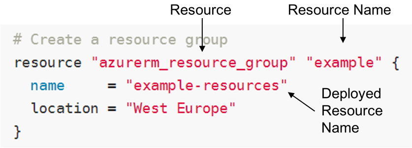
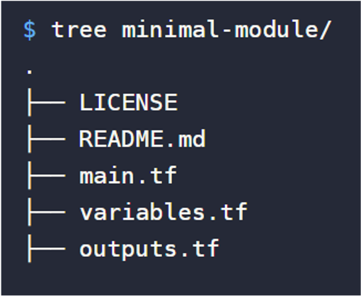

In this unit we look at Terraform.

## Hashicorp Configuration Language (HCL)

### Interpolation

azure_instance.web.0.id

### language

#### Variables

Values can be supplied as a .tfvars file containing simple key/value pairs, env variables, or command parameters.

#### Functions

String and math (all the usual)
Count – simple method for deploying multiple resources
Conditional "${var.env == "production" ? var.prod_subnet : var.dev_subnet}"
CIDR

#### Provisioners

local-exec, remote-exec, file

#### Modules

A module is a set of configuration files in a single directory. Even a simple configuration consisting of a single directory with one or more .tf files is a module.

- Organize configuration
- Encapsulate configuration
- Re-use configuration
- Provide consistency and ensure best practices

### State

State is a necessary requirement for Terraform to function.
When running a `terraform plan`, Terraform must know the current state of resources in order to effectively determine the changes that it needs to make to reach your desired configuration.
State can be stored local (single user – terraform.tfstate) or remote
Use `terraform taint` to flag resources. Tainted resources will be destroyed and recreated during `terraform apply`.

- Responsible for mapping “azure_virtual_machine” “vm” to “/subscriptions/dcf628c7-fc9d-4e40-af2c-5c963345a237/resourceGroups/BDIterraformdemo/providers/Microsoft.Compute/virtualMachines/BDIvm-vm”
- Tracks dependencies between resources
- Knows that if the VM is deleted, to also delete the Disk(s)
- Provides the ability to pass in previous deployments as parameters

### Providers

Azure, Kubernetes, Docker, VMware etc.
Resources – the things you can create
Data Sources – the things you can reference

### Best Practices

- Start writing your configuration with modules in mind
- Use local modules to organize and encapsulate your code
- Use the public Terraform Registry to find useful modules
- Publish and share modules with your team

### Configuration Files

- main.tf (Required): Main structure in order to deploy the complete infrastructure directly or through calls to modules

- output.tf: Identify each return value of a Terraform module

- terraform.tfvars: Assign values to variables in a file instead of arguments in a command

- variables.tf: Define variables required (or not) in main.tf, we need to define the var type and it allows to you assign a default value.

- versions.tf: Define mínimum version required for terraform and providers in a module

