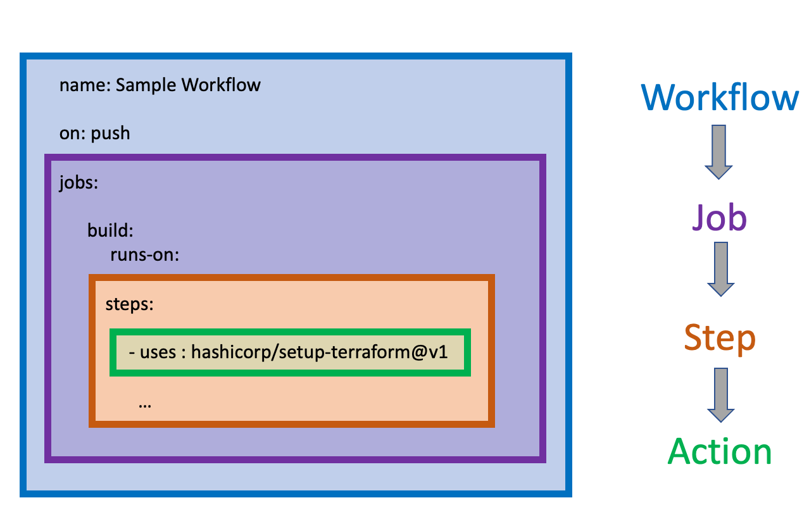

In this unit, you'll learn about automated workflow tools and how they integrate with Terraform and Azure.

::: zone pivot="github-actions"

## About GitHub Actions

As an infrastructure manager, you need your build and deployment workflows to use the same version control as your project.

By using GitHub Actions, you can run a continuous integration and continuous delivery (CI/CD) process that's linked to your GitHub repositories.

With GitHub Actions, you can build, test, and deploy your code right from GitHub. You can also assign code reviews, manage branches, and triage issues.

## GitHub Actions components

Let's describe the various GitHub Actions components, as shown in the following diagram:



- **Workflow**: Triggered by certain events or activities, a workflow is a collection of jobs and steps that automate software development lifecycle tasks.
- **Job**: A set of steps that execute on a runner.
- **Step**: A task that can run one or more commands or actions. Each step is made up of individual actions that run after a specific event occurs, such as a pull request.
- **Action**: Standalone commands that can be combined into steps. Multiple steps can be combined to create a job. Individual actions are packaged scripts that automate software development tasks. To create a workflow, you add actions to a YAML file in the *.github/workflows* directory in your GitHub repository.

## A Terraform GitHub action

The `hashicorp/setup-terraform` action sets up the Terraform CLI in your GitHub Actions workflow by:

- Downloading a specific version of the Terraform CLI and adding it to the `PATH`.
- Configuring the Terraform CLI configuration file with a Terraform Cloud or Enterprise host name and API token.
- Installing a wrapper script to wrap later calls of the `terraform` binary and expose its STDOUT, STDERR, and exit code as outputs named `stdout`, `stderr`, and `exitcode`, respectively.

## Authenticate GitHub Actions with Azure

Terraform supports several options for authenticating with Azure:

- When you use Terraform interactively, we recommend that you authenticate via a Microsoft account.
- When you use Terraform from code or by automation, we recommend that you authenticate via an Azure **Service Principal**.

A Service principal is an identity for use with applications, hosted services, and automated tools to access Azure resources.

## Next steps

In the next unit, we'll set up a sample project and use GitHub Actions with Terraform to deploy it to Azure.

::: zone-end

::: zone pivot="azure-devops"

## Key concepts for new Azure Pipelines

Let's learn about the components that make up an Azure Pipeline.


- A **trigger** tells a Pipeline to run.
- A pipeline is made up of one or more **stages**. A pipeline can deploy to one or more **environments**.
- A stage is a way of organizing job in a pipeline and each stage can have one or more **jobs**.
- Each job runs on one **agent**. A job can also be **agentless**.
- Each agent runs a job that contains one or more **steps**.
- A step can be a **task** or **script**, and is the smallest building block of a pipeline.
- A **task** is a prepackaged script that does an action, such as invoking a REST API or publishing a build artifact.
- An **artifact** is a collection of files or packages published by a run.

> [!TIP]
> For more in-depth information about the different Pipeline components and how to use them, see the Links provided in the **Summary** section.

## Terraform Tasks for Azure Pipelines

When executing commands that interact with Azure such as `plan`, `apply`, and `destroy`, the task will use an Azure **Service Connection** to authorize operations against the target subscription.
The recommended way to connect to Azure is binding the Service Connection to an Azure *Service Principal*. An Azure Service Principal is an identity that you create for uses automated tools to access Azure resources.

The following YAML snippet uses the Azure Pipeline Terraform provider `azurerm`. A Service Connection is specified via the `environmentServiceNameAzureRM` input:

```yaml
- task: TerraformTaskV1@0
  inputs:
    provider: 'azurerm'
    command: 'apply'
    workingDirectory: $(Build.Repository.LocalPath)/terraform
    backendAzureRmContainerName: 'tfstate'
    backendAzureRmKey: 'tf/terraform.tfstate'
    environmentServiceNameAzureRM: $(serviceConnection)
```

> [!TIP]
> If you use `azurerm` as the Azure Pipeline Terraform provider, you also need to supply a Service Connection and Storage Container to use with the Terraform backend **state**.

## Passing Parameters

There are multiple methods to pass parameters to terraform commands. Variables give you a convenient way to get key bits of data into various parts of the pipeline.

You can set a variable for a build pipeline by following these steps:

1. Go to the **Pipelines** page, select the appropriate pipeline, and select **Edit**.
1. Locate the **Variables** for this pipeline.
1. Add or update the variable.
1. To mark the variable as secret, select **Keep this value secret**.
1. Save the pipeline.

## Terraform Output to Pipeline Variables

The TerraformCLI task supports running the Terraform `output` command. When the CLI runs, pipeline variables will be created from each output variable emitted from the `terraform output` command.

## Next steps

In the next unit, we'll set up a sample project and use Azure Pipelines with Terraform to deploy it to Azure.

::: zone-end
