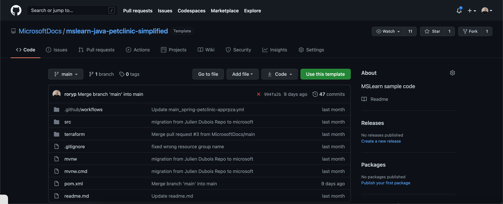
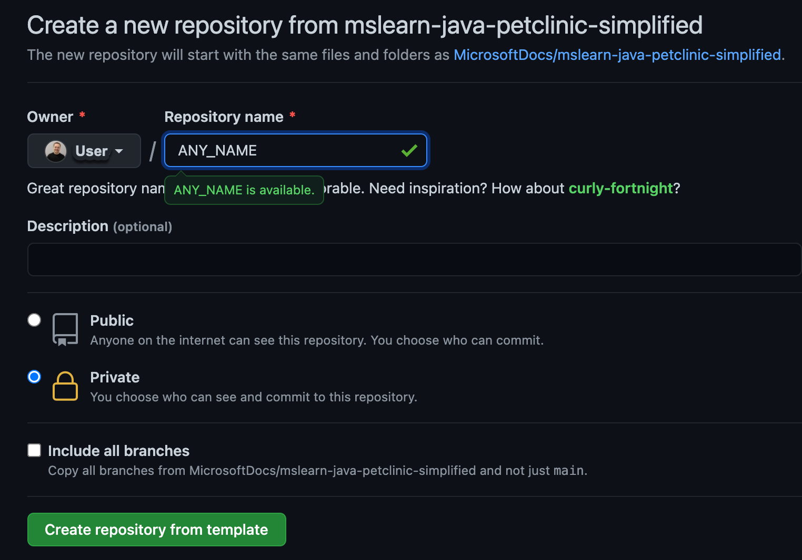
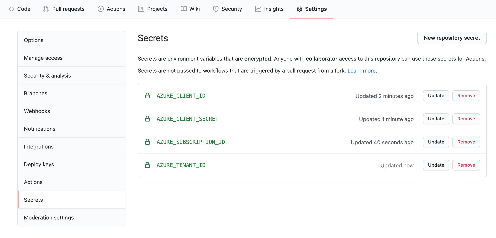
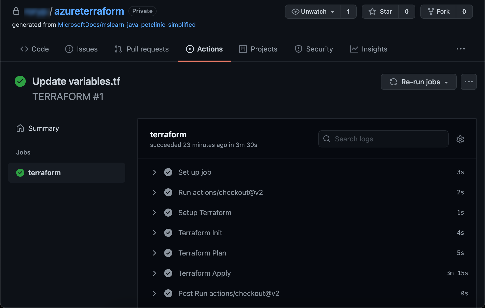
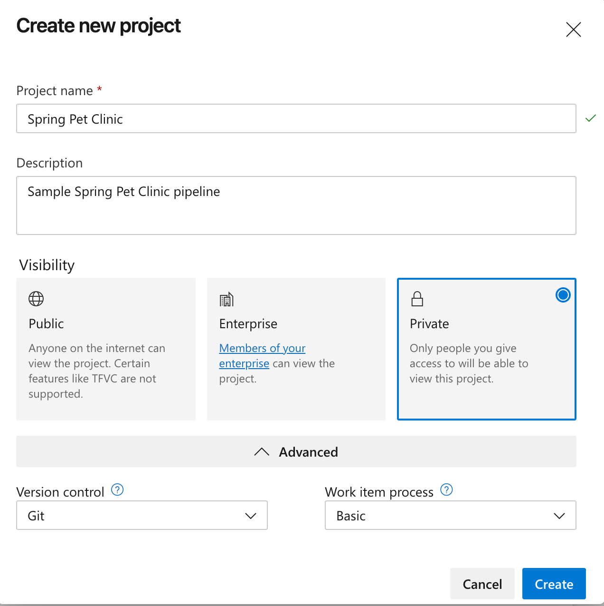
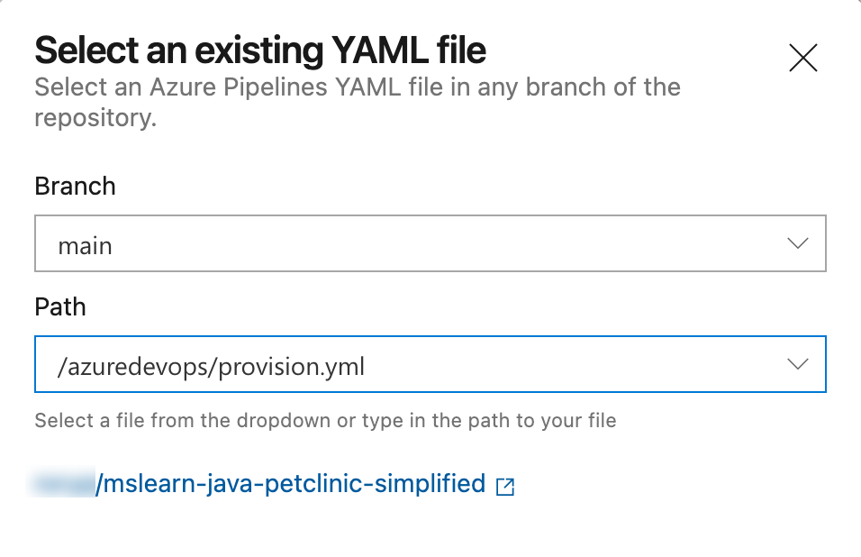
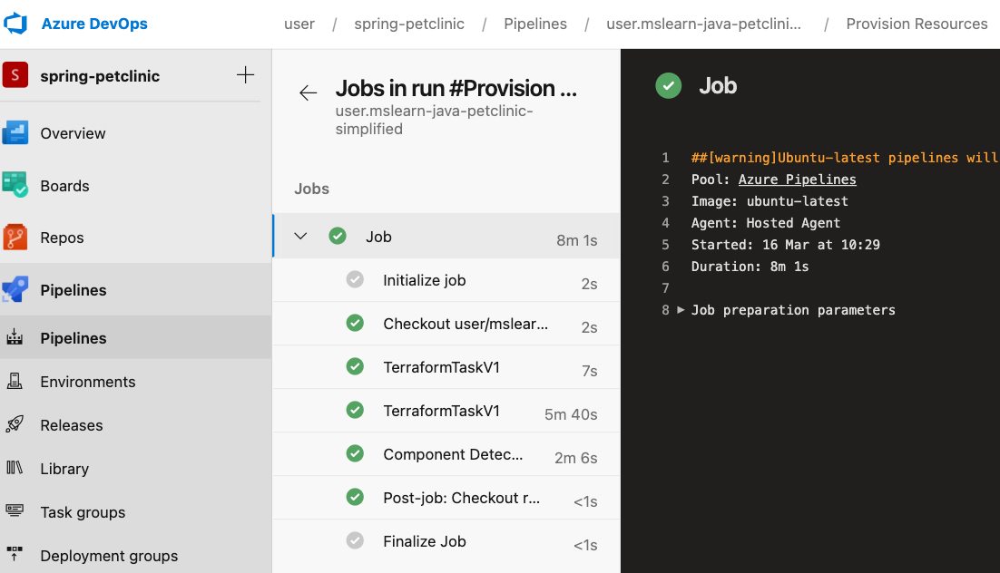

In this exercise, you'll configure an automation workflow to provision your Terraform resources.

## Access the sample application

In this exercise, you'll create a GitHub repository from a template that contains all the code for Terraform provisioning.

1. On GitHub, go to the main page of the repository:

   ```html
   https://github.com/MicrosoftDocs/mslearn-java-petclinic-simplified
   ```

1. Above the file list, select **Use this template**, then select **Create a new repository**.

    

1. In the **Repository name** box, enter a unique name for your repository. Be sure to follow the naming convention for GitHub repositories.

1. Ensure that the **Private** option is selected, and then select **Create repository**.

    

## Workflow

Inside the project directory for the repository you've created, you'll see a directory called *terraform* and, within it, a file called *main.tf*.

Let's look at a few sections that you might use to define your module's configuration:

- **Provider**: A Terraform configuration file starts with the specification of the provider. When you use Azure, you specify the Azure provider (`azurerm`) in the provider block.
- **Terraform**: The Terraform version with which you're working.
- **Data**: Gets data from existing services.
- **Locals**: Generates new variables by using functions and expressions.
- **Resource**: Describes resources and dependencies.
- **Module**: Reusability and complexity abstraction.

To provision our application and database, we'll only need to include the **Provider** and **Resource** sections.

Next, open the *main.tf* file and review the outline and comments:

```yml
provider "azurerm" {
  version = "=2.20.0"
  features {}
}

# Creates a resource group
resource "azurerm_resource_group" "main" {
  name     = var.resource_group
  location = var.location

  tags = {
    "Terraform" = "true"
  }
}

resource "random_password" "password" {
  length = 32
  special = true
  override_special = "_%@"
}

# Creates a MySQL server
resource "azurerm_mysql_server" "main" {
  name                              = "${azurerm_resource_group.main.name}-mysql-server"
  location                          = azurerm_resource_group.main.location
  resource_group_name               = azurerm_resource_group.main.name

  administrator_login               = "petclinic"
  administrator_login_password      = random_password.password.result

  sku_name   = "B_Gen5_1"
  storage_mb = 5120
  version    = "5.7"
  auto_grow_enabled                 = true
  backup_retention_days             = 7
  geo_redundant_backup_enabled      = false
  infrastructure_encryption_enabled = false
  public_network_access_enabled     = true
  ssl_enforcement_enabled           = true
  ssl_minimal_tls_version_enforced  = "TLS1_2"
}

# The database that your application will use
resource "azurerm_mysql_database" "main" {
  name                = "${azurerm_resource_group.main.name}_mysql_db"
  resource_group_name = azurerm_resource_group.main.name
  server_name         = azurerm_mysql_server.main.name
  charset             = "utf8"
  collation           = "utf8_unicode_ci"
}

# Enables the 'Allow access to Azure services' check box
resource "azurerm_mysql_firewall_rule" "main" {
  name                = "${azurerm_resource_group.main.name}-mysql-firewall"
  resource_group_name = azurerm_resource_group.main.name
  server_name         = azurerm_mysql_server.main.name
  start_ip_address    = "0.0.0.0"
  end_ip_address      = "0.0.0.0"
}

# Creates the plan that the service uses
resource "azurerm_app_service_plan" "main" {
  name                = "${var.application_name}-plan"
  location            = azurerm_resource_group.main.location
  resource_group_name = azurerm_resource_group.main.name
  kind                = "Linux"
  reserved            = true

  sku {
    tier = "PremiumV2"
    size = "P1v2"
  }
}

# Creates the service definition
resource "azurerm_app_service" "main" {
  name                = var.application_name
  location            = azurerm_resource_group.main.location
  resource_group_name = azurerm_resource_group.main.name
  app_service_plan_id = azurerm_app_service_plan.main.id
  https_only          = true

  site_config {
    always_on        = true
    linux_fx_version = "JAVA|8-jre8"
  }

  # Contains application-specific environment variables
  app_settings = {
    "WEBSITES_ENABLE_APP_SERVICE_STORAGE" = "false"

    "SPRING_PROFILES_ACTIVE"     = "mysql"
    "SPRING_DATASOURCE_URL"      = "jdbc:mysql://${azurerm_mysql_server.main.fqdn}:3306/${azurerm_mysql_database.main.name}?useUnicode=true&characterEncoding=utf8&useSSL=true&useLegacyDatetimeCode=false&serverTimezone=UTC"
    "SPRING_DATASOURCE_USERNAME" = "${azurerm_mysql_server.main.administrator_login}@${azurerm_mysql_server.main.name}"
    "SPRING_DATASOURCE_PASSWORD" = azurerm_mysql_server.main.administrator_login_password
  }
}
```

::: zone pivot="github-actions"

## Set up your GitHub Actions workflow with Terraform

Let's provide your GitHub workflow access to your Azure account.

In the Azure CLI, create a service principal by running the following command:

> [!IMPORTANT]
> Replace *\<yourServicePrincipalName>* with the service principal name you want to use.

```azurecli
az ad sp create-for-rbac --name "<yourServicePrincipalName>" --role contributor --scopes /subscriptions/<subscriptionId> --sdk-auth
```

The preceding command returns the following JSON. Copy it for use in the next step:

```output
{
  "clientId": "XXXXXXX-XXXX-XXXX-XXXX-XXXXXXXXXXXXX",
  "clientSecret": "XXXXXXXXXXXXXXXXXXXXXXXXXXXXX",
  "subscriptionId": "XXXXXXXXX-XXXXX-XXXX-XXXX-XXXXXXXXXXXXX",
  "tenantId": "XXXXXXXX-XXXXX-XXXX-XXXX-XXXXXXXXXXX",
  ...
}
```

## GitHub secrets

Your GitHub repository has a feature called Secrets, where you can store sensitive information that's used by Terraform to authenticate to Azure.

After you've created the required IDs and the secret in the preceding step, the next step in this unit is to add them to the Secrets store in your GitHub project.

For this exercise, you need to store the following secrets:

* `AZURE_CLIENT_ID`
* `AZURE_CLIENT_SECRET`
* `AZURE_SUBSCRIPTION_ID`
* `AZURE_TENANT_ID`

To store the secrets, go to your forked GitHub repository, select **Settings**, and then select **Secrets and variables**, then select **Actions** on the left pane.

Create four secrets using the values returned from the creation of the Service Principal.

Be sure to store the secrets without the quotation marks (" "), as shown in the following screenshot:



## Workflow file

Inside your project directory is a directory called *.github/workflows* and, within it, a file called *main.yml*.

The *main.yml* file is a GitHub workflow. It uses the secret you've configured to deploy your application to your Azure subscription.

In the *main.yml* workflow file, you'll find the following content:

```yml
name: TERRAFORM

on:
  push:
    branches: [ main ]
    paths:
    - 'terraform/**'
  pull_request:
    branches: [ main ]
    paths:
    - 'terraform/**'

  workflow_dispatch:
jobs:
  terraform:
    runs-on: ubuntu-latest

    env:
      ARM_CLIENT_ID: ${{ secrets.AZURE_CLIENT_ID }}
      ARM_CLIENT_SECRET: ${{secrets.AZURE_CLIENT_SECRET}}
      ARM_SUBSCRIPTION_ID: ${{ secrets.AZURE_SUBSCRIPTION_ID }}
      ARM_TENANT_ID: ${{ secrets.AZURE_TENANT_ID }}

    defaults:
      run:
        working-directory: ./terraform
    steps:
      - uses: actions/checkout@v2

      - name: Setup Terraform
        uses: hashicorp/setup-terraform@v1

      - name: Terraform Init
        run: terraform init

      - name: Terraform Plan
        run: terraform plan

      - name: Terraform Apply
        run: terraform apply -auto-approve
```

This workflow does the following actions:

- It checks whether the configuration is formatted properly.
- It generates a plan for every pull request.
- It triggers the configuration when you update files in the *terraform* directory.

> [!NOTE]
> You can also trigger the GitHub Actions workflow by going to **Actions**, selecting the Terraform workflow, and selecting **Re-run existing Jobs**.

## Trigger the workflow

Next, in your repository, trigger your GitHub action by:

1. In the built-in GitHub text editor, or in an editor of your choice, edit *terraform/variables.tf* as follows:

   a. Change `"CHANGE_ME_RESOURCE_GROUP"` to your intended resource group name.  
   b. Change `"CHANGE_ME_APP_NAME"` to your intended application name. Make sure that your application name is unique.

    ```yaml
    variable "resource_group" {
      description = "The resource group"
      default = "CHANGE_ME_RESOURCE_GROUP"
    }

    variable "application_name" {
      description = "The Spring Boot application name"
      default     = "CHANGE_ME_APP_NAME"
    }

    variable "location" {
      description = "The Azure location where all resources in this example should be created"
      default     = "westeurope"
    }
    ```

1. Commit your changes.

## Verify the GitHub Actions build

1. In your repository, select **Actions**, and then select the **TERRAFORM** workflow on the left pane.

1. In the list of steps, verify that **Terraform Init**, **Terraform Plan**, and **Terraform Validate** have been triggered.

    

1. In the list of steps, expand **Terraform Apply**, and verify that:
  
- Terraform has created the resources and displays the Azure instance URL.
- Your Azure app instance is publicly available.

    

## Next steps

In the next exercise, you'll use GitHub Actions to deploy a sample Spring Boot application.

::: zone-end

::: zone pivot="azure-devops"

## Set up your application name and Azure resource group

In your GitHub repository, edit your Azure resource names by doing the following action:

1. In the built-in GitHub text editor, or in an editor of your choice, edit *terraform/variables.tf* as follows:

   a. Change `"<CHANGE_ME_RESOURCE_GROUP>"` to your intended resource group name.  
   b. Change `"<CHANGE_ME_APP_NAME>"` to your intended application name. Make sure that your application name is unique.

    ```yaml
    variable "resource_group" {
      description = "The resource group"
      default = "<CHANGE_ME_RESOURCE_GROUP>"
    }

    variable "application_name" {
      description = "The Spring Boot application name"
      default     = "CHANGE_ME_APP_NAME"
    }

    variable "location" {
      description = "The Azure location where all resources in this example should be created"
      default     = "westeurope"
    }
    ```

1. Commit your changes

## Create an Azure Pipeline to provision your Terraform resources

In our Azure DevOps project, we'll create two separate pipelines for provisioning and build-and-deploy. The provisioning pipeline creates the Azure resources that will be released via the build-and-deploy pipeline at a later point.

Let's create the first provisioning Pipeline:

1. Choose your organization, and then select **New project**.

1. Specify the following parameters.

   | Parameter | Description |
   | --------- | ----------- |
   | Project Name | Required |
   | Description | Optional |
   | Visibility | Choose **Private** |
   | Advanced |  |
   | Version control | Choose **GIT** |  
   | Work Item Process | Choose **Basic** |

1. Select **Create project** to create the project and open a welcome page.



## Set up your Azure Pipeline Service Connection

Let's give your Azure Pipeline access to your Azure account.

1. In Azure DevOps, open the **Service connections** page from the project settings page

1. Choose **Create service connection** and select **Azure Resource Manager**, then select **Next**.
1. Select **Service principal (automatic)**, then select **Next**.

1. Specify the following parameters.

   | Parameter | Description |
   | --------- | ----------- |
   | Scope level | Select Azure Subscription |
   | Subscription | Select your existing Azure subscription |
   | Resource Group | Leave empty to allow users to access all resources defined within the subscription |
   | Connection Name | Required. The name you'll use to refer to this service connection in task properties. This name isn't the name of your Azure subscription. |

1. Select **Save** to create the connection.

## Create the Provision Pipeline

> [!IMPORTANT]
> This module's prerequisites required you to install the [Terraform Azure Pipelines extension](https://marketplace.visualstudio.com/items?itemName=ms-devlabs.custom-terraform-tasks). If you haven't installed it, your pipeline won't run.

After setting up your project and connection to Azure, you'll need to create an Azure Pipeline to provision your terraform resources.

In Azure DevOps, go to your Project, select **Pipelines** in the left-hand menu, then select **Create Pipeline**.

1. On the "**Connect**" tab, select "**GitHub**" (YAML file).
1. If prompted to authorize GitHub access, enter your GitHub Credentials and approve the access for Azure Pipelines with the requested privileges.
1. On the "**Select**" tab, select the GitHub Repository containing your Template.
1. Select **Configure pipeline** on the **Inventory** tab.
1. On the "**Configure**" tab, select to use an "**Existing Azure Pipelines YAML file**".
1. In the path, select "/azuredevops/provision.yml"
1. Select **Continue** to go the **Review** tab and review your pipeline.



On the "Review your pipeline YAML" screen, let's inspect the Yaml file we'll use to create our Pipeline.

```yml
name: Provision Resources

trigger: none

pool:
  vmImage: 'ubuntu-latest'

steps:

# Initialize the Terraform environment and bind to your Service Connection
- task: TerraformTaskV1@0
  inputs:
    provider: 'azurerm'
    command: 'init'
    workingDirectory: $(Build.Repository.LocalPath)/terraform
    backendServiceArm: $(serviceConnection)
    backendAzureRmResourceGroupName: $(serviceConnection)
    backendAzureRmStorageAccountName: $(serviceConnection)
    backendAzureRmContainerName: 'tfstate'
    backendAzureRmKey: 'tf/terraform.tfstate'

# Apply the Terraform config and deploy to Azure
- task: TerraformTaskV1@0
  inputs:
    provider: 'azurerm'
    command: 'apply'
    workingDirectory: $(Build.Repository.LocalPath)/terraform
    backendAzureRmContainerName: 'tfstate'
    backendAzureRmKey: 'tf/terraform.tfstate'
    environmentServiceNameAzureRM: $(serviceConnection)
```

Let's look at some of the fields we use in the config:

- **serviceConnection**: Your Azure PipeLine Service Connection your setup previously
- **command**: Your Terraform workflow command: **init** or **apply**
- **backendAzure**: Required fields that are needed in a team environment to store shared state.\

Before you save and run the pipeline, we need to add the variable that will bind to your service connection:

1. Select **Variables** (Top right) and add a variable named "serviceConnection" with the value as the name of your Service Connection.
1. Select **OK** (bottom-right corner) to save the variable.


Finally, select "**run**" (top-right corner) to save and run the pipeline

## Watch the pipeline run

Under Jobs, trace the build process through each of the steps.

As your pipeline runs, watch as your first Terraform **init** stage, and then your second **apply** stage, go from blue (running) to green (completed). You can select the stages to watch your pipeline in action.



> [!TIP]
> Check your email. You might have already received a build notification with the results of your run. You can use these notifications to know whether each build passes or fails.

## Next steps

In the next exercise, you'll use Azure Pipelines to build and deploy your sample Spring Boot application.

::: zone-end
