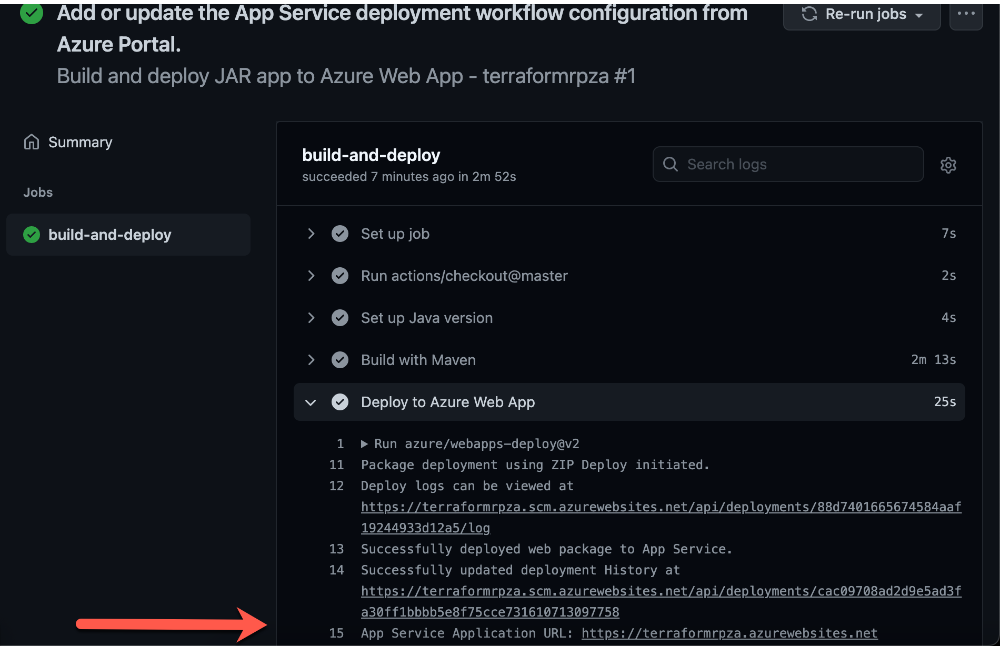

In this exercise, you'll use GitHub Actions to deploy a Spring Boot sample application.

## Set up a GitHub action to deploy the sample application

Now that you've provisioned your Azure resources, you can deploy your sample Spring Boot application.

To create your Maven GitHub workflow, you'll use the built-in continuous integration and continuous delivery (CI/CD) wizard tool that's available at the Deployment Center in the Azure App Service portal.


The Azure App Service Deployment Center automatically generates a GitHub Actions workflow file that's based on your application stack. The Deployment Center then commits the file to your GitHub repository in the correct directory. The Deployment Center also links your GitHub action to an Azure App Service publishing profile.

1. In the Azure portal, go to your Azure App Service web app.

1. On the left pane, select **Deployment Center**.

1. Under **Continuous Deployment (CI/CD)**, select **GitHub**.

1. Select **GitHub Actions**.

1. Under **Settings**, in the drop-down lists, do the following:

   a. Select your GitHub repository.  
   b. For branch, select **main**.  
   c. For application stack, select **JAVA 8**.

1. On the final page, review your selections and preview the workflow file that will be committed to the repository. 

   Except for the application name (`APP-NAME`) and publishing profile (`publish-profile`), the contents of your YAML workflow file are similar to the following:

    ```yml
    name: Build and deploy JAR app to Azure Web App - APP_NAME
    
    on:
      push:
        branches:
          - main
      workflow_dispatch:
    
    jobs:
      build-and-deploy:
        runs-on: ubuntu-latest
    
        steps:
        - uses: actions/checkout@master
    
        - name: Set up Java version
          uses: actions/setup-java@v1
          with:
            java-version: '8'
    
        - name: Build with Maven
          run: mvn clean install
    
        - name: Deploy to Azure Web App
          uses: azure/webapps-deploy@v2
          with:
            app-name: 'APP_NAME'
            slot-name: 'production'
            publish-profile: ${{ secrets.AzureAppService_PublishProfile_c1ee8d191003493b9c9e13a9b78ad2c3 }}
            package: '${{ github.workspace }}/target/*.jar'
    ```

1. Select **Save** to commit the workflow file to the repository, and immediately start building and deploying your app.

    > [!NOTE]
    > You can also trigger the GitHub Actions workflow in your repository by selecting the **Actions** tab, selecting the **build-and-deploy** workflow, and then selecting **Re-run jobs**.

## Confirm the GitHub Actions build

1. In your repository, select the **Actions** tab and then, for workflow, select **build-and-deploy**.

1. Under **build-and-deploy**, in the list of steps, expand **Deploy to Azure Web App**. 

    

   As shown in the preceding screenshot, Terraform has deployed the Java web app and displayed the Azure instance URL.

1. Verify that your Java application is deployed, is connected to your MySQL database, and is returning data.

## Next steps

Congratulations! You now have two GitHub Actions workflows: a provisioning action and a build-and-deploy action.

Each time you enter a `git push` command to commit your code, your build-and-deploy action is triggered and your application is deployed.

> [!IMPORTANT]
> Re-running the provisioning of your GitHub action won't re-create your resources if they already exist. You'll need to delete your resource group or resources manually and then re-run the GitHub action.
>
> Re-running your build-and-deploy GitHub action will replace your application.
>
> If you re-create your App Service instance, you also need to change to the new publishing profile. You need to change only the following line:

```yml
publish-profile: ${{ secrets.AzureAppService_PublishProfile_c1ee8d191003493b9c9e13a9b78ad2c3 }}
```

The next unit is a knowledge check to see what you've learned in this module.
