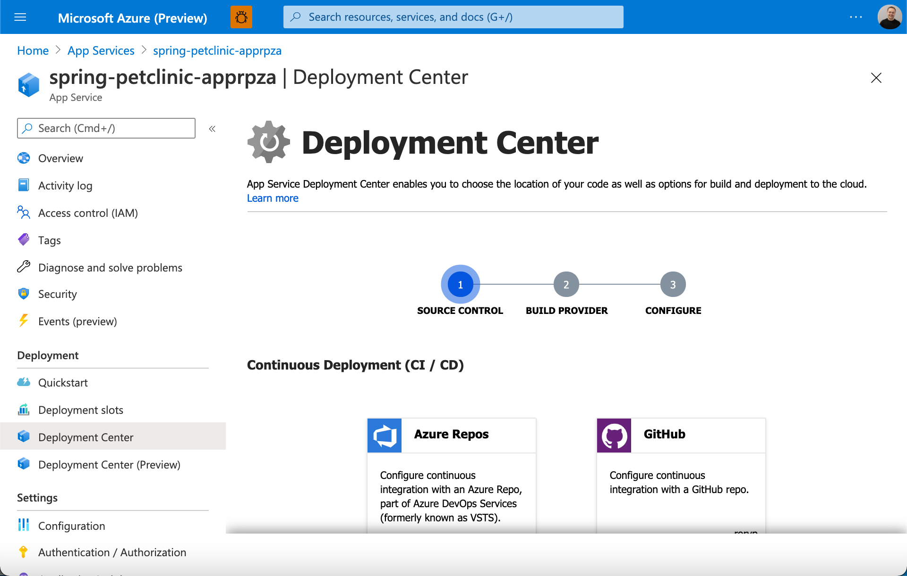
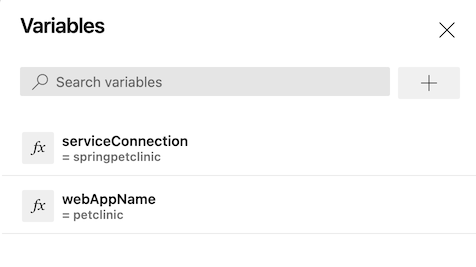
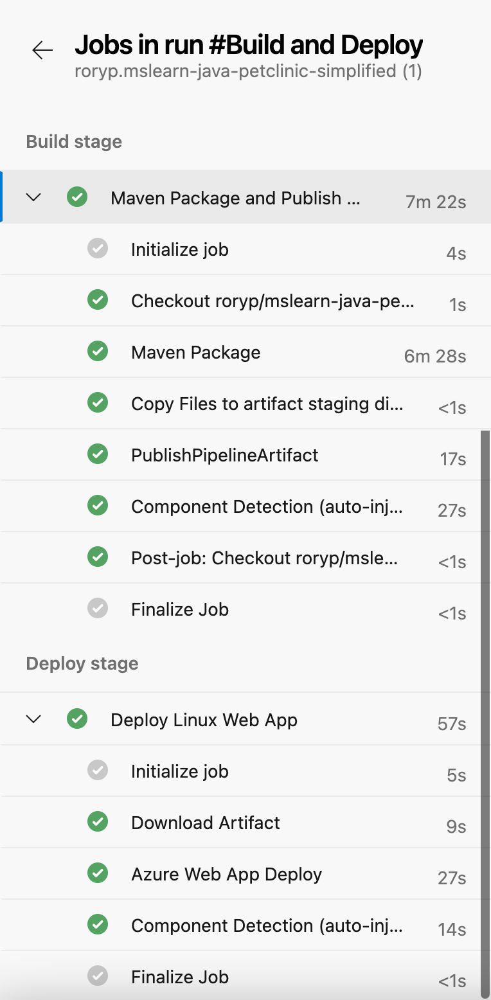

In this exercise, you'll use an automated workflow to build and deploy your Spring Boot sample application.

::: zone pivot="github-actions"

## Set up a GitHub action to deploy the sample application

Now that you've provisioned your Azure resources, you can deploy your sample Spring Boot application.

To create your Maven GitHub workflow, you'll use the built-in continuous integration and continuous delivery (CI/CD) wizard tool that's available at the Deployment Center in the Azure App Service portal.



The Azure App Service Deployment Center automatically generates a GitHub Actions workflow file that's based on your application stack. The Deployment Center then commits the file to your GitHub repository in the correct directory. The Deployment Center also links your GitHub action to an Azure App Service publishing profile.

1. In the Azure portal, go to your Azure App Service web app.

1. On the left pane, expand **Deployment** and select **Deployment Center**.

1. In the **Source** drop-down, Under **Continuous Deployment (CI/CD)**, select **GitHub**.

1. Select **GitHub Actions**. (This should be the default, but if it's not, select **Change provider** to load the provider options.)

1. Under **Settings**, in the drop-down lists, do the following:

   a. Select your GitHub repository.  
   b. For branch, select **main**.  
   c. For application stack, select **JAVA 8**.

1. On the final page, review your selections and preview the workflow file that will be committed to the repository.

1. Select **Save** to commit the workflow file to the repository, and immediately start building and deploying your app.

    > [!NOTE]
    > You can also trigger the GitHub Actions workflow in your repository by selecting the **Actions** tab, selecting the **build-and-deploy** workflow, and then selecting **Re-run jobs**.

## Confirm the GitHub Actions build

1. In your GitHub repository, select the **Actions** tab and then, on the left hand side, under **All Workflows**, select "**Build and deploy JAR app to Azure Web App**".

1. Next, in the right-side table, under **Workflow run**, select the workflow run **Add or update the App Service deployment workflow configuration**.

1. Wait until the workflow run is finished, then under the **Deploy** job in the workflow run, copy the URL in the **Deploy** job that displays the Azure webapp URL.

1. Finally, open the URL in a browser and verify that your Java application is deployed, connected to your MySQL database, and is returning data.

## Next steps

Congratulations! You now have two GitHub Actions workflows: a provisioning action and a build-and-deploy action.

Each time you enter a `git push` command to commit your code, your build-and-deploy action is triggered and your application is deployed.

> [!IMPORTANT]
> Rerunning the provisioning of your GitHub action won't re-create your resources if they already exist. You'll need to delete your resource group or resources manually and then rerun the GitHub action.
>
> Rerunning your build-and-deploy GitHub action will replace your application.
>
> If you re-create your App Service instance, you also need to change to the new publishing profile. You need to change only the following line:

```yml
publish-profile: ${{ secrets.AzureAppService_PublishProfile_c1ee8d191003493b9c9e13a9b78ad2c3 }}
```

::: zone-end

::: zone pivot="azure-devops"

## Set up an Azure Pipeline to deploy the sample application

As before, you'll need to create an Azure Pipeline to build-and-deploy your application.

In Azure DevOps, go to your Project, select "Pipelines" and select "New Pipeline" (Top-right corner).

You will now be given 4four tabs to setup your Pipeline:

1. On the "**Connect**" tab, select "**GitHub**" (YAML file).
1. On the "**Select**" tab, select the GitHub Repository containing your Template.
1. On the "**Configure**" tab, select to use an "**Existing Azure Pipelines YAML file**".
1. In the path, this time, select "/azuredevops/build_deploy.yml"
1. Select **Continue** to go the "***Review**" tab and review your pipeline before you run it.

On the **Review your pipeline YAML** screen, inspect the Yaml file you'll use to create your pipeline:

```yml
name: Build and Deploy

trigger:
- main

stages:

# Build your Spring Boot App using Maven
- stage: Build
  displayName: Build stage
  jobs:
  - job: MavenPackageAndPublishArtifacts
    displayName: Maven Package and Publish Artifacts
    pool:
      vmImage: 'ubuntu-latest'

    steps:
    - task: Maven@3
      displayName: 'Maven Package'
      inputs:
        mavenPomFile: 'pom.xml'

    - task: CopyFiles@2
      displayName: 'Copy Files to artifact staging directory'
      inputs:
        SourceFolder: '$(System.DefaultWorkingDirectory)'
        Contents: '**/target/*.?(war|jar)'
        TargetFolder: $(Build.ArtifactStagingDirectory)

    - upload: $(Build.ArtifactStagingDirectory)
      artifact: drop

# Deploy to Azure using the AzureWebApp task using your Service Connection
- stage: Deploy
  displayName: Deploy stage
  dependsOn: Build
  condition: succeeded()
  jobs:
  - deployment: DeployLinuxWebApp
    displayName: Deploy Linux Web App
    environment: 'production'
    pool:
      vmImage: 'ubuntu-latest'
    strategy:
      runOnce:
        deploy:
          steps:
          - task: AzureWebApp@1
            displayName: 'Azure Web App Deploy'
            inputs:
              azureSubscription: $(serviceConnection)
              appType: webAppLinux
              appName: '$(webAppName)'
              package: '$(Pipeline.Workspace)/drop/**/target/*.?(war|jar)'
```

Let's look at some of the fields we use in the "**Build**" config:

* **azureSubscription**: Your Azure subscription
* **appType**: Your Web App type
* **appName**: The name of your existing app service
* **package**: The file path to the package or a folder containing your app service contents

## Add Build Variables

As with our provisioning pipeline, before you save and run the build-and-deploy pipeline, you need to add your pipeline's variables:

1. Select **Variables** at the top right.
1. Add a variable named **serviceConnection** with the value as the name of your Service Connection.
1. Select **OK** in the bottom-right corner to save the variable.
1. Add a second variable named **webAppName** with your App Service name (same value defined in your Terraform variable "application_name").
1. Select **OK** to save the variable.
1. Select **Save** in the bottom-right corner to save both the variables.



## Watch the pipeline run

1. Select && to save and run the pipeline
1. As you did for your *Provision* pipeline, trace the build process through each of the stages and steps.
1. Verify that your Java application is deployed, connected to your MySQL database, and returning data.



## Next steps

Congratulations! You now have two Azure Pipeline workflows: a provisioning pipeline and a build-and-deploy pipeline.

Each time you enter a `git push` command to commit your code to the **main** branch, your build-and-deploy pipeline is triggered and your application is deployed.

> [!IMPORTANT]
> Rerunning the Provision Pipeline won't re-create your resources if they already exist. You'll need to delete your resource group or resources manually and then rerun the Pipeline. You can find more information on how to better achieve this in production in the Summary section.
>
> Rerunning your build-and-deploy Pipeline will replace your application.

::: zone-end

The next unit is a knowledge check to see what you've learned in this module.
