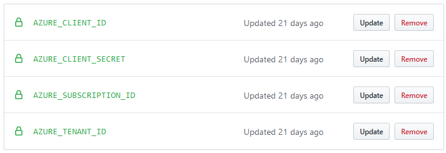

In this unit, you'll configure GitHub actions to provision your Terraform resources.

You'll configure your pipeline to act as soon as you push code to master (see on: push: branches: master), then you'll check out the code (actions/checkout@master), then do a terraform format, terraform init, terraform validate, terraform plan, terraform apply

## Set Up up your workflow

You now need to allow access from your GitHub workflow to your Azure account.
Create a service principal to deploy to Azure.

> [!IMPORTANT]
> Make sure you assign the name of your resource group to the variable `AZ_RESOURCE_GROUP` or substitute the value for it in the commands below.
> Replace `yourServicePrincipalName` with a name of your service principal you choose.

```bash
RESOURCE_ID=$(az group show --name "$AZ_RESOURCE_GROUP" --query id -o tsv)
az ad sp create-for-rbac --name "yourServicePrincipalName" --role contributor --scopes "$RESOURCE_ID" --sdk-auth
```

This command will return JSON - copy it and keep it safe as we'll use it in the next step:

```bash
{
  "clientId": "XXXXXXX-XXXX-XXXX-XXXX-XXXXXXXXXXXXX",
  "clientSecret": "XXXXXXXXXXXXXXXXXXXXXXXXXXXXX",
  "subscriptionId": "XXXXXXXXX-XXXXX-XXXX-XXXX-XXXXXXXXXXXXX",
  "tenantId": "XXXXXXXX-XXXXX-XXXX-XXXX-XXXXXXXXXXX",
  ...
}
```

## GitHub Secrets

Once you have the required ID and Secrets, the next step is to add them the secret store in your GitHub project.

GitHub repositories have a feature known as Secrets that allow you to store sensitive information related to a project. For this exercise, store three secrets – `AZURE_CLIENT_ID`, `AZURE_CLIENT_SECRET`, `AZURE_SUBSCRIPTION_ID`, and `AZURE_TENANT_ID`.
You'll create these secrets because they'll be used by Terraform to authenticate to Azure.

To create the secrets, navigate to the GitHub repository, select the `Settings` menu and then on `Secrets`.
Create a GitHub secret for each of four secrets using the values returned the Azure service principal.

The result will be something like this:



## Workflow file

Inside the project directory, you'll see a directory called `.github/workflows` and a file called `main.yml` in it.
This file is a GitHub workflow and will use the secret we configured above to deploy the application to your Azure subscription.

In that file, you'll see the following content:

```yaml
name: CI

on:
  push:
    branches: [ main ]
  pull_request:
    branches: [ main ]

  workflow_dispatch:
jobs:
  terraform:
    runs-on: ubuntu-latest

    env:
      ARM_CLIENT_ID: ${{ secrets.AZURE_CLIENT_ID }}
      ARM_CLIENT_SECRET: ${{secrets.AZURE_CLIENT_SECRET}}
      ARM_SUBSCRIPTION_ID: ${{ secrets.AZURE_SUBSCRIPTION_ID }}
      ARM_TENANT_ID: ${{ secrets.AZURE_TENANT_ID }}

    defaults:
      run:
        working-directory: ./terraform
    steps:
      - uses: actions/checkout@v2

      - name: Setup Terraform
        uses: hashicorp/setup-terraform@v1

      - name: Terraform Init
        run: terraform init

      - name: Terraform Plan
        run: terraform plan

      - name: Terraform Apply
        run: terraform apply -auto-approve
```

This workflow does the following actions:

- Check whether the configuration is formatted properly
- generate a plan for every pull requests
- apply the configuration when you update the GitHub branch

Your workflow will be triggered whenever code is pushed to the repository.

## Test the GitHub Action

You can now manually trigger the GitHub Actions workflow by going to "Actions", then select the terraform workflow.
Then, select the "Terraform" workflow. Notice how the "Terraform Init", "Terraform Plan" and "Terraform Validate" steps have been triggered.


Expand the "Terraform Apply" step. Terraform has created the resources and displayed the Azure Instance URL.
Verify your Azure App Instance is publicly available.

## Deploy your application

Use Maven, as before, to deploy to your Azure instance.

```bash
./mvnw com.microsoft.azure:azure-webapp-maven-plugin:1.12.0:deploy
```

## Destroy your resources

Remove the resources you created for this tutorial.

```bash
terraform destroy
```

Congratulations! Each time you `git push` your code, your TerraForm provisioned resources are now automatically deployed to production.

## Next steps

In the next unit, we'll summarize what we learnt about Terraform.
