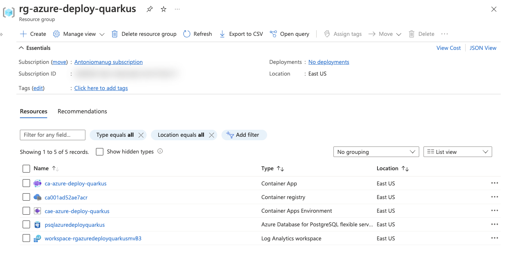

In this unit, you'll configure your Quarkus application to be deployed through Maven. Then you'll create and deploy to an Azure Container Apps instance.


## Containerize the Quarkus application 

Rename `Dockerfile.jvm` to `Dockerfile` and move it to the root folder.
This image is a native image that is optimized for running in a container. 

```bash
mv src/main/docker/Dockerfile.jvm ./Dockerfile
```


```dockerfile
FROM registry.access.redhat.com/ubi8/openjdk-11:1.14

ENV LANGUAGE='en_US:en'


# We make four distinct layers so if there are application changes the library layers can be re-used
COPY --chown=185 target/quarkus-app/lib/ /deployments/lib/
COPY --chown=185 target/quarkus-app/*.jar /deployments/
COPY --chown=185 target/quarkus-app/app/ /deployments/app/
COPY --chown=185 target/quarkus-app/quarkus/ /deployments/quarkus/

EXPOSE 8080
USER 185
ENV AB_JOLOKIA_OFF=""
ENV JAVA_OPTS="-Dquarkus.http.host=0.0.0.0 -Djava.util.logging.manager=org.jboss.logmanager.LogManager"
ENV JAVA_APP_JAR="/deployments/quarkus-run.jar"
```

## Deploy the container to Azure Container App


```bash
az containerapp up \
    --name "$AZ_CONTAINERAPP" \
    --environment "$AZ_CONTAINERAPP_ENV" \
    --location "$AZ_LOCATION" \
    --resource-group "$AZ_RESOURCE_GROUP" \
    --ingress external \
    --target-port 8080 \
    --source .
```

```bash
Using resource group 'rg-azure-deploy-quarkus'
Creating ContainerAppEnvironment 'cae-azure-deploy-quarkus' in resource group rg-azure-deploy-quarkus
No Log Analytics workspace provided.
Generating a Log Analytics workspace with name "workspace-rgazuredeployquarkusEED7"
Creating Azure Container Registry ca001ad52ae7acr in resource group rg-azure-deploy-quarkus

Run ID: ca3 was successful after 41s
Creating Containerapp ca-azure-deploy-quarkus in resource group rg-azure-deploy-quarkus
Adding registry password as a secret with name "ca001ad52ae7acrazurecrio-ca001ad52ae7acr"

Your container app ca-azure-deploy-quarkus has been created and deployed! Congrats! 
```

## Check the deployment




```bash
az resource list \
    --location "$AZ_LOCATION" \
    --resource-group "$AZ_RESOURCE_GROUP" \
    --output table
```

## Execute the Azure Container Apps application


```bash
AZ_APP_URL=$(
    az containerapp show \
        --name "$AZ_CONTAINERAPP" \
        --resource-group "$AZ_RESOURCE_GROUP" \
        --query "properties.configuration.ingress.fqdn" \
        --output tsv \
)

echo "AZ_APP_URL=$AZ_APP_URL"
```

When the deployment finishes, your application is ready at `https://<appName>.azurecontainerapps.io/`. Notice the `https` protocol. This is because the application is deployed with a TLS certificate.

To test the application, you can use `cURL`.

As you redeployed your application, you cleared the database. Now you need to create a new to-do item in the database:

```bash
curl --header "Content-Type: application/json" \
    --request POST \
    --data '{"description":"configuration","details":"congratulations, you have set up your Quarkus application correctly!","done": "true"}' \
    https://<value of $AZ_APP_URL>/api/todos
```

Retrieve the data by using a new `cURL` request:

```bash
curl https://<value of $AZ_APP_URL>/api/todos
```

This command returns the list of to-do items, including the item you created:

```json
[{"id":1,"description":"configuration","details":"congratulations, you have set up your Quarkus application correctly!","done":true}]
```

Stream logs for your container with: 

```bash
az containerapp logs show \
    --name "$AZ_CONTAINERAPP" \
    --resource-group "$AZ_RESOURCE_GROUP" \
    --follow
```

Execute more curl commands, and you should see the logs scrolling in the terminal. 


```bash
curl https://<value of $AZ_APP_URL>/api/todos
```

> [!NOTE]
> You can also open the URL in a web browser to return the list of to-do items.
