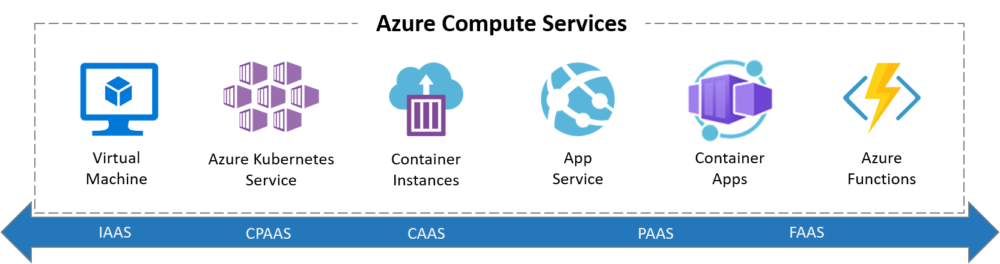

In this unit, you learn how to create an Azure Container Apps environment and an Azure for PostgreSQL database using Azure CLI. You then configure your Quarkus application so it connects to the remote database instead of the local one.

Several targets are available to deploy a Quarkus application on Azure: from IaaS to FaaS. [Azure Container Apps](https://azure.microsoft.com/products/container-apps/) sits between PaaS and FaaS. On the one hand, it feels more like a PaaS because it doesn't force you into a specific programming model, and you can control the rules by which to scale out and in. On the other hand, it has some serverless characteristics like scaling to zero, event-driven scaling, or a per second pricing model.

Container Apps is built on top of [Azure Kubernetes Service](https://azure.microsoft.com/products/kubernetes-service/) (or AKS). It includes a deep integration with [KEDA](https://keda.sh) (event-driven autoscaling for Kubernetes), [Dapr](https://dapr.io) (distributed application runtime) and [Envoy](https://www.cncf.io/projects/envoy) (a service proxy designed for cloud-native applications). The underlying complexity is abstracted for the end-user. So no need to configure your K8s service, deployment, ingress, volume manifests… You get a simple API and user interface to configure the desired configuration for your containerized application. This simplification means also less control, hence the difference with AKS.

In Azure Container Apps, the applications need to be packaged into a Docker container. Azure Container Apps supports Docker containers built with Dockerfiles or containers built with Jib. The container has to be available on a container registry. Azure Container Apps supports Azure Container Registry, Docker Hub, and GitHub Container Registry. Once the application image is available in a registry, Azure Container Apps supports deploying from the Azure portal, Azure CLI, GitHub Action and Azure DevOps.

Azure Container Apps has the following features:

* _Revisions_: automatic versioning that helps to manage the application lifecycle of your container apps
* _Traffic control_: split incoming HTTP traffic across multiple revisions for Blue/Green deployments and A/B testing
* _Ingress_: simple HTTPS ingress configuration, without the need to worry about DNS and certificates
* _Autoscaling_: use all KEDA-supported scale triggers (to scale your app based on external metrics)
* _Secrets_: deploy secrets that are securely shared between containers, scale rules and Dapr sidecars
* _Monitoring_: the standard output and error streams are automatically written to Log Analytics
* _Dapr_: through a simple flag, you can enable native Dapr integration for your Container Apps

Azure Container Apps introduces the following concepts:

* _Environment_: a secure boundary around a group of Container Apps. They're deployed in the same virtual network, these apps can easily intercommunicate with each other and they write logs to the same Log Analytics workspace. An environment can be compared with a Kubernetes namespace.
* _Container App_: a group of containers (pod) that is deployed and scale together. They share the same disk space and network.
* _Revision_: an immutable snapshot of a Container App. New revisions are automatically created and are valuable for HTTP traffic redirection strategies, such as A/B testing.

Let's see all these concepts in action by creating a Container App environment.
