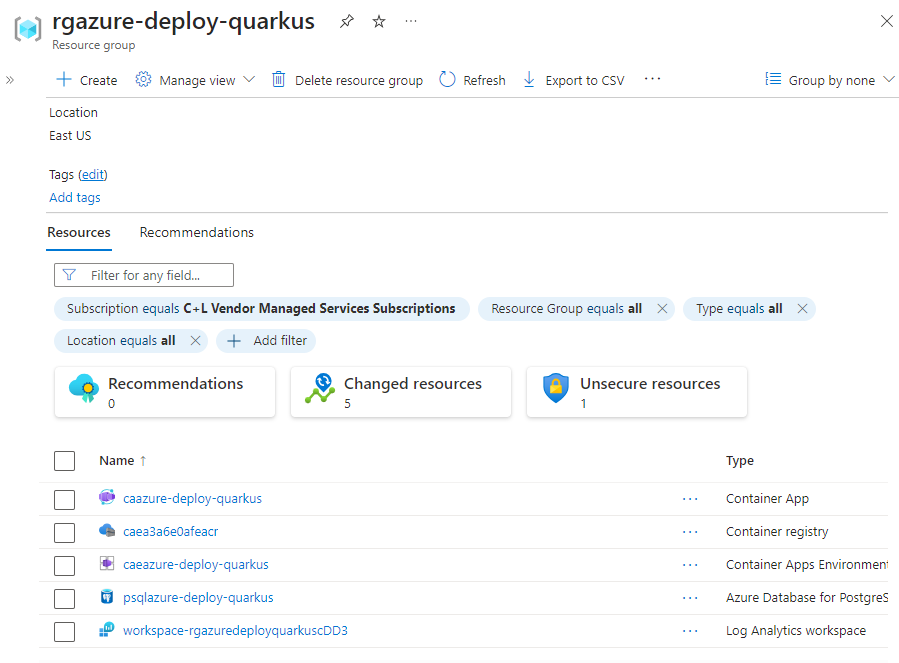

In this unit, you create the Azure Container Apps environment using the Azure CLI. Then, you containerize the Quarkus application into a Docker image, push it to Azure Registry and deploy the image to Azure Container Apps.

## Set up the Dockerfile for the Quarkus application

Azure Container Apps is for deploying containerized applications. So, the first thing we need to do is containerize the Quarkus application into a Docker image. This is easy to do as the Quarkus Maven plugin has already generated some Docker files under `src/main/docker`.
Let's take one of these Docker file (`Dockerfile.jvm`), rename it to `Dockerfile` and move it to the root folder.

```bash
mv src/main/docker/Dockerfile.jvm ./Dockerfile
```

The dockerfile should have the following content:

```dockerfile
FROM registry.access.redhat.com/ubi8/openjdk-11:1.14

ENV LANGUAGE='en_US:en'


# We make four distinct layers so if there are application changes the library layers can be re-used
COPY --chown=185 target/quarkus-app/lib/ /deployments/lib/
COPY --chown=185 target/quarkus-app/*.jar /deployments/
COPY --chown=185 target/quarkus-app/app/ /deployments/app/
COPY --chown=185 target/quarkus-app/quarkus/ /deployments/quarkus/

EXPOSE 8080
USER 185
ENV AB_JOLOKIA_OFF=""
ENV JAVA_OPTS="-Dquarkus.http.host=0.0.0.0 -Djava.util.logging.manager=org.jboss.logmanager.LogManager"
ENV JAVA_APP_JAR="/deployments/quarkus-run.jar"
```

This Dockerfile expects the Quarkus application to be packaged as a `quarkus-run.jar` file. This is the default name for the Quarkus application when it's packaged as a `jar` file. So, we need to make sure that the Quarkus application is packaged as a `jar` file. To do so, we need to execute the following Maven command:

```bash
./mvnw package
```

This command packages the Quarkus application into a `jar` file and generates a `quarkus-run.jar` file in the `target/quarkus-app` folder.

## Create the Azure Container App Environment and deploy the container

Now that we have the Dockerfile at the right location, we can create the Azure Container App environment and deploy the container in a single Azure CLI command. Execute the following command at the root of the project:

```bash
az containerapp up \
    --name "$AZ_CONTAINERAPP" \
    --environment "$AZ_CONTAINERAPP_ENV" \
    --location "$AZ_LOCATION" \
    --resource-group "$AZ_RESOURCE_GROUP" \
    --ingress external \
    --target-port 8080 \
    --source .
```

This `az containerapp up` does several things:

* It creates a new Azure Container App environment if it doesn't exist
* It creates a new Azure Registry if it doesn't exist
* It creates a new Log Analytics workspace if it doesn't exist
* It builds the Docker image and pushes it to the Azure Registry
* It deploys the Docker image to the Azure Container App environment

The `az containerapp up` command takes a bit of time to execute, and you should see a similar output:

```bash
Using resource group 'rg-azure-deploy-quarkus'
Creating ContainerAppEnvironment 'cae-azure-deploy-quarkus' in resource group rg-azure-deploy-quarkus
No Log Analytics workspace provided.
Generating a Log Analytics workspace with name "workspace-rgazuredeployquarkusEED7"
Creating Azure Container Registry ca001ad52ae7acr in resource group rg-azure-deploy-quarkus

Run ID: ca3 was successful after 41s
Creating Containerapp ca-azure-deploy-quarkus in resource group rg-azure-deploy-quarkus
Adding registry password as a secret with name "ca001ad52ae7acrazurecrio-ca001nxc57acr"

Your container app ca-azure-deploy-quarkus has been created and deployed! Congrats! 
```

## Check the deployment

You can check the deployment has succeeded in several ways. The easiest way is to search for your resource group in the [Azure portal](https://portal.azure.com). You should see resources similar to the following:



You can also check the deployment by executing the following command that lists all the resources created by the `az containerapp up` command:

```bash
az resource list \
    --location "$AZ_LOCATION" \
    --resource-group "$AZ_RESOURCE_GROUP" \
    --output table
```

You should see a similar output:

```bash
Name                                ResourceGroup            Location    Type                                      
----------------------------------  -----------------------  ----------  ----------------------------------------- 
psqlazuredeployquarkus              rg-azure-deploy-quarkus  eastus      Microsoft.DBforPostgreSQL/flexibleServers
workspace-rgazuredeployfdsrkusZRnr  rg-azure-deploy-quarkus  eastus      Microsoft.OperationalInsights/workspaces
cae-azure-deploy-quarkus            rg-azure-deploy-quarkus  eastus      Microsoft.App/managedEnvironments
ca0ad52sfde7acr                     rg-azure-deploy-quarkus  eastus      Microsoft.ContainerRegistry/registries
ca-azure-deploy-quarkus             rg-azure-deploy-quarkus  eastus      Microsoft.App/containerApps
```

## Execute the deployed Quarkus application

You can now execute the deployed Quarkus application. First, you need to get the URL of the application. You can get it by executing the following command:

```bash
export AZ_APP_URL=$(
    az containerapp show \
        --name "$AZ_CONTAINERAPP" \
        --resource-group "$AZ_RESOURCE_GROUP" \
        --query "properties.configuration.ingress.fqdn" \
        --output tsv \
)

echo "AZ_APP_URL=$AZ_APP_URL"
```

Your application is ready at `https://<appName>.azurecontainerapps.io/`. Notice the `https` protocol. This is because the application is deployed with a TLS certificate. To test the application, you can use `cURL`.

```bash
curl --header "Content-Type: application/json" \
    --request POST \
    --data '{"description":"Configuration","details":"Congratulations, you have set up your Quarkus application correctly!","done": "true"}' \
    https://$AZ_APP_URL/api/todos
```

Retrieve the data by using a new `cURL` request:

```bash
curl https://$AZ_APP_URL/api/todos
```

This command returns the list of all to-do items from the database:

```json
[
   {
      "description" : "Take Quarkus MS Learn",
      "details" : "Take the MS Learn on deploying Quarkus to Azure Container Apps",
      "done" : true,
      "id" : 1
   },
   {
      "description" : "Take Azure Container Apps MS Learn",
      "details" : "Take the ACA Learn module",
      "done" : false,
      "id" : 2
   },
   {
      "description" : "Configuration",
      "details" : "Congratulations, you have set up your Quarkus application correctly!",
      "done" : true,
      "id" : 3
   }
]
```

While you create new to-dos, you can stream the logs for your container with:

```bash
az containerapp logs show \
    --name "$AZ_CONTAINERAPP" \
    --resource-group "$AZ_RESOURCE_GROUP" \
    --follow
```

Execute more curl commands, and you should see the logs scrolling in the terminal.

```bash
curl https://$AZ_APP_URL/api/todos
```

> [!NOTE]
> You can also open the URL in a web browser to return the list of to-do items.
