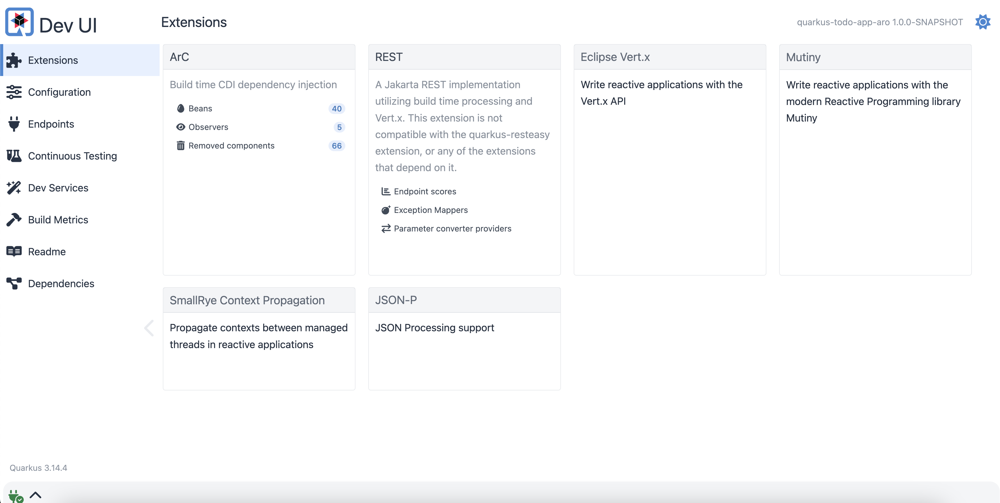

Dive into Quarkus with a hands-on lab! In this module, you'll create a basic Quarkus application using Quarkus CLI and your preferred IDE. Then, you will keep adding new features to your Todo application.

For consistent environment from developer's local to production using Quarkus Dev Services, you need to install a container runtime (e.g., _Docker_ or _Podman_) to stand up external services (e.g. PostgreSQL) with your application locally.

## Generate a new Quarkus application

Use Quarkus CLI to scaffold a new Quarkus project to implement a Todo application. Run the following command in your local Terminal.

```bash
quarkus create app quarkus-todo-app-aro
```

The output should look likt this.

```bash
Looking for the newly published extensions in registry.quarkus.io
-----------

applying codestarts...
📚 java
🔨 maven
📦 quarkus
📝 config-properties
🔧 tooling-dockerfiles
🔧 tooling-maven-wrapper
🚀 rest-codestart

-----------
[SUCCESS] ✅  quarkus project has been successfully generated in:
--> /Users/danieloh/azure-learn-path/quarkus-todo-app-aro
-----------
Navigate into this directory and get started: quarkus dev
```

## Get started with live coding

Quarkus Dev Mode is a powerful feature that significantly speeds up the development lifecycle by providing hot reload capabilities as known as _Live Coding_. This means that changes made to your application code are automatically recompiled and reloaded without requiring a full restart.

Run the Quarkus Dev Mode using the following Quarkus CLI.

```bash
cd quarkus-todo-app-aro
quarkus dev
```

The output should look likt this.

```bash
....
Listening for transport dt_socket at address: 5005
__  ____  __  _____   ___  __ ____  ______ 
 --/ __ \/ / / / _ | / _ \/ //_/ / / / __/ 
 -/ /_/ / /_/ / __ |/ , _/ ,< / /_/ /\ \   
--\___\_\____/_/ |_/_/|_/_/|_|\____/___/   
INFO  [io.quarkus] (Quarkus Main Thread) quarkus-todo-app-aro 1.0.0-SNAPSHOT on JVM (powered by Quarkus xx.xx.xx) started in 1.306s. Listening on: http://localhost:8080

INFO  [io.quarkus] (Quarkus Main Thread) Profile dev activated. Live Coding activated.
INFO  [io.quarkus] (Quarkus Main Thread) Installed features: [cdi, rest, smallrye-context-propagation, vertx]

--
Tests paused
Press [e] to edit command line args (currently ''), [r] to resume testing, [o] Toggle test output, [:] for the terminal, [h] for more options
```

Press `d` to open the Quarkus DEV UI. It will open a new web browser or tab automatically. You can also access the [DEV UI](http://localhost:8080/q/dev-ui) directly.



Take some time to familiarize yourself with the Dev UI menus, including Extensions and Continuous Testing. We'll cover these topics in depth later.

Find more information about Quarkus DEV UI [here](https://quarkus.io/guides/dev-ui).

Test the sample REST service by sending a request using `curl` in your terminal. This will help ensure it's working as expected.

```bash
curl localhost:8080/hello
```

The output should look like this.

```bash
Hello from Quarkus REST
```

Keep running the Quarkus dev mode!

## Develop new features in the Todo application

We’ll be creating a simple data-driven application that manages a set of Todo items, who have title, completed, order, and url. In this lab we'll add the **quarkus-panache** extension for the JPA implementation to our project, but we will need a few more for connecting to databases. Add these extensions with the following command:

```bash
quarkus ext add jdbc-postgresql hibernate-orm-panache hibernate-validator rest-jackson
```

The output should look like this.

```bash
Looking for the newly published extensions in registry.quarkus.io
[SUCCESS] ✅  Extension io.quarkus:quarkus-jdbc-postgresql has been installed
[SUCCESS] ✅  Extension io.quarkus:quarkus-hibernate-orm-panache has been installed
[SUCCESS] ✅  Extension io.quarkus:quarkus-hibernate-validator has been installed
[SUCCESS] ✅  Extension io.quarkus:quarkus-rest-jackson has been installed
```

When you take a look at the terminal where you started the Quarkus Dev Mode, you should see the following logs.

```bash
Dev Services for the default datasource (postgresql) started
```

**Quarkus Dev Services** provide a convenient way to manage and configure external dependencies for your Quarkus applications. This can significantly simplify development and testing processes. Find more information about Quarkus Dev Services [here](https://quarkus.io/guides/dev-services).

Then, execute `podman ps` or `docker ps` locally in another terminal. You will see that a PostgreSQL container is running automatically.

```bash
CONTAINER ID  IMAGE                          COMMAND               CREATED        STATUS        PORTS                              NAMES
f36fef6abd46  docker.io/library/postgres:14  postgres -c fsync...  9 seconds ago  Up 9 seconds  0.0.0.0:41493->5432/tcp, 5432/tcp  festive_ramanujan
```

### Create the new Todo entity

Now, let's create a new class representing a `Todo` entity. We'll leverage the Java Persistence API (JPA) to manage data interaction with our PostgreSQL database. For simplified persistence logic, we'll utilize [Hibernate ORM with Panache](https://quarkus.io/guides/hibernate-orm-panache) by extending the `io.quarkus.hibernate.orm.panache.PanacheEntity` class.

To establish a direct connection between your Java Todo object and the PostgreSQL `Todo` table, you employ a JPA entity (`@Entity`). The `TodoResource` REST endpoint serves as a gateway, creating a new `Todo` entity class and subsequently persisting it. This entity class acts as a domain model, aligning with the Todo table. JPA will automatically generate this table.

By extending `PanacheEntity`, you gain access to a comprehensive set of generic create, read, update, and delete (CRUD) methods tailored to your specific type. This streamlines the process of saving and deleting `Todo` objects, condensing these operations into a single line of Java code.

Create a new `Todo.java` file in the `src/main/java/java/org/acme/` directory. Copy the following code to the Java file.

```java
package org.acme;

import io.quarkus.hibernate.orm.panache.PanacheEntity;

import jakarta.persistence.Column;
import jakarta.persistence.Entity;
import java.util.List;

@Entity
public class Todo extends PanacheEntity {

    @Column(unique = true)
    public String title;

    public boolean completed;

    @Column(name = "ordering")
    public int order;

    public String url;

    public static List<Todo> findNotCompleted() {
        return list("completed", false);
    }

    public static List<Todo> findCompleted() {
        return list("completed", true);
    }

    public static long deleteCompleted() {
        return delete("completed", true);
    }

}
```


### Create Jakarta REST services

To manage that class, update the `TodoResource` so that it can publish REST interfaces to store and retrieve data by using HTTP. Open the `TodoResource` class and replace the code with the following:

To effectively manage the Todo class, you'll create a new `TodoResource.java` file in the `src/main/java/java/org/acme/` directory to expose REST interfaces that facilitate data storage and retrieval through HTTP requests.

Copy the following code to the Java file:

```java
package org.acme;

import io.quarkus.panache.common.Sort;

import jakarta.transaction.Transactional;
import jakarta.validation.Valid;
import jakarta.ws.rs.*;
import jakarta.ws.rs.core.Response;
import jakarta.ws.rs.core.Response.Status;
import java.util.List;

@Path("/api")
public class TodoResource {

    
    @OPTIONS
    public Response opt() {
        return Response.ok().build();
    }

    @GET
    public List<Todo> getAll() {
        return Todo.listAll(Sort.by("order"));
    }

    @GET
    @Path("/{id}")
    public Todo getOne(@PathParam("id") Long id) {
        Todo entity = Todo.findById(id);
        if (entity == null) {
            throw new WebApplicationException("Todo with id of " + id + " does not exist.", Status.NOT_FOUND);
        }
        return entity;
    }

    @POST
    @Transactional
    public Response create(@Valid Todo item) {
        item.persist();
        return Response.status(Status.CREATED).entity(item).build();
    }

    @PATCH
    @Path("/{id}")
    @Transactional
    public Response update(@Valid Todo todo, @PathParam("id") Long id) {
        Todo entity = Todo.findById(id);
        entity.id = id;
        entity.completed = todo.completed;
        entity.order = todo.order;
        entity.title = todo.title;
        entity.url = todo.url;
        return Response.ok(entity).build();
    }

    @DELETE
    @Transactional
    public Response deleteCompleted() {
        Todo.deleteCompleted();
        return Response.noContent().build();
    }

    @DELETE
    @Transactional
    @Path("/{id}")
    public Response deleteOne(@PathParam("id") Long id) {
        Todo entity = Todo.findById(id);
        if (entity == null) {
            throw new WebApplicationException("Todo with id of " + id + " does not exist.", Status.NOT_FOUND);
        }
        entity.delete();
        return Response.noContent().build();
    }

}
```

## Insert sample data to the Todo database

In the reality scenario, you would insert data into the database since the business data in production should be stored in a relational database.

Create a new `import.sql` file in the `src/main/resources/` directory. Copy the following SQL code to the SQL file.

```sql
INSERT INTO todo(id, title, completed, ordering, url) VALUES (1, 'Introduction to Quarkus', false, 0, null);
INSERT INTO todo(id, title, completed, ordering, url) VALUES (2, 'Hibernate with Panache', false, 1, null);
INSERT INTO todo(id, title, completed, ordering, url) VALUES (3, 'Visit Quarkus web site', false, 2, 'https://quarkus.io');
INSERT INTO todo(id, title, completed, ordering, url) VALUES (4, 'Visit Azure Red Hat OpenShift', false, 3, 'https://azure.microsoft.com/en-us/products/openshift');
ALTER SEQUENCE todo_seq RESTART WITH 5;
```

## Verify the application

Let's verify the application using `curl` command.

Open a new lcoal terminal. Retrieve all Todo items by running the following `curl` command:

```bash
curl http://localhost:8080/api
```

The output should look like this:

```json
[
  {
    "id": 1,
    "title": "Introduction to Quarkus",
    "completed": false,
    "order": 0,
    "url": null
  },
  {
    "id": 2,
    "title": "Hibernate with Panache",
    "completed": false,
    "order": 1,
    "url": null
  },
  {
    "id": 3,
    "title": "Visit Quarkus web site",
    "completed": false,
    "order": 2,
    "url": "https://quarkus.io"
  },
  {
    "id": 4,
    "title": "Visit Azure Red Hat OpenShift",
    "completed": false,
    "order": 3,
    "url": "https://azure.microsoft.com/en-us/products/openshift"
  }
]
```

Great job! You have successfully developed your Todo application on Quarkus.