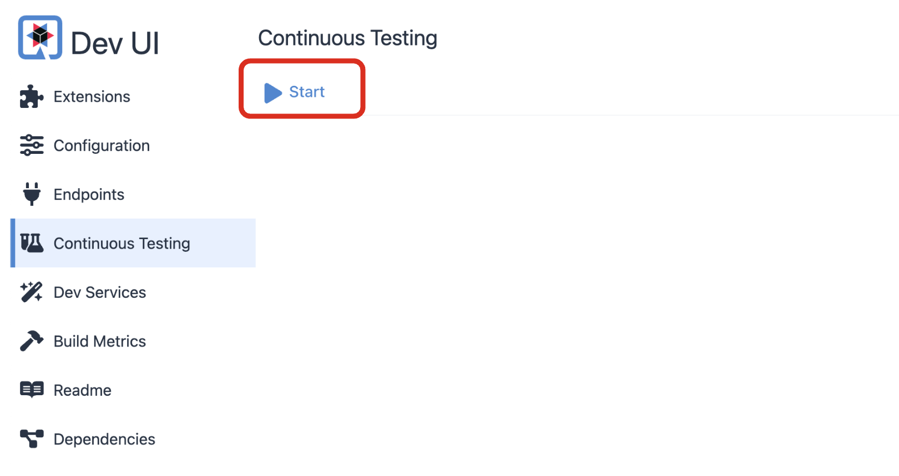
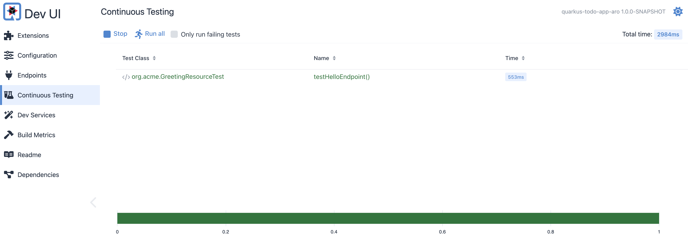
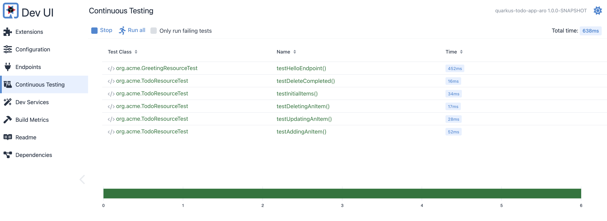

To further strengthen the Todo application's testing, we'll introduce new test cases that leverage Quarkus Continuous Testing as the testing framework and align with Test-Driven Development principles. We'll also package and run the application locally using a standalone PostgreSQL database.

## Resume the continuous testing

To resume the continuous testing in Quakrus, you can press `r` in the terminal where the Quarkus dev mode is running. 

```bash
--
Tests paused
Press [e] to edit command line args (currently ''), [r] to resume testing, [o] Toggle test output, [:] for the terminal, [h] for more options>
```

Otherwise, you can start it in Quarkus Dev UI.



When you resume the continuous testing, the existing test (`testHelloEndpoint()`) will be re-run. 

The output in the terminal should look like this (**All 1 test is passing**).

```bash
--
All 1 test is passing (0 skipped), 1 test was run in 2984ms. Tests completed at 22:02:31.
Press [e] to edit command line args (currently ''), [r] to re-run, [o] Toggle test output, [:] for the terminal, [h] for more options>
```

When you run it in Dev UI, you will see the test result like this.



## Create following 5 test cases for Todo application

You'll add new 5 test cases to verify the Todo application.

* **testInitialItems()** - verify that the initial list of items is correct.
* **testAddingAnItem()** - verify that you can add an item to the list.
* **testUpdatingAnItem()** - verify that you can update an item in the list.
** **testDeletingAnItem()** - verify that you can delete an item from the list.
* **testDeleteCompleted()** - verify that you can delete all completed items from the list.

Create a new `TodoResourceTest.java` file in the `src/test/java/io/quarkus/sample/` directory. Copy the following code to the Java file.

```java
package io.quarkus.sample;

import io.quarkus.test.junit.QuarkusTest;
import io.restassured.common.mapper.TypeRef;
import org.apache.http.HttpStatus;
import org.junit.jupiter.api.MethodOrderer;
import org.junit.jupiter.api.Order;
import org.junit.jupiter.api.Test;
import org.junit.jupiter.api.TestMethodOrder;

import jakarta.ws.rs.core.HttpHeaders;
import jakarta.ws.rs.core.MediaType;
import java.util.List;

import static io.restassured.RestAssured.*;
import static org.hamcrest.core.Is.is;
import static org.junit.jupiter.api.Assertions.assertEquals;

@QuarkusTest
@TestMethodOrder(MethodOrderer.OrderAnnotation.class)
class TodoResourceTest {

        @Test
        @Order(1)
        void testInitialItems() {
                List<Todo> todos = get("/api").then()
                                .statusCode(HttpStatus.SC_OK)
                                .contentType(MediaType.APPLICATION_JSON)
                                .extract().body().as(getTodoTypeRef());
                assertEquals(4, todos.size());

                get("/api/1").then()
                                .statusCode(HttpStatus.SC_OK)
                                .contentType(MediaType.APPLICATION_JSON)
                                .body("title", is("Introduction to Quarkus - Imperative"))
                                .body("completed", is(false));
        }

        @Test
        @Order(2)
        void testAddingAnItem() {
                Todo todo = new Todo();
                todo.title = "testing the application";
                given()
                                .body(todo)
                                .contentType(MediaType.APPLICATION_JSON)
                                .header(HttpHeaders.ACCEPT, MediaType.APPLICATION_JSON)
                                .when()
                                .post("/api")
                                .then()
                                .statusCode(HttpStatus.SC_CREATED)
                                .contentType(MediaType.APPLICATION_JSON)
                                .body("title", is(todo.title))
                                .body("completed", is(false))
                                .body("id", is(5));

                List<Todo> todos = get("/api").then()
                                .statusCode(HttpStatus.SC_OK)
                                .contentType(MediaType.APPLICATION_JSON)
                                .extract().body().as(getTodoTypeRef());
                assertEquals(5, todos.size());
        }

        @Test
        @Order(3)
        void testUpdatingAnItem() {
                Todo todo = new Todo();
                todo.title = "testing the application (updated)";
                todo.completed = true;
                given()
                                .body(todo)
                                .contentType(MediaType.APPLICATION_JSON)
                                .header(HttpHeaders.ACCEPT, MediaType.APPLICATION_JSON)
                                .pathParam("id", 5)
                                .when()
                                .patch("/api/{id}")
                                .then()
                                .statusCode(HttpStatus.SC_OK)
                                .contentType(MediaType.APPLICATION_JSON)
                                .body("title", is(todo.title))
                                .body("completed", is(true))
                                .body("id", is(5));
        }

        @Test
        @Order(4)
        void testDeletingAnItem() {
                given()
                                .contentType(MediaType.APPLICATION_JSON)
                                .header(HttpHeaders.ACCEPT, MediaType.APPLICATION_JSON)
                                .pathParam("id", 5)
                                .when()
                                .delete("/api/{id}")
                                .then()
                                .statusCode(HttpStatus.SC_NO_CONTENT);

                List<Todo> todos = get("/api").then()
                                .statusCode(HttpStatus.SC_OK)
                                .contentType(MediaType.APPLICATION_JSON)
                                .extract().body().as(getTodoTypeRef());
                assertEquals(4, todos.size());
        }

        @Test
        @Order(5)
        void testDeleteCompleted() {
                delete("/api")
                                .then()
                                .statusCode(HttpStatus.SC_NO_CONTENT);

                List<Todo> todos = get("/api").then()
                                .statusCode(HttpStatus.SC_OK)
                                .contentType(MediaType.APPLICATION_JSON)
                                .extract().body().as(getTodoTypeRef());
                assertEquals(4, todos.size());
        }

        private TypeRef<List<Todo>> getTodoTypeRef() {
                return new TypeRef<List<Todo>>() {
                        // Kept empty on purpose
                };
        }

}
```

`Save` the file. Then, the continuous testing is running automatically and instantly in the Quarkus Dev UI.

The output in the terminal should look like this (**All 6 tests are passing**).

```bash
--
All 6 tests are passing (0 skipped), 5 tests were run in 2968ms. Tests completed at 22:06:45 due to changes to TodoResourceTest$1.class and 1 other files.
Press [e] to edit command line args (currently ''), [r] to re-run, [o] Toggle test output, [:] for the terminal, [h] for more options>
```

Dev UI should now show the following.



`Stop` the Quarkus dev mode by pressing `CTRL + c`.

## Package your application

Before you package your application, you need to append the actual database connection details (e.g., _JDBC url_, _database credentials_) to the `application.properties` file in the `src/main/resources` directory.

```properties
%prod.quarkus.datasource.db-kind=postgresql
%prod.quarkus.datasource.jdbc.url=jdbc:postgresql://localhost:5432/todo
%prod.quarkus.datasource.jdbc.driver=org.postgresql.Driver
%prod.quarkus.hibernate-orm.sql-load-script=import.sql
%prod.quarkus.datasource.username=user
%prod.quarkus.datasource.password=superSecret
%prod.quarkus.hibernate-orm.database.generation=drop-and-create
```

Quarkus supports the notion of configuration profiles. These allows you to have multiple configurations in the same file and select between then via a profile name.

By default Quarkus has three profiles, although it is possible to use as many as you like. The default profiles are:

* *dev* - Activated when in development mode (e.g., quarkus:dev)
* *test* - Activated when running tests
* *prod* - The default profile when not running in development or test mode

During the build process, Quarkus will automatically validate the database connection using the above specified details. Therefore, it's necessary to run a standalone PostgreSQL database instead of relying on the PostgreSQL dev service.

Run a standalone PostgreSQL database with the following command.

```bash
podman run -it --rm=true --name todo -e POSTGRES_USER=user \
    -e POSTGRES_PASSWORD=superSecret -e POSTGRES_DB=todo \
    -p 5432:5432 postgres:14
```

You can also run the above command using `docker run` command.

Next, compile your application to create a JAR file. You can do this using the `quarkus build` command.

```bash
quarkus build
```

While building the applicaiton, you will see the following test result in the terminal.

```bash
[INFO] Results:
[INFO] 
[INFO] Tests run: 6, Failures: 0, Errors: 0, Skipped: 0
```

The output should end with `BUILD SUCCESS`.

You should now see a JAR file (`quarkus-run.jar `) in the `target/quarkus-app/` directory.

## Run your application

You might wonder why the Jar file isn't generated right under the _target_ directory. The reason is that Quarkus generates a **Fast-JAR** file for you when you build your application.

**Quarkus Fast-Jar** offers several advantages for Quarkus applications. By generating smaller JAR files compared to traditional Java applications, it improves deployment and startup times. Additionally, Quarkus Fast-Jar enhances application performance by minimizing classloader lookups. Its simplified deployment process, involving a single JAR file, streamlines management and distribution. Moreover, Quarkus Fast-Jar is compatible with various deployment environments, including cloud platforms, Kubernetes, and traditional servers.

Run your application by executing the following command.

```bash
java -jar target/quarkus-run.jar
```

The output should look like this.

```bash
__  ____  __  _____   ___  __ ____  ______ 
 --/ __ \/ / / / _ | / _ \/ //_/ / / / __/ 
 -/ /_/ / /_/ / __ |/ , _/ ,< / /_/ /\ \   
--\___\_\____/_/ |_/_/|_/_/|_|\____/___/   
INFO  [io.quarkus] (main) quarkus-todo-app-aro 1.0.0-SNAPSHOT on JVM (powered by Quarkus xx.xx.xx) started in 1.558s. Listening on: http://0.0.0.0:8080
INFO  [io.quarkus] (main) Profile prod activated. 
INFO  [io.quarkus] (main) Installed features: [agroal, cdi, hibernate-orm, hibernate-orm-panache, hibernate-validator, jdbc-postgresql, narayana-jta, rest, rest-jackson, smallrye-context-propagation, vertx]
```

Open a new lcoal terminal. Retrieve a specific Todo item by running the following `curl` command:

```bash
curl http://localhost:8080/api/3
```

The output should look like this.

```json
{
  "id": 3,
  "title": "Visit Quarkus web site",
  "completed": false,
  "order": 2,
  "url": "https://quarkus.io"
}
```

Stop the application by pressing `CTRL + c`.

Great job! You have successfully packaged your Todo application with the PosgreSQL database configuration. You can now deploy your application to Azure Red Hat OpenShift.