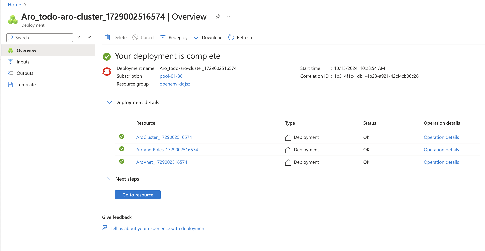
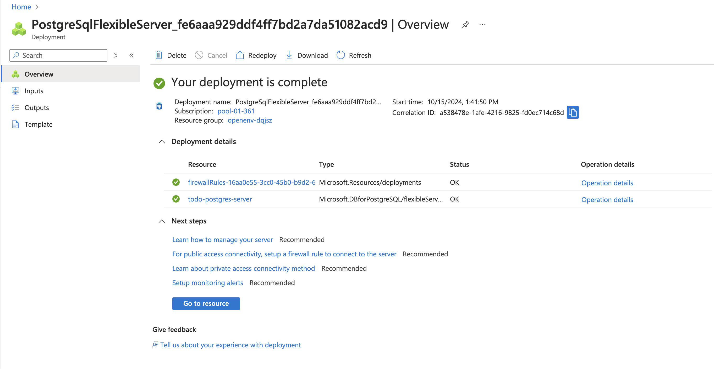
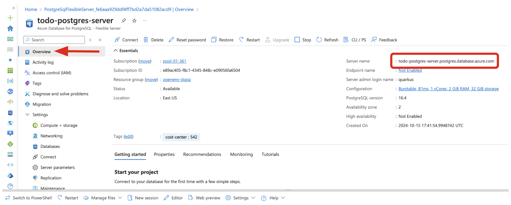
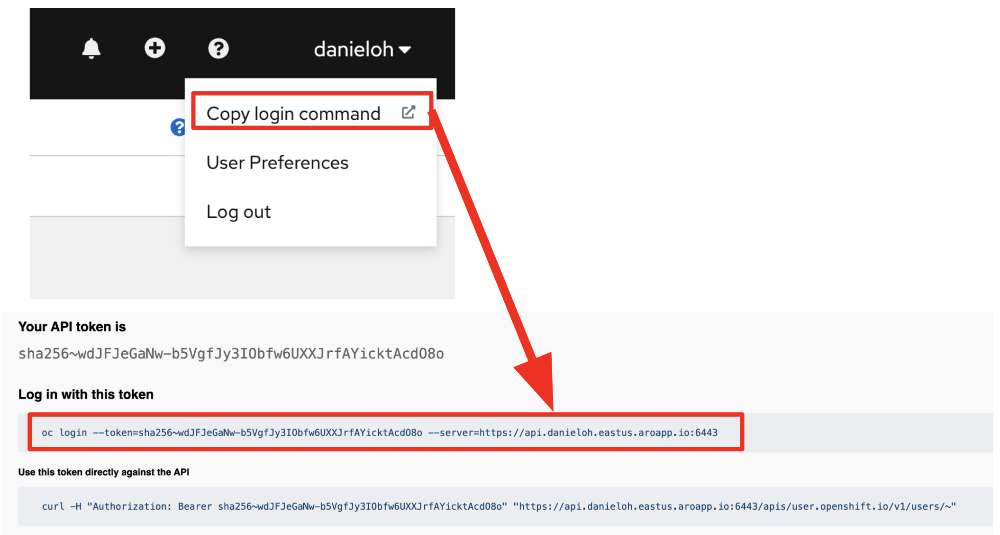
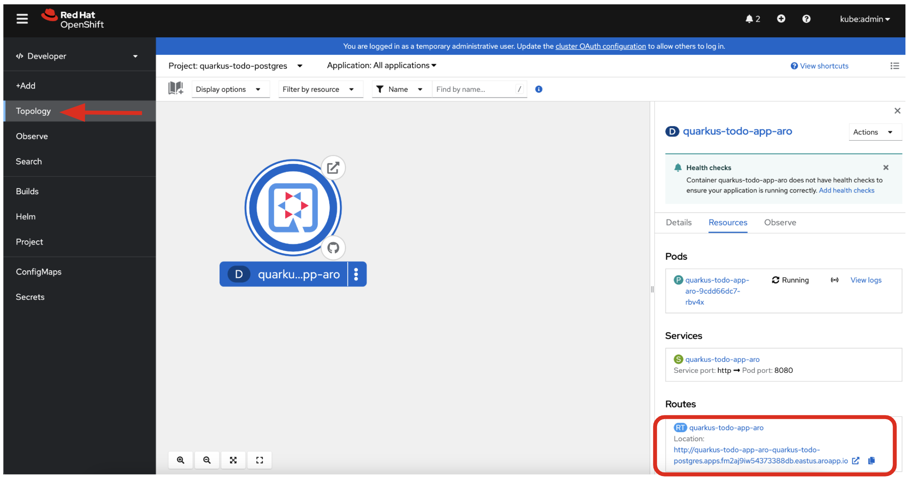
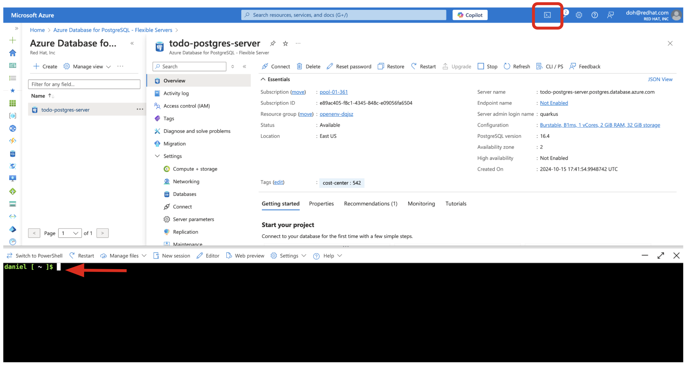
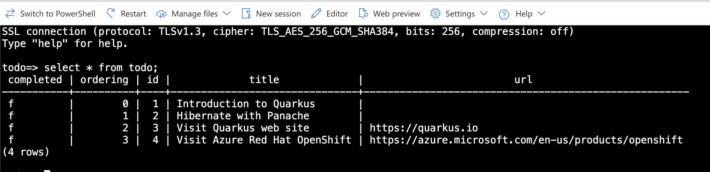

In this exercise, you'll establish a new Azure Red Hat OpenShift cluster, which will serve as the deployment environment for the Todo application. Subsequently, you'll create a new Azure PostgreSQL database server and configure your Quarkus application to access it.

## Create a new Azure Red Hat OpenShift cluster

To create a new Azure Red Hat OpenShift cluster, you can follow these steps:

1. Log in to the [Azure Portal](https://portal.azure.com) and sign in with your Azure credentials.

2. Create a resource group: A resource group is a logical container for related Azure resources. Click on `Create a resource` and search for `Resource group`. Choose a name and location for your resource group and click `Create`.

3. Create an OpenShift cluster: Search for `OpenShift` in the Azure marketplace and select `OpenShift`. Click `Create` to start the deployment process.

4. Configure your cluster: In the deployment wizard, you'll need to specify the following:

* **Subscription**: Choose your available Azure subscription.
* **Resource group**: Select the resource group you created in step 2.
* **Region**: Choose a region for your cluster.
* **OpenShift cluster name**: Choose a unique name for your cluster (e.g., `todo-aro-cluster`).
* **Domain name**: Specify the domain name for your cluster. You can use the randomly generated domain name.
* **OpenShift cluster version**: Select the OpenShift version for your cluster (e.g., `4.15.27 (latest)`).
* **Master VM size**: Choose the size of the virtual machines for your master nodes.
* **Worker VM size**: Choose the size of the virtual machines for your worker nodes.
* **Worker node count**: Choose the number of worker nodes for your cluster.

> [!NOTE]
> You can leave the default values in _Authentication_, _Network_, and _Tags_ settings section.

5. Review and create: Review your cluster configuration and click `Create` to start the deployment process.

6. Monitor the deployment: The deployment process may take more than 60 minutes to complete. You can monitor the progress in the Azure portal.

Once your cluster is deployed, you can access it using the OpenShift web console. You can find the URL for the web console in the cluster's overview page.



> 💡 **Tip:**:
> If you're not sure which region to choose, you can select a region that is closest to your users to reduce latency.

More resources for Azure Red Hat OpenShift deployments:

* [Azure CLI to Create Azure Red Hat OpenShift](https://learn.microsoft.com/en-us/azure/openshift/create-cluster?tabs=azure-cli)
* [Deploying an Azure Red Hat OpenShift cluster in the Azure portal](https://youtu.be/iY66MONBfVQ?si=m1HH3SWPOokGVXSY)

## Create an instance of Azure Database for PostgreSQL

To create an instance of Azure Database for PostgreSQL, follow these steps:

1. Log in to the [Azure Portal](https://portal.azure.com) and sign in with your Azure credentials.

2. Create a resource group or choose an existing one.

3. Create an Azure Database for PostgreSQL: In the Azure Portal, click `Create a resource` and search for `Azure Database for PostgreSQL`. Then, select `Flexible server` and fill in the required details:

* **Subscription**: Select your Azure subscription.
* **Resource group**: Choose the resource group you created earlier.
* **Server name**: Give your PostgreSQL server a unique name (e.g., `todo-postgres-server`).
* **Region**: Choose a region for your cluster.
* **PostgreSQL version**: Select the version of your PostgreSQL server (e.g., `16`).
* **Workload type**: Choose the type of workload for your PostgreSQL server (e.g., `Development`).
* **Authentication method**: Choose the authentication method for your PostgreSQL server (e.g., `PostgreSQL authentication only`).
* **Admin username**: Specify the name of the administrator user (e.g., `admin`).
* **Password**: Specify the password for the administrator user.
* **Public access**: Check the `Allow public access to this resource through the internet using a public IP address`.
* **Firewall rules**: Check the `Allow public access from any Azure service within Azure to this server`.

4. Review and create: Review your cluster configuration and click `Create` to start the deployment process.

> [!NOTE]
> You can leave the default values in other settings section.

Wait for deployment! The deployment process may take a few minutes to complete. You can monitor its progress in the Azure Portal.

Once the deployment is finished, you can connect to your PostgreSQL server using tools like pgAdmin or the Azure Data Studio. You'll need the server name, administrator login, and password.



More Resources for creating Azure Database for PostgreSQL: 

* [Quickstart: Create an Azure Database for PostgreSQL - Flexible Server instance in the Azure portal](https://learn.microsoft.com/en-us/azure/postgresql/flexible-server/quickstart-create-server-portal)

## Create a Todo database in the Azure PostgreSQL server

The PostgreSQL server that you created earlier is empty. It doesn't have any database that you can use with the Quarkus application.

Export your resource group using the following command:

> [!NOTE]
> You can run the following shell command using your local terminal or [Azure Cloud Shell](https://learn.microsoft.com/en-us/azure/cloud-shell/overview).

Create a new database called `Todo` by using the following command:

```shell
az postgres flexible-server db create \
  --resource-group YOUR_RESOURCE_GROUP \
  --database-name todo \
  --server-name todo-postgres-server
```

The output should look like this:

```shell
Creating database with utf8 charset and en_US.utf8 collation
{
  "charset": "UTF8",
  "collation": "en_US.utf8",
  "id": "/subscriptions/xxxx-xxxx-xxxx-xxxx-xxxx-xxxx/resourceGroups/my-resource-group/providers/Microsoft.DBforPostgreSQL/flexibleServers/todo-postgres-server/databases/todo",
  "name": "todo",
  "resourceGroup": "my-resource-group",
  "systemData": null,
  "type": "Microsoft.DBforPostgreSQL/flexibleServers/databases"
}
```

## Update the configuration in the Quarkus application to access the PostgreSQL database

Now let's connect the Quarkus application to the PostgreSQL database. To do so, you first need to obtain the connection string for the database.

Copy the server name on the overview page to clipboard.



`Replace` the following values in the `application.properties` file.

```properties
%prod.quarkus.datasource.jdbc.url=jdbc:postgresql://<YOUR POSTGRESQL SERVER NAME>:5432/todo
%prod.quarkus.datasource.password=<YOUR POSTGRESQL SERVER PASSWORD> 
```

## Deploy the Quarkus Todo application

Quarkus also offers the ability to automatically generate OpenShift resources based on sane default and user supplied configuration. The OpenShift extension is actually a wrapper extension that brings together the [kubernetes](https://quarkus.io/guides/deploying-to-kubernetes) and [container-image-s2i](https://quarkus.io/guides/container-image#s2i) extensions with defaults so that it’s easier for the user to get started with **Quarkus on OpenShift**.

Add `quarkus-openshift` extension in Terminal:

```shell
quarkus ext add openshift
```

The output should look like this.

```shell
[SUCCESS] ✅  Extension io.quarkus:quarkus-openshift has been installed
```

Next, append the OpenShift deployment configuration to the `application.properties` file in the `src/main/resources` directory.

```properties
# OpenShift configurations
%prod.quarkus.container-image.group=quarkus-todo-postgres
%prod.quarkus.kubernetes-client.trust-certs=true
%prod.quarkus.kubernetes.deployment-target=openshift
%prod.quarkus.openshift.build-strategy=docker
%prod.quarkus.openshift.deploy=true
%prod.quarkus.openshift.route.expose=true
```

Before deploying the Todo application to ARO, be sure to log in to the OpenShift cluster via `oc` command-line tool.

* [Installing the OpenShift CLI](https://docs.openshift.com/container-platform/latest/cli_reference/openshift_cli/getting-started-cli.html)

Get the token from OpenShift web consol. Then, paste the `oc login` command-line with the _token_ in Terminal.



The output should look like:

```shell
Logged into "https://api.fm2aj9iw54373388db.eastus.aroapp.io:6443" as "kube:admin" using the token provided.

You have access to 72 projects, the list has been suppressed. You can list all projects with 'oc projects'

Using project "default".
```

Now let’s create a new project (Kubernetes namespace) for the Todo application deployment.

```shell
oc new-project quarkus-todo-postgres
```

The output should look like:

```shell
Now using project "quarkus-todo-postgres" on server "https://api.fm2aj9iw54373388db.eastus.aroapp.io:6443".

You can add applications to this project with the 'new-app' command. For example, try:

    oc new-app rails-postgresql-example

to build a new example application in Ruby. Or use kubectl to deploy a simple Kubernetes application:

    kubectl create deployment hello-node --image=registry.k8s.io/e2e-test-images/agnhost:2.43 -- /agnhost serve-hostname
```

Next, deploy the application itself. Run the following Quarkus CLI which will build and deploy using the OpenShift extension:

```shell
quarkus build --no-tests
```

The output should end with `BUILD SUCCESS`.

Finally, make sure it’s actually done rolling out:

```shell
oc rollout status -w deployment/quarkus-todo-app-aro
```

Wait for that command to report `deployment "quarkus-todo-app-aro" successfully rolled out` before continuing.

Go to the `Topology View` in _OpenShift Dev Perspective_, make sure it’s done deploying (dark blue circle):



Copy the `Route URL` to clipboard.

Access the REST API (_/api/_) to get all Todo items that store in the **Azure PostgreSQL database**. You need to replace `ROUTE-URL` with your url in the OpenShift cluster. 

```shell
curl http://ROUTE-URL/api/3 ; echo
```

The output should look like:

```json
{
    "completed": false,
    "id": 3,
    "order": 2,
    "title": "Visit Quarkus web site",
    "url": "https://quarkus.io"
}
```

## Connect to the Azure PostgreSQL server using Azure Cloud Shell

Open Azure Cloud Shell in the Azure portal by selecting the icon on the upper-left side:



Run the following command in the Azure Cloud Shell terminal. Replace values with `your server name` and admin user login name:

```shell
psql --host=YOUR-POSTGRESQL-SERVER-NAME --port=5432 --username=quarkus --dbname=todo
```

Key the `admin password` in the prompt. Then, execute the following query to get all Todo items:

```shell
select * from todo;
```

The output should look like:



Great job! You have successfully deployed your Todo application to ARO with Azure PostgreSQL.