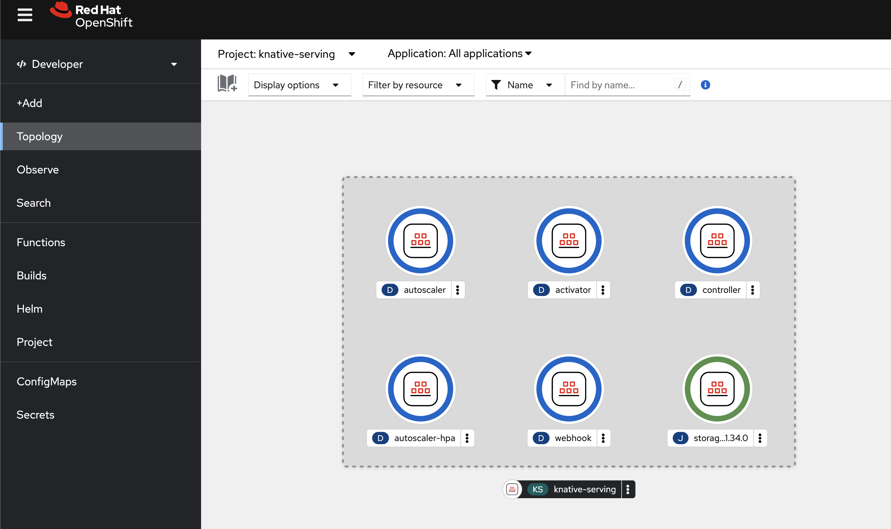
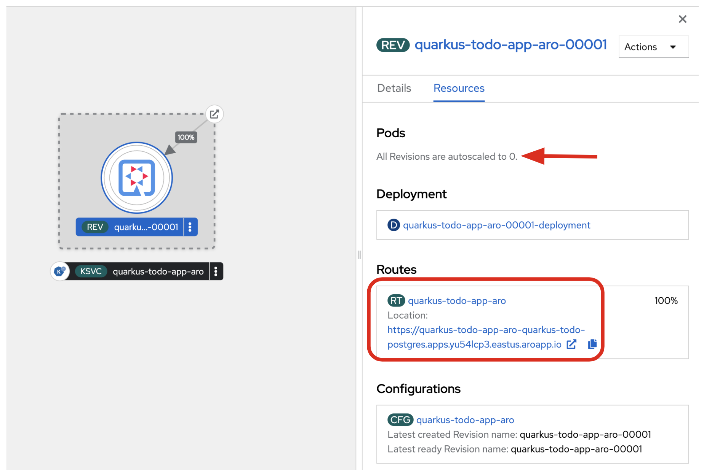
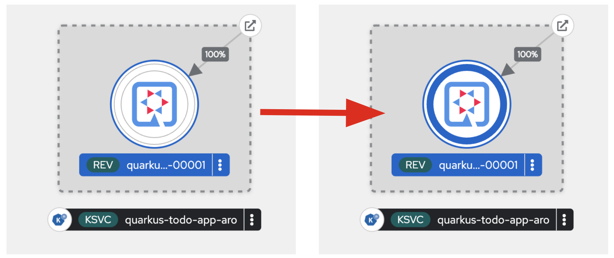

In this unit, you will deploy the exsisting Todo application as a serverless function to the Azure Red Hat OpenShift environment.

Quarkus offers Funqy extensions, enabling you to create a portable Java API for deploying functions on various serverless platforms like OpenShift Serverless (Knative), AWS Lambda, Azure Functions, and Google Cloud Functions. Unlike direct Azure Functions, Quarkus functions on OpenShift Serverless on ARO can be compiled into **native executables**, resulting in faster cold starts and significantly reduced memory footprints.

## Install OpenShift Serverless

Install the OpenShift Serverless ane Knative Serving Custom Resource (CR) with the following documents:

* [Installing the OpenShift Serverless Operator](https://docs.openshift.com/container-platform/latest/serverless/install/install-serverless-operator.html)
* [Installing Knative Serving](https://docs.openshift.com/container-platform/latest/serverless/install/installing-knative-serving.html)

You should see the deployed pods when you have successfully installed the OpenShift Serverless:



## Configure the serverless function deployment with Quarkus

**Update** the following values in `src/main/resources/application.properties` to keep the existing Todo data and deploy the application as the serverless function:

```yaml
%prod.quarkus.kubernetes.deployment-target=knative
```

**Append** the following variables in `src/main/resources/application.properties`:

```yaml
%prod.quarkus.container-image.registry=image-registry.openshift-image-registry.svc:5000
```

_Note_ that if you want to build a native executables on `macOS`, add the following configuration to use Linux binary file format:

```yaml
%prod.quarkus.native.container-build=true
```

Before the build, delete existing `todo` application by the following `oc` command:

> [!NOTE]
> If you haven't installed the OpenShift CL yet, you can install it by following this [link](https://docs.openshift.com/container-platform/latest/cli_reference/openshift_cli/getting-started-cli.html).

```shell
oc delete all --all
```

## Build and deploy the serverless function

Build the native executables then deploy it to ARO. Run the following Quarkus CLI which will build and deploy using the OpenShift extension:

```shell
quarkus build --no-tests --native
```

The output should end with `BUILD SUCCESS`.

Edit the label of the serverless function pod to use the Quarkus icon.

```shell
oc label rev/quarkus-todo-app-aro-00001 app.openshift.io/runtime=quarkus --overwrite
```

If your application name is not "quarkus-todo-app-aro", you need to change it in the above `oc` command.

The output should look like:

```shell
revision.serving.knative.dev/quarkus-todo-app-aro-00001 labeled
```

## Access the serverless function

Go back to the _Topology_ view, you should see the serverless function pods running. The pod will scale down to `zero` if you didn't send traffic in `30` seconds. 

Copy the `Route URL` to clipboard.



Access the REST API (_/api/_) to get all Todo items in the **Azure PostgreSQL database**. You need to replace `ROUTE-URL` with your serverless function url in the OpenShift cluster. 

```shell
curl http://ROUTE-URL/api ; echo
```

The output should look like:

```shell
[
    {
        "completed": false,
        "id": 1,
        "order": 0,
        "title": "Introduction to Quarkus",
        "url": null
    },
    {
        "completed": false,
        "id": 2,
        "order": 1,
        "title": "Hibernate with Panache",
        "url": null
    },
    {
        "completed": false,
        "id": 3,
        "order": 2,
        "title": "Visit Quarkus web site",
        "url": "https://quarkus.io"
    },
    {
        "completed": false,
        "id": 4,
        "order": 3,
        "title": "Visit Azure Red Hat OpenShift",
        "url": "https://azure.microsoft.com/en-us/products/openshift"
    }
]
```

You can also see that the servereless function pod has **scaled up** again in the _Topology view_.



Great! You have successfully deployed the serverless function to ARO.