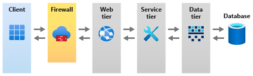

In this unit, you'll learn how to create a Spring App, connect to a MySQL database, and run locally.

As a Java developer, you're already familiar with Spring applications. As you complete the exercises in this module, you'll use a personal Azure account, you would need to make sure that you have the following items installed:
>  
>  | Item | Version |
>  |---|---|
>  | **Java JDK** | 1.8 |
>  | **Maven** | 3.0 or above |
>  | **Azure CLI** | 2.12 or above |
>  

## Introduction to Azure App Service

Azure App Service provides flexible hosting solutions for Spring Applications.
The Azure App Service allows you to host your company's websites, web apps, REST APIs, and other application code on Azure. Your project code is running in the cloud; you don't have to provision or configure any infrastructure. Running your web app in Azure App Service provides you with all the benefits of running on Azure: your app is globally available, it scales automatically, has security and compliance built-in, and you only pay for the resources you use.

For a Database, we will use Azure Database for MySQL. Azure Database for MySQL is a fully managed MySQL relational database with high availability and security. We will be using a Single Server deployment model which allows for database management functions such as patching, backups, high availability, security with minimal user configuration and control.

Azure App Service considers Java a first-class application language and supports Initializer-generated web apps right out of the box.
Quickly build, deploy and scale your Java SE, Web, and Jakarta EE web applications on a fully managed service as App Service ensures fast connections to your database (also running in Azure) and any other Azure services you decide to use in your app.

In our App, you are looking at creating a tiered application that hosts its Web, Service and Data layer in App Services and its Database in an Azure MySQL Database.

## Develop your Spring app

Spring is the perfect framework to host and manage our applications. All we have to do is wire certain Spring components and without managing the underlying Server runtime.
You have decided to use Spring Boot, which is self-hosted and provides a rich ecosystem of backing services for your app.

The Spring injection annotations use Dependency injection to process the Components requests and utilizes the Azure Spring Starter integration libraries to configure and setup connections to the Backing services that are our MySQL database.

## Create your resources using the Azure CLI and Maven

### Azure CLI

Azure CLI is a managed interface to allow developers full access to the Azure APIs via the Command line.
In this module, you use the Azure CLI to spin up the Azure App Service and Azure Database for MySQL instance. You can access the Azure CLI from a terminal or through Visual Studio Code. You can also access the Azure CLI from Azure Cloud Shell. This browser-based shell experience is hosted in the cloud. In Cloud Shell, the Azure CLI is configured for use with your Azure subscription.

### Maven

We'll use the Maven package manager to structure our project and pull in dependencies. Maven also provides the tooling necessary to configure and deploy our project to the Azure App services with the Azure WebApp Plugin.

### Azure Database for MySQL

A fully managed MySQL database-as-a-service offering from Microsoft. Whether you're building new applications that target MySQL or migrating legacy applications, Azure Database for MySQL provides the enterprise-ready solution needed for modern applications. To learn more, see [Azure Database for MySQL](https://azure.microsoft.com/services/mysql/?azure-portal=true).
