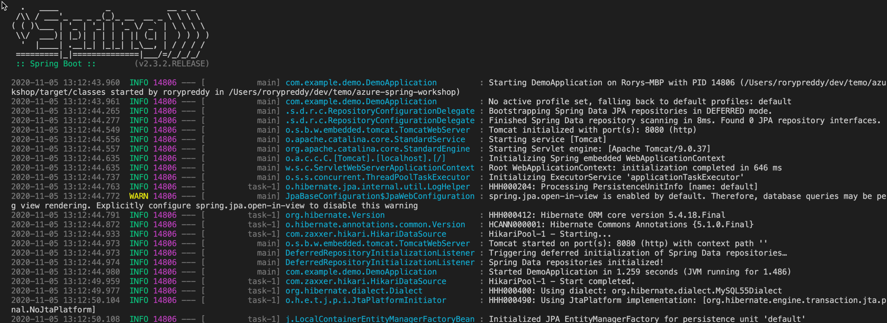
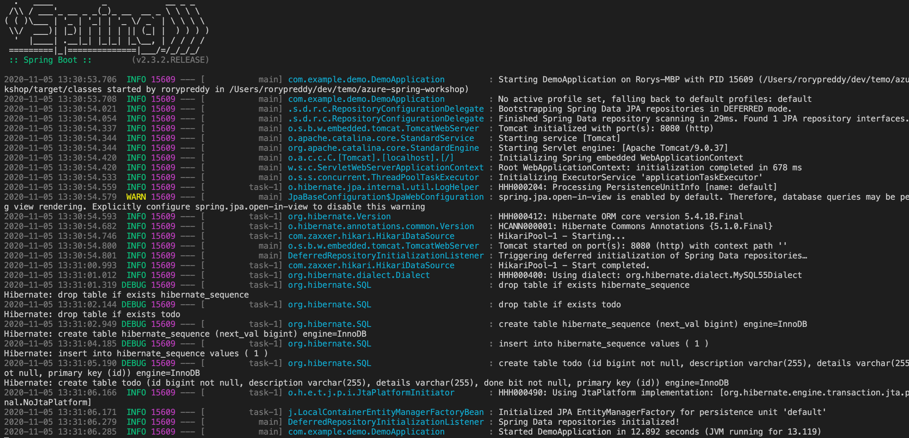

In this unit, you'll create a basic Spring Boot application. You'll use the Azure CLI and an integrated development environment (IDE) of your choice to edit the code. Use a terminal of your choice to run the code.

## Prepare the working environment

Set up some environment variables by using the following commands:

```bash
AZ_RESOURCE_GROUP=azure-spring-workshop
AZ_DATABASE_NAME=<YOUR_DATABASE_NAME>
AZ_LOCATION=<YOUR_AZURE_REGION>
AZ_MYSQL_USERNAME=spring
AZ_MYSQL_PASSWORD=<YOUR_MYSQL_PASSWORD>
AZ_LOCAL_IP_ADDRESS=<YOUR_LOCAL_IP_ADDRESS>
```

In your code, replace the placeholders with the values in the following table. These values are used throughout this module.

| Variable | Description |
|-|-|
| <YOUR_DATABASE_NAME> | The name of your MySQL server. It should be unique across Azure. |
| <YOUR_AZURE_REGION> | The Azure region you'll use. You can use `eastus` by default, but we recommend that you use a region close to where you live. To see the full list of available regions, enter `az account list-locations` |
| <YOUR_MYSQL_PASSWORD> | The password of your MySQL database server. The password should have a minimum of eight characters. The characters should be from three of the following categories: English uppercase letters, English lowercase letters, numbers 0 through 9, and nonalphanumeric characters (!, $, #, %, and so on). |
| <YOUR_LOCAL_IP_ADDRESS> | The IP address of the local computer from which you'll run your Spring Boot application. To find the IP address, point your browser to [whatismyip.akamai.com](http://whatismyip.akamai.com/?azure-portal=true). |

Next, create a resource group:

```bash
az group create \
    --name $AZ_RESOURCE_GROUP \
    --location $AZ_LOCATION \
    | jq
```

> [!NOTE]
> This module uses the `jq` tool, which is installed by default on [Azure Cloud Shell](https://shell.azure.com/) to display JSON data and make it more readable.
>
> If you don't want to use the `jq` tool, you can safely remove the `| jq` part of all commands in this module.

## Create an instance of Azure Database for MySQL

Now you'll create a managed MySQL server.

> [!NOTE]
> To learn more about Azure Database for MySQL, at the end of this module, follow the link to the relevant documentation.

Run the following script to create a small instance of Azure Database for MySQL. The database has 1 CPU and 2 GB of RAM.

```bash
az mysql server create \
    --resource-group $AZ_RESOURCE_GROUP \
    --name $AZ_DATABASE_NAME \
    --location $AZ_LOCATION \
    --sku-name B_Gen5_1 \
    --storage-size 5120 \
    --admin-user $AZ_MYSQL_USERNAME \
    --admin-password $AZ_MYSQL_PASSWORD \
    | jq
```

This script creates a small MySQL server that uses the variables you set up earlier.

### Configure a firewall rule for your MySQL server

Azure Database for MySQL is secured by default. Its firewall allows no incoming connections. So add a firewall rule to allow the local IP address to access the database server.

Run the following command to open the server's firewall:

```bash
az mysql server firewall-rule create \
    --resource-group $AZ_RESOURCE_GROUP \
    --name $AZ_DATABASE_NAME-database-allow-local-ip \
    --server-name $AZ_DATABASE_NAME \
    --start-ip-address $AZ_LOCAL_IP_ADDRESS \
    --end-ip-address $AZ_LOCAL_IP_ADDRESS \
    | jq
```

Run the following command to allow firewall access from Azure resources:

```bash
az mysql server firewall-rule create \
    --resource-group $AZ_RESOURCE_GROUP \
    --name allAzureIPs \
    --server-name $AZ_DATABASE_NAME \
    --start-ip-address 0.0.0.0 --end-ip-address 0.0.0.0 \
    | jq
```

### Configure a MySQL database

The MySQL server that you created earlier is empty. It has no database that you can use with the Spring Boot application. Create a new database called `demo`:

```bash
az mysql db create \
    --resource-group $AZ_RESOURCE_GROUP \
    --name demo \
    --server-name $AZ_DATABASE_NAME \
    | jq
```

## Generate the application by using Spring Initializr

Spring Initializr is a web application that generates a Spring Boot project structure for you.
Spring Initializr doesn't generate any application code, but it gives you a basic project structure and a Maven build specification.

You'll generate your application scaffold with three dependencies: `web`, `mysql`, and `data-jpa`.
You don't need to specify Azure dependencies because you'll run your application locally.

At a command prompt, generate the application:

```bash
curl https://start.spring.io/starter.tgz -d type=maven-project -d dependencies=web,data-jpa,mysql -d baseDir=azure-spring-workshop -d bootVersion=3.1.5.RELEASE -d javaVersion=17 | tar -xzvf -
```

### Configure Spring Boot to use Azure Database for MySQL

Open the *src/main/resources/application.properties* file and add some properties. Be sure to replace the two `$AZ_DATABASE_NAME` variables and the `$AZ_MYSQL_PASSWORD` variable with the values that you set up earlier.

```properties
logging.level.org.hibernate.SQL=DEBUG

spring.datasource.url=jdbc:mysql://$AZ_DATABASE_NAME.mysql.database.azure.com:3306/demo?serverTimezone=UTC
spring.datasource.username=spring@$AZ_DATABASE_NAME
spring.datasource.password=$AZ_MYSQL_PASSWORD

spring.jpa.show-sql=true
spring.jpa.hibernate.ddl-auto=create-drop
```

> [!WARNING]
> The configuration property `spring.jpa.hibernate.ddl-auto=create-drop` means that Spring Boot will automatically create a database schema at application start-up and will try to delete the database schema when it shuts down. This property is great for testing, but it shouldn't be used in production!

> [!NOTE]
> You append `?serverTimezone=UTC` to the configuration property `spring.datasource.url`. This setup tells the Java Database Connectivity (JDBC) driver to use the Coordinated Universal Time (UTC) date format when you connect to the database. Otherwise, your Java server won't use the same date format as the database, which will result in an error.

Now start your application by using the provided Maven wrapper:

```bash
./mvnw spring-boot:run
```

This screenshot shows the application running for the first time:



## Code the application

Next, add the following Java code. It uses Java Persistence API (JPA) to store and retrieve data from your MySQL server.

You'll use a JPA entity class to map a Java `Todo` object directly to the MySQL `Todo` table.

Next to the `DemoApplication` class, create a new `Todo` entity class. Then add the following code:

```java
package com.example.demo;

import javax.persistence.Entity;
import javax.persistence.GeneratedValue;
import javax.persistence.Id;

@Entity
public class Todo {

    public Todo() {
    }

    public Todo(String description, String details, boolean done) {
        this.description = description;
        this.details = details;
        this.done = done;
    }

    @Id
    @GeneratedValue
    private Long id;

    private String description;

    private String details;

    private boolean done;

    public Long getId() {
        return id;
    }

    public void setId(Long id) {
        this.id = id;
    }

    public String getDescription() {
        return description;
    }

    public void setDescription(String description) {
        this.description = description;
    }

    public String getDetails() {
        return details;
    }

    public void setDetails(String details) {
        this.details = details;
    }

    public boolean isDone() {
        return done;
    }

    public void setDone(boolean done) {
        this.done = done;
    }

    @Override
    public boolean equals(Object o) {
        if (this == o) {
            return true;
        }
        if (!(o instanceof Todo)) {
            return false;
        }
        return id != null && id.equals(((Todo) o).id);
    }

    @Override
    public int hashCode() {
        return 31;
    }
}
```

This class is a domain model that's mapped on the `Todo` table. It will be automatically created by JPA.

To manage that class, you need a repository. Define a new `TodoRepository` interface in the same package:

```java
package com.example.demo;

import org.springframework.data.jpa.repository.JpaRepository;

public interface TodoRepository extends JpaRepository<Todo, Long> {
}
```

This repository is a JPA repository that Spring Data JPA manages. By extending `JpaRepository`, you get a bunch of generic create, read, update, and delete (CRUD) methods for your type. So you can do things like saving and deleting `Todo` objects.

Finish the application by creating a `RestController` that can publish REST interfaces to store and retrieve data by using HTTP. Implement a `TodoController` class in the same package. Then add the following code:

```java
package com.example.demo;

import org.springframework.http.HttpStatus;
import org.springframework.web.bind.annotation.*;

@RestController
@RequestMapping("/")
public class TodoController {

    private final TodoRepository todoRepository;

    public TodoController(TodoRepository todoRepository) {
        this.todoRepository = todoRepository;
    }

    @PostMapping("/")
    @ResponseStatus(HttpStatus.CREATED)
    public Todo createTodo(@RequestBody Todo todo) {
        return todoRepository.save(todo);
    }

    @GetMapping("/")
    public Iterable<Todo> getTodos() {
        return todoRepository.findAll();
    }
}
```

Finally, stop the application and then start it again by using the following command:

```bash
./mvnw spring-boot:run
```

The Spring Boot application should start and connect to your database.

This screenshot shows the application connecting to the database:



## Test the application

To test the application, you can use `cURL`.

First, create a new to-do item in the database:

```bash
curl --header "Content-Type: application/json" \
    --request POST \
    --data '{"description":"configuration","details":"congratulations, you have set up your Spring Boot application correctly!","done": "true"}' \
    http://127.0.0.1:8080
```

This command should return the created item:

```json
{"id":1,"description":"configuration","details":"congratulations, you have set up your Spring Boot application correctly!","done":true}
```

Next, retrieve the data by using a new `cURL` request:

```bash
curl http://127.0.0.1:8080
```

This command returns the list of to-do items, including the item you created:

```json
[{"id":1,"description":"configuration","details":"congratulations, you have set up your Spring Boot application correctly!","done":true}]
```
