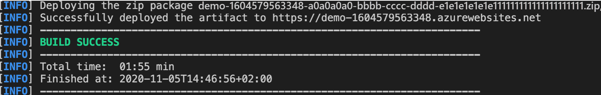

In this unit, you'll configure your  Spring Boot app to be deployed via Maven and then create and deploy to an Azure App Service instance.

# Configure the Maven plugin

The deployment process to Azure App Service will use your Azure credentials from the Azure CLI automatically.

Run the Maven command below to configure the deployment. This command will help you to set up the App Service operating system,Azure subscription and Java version.

```bash
mvn com.microsoft.azure:azure-webapp-maven-plugin:1.12.0:config
```

1. When prompted with **Subscription** option, select the proper `Subscription` by entering the number print in the line start.
1. When prompted with **Web App** option, accept the default option `<create>` by pressing enter.
1. When prompted with **OS** option, select **linux** by pressing enter.
1. Use the default Java version, 1.8, by pressing enter.
1. Finally, press enter on the last prompt to confirm your selections.

    ```bash
    Please confirm webapp properties
    AppName : demo-1604579125693
    ResourceGroup : demo-1604579125693-rg
    Region : eastus
    PricingTier : PremiumV2_P1v2
    OS : Linux
    Java : Java 8
    Web server stack: Java SE
    Deploy to slot : false
    Confirm (Y/N) [Y]: Y
    [INFO] Saving configuration to pom.
    [INFO] ------------------------------------------------------------------------
    [INFO] BUILD SUCCESS
    [INFO] ------------------------------------------------------------------------
    [INFO] Total time:  28.781 s
    [INFO] Finished at: 2020-11-05T14:30:00+02:00
    [INFO] ------------------------------------------------------------------------
    ```


> [!IMPORTANT]
> The default value for the region is "westeurope", but for better performance you will need to change it to "eastus" as this is where your database is located.

Change The following field in your project's `pom.xml` file:

```xml
    <configuration>
        ...
        <region>eastus</region>
        ...
    </configuration>
```

## Deploy the app

The maven deploy plugin will copy your executable Spring Boot JAR file to your Azure App Service's instance, and also copy your JAR file to the server's "/local/site/wwwroot" directory
Finally it will start your App via your Spring Boot JAR file's embedded HTTP server.

Next, deploy your Spring Boot app to Azure using the following command:

```bash
mvn package com.microsoft.azure:azure-webapp-maven-plugin:1.12.0:deploy
```
Here's a screenshot of the application deployed to the Azure app service:



## Test the Azure App Service application

Once deployment has completed, your application will be ready at `http://<appName>.azurewebsites.net/`(`http://demo-1604579125693.azurewebsites.net` in the demo).
To test the application, you can use cURL.

First, create a new "todo" item in the database using the following command:

```bash
curl --header "Content-Type: application/json" \
    --request POST \
    --data '{"description":"configuration","details":"congratulations, you have set up your Spring Boot App correctly!","done": "true"}' \
    http://<appName>.azurewebsites.net
```

This command should return the created item as follows:

```json
{"id":1,"description":"configuration","details":"congratulations, you have set up your Spring Boot App correctly!","done":true}
```

Next, retrieve the data by using a new cURL request as follows:

```bash
curl http://<appName>.azurewebsites.net
```

This command will return the list of "todo" items, including the item you've created, as follows:

```json
[{"id":1,"description":"configuration","details":"congratulations, you have set up your Spring Boot App correctly!","done":true}]
```

> [!NOTE]
> You can also open the url in a web browser to return the list of "todo" items.
