Azure Arc data controller is the Kubernetes operator that brings all of the Arc-enabled components together allowing you to get the benefits of Azure data service in your Arc-enabled environment. This unit covers the prerequisites and implements an Arc data controller in your environment.

## Prerequisites

Before you proceed, complete the following prerequisites:

- Install/Upgrade **[Azure CLI](/cli/azure/install-azure-cli)** to the latest version.
- Add **arcdata** and associated **k8s CLI extensions**:
  - `arcdata`               : `az extension add --name arcdata`
  - `connectedk8s`          : `az extension add --name connectedk8s`
  - `customlocation`        : `az extension add --name customlocation`
  - `k8s-configuration`     : `az extension add --name k8s-configuration`
  - `k8s-extension`         : `az extension add --name k8s-extension`
- Connect to your **Kubernetes Cluster** V1.21 and above.
- **[Meet network requirements](/azure/azure-arc/kubernetes/network-requirements)**.
- **[Register providers for Azure Arc-enabled Kubernetes](/azure/azure-arc/kubernetes/quickstart-connect-cluster?tabs=azure-cli#register-providers-for-azure-arc-enabled-kubernetes)**.
  - `Microsoft.Kubernetes`
  - `Microsoft.KubernetesConfiguration`
  - `Microsoft.ExtendedLocation`

- Create a destination resource group in your Azure subscription.
- Size your Kubernetes cluster for your workload.

## Arc-enable your Kubernetes cluster

To Arc-enable your kubernetes cluster, or to connect your Kubernetes cluster to Azure, execute the **[az connectedk8s](/azure/azure-arc/kubernetes/quickstart-connect-cluster?tabs=azure-cli#connect-an-existing-kubernetes-cluster)** command. Before running this command, ensure you have downloaded your `kubeconfig` file. This prerequisite step is only required when you deploy in directly connected mode.

To confirm that your Arc-enabled Kubernetes cluster is ready and available to deploy your Arc data controller, view the shadow object (object representation of the Arc-enabled Kubernetes cluster) in the portal:


In the preceding image, the resource **Kubernetes-cluster** of resource type **Kubernetes service** is our Kubernetes cluster (which could be on-premises, any public cloud, or in this instance, located in Azure). The second highlighted resource of type **Kubernetes -Azure Arc** is our shadow resource for our Arc-enabled cluster that we can manage in the Azure portal.

Enable [custom locations](/azure/azure-arc/kubernetes/custom-locations#enable-custom-locations-on-cluster) on the kubernetes cluster.

Lastly, confirm **[Azure Arc agents for Kubernetes](/azure/azure-arc/kubernetes/quickstart-connect-cluster?tabs=azure-cli#view-azure-arc-agents-for-kubernetes)** have been deployed.

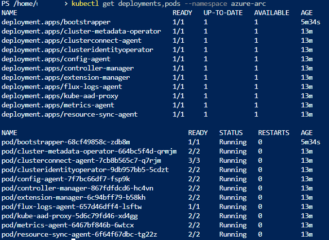

## Deploy the Arc data controller

The deployment mode you choose has multiple methods available. Choose either the **directly connected mode** or **indirectly connected mode**. You can choose which option to work through based on your connectivity mode requirement.

Azure Arc-enabled data services are supported on Kubernetes platforms V1.21 and above. Each Kubernetes type has slightly different instructions to create your data controller. Here are specific instructions for each type:

- **[Azure Kubernetes Service (AKS)](/azure/azure-arc/data/create-data-controller-indirect-cli?tabs=linux#create-on-azure-kubernetes-service-aks)**
- **[AKS on Azure Stack HCI](/azure/azure-arc/data/create-data-controller-indirect-cli?tabs=linux#create-on-aks-on-azure-stack-hci)**
- **[Azure Red Hat OpenShift (ARO)](/azure/azure-arc/data/create-data-controller-indirect-cli?tabs=linux#create-on-azure-red-hat-openshift-aro)**
- **[Red Hat OpenShift Container Platform (OCP)](/azure/azure-arc/data/create-data-controller-indirect-cli?tabs=linux#create-on-red-hat-openshift-container-platform-ocp)**
- **[Open source, upstream Kubernetes (kubeadm)](/azure/azure-arc/data/create-data-controller-indirect-cli?tabs=linux#create-on-open-source-upstream-kubernetes-kubeadm)**
- **[AWS Elastic Kubernetes Service (EKS)](/azure/azure-arc/data/create-data-controller-indirect-cli?tabs=linux#create-on-aws-elastic-kubernetes-service-eks)**
- **[Google Cloud Kubernetes Engine Service (GKE)](/azure/azure-arc/data/create-data-controller-indirect-cli?tabs=linux#create-on-google-cloud-kubernetes-engine-service-gke)**

For the following deployment options, we're using an AKS deployed Kubernetes cluster. All options related to storage classes are associated with the AKS cluster supported storage classes. The choice of Service type depends on the configuration of your Kubernetes cluster. The kubernetes cluster we use in this exercise is configured as a load-balanced service type. If you're configured in a node-port type, use node port instead of load balancer appropriately in the exercise. The type of Kubernetes cluster implemented in your environment dictates the types of provisioned and presented storage types. To complete the exercise, you need to know your storage classes. Talk to your infrastructure team or Kubernetes admin if you're unsure.

## Deploy in directly connected mode

To deploy your Arc data controller, you have several options:

- GUI deployment:
  - Azure portal
  - Azure Data Studio
- CLI deployment:
  - Azure portal Cloud Shell
  - Azure Data Studio terminal window

Choose which of the options you wish to walk through. All provide you with the same outcome.

## Option 1: Azure portal GUI deployment

1. In the Azure portal, select **Create a resource**.
1. Search for and select **Azure Arc data controller**.
1. Select **Create**.

    

1. Select **Azure Arc-enabled Kubernetes cluster (Directly connected mode)**, then select **Next: Data controller details**.

    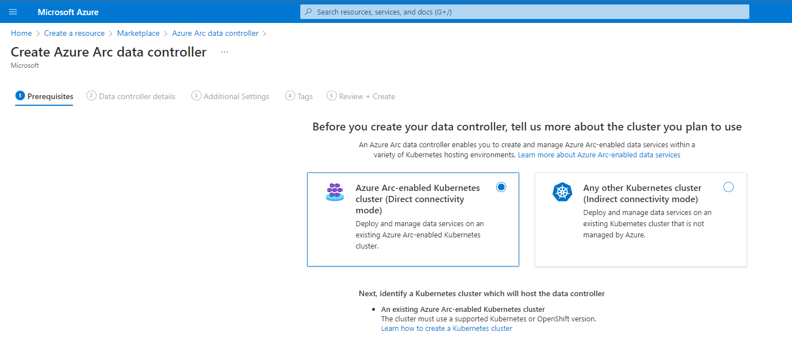

1. Choose the **Resource group** you created and into which you deployed your Azure Arc-enabled Kubernetes cluster.
1. Name your Arc data controller appropriately in the **Data controller name** field.
1. Select **Create new** under Custom location, then enter a **Name** and select your **Cluster**.

    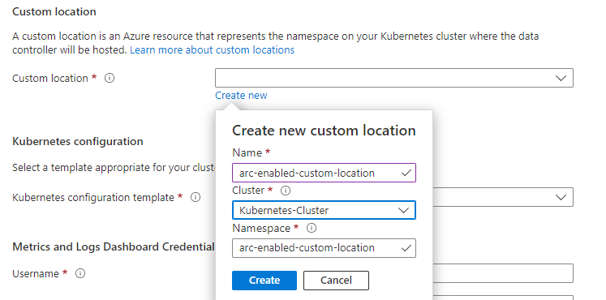

1. For the **Kubernetes configuration template**, choose the appropriate storage class. On the AKS cluster for this exercise, specify `azure-arc-aks-premium-storage`.

    If your Kubernetes cluster is either on-premises or in a public cloud, change the configuration template to a custom template and complete all of the required information. In particular, note your infrastructure location.

    Microsoft provides templates for various environments, such as GKE and OpenShift. If you see an option that matches your environment, Microsoft provides a configuration template for you. Otherwise, specify a custom template.

    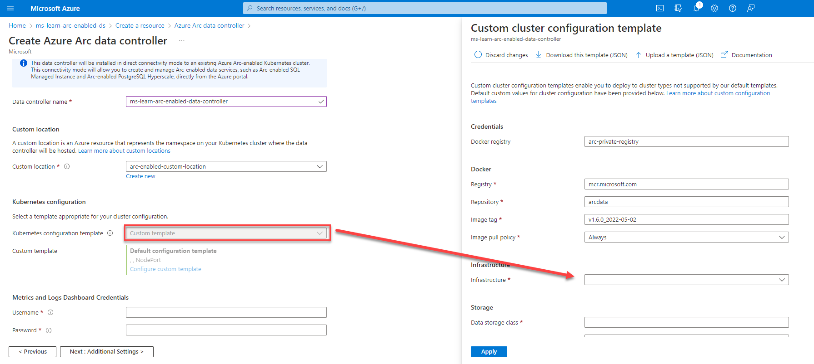

1. For **Service type**, select **Load balancer**.
1. Set a **Username** and **Password** for Metrics and Logs Dashboards (Kibana and Grafana) that you view locally.

    

1. Select **Next: Additional Settings**.

    You might already have a Log Analytics workspace configured, or you can create a new workspace specifically for your Arc data controller. Find the Log Analytics workspace ID and primary key (both values are required) under **Settings** > **Agents management** of your Log Analytics workspace.

    

    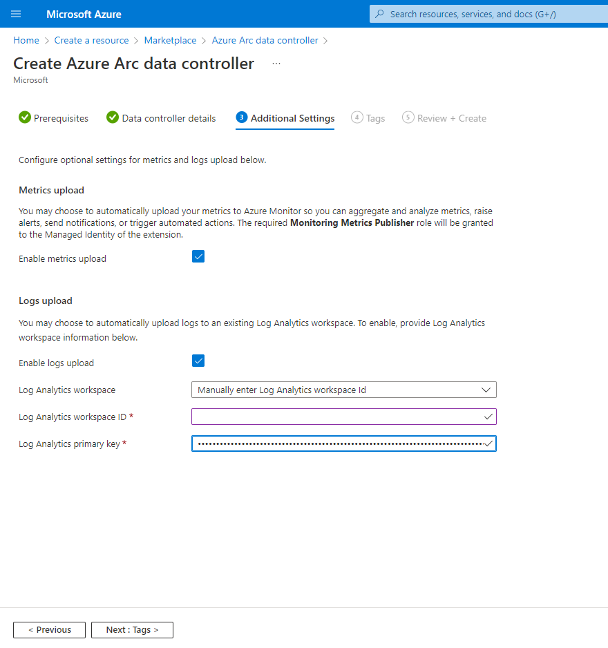

1. Select **Next: Tags**, then add Tags for your Arc data controller.

    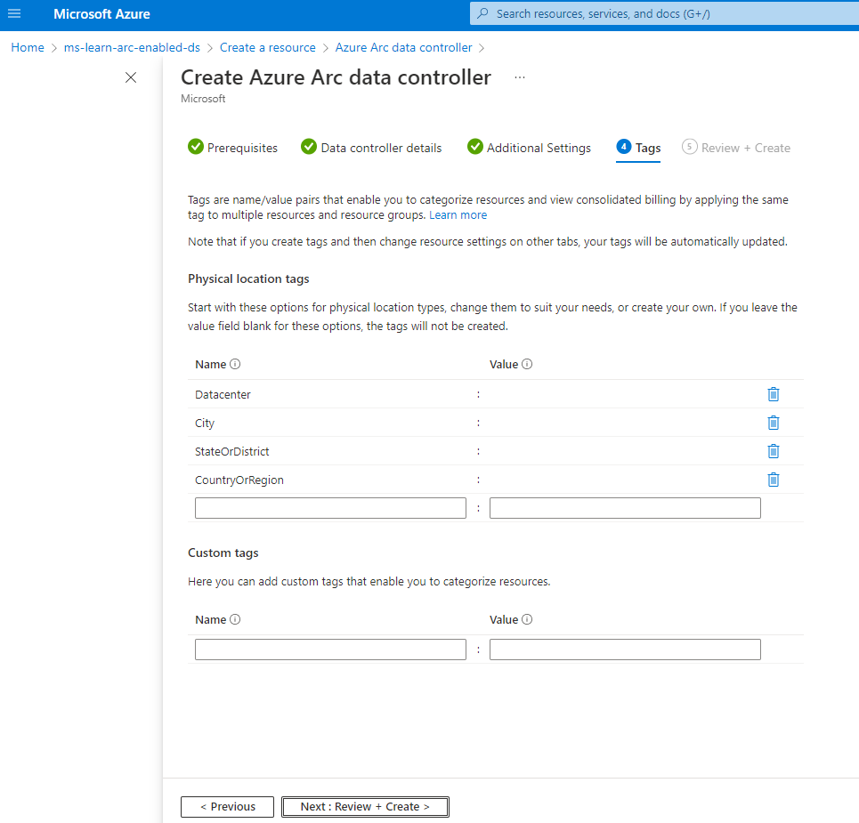

1. On **Review + Create** and confirm all details are correct. Select **Create**.

    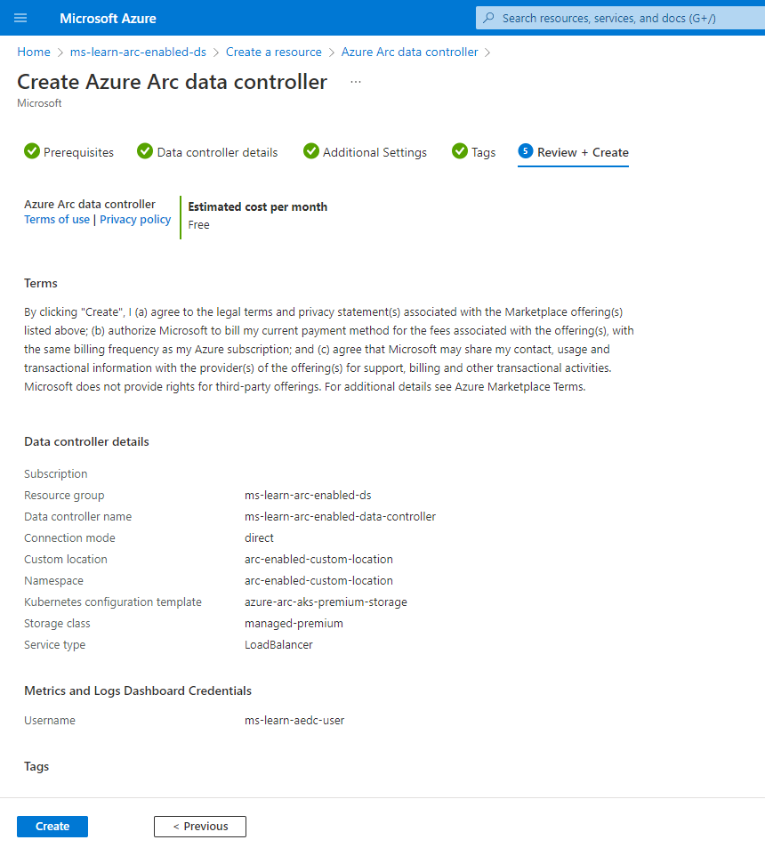

1. Monitor the Arc data controller creation with this command:

    ```PowerShell
    kubectl get datacontroller --namespace <namespace>
    ```

    

    Congratulations! You've successfully deployed your Arc data controller in directly connected mode.

    

1. Validate the deployment against the Kubernetes cluster. Execute `kubectl get ns` in the Cloud Shell.

    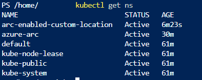

1. Confirm all packages deployed to the Kubernetes cluster as part of the deployment. Execute `Kubectl get crd` in the Cloud Shell.

    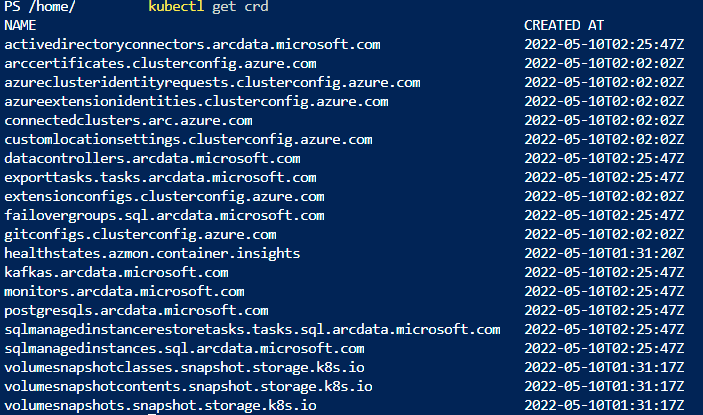

1. Review all the resources created under the **Custom location** type resource. Execute `Kubectl get pods --namespace <namespace>` in the Cloud Shell.

    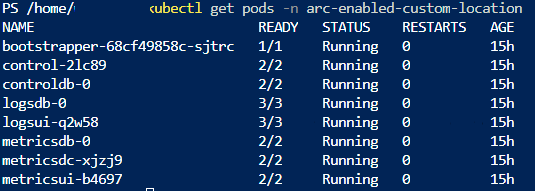

## Option 2: Azure Data Studio GUI deployment

This deployment method, you'll use **[Azure Data Studio](/sql/azure-data-studio/download-azure-data-studio)** (ADS) and the associated ADS extensions **Azure Arc** and **Azure CLI**.

Ensure that you've navigated to your `.kube` directory in the ADS terminal before executing any CLI commands.

- Before using ADS for the deployment, you need to create a custom location in your chosen subscription and resource group where you deploy your Arc data controller. In ADS, open the terminal window and connect to your subscription and download your `kube` config file.

    ```PowerShell
    $Env:MySuscriptionID = 'enter your subscription ID here'
    $Env:MyResourceGroup = 'enter your resource group name here'
    $Env:MyCluster = 'enter your kubernetes cluster name here'
    az account set --subscription $Env:MySuscriptionID
    az aks get-credentials --resource-group $Env:MyResourceGroup --name $Env:MyCluster
    ```

Create your custom location for your Azure Arc data controller that you deploy on your Azure Arc-enabled Kubernetes cluster. With the Azure portal Cloud Shell, execute the following commands.

1. Create the Arc-enabled kubernetes cluster custom location extension using the following command:

    ```PowerShell
    $Env:MyNamespace = 'enter your namespace name here'
    $Env:MyCustomlocationExtension = 'enter your custom location extension name here'

    az k8s-extension create --cluster-name $Env:MyCluster `
        --resource-group $Env:MyResourceGroup `
        --name $Env:MyCustomlocationExtension `
        --cluster-type connectedClusters `
        --extension-type microsoft.arcdataservices `
        --auto-upgrade false `
        --scope cluster `
        --release-namespace $Env:MyNamespace `
        --config Microsoft.CustomLocation.ServiceAccount=sa-arc-bootstrapper
    ```

1. In the ADS terminal window, confirm the creation of the newly created custom location extension:

    ```PowerShell
    az k8s-extension show --resource-group $Env:MyResourceGroup `
        --cluster-name $Env:MyCluster `
        --name $Env:MyCustomlocationExtension `
        --cluster-type connectedclusters
    ```

1. In the ADS terminal window, confirm the cluster status using the following kubectl CLI command. The bootstrapper pod should be in a running state:

    ```PowerShell
    kubectl get pods --name $Env:MyNamespace
    ```

1. **[Create a custom location](/azure/azure-arc/kubernetes/custom-locations#create-custom-location)** following steps 2, 3, and 4. The `extensionInstanceName` in step 3 relates to the extension name you used in the step above. In step 4, add the optional parameter `--location`.

1. In the ADS terminal window, confirm the creation of the Arc-enabled custom location:

    ```PowerShell
    az customlocation list -o table
    ```

    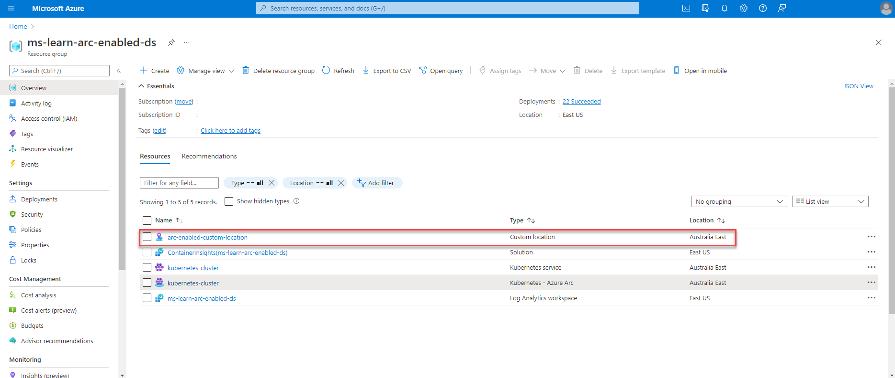

1. Confirm you have Azure Data Studio downloaded and installed.
1. Open ADS and select **Extensions** in the sidebar.

    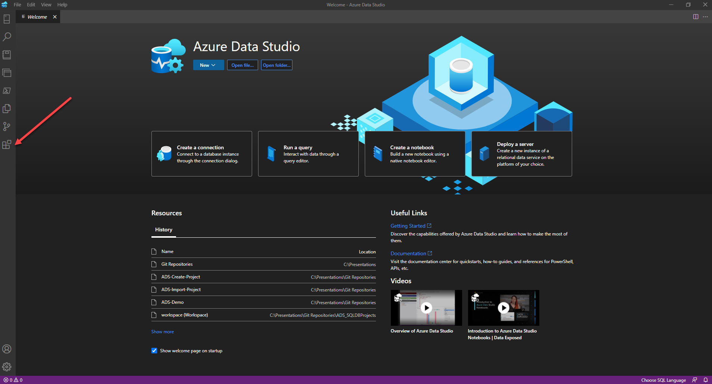

1. Search for **azure cli**. Install the Azure CLI Extension.

    

1. Search for **Azure Arc**. Install the Azure Arc Extension.

    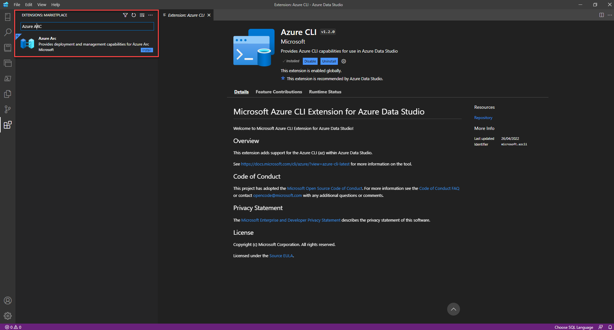

1. After installing both extensions, close and restart ADS.
1. Once ADS has restarted, navigate to the **Linked Accounts** section and select **Add an account** (the **+** icon at the top-right corner).

   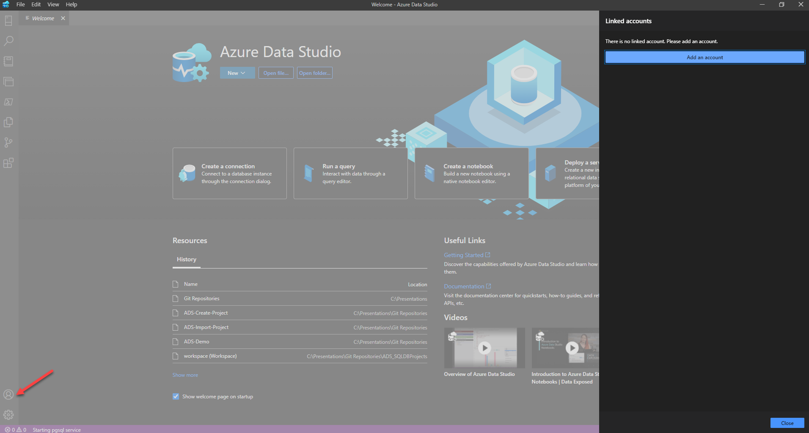

1. Sign in to your Azure subscription. You've successfully added a Linked Account to your Azure subscription. Select **Close**.

   

1. Open the Terminal window (**View** > **Terminal**) and download your Arc-enabled Kubernetes Cluster config file to your workstation. You can use the command:

    ```PowerShell
    az aks get-credentials --resource-group <resourcegroupname> `
        --name <Arc-enabled Kubernetes Cluster Name> `
        --file <download location>
    ```

    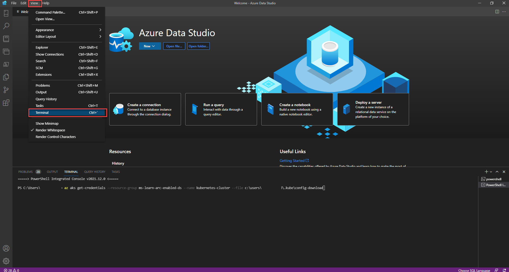

1. Expand the **Connections** tab and expand the **Azure Arc controllers** dropdown.

    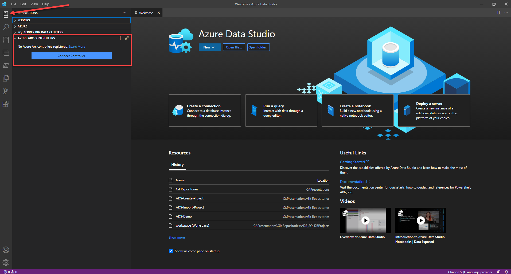

1. Select **+ Create New Azure Arc Controller**, ensure **Azure Arc data controller** is selected, and select **Select**.

    

1. Confirm the deployment prerequisites are in-place. Select **Next**.

   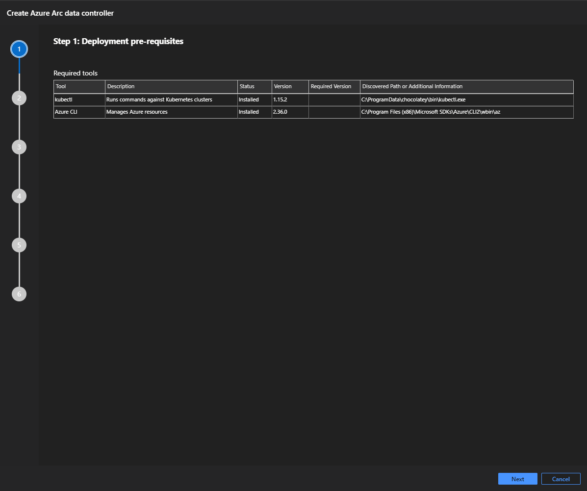

1. With your downloaded Arc-enabled Kubernetes Cluster config file in the default location, confirm your Arc-enabled Kubernetes Cluster is selected. Ensure the chosen connectivity mode is **Direct**. Select **Next**.

    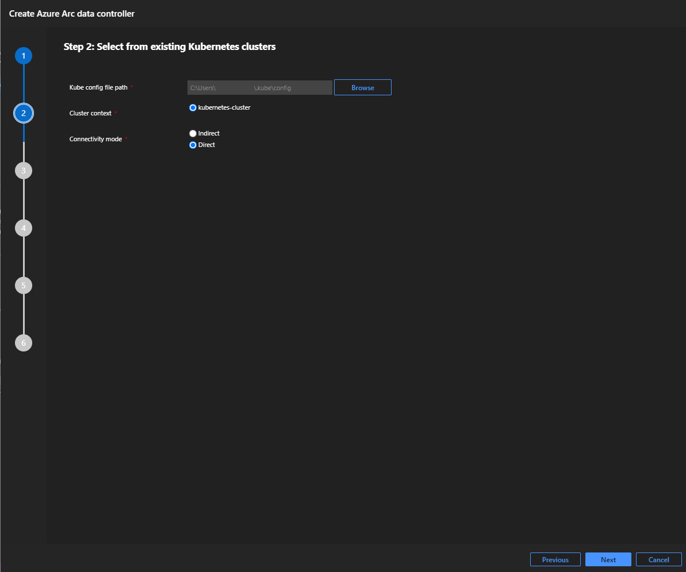

1. For the Kubernetes configuration template, choose the appropriate storage class. This exercise uses an AKS cluster. Specify `azure-arc-aks-premium-storage`. Select **Next**.

    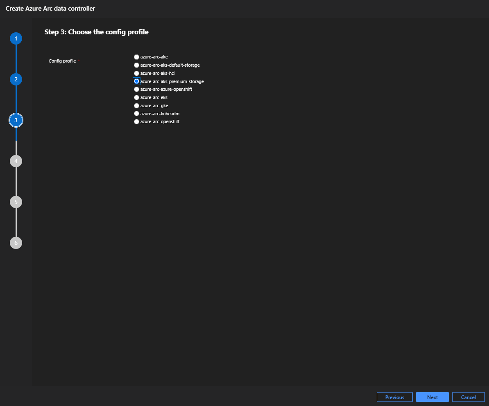

1. In step 11, you connected to your subscription. Confirm the Azure account is connected to the correct subscription. Choose the resource group you configured in the prerequisites at the top of this section. Choose the location to which you're deploying your Arc data controller. Select **Next**.

   

1. To create the Arc data controller, gather the following information:
    - **Data Controller Name**: Your custom name
    - **Storage Class**: dependent on your config profile selection above
    - **Infrastructure**: dependent on the location of your Kubernetes Cluster
    - **Custom Location**: An Azure resource representing the namespace on your Kubernetes Cluster where you'll host the data controller.
    - **Auto-upload Metrics**: Ensure you select this with the directly connected mode
    - **Auto-upload Logs**: Ensure you select this with the directly connected mode
    - **Log Analytics workspace ID**: Available from your Log Analytics workspace (see step 11 in the *Option 1: Azure portal GUI deployment* section of this unit)
    - **Log Analytics primary key**: Available from your Log Analytics workspace (see step 11 in the *Option 1: Azure portal GUI deployment* section of this unit)
    - **Metrics and Logs Dashboard Credentials**: Kibana and Grafana

    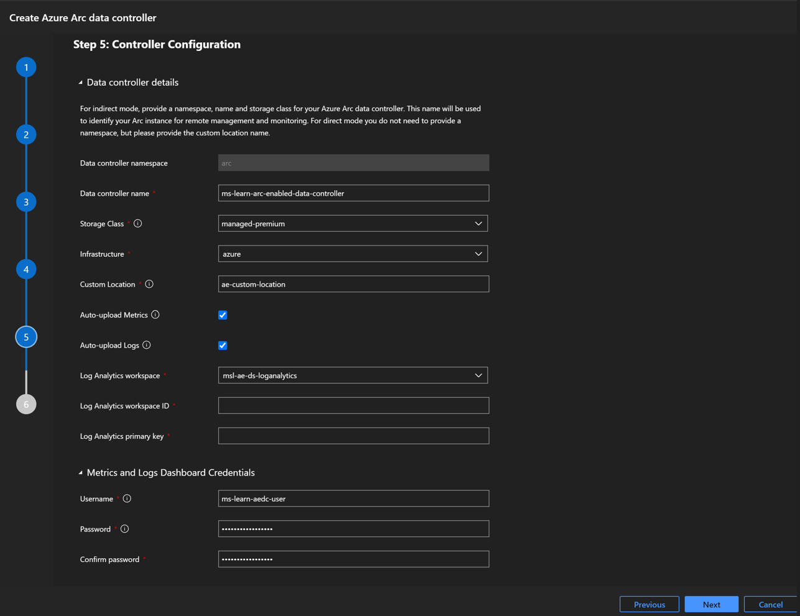

1. Once you confirm the configuration details, you're ready to deploy. Select **Deploy**.

    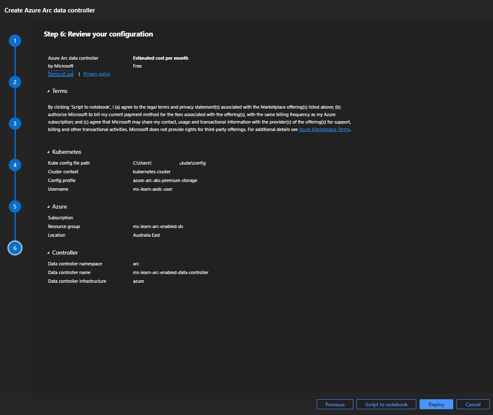

   This opens a notebook called *deploy.arc.data.controller*, which automatically starts executing each of the created cells. A prompt requests that you log in to your Azure subscription to allow the deployment to start.

Once the deployment completes, select **Connect Controller** in the connections tab. Enter the namespace for the data controller you just created and select **Connect**.


To manage your Arc data controller, right-click the data controller and select **Manage**.


## Option 3: Azure portal Cloud Shell deployment

In this exercise option, you create the Arc data controller via the CLI from the Azure portal. Ensure you have walked through the prerequisites at the start of this exercise.

1. In the Azure portal, open the Cloud Shell. Select **Switch to PowerShell** if your Cloud Shell loads in Bash.
1. Set your parameters for this deployment:

    ```PowerShell
    $Env:MySuscriptionID = 'enter your subscription ID here'
    $Env:MyResourceGroup = 'enter resource group name here'
    $Env:MyCluster = 'enter kubernetes cluster name here'
    $Env:Mylocation = 'enter resource location here'
    $Env:MyCustomlocationExtension = 'enter custom location extension name here'
    $Env:MyCustomlocation = 'enter custom location name here'
    $Env:MyNamespace = 'enter data controller name space here'
    ```

1. Download the Kubernetes cluster `kube` config file:

    ```PowerShell
    az account set --subscription $Env:MySuscriptionID
    az aks get-credentials --resource-group $Env:MyResourceGroup --name $Env:MyCluster
    ```

1. Arc-enable your Kubernetes Cluster:

    ```PowerShell
    az connectedk8s connect --name $Env:MyCluster --resource-group $Env:MyResourceGroup --location $Env:Mylocation
    ```

1. Confirm your Arc-enabled Kubernetes cluster:

    ```PowerShell
    az connectedk8s list --resource-group $Env:MyResourceGroup --output table
    ```

1. Enable the `cluster-connect` and `custom-location` Arc-enabled features on your Arc-enabled Kubernetes cluster:

    ```PowerShell
    az connectedk8s enable-features --name $Env:MyCluster `
        --resource-group $Env:MyResourceGroup `
        --features cluster-connect custom-locations
    ```

1. Confirm all Azure Arc Agents have been deployed and are running in the azure-arc namespace:

    ```PowerShell
    kubectl get deployments,pods --namespace azure-arc
    ```

1. Create your Arc-enabled custom location extension in your Kubernetes - Azure Arc type resource:

    ```PowerShell
    az k8s-extension create --cluster-name $Env:MyCluster `
        --resource-group $Env:MyResourceGroup `
        --name $Env:MyCustomlocationExtension `
        --cluster-type connectedClusters `
        --extension-type microsoft.arcdataservices `
        --auto-upgrade false `
        --scope cluster `
        --release-namespace $Env:MyNamespace `
        --config Microsoft.CustomLocation.ServiceAccount=sa-arc-bootstrapper
    ```

1. Confirm your newly created Arc-enabled custom location extension:

    ```PowerShell
    az k8s-extension show --resource-group $Env:MyResourceGroup `
        --cluster-name $Env:MyCluster `
        --name $Env:MyCustomlocationExtension `
        --cluster-type connectedclusters
    ```

1. Confirm your custom location namespace has been created and has the bootstrapper running:

    ```PowerShell
    kubectl get pods -n $Env:MyNamespace
    ```

1. Assign permissions to the Arc-enabled custom location extension:

    ```PowerShell
    $Env:MSI_Object_Id=(az k8s-extension show `
        --resource-group $Env:MyResourceGroup `
        --cluster-name $Env:MyCluster `
        --cluster-type connectedClusters `
        --name $Env:MyCustomlocationExtension | convertFrom-json).identity.principalId
    
    az role assignment create --assignee $Env:MSI_Object_Id `
        --role "Contributor" `
        --scope "/subscriptions/$Env:MySuscriptionID/resourceGroups/$Env:MyResourceGroup"
    
    az role assignment create --assignee $Env:MSI_Object_Id `
        --role "Monitoring Metrics Publisher" `
        --scope "/subscriptions/$Env:MySuscriptionID/resourceGroups/$Env:MyResourceGroup"
    ```

1. Create the Arc-enabled custom location:

    ```PowerShell
    $Env:HostClusterID=az connectedk8s show --name $Env:MyCluster `
        --resource-group $Env:MyResourceGroup `
        --query id -o tsv

    $Env:ExtensionID=az k8s-extension show --name $Env:MyCustomlocationExtension `
        --cluster-type connectedClusters `
        --cluster-name $Env:MyCluster `
        --resource-group $Env:MyResourceGroup `
        --query id -o tsv

    az customlocation create --name $Env:MyCustomlocation `
        --resource-group $Env:MyResourceGroup `
        --namespace $Env:MyNamespace `
        --host-resource-id $Env:HostClusterID `
        --cluster-extension-ids $Env:ExtensionID `
        --location $Env:Mylocation
    ```

1. Validate the creation of the Arc-enabled custom location:

    ```PowerShell
    az customlocation list -o table
    ```

1. Declare some parameters specific to creating the Arc data controller:

    ```PowerShell
    $Env:MyDataController = 'enter your data controller name here'
    $Env:MyConnectMode = 'direct'
    $Env:MyProfile = 'azure-arc-aks-premium-storage'  (Choose your storage profile)
    $Env:MyStorageClass = 'managed-premium' (Choose your storage class)
    $Env:arc_infrastructure = 'azure'
    $ENV:AZDATA_LOGSUI_USERNAME= 'enter Kibana dashboard username here'
    $ENV:AZDATA_LOGSUI_PASSWORD= 'enter Kibana dashboard password here'
    $ENV:AZDATA_METRICSUI_USERNAME= 'enter Grafana dashboard username here'
    $ENV:AZDATA_METRICSUI_PASSWORD= 'enter Grafana dashboard password here'
    ```

1. Create the Arc data controller:

    ```PowerShell
    az arcdata dc create --name $Env:MyDataController `
        --k8s-namespace $Env:MyNamespace `
        --subscription $Env:MySuscriptionID `
        --resource-group $Env:MyResourceGroup `
        --location $Env:Mylocation `
        --connectivity-mode $Env:MyConnectMode `
        --profile-name $Env:MyProfile `
        --auto-upload-logs true `
        --auto-upload-metrics true `
        --custom-location $Env:MyCustomlocation `
        --storage-class $Env:MyStorageClass `
        --infrastructure $Env:arc_infrastructure `
        --custom-location $Env:MyCustomlocation `
        --cluster-name $Env:MyCluster
    ```

1. Use the following command to monitor your Arc data controller deployment:

    ```PowerShell
    kubectl get datacontrollers --namespace $Env:MyNamespace. 

    <##
        The deployment will go through 3 states before it finishes: 

        - State = Deploying Controller
        - State = Deploying Monitoring
        - State = Ready
    ##> 
    ```

1. Confirm all resources have been deployed into your Arc-enabled custom location namespace:

    ```PowerShell
    kubectl get pods -n $Env:MyNamespace
    ```

## Option 4: Azure Data Studio Terminal window deployment

In this deployment method, use **[Azure Data Studio](/sql/azure-data-studio/download-azure-data-studio)** (ADS) and the associated ADS extensions **Azure Arc** and **Azure CLI**. Use the CLI from the Azure Data Studio Terminal. Ensure you meet the prerequisites at the start of this exercise and you've installed the Azure Arc and Azure CLI Azure Data Studio extensions.

Navigate to your `.kube` directory in the ADS terminal before executing any CLI commands.

1. Open the Terminal (**View** > **Terminal**) and navigate to your `.kube` directory.
1. Set your parameters for this deployment:

    ```PowerShell
    $Env:MySuscriptionID= 'enter your subscription ID here'
    $Env:MyResourceGroup= 'enter resource group name here'
    $Env:MyCluster= 'enter kubernetes cluster name here'
    $Env:Mylocation= 'enter resource location here'
    $Env:MyCustomlocationExtension= 'enter custom location extension name here'
    $Env:MyCustomlocation= 'enter custom location name here'
    $Env:MyNamespace= 'enter data controller name space here'
    ```

1. Download the Kubernetes cluster `kube` config file:

    ```PowerShell
    az account set --subscription $Env:MySuscriptionID
    az aks get-credentials --resource-group `
        $Env:MyResourceGroup --name $Env:MyCluster
    ```

1. Arc-enable your Kubernetes Cluster:

    ```PowerShell
    az connectedk8s connect --name $Env:MyCluster `
        --resource-group $Env:MyResourceGroup `
        --location $Env:Mylocation
    ```

1. Confirm your Arc-enabled Kubernetes cluster:

    ```PowerShell
    az connectedk8s list --resource-group $Env:MyResourceGroup --output table
    ```

1. Enable the Cluster-Connect and Custom-location Arc-enabled features on your Arc-enabled Kubernetes cluster:

    ```PowerShell
    az connectedk8s enable-features --name $Env:MyCluster `
        --resource-group $Env:MyResourceGroup `
        --features cluster-connect custom-locations
    ```

1. Confirm all Azure Arc Agents have been deployed and are running in the azure-arc namespace:

    ```PowerShell
    kubectl get deployments,pods --namespace azure-arc
    ```

1. Create your Arc-enabled custom location extension in your Kubernetes - Azure Arc type resource:

    ```PowerShell
    az k8s-extension create --cluster-name $Env:MyCluster `
        --resource-group $Env:MyResourceGroup `
        --name $Env:MyCustomlocationExtension `
        --cluster-type connectedClusters `
        --extension-type microsoft.arcdataservices `
        --auto-upgrade false `
        --scope cluster `
        --release-namespace $Env:MyNamespace `
        --config Microsoft.CustomLocation.ServiceAccount=sa-arc-bootstrapper
    ```

1. Confirm your newly created Arc-enabled custom location extension:

    ```PowerShell
    az k8s-extension show --resource-group $Env:MyResourceGroup `
        --cluster-name $Env:MyCluster `
        --name $Env:MyCustomlocationExtension `
        --cluster-type connectedclusters
    ```

1. Confirm your custom location namespace has been created and has the bootstrapper running:

    ```PowerShell
    kubectl get pods -n $Env:MyNamespace
    ```

1. Assign permissions to the Arc-enabled custom location extension:

    ```PowerShell
    $Env:MSI_Object_Id=(az k8s-extension show --resource-group $Env:MyResourceGroup `
        --cluster-name $Env:MyCluster `
        --cluster-type connectedClusters `
        --name $Env:MyCustomlocationExtension | convertFrom-json).identity.principalId

    az role assignment create --assignee $Env:MSI_Object_Id `
        --role "Contributor" `
        --scope "/subscriptions/$Env:MySuscriptionID/resourceGroups/$Env:MyResourceGroup"

    az role assignment create --assignee $Env:MSI_Object_Id `
        --role "Monitoring Metrics Publisher" `
        --scope "/subscriptions/$Env:MySuscriptionID/resourceGroups/$Env:MyResourceGroup"
    ```

1. Create the Arc-enabled custom location:

    ```PowerShell
    $Env:HostClusterID=az connectedk8s show --name $Env:MyCluster `
        --resource-group $Env:MyResourceGroup `
        --query id -o tsv

    $Env:ExtensionID=az k8s-extension show --name $Env:MyCustomlocationExtension `
        --cluster-type connectedClusters `
        --cluster-name $Env:MyCluster `
        --resource-group $Env:MyResourceGroup `
        --query id -o tsv

    az customlocation create --name $Env:MyCustomlocation `
        --resource-group $Env:MyResourceGroup `
        --namespace $Env:MyNamespace `
        --host-resource-id $Env:HostClusterID `
        --cluster-extension-ids $Env:ExtensionID `
        --location $Env:Mylocation
    ```

1. Validate the creation of the Arc-enabled custom location:

    ```PowerShell
    az customlocation list -o table
    ```

1. Declare some parameters specific to the creation of the Arc data controller:

    ```PowerShell
    $Env:MyDataController= 'enter your data controller name here'
    $Env:MyConnectMode = 'direct'
    $Env:MyProfile = 'azure-arc-aks-premium-storage'  (Choose your storage profile)
    $Env:MyStorageClass = 'managed-premium' (Choose your storage class)
    $Env:arc_infrastructure = 'azure'
    $ENV:AZDATA_LOGSUI_USERNAME= 'enter Kibana dashboard username here'
    $ENV:AZDATA_LOGSUI_PASSWORD= 'enter Kibana dashboard password here'
    $ENV:AZDATA_METRICSUI_USERNAME= 'enter Grafana dashboard username here'
    $ENV:AZDATA_METRICSUI_PASSWORD= 'enter Grafana dashboard password here'
    ```

1. Create Arc data controller:

    ```PowerShell
    az arcdata dc create --name $Env:MyDataController `
        --k8s-namespace $Env:MyNamespace `
        --subscription $Env:MySuscriptionID `
        --resource-group $Env:MyResourceGroup `
        --location $Env:Mylocation `
        --connectivity-mode $Env:MyConnectMode `
        --profile-name $Env:MyProfile `
        --auto-upload-logs true `
        --auto-upload-metrics true `
        --custom-location $Env:MyCustomlocation `
        --storage-class $Env:MyStorageClass`
        --infrastructure $Env:arc_infrastructure `
        --custom-location $Env:MyCustomlocation `
        --cluster-name $Env:MyCluster
    ```

1. Provide the Log Analytics Workspace ID and associated primary key. You can retrieve these from inside the portal. Navigate to your Log Analytics workspace. The workspace ID and primary key are available in the **Settings** > **Agents management** section.

1. Use the following command to monitor your Arc data controller deployment:

    ```PowerShell
    kubectl get datacontrollers --namespace $Env:MyNamespace
    
    <##
        The deployment will go through 3 states before it finishes: 

        - State = Deploying Controller
        - State = Deploying Monitoring
        - State = Ready
    ##> 
    ```

1. Confirm all resources have been deployed into your Arc-enabled custom location namespace:

    ```PowerShell
    kubectl get pods -n $Env:MyNamespace
    ```

## Deploy in indirectly connected mode

To deploy your Azure Arc data controller, you can use one of the following options:

- GUI deployment: Azure Data Studio
- CLI deployment: Azure Data Studio terminal window

Once you deploy your data controller in indirectly connected mode, the resource is displayed in your Azure subscription. Use Azure Data Studio to manage and maintain your data controller.

In preparation for configuring your environment to utilize a data controller in indirectly connected mode, your environment needs access to port 443 and the Microsoft Container Registry, allowing you to pull images.

## Option 1: Azure Data Studio GUI deployment

In this deployment method, use **[Azure Data Studio](/sql/azure-data-studio/download-azure-data-studio)** (ADS) and the associated ADS extensions **Azure Arc** & **Azure CLI**.

Navigate to your `.kube` directory in the ADS terminal before you run any CLI commands.

- You can check to see that you have a current Kubernetes connection and confirm your current context with the following commands:

    ```PowerShell
    kubectl cluster-info
    kubectl config current-context
    ```

   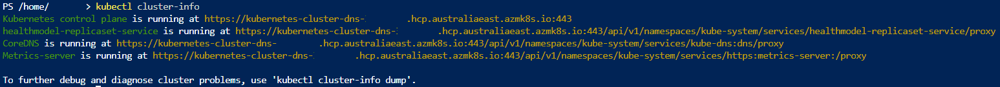

   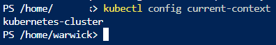

1. Confirm you have Azure Data Studio downloaded and installed.
1. Open ADS and select **Extensions**.

   

1. Search for **Azure CLI** and install the Azure CLI Extension.

   

1. Search for **Azure Arc** and install the Azure Arc Extension.

   

1. After you install both extensions, close and restart ADS.
1. Once ADS restarts, navigate to the **Linked Accounts** section and select **Add an account** (the **+** icon in the top-right corner).

   

1. Sign in to your Azure subscription. You've successfully added a Linked Account to your Azure subscription. Select **Close**.

   

1. Open the terminal window (**View** > **Terminal**) and use this command to download your Arc-enabled Kubernetes Cluster config file to your workstation:

    ```PowerShell
    az aks get-credentials --resource-group <resourcegroupname> `
        --name <Arc-enabled Kubernetes Cluster Name> `
        --file <download location>
    ```

   

1. Expand the **ADS Connections** tab, then expand the **Azure Arc Controllers** drop-down.

   

1. Select **Create new Azure Arc Controller** (the **+** icon), ensuring **Azure Arc data controller** is selected. Select **Select**.

   

1. Confirm the deployment prerequisites are in place. Select **Next**.

   

1. With your downloaded Arc-enabled Kubernetes Cluster config file in the default location, confirm your Arc-enabled Kubernetes Cluster is selected.

    Ensure the chosen connectivity mode is **Indirect**. Select **Next**.

    

1. For the Kubernetes configuration template, choose the appropriate storage class. For this exercise, use an AKS cluster for this exercise, so we specify azure-arc-aks-premium-storage. Select **Next**.

    

1. You connected to your subscription in step 7. Confirm the Azure account is correct, and the subscription is connected to the right subscription. Choose the resource group you previously configured in the prerequisites section at the top of this section. Choose the location to which you're deploying your Arc data controller. Select **Next**.

    

1. To create the Arc data controller, provide the following information:

    - **Data Controller Namespace**: Your data controller namespace
    - **Storage Class**: dependent on your config profile selection previously
    - **Infrastructure**: dependent on the location of your Kubernetes Cluster
    - **Custom Location**: Only required for directly connected mode
    - **Auto-upload Metrics**: Only required for directly connected mode
    - **Auto-upload Logs**: Only required for directly connected mode
    - **Log Analytics workspace ID**: Only required for directly connected mode
    - **Log Analytics primary key**: Only required for directly connected mode
    - **Metrics and Logs Dashboard Credentials**: Kibana and Grafana

    

1. Once you review the configuration details, you're ready to deploy. Select **Deploy**.

    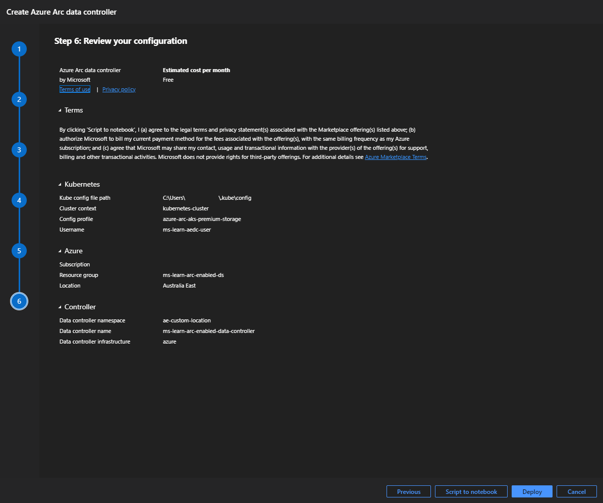

    This opens a notebook called *deploy.arc.data.controller*, which automatically starts executing each of the created cells. As this is an indirect mode deployment, you don't need to log in to your Azure subscription.

1. To monitor the deployment status in the terminal window in ADS, you can execute the following commands:

    ```PowerShell
    kubectl get datacontroller --namespace 'enter your namespace here'
    ````

    This command works through the following three states during the deployment:

    

    The following command shows all the deployed services and the status of those services in the data controller namespace:

    ```PowerShell
    kubectl get pods --namespace 'enter your namespace here'
    ```

    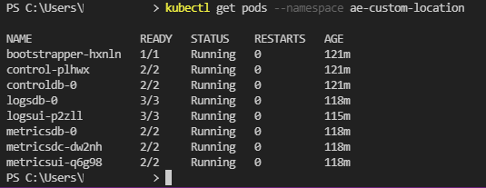

Once the deployment completes, select **Connect Controller** in the **Connections** tab. Enter the namespace for the data controller you just created and select **Connect**.


You can manage your Arc data controller by right-clicking the data controller and selecting **Manage**.


## Option 2: Azure Data Studio terminal deployment

In this exercise option, you create the data controller onto your Kubernetes cluster located either on-premises or in the public cloud via the CLI from Azure Data Studio. Ensure you have completed the prerequisites at the start of this exercise.

You can check to see that you have a current Kubernetes connection and confirm your current context with the following commands:

```PowerShell
 kubectl cluster-info
kubectl config current-context
```

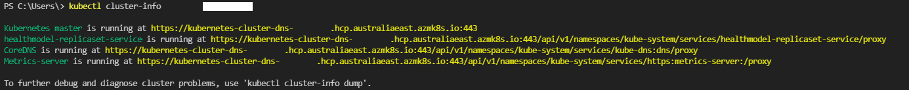

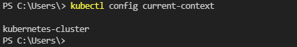

1. Open the Terminal in ADS (**View** > **Terminal**).
1. Set your parameters for this deployment:

    ```PowerShell
    $Env:MySuscriptionID= 'enter your subscription ID here'
    $Env:MyResourceGroup= 'enter resource group name here'
    $Env:Mylocation= 'enter resource location here'
    $Env:MyNamespace= 'enter data controller name space here'
    $Env:MyDataController= 'enter your data controller name here'
    $Env:MyConnectMode = 'Indirect'
    $Env:MyProfile = 'azure-arc-aks-premium-storage'  (Choose your storage profile)
    $Env:MyStorageClass = 'managed-premium' (Choose your storage class)
    $Env:arc_infrastructure = 'azure'
    $ENV:AZDATA_LOGSUI_USERNAME= 'enter Kibana dashboard username here'
    $ENV:AZDATA_LOGSUI_PASSWORD= 'enter Kibana dashboard password here'
    $ENV:AZDATA_METRICSUI_USERNAME= 'enter Grafana dashboard username here'
    $ENV:AZDATA_METRICSUI_PASSWORD= 'enter Grafana dashboard password here'
    ```

1. Download the Kubernetes cluster `kube` config file:

    ```PowerShell
    az account set --subscription $Env:MySuscriptionID`
    az aks get-credentials --resource-group $Env:MyResourceGroup `
        --name $Env:MyCluster
    ```

1. Create the Arc data controller:

    ```PowerShell
    az arcdata dc create --name $Env:MyDataController `
        --k8s-namespace $Env:MyNamespace `
        --use-k8s `
        --subscription $Env:MySuscriptionID `
        --resource-group $Env:MyResourceGroup `
        --location $Env:Mylocation `
        --connectivity-mode $Env:MyConnectMode `
        --profile-name $Env:MyProfile `
        --storage-class $Env:MyStorageClass `
        --infrastructure $Env:arc_infrastructure `
        --cluster-name $Env:MyCluster
    ```

1. Use this command to monitor your Arc data controller deployment:

    ```PowerShell
    kubectl get datacontrollers --namespace $Env:MyNamespace
    ```

   The deployment goes through three states before it's finished:

   

1. Confirm all resources have been deployed into your data controller namespace:

    ```PowerShell
    kubectl get pods -n $Env:MyNamespace
    ```

   

1. Select **Connect Controller** in the **Connections** tab once the deployment has successfully completed. Enter the namespace for the data controller you just created and select **Connect**.

   

After the deployment completes, you can manage your Arc data controller. Right-click the data controller and select **Manage**.


