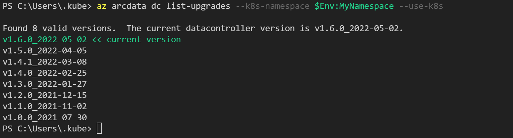

Az arcdata is a suite of CLI commands available for us to use to create, delete and manage your Arc-enabled resources either via the Azure portal Cloud Shell or Azure Data Studio terminal. In unit 5: Exercise - Deploy an Azure Arc data controller, we used some az arcdata CLI commands, allowing us to ensure our Arc-enabled environment was ready for us to use.

In this exercise, we will look at a few additional commands that have been covered in the previous unit.

- Prior to running any of these commands ensure you have the latest `kube` config file on your system. You can download the latest version with the following commands:

    ```PowerShell
    $Env:MyResourceGroup="<enter resource group name here>"
    $Env:MyCluster="<enter your kubernetes cluster name here>"
    az aks get-credentials --resource-group $Env:MyResourceGroup --name $Env:MyCluster
    ````

## Data controller status

- When deploying or managing your Arc data controller, you can easily see the status of the Arc data controller in a particular namespace either through the Azure portal, or with the following commands:

    ```PowerShell
    $Env:MyNamespace="<enter data controller namespace here>"
    az arcdata dc status show --k8s-namespace $Env:MyNamespace --use-k8s
    ```

- The results of this command should show a state of Ready.

    ```PowerShell
    $Env:MyResourceGroup="<enter resource group name here>"
    az arcdata dc status show --resource-group $Env:MyResourceGroup
    ```

This command's results will return a JSON file outlining the configuration details of your deployed Arc data controller.

## Data controller available upgrades

- This command connects to your registered image registry based on the location of your Arc-enabled Kubernetes cluster and checks plus displays any images that are available for an upgrade:

    ```PowerShell
    az arcdata dc list-upgrades --k8s-namespace $Env:MyNamespace --use-k8s
    ```

    

- If you have a new version available, you can upgrade with the following command:

    ```PowerShell
    $Env:DCVersion = 'enter desired version here'
    $Env:MyDataController = 'enter data controller name here'
    az arcdata dc upgrade --k8s-namespace $Env:MyNamespace `
        --use-k8s `
        --desired-version $Env:DCVersion
    ```

If the desired version is not specified, the command uses the latest version.

## Data controller update configurations

This command allows you to change the configurations around whether to auto-upload logs and metrics and to configure maintenance window configurations.

- The auto-upload of metrics and logs is only available in a directly connected mode.

    ```PowerShell
    az arcdata dc update --auto-upload-logs true `
        --auto-upload-metrics true `
        --name $Env:MyDataController `
        --resource-group $Env:MyResourceGroup `
        --maintenance-enabled false`
    ```

## Data controller endpoint listing

- This command returns a JSON output, enabling you to see the configured endpoints for your Arc data controller. This will provide the details by default for the Log Search Dashboard and Metrics Dashboard.

    ```PowerShell
    az arcdata dc endpoint list --k8s-namespace $Env:MyNamespace --use-k8s
    ```

## Data controller copy debug logs

- This command allows you to copy the debug logs from the Arc data controller for analysis. These logs will be copied to your local profile from which you are running the command. In your `.kube` folder, a logs folder will have the debug logs compressed and saved for your review.

    ```PowerShell
    az arcdata dc debug copy-logs --k8s-namespace $Env:MyNamespace
    ```
