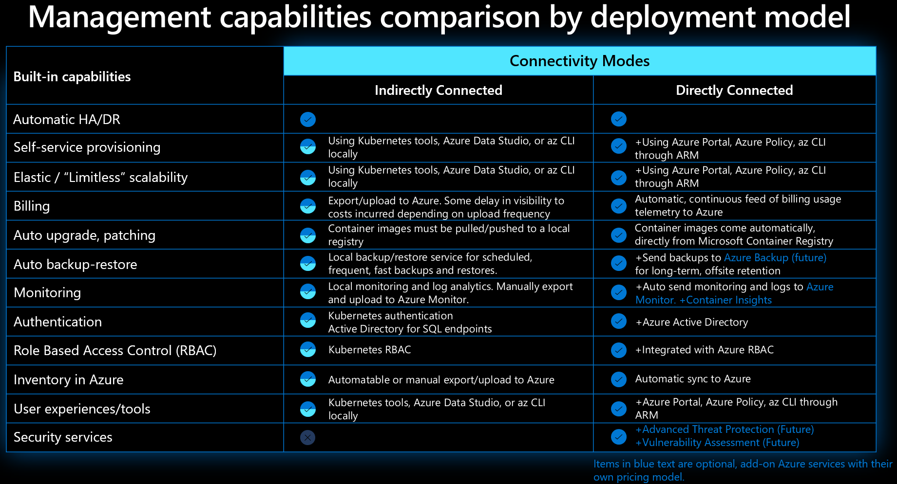

A wide range of existing Azure customers, similar to your company, follow the hybrid operational model, with some workloads residing in on-premises datacenters due to a variety of requirements, including compliance and regulatory constraints or latency considerations. Others might opt to follow the multicloud approach and rely on, besides Microsoft, other, third-party cloud providers. In each of these scenarios, there is typically an incentive to minimize the administrative overhead by developing a unified management strategy across all cloud-based and on-premises environments. To optimize the benefits of the operational model, the management strategy should leverage the advantages commonly associated with cloud computing, including automated deployment, configuration and updates, DevOps integration, elasticity and scaling, centralized monitoring and diagnostics, in addition to increased resiliency. 

To achieve these objectives, you can use Azure Arc-enabled data services to deploy, manage, and run Azure data services on premises, at the edge, or in any public cloud. These services leverage the strengths of Kubernetes-based clustering hosted on the infrastructure of your choice. While using Azure Arc-enables data services provides additional flexibility, it also requires more foresight and preparation because some of the Microsoft responsibilities associated with the Azure PaaS model become yours to fulfill. 

The most significant disparity between Azure Arc-enabled data services deployments and Azure SQL offerings results from the differences in the ownership and management of the underlying infrastructure, which means that:  

- **Elasticity and scalability** are limited by the capabilities of the infrastructure provisioned to host Azure Arc-enabled data services in your environment.
- **Automatic high availability (HA) and disaster recovery (DR)** are your responsibilities due to their dependencies on the resiliency of the underlying hardware and the Kubernetes cluster that you provision and manage. 
- **Compliance certifications** must be validated and obtained by your compliance and legal teams.

The following diagram summazrizes a high-level overview of differences between the traditional on-premises deployments, Azure Arc-enabled data services, and PaaS cloud services.

Before you proceed with deploying Azure Arc-enabled data services, you must evaluate and prepare your existing environment. This involves identifying the supported Kubernetes solutions, choosing the suitable data service and connectivity mode, selecting the Azure region to host the service metadata, and sizing your infrastructure. You also need to choose your deployment methodology.

## Identify the supported Kubernetes solutions

To determine whether your existing or planned Kubernetes deployment supports Azure Arc-enabled data services, refer to [the validated list of Kubernetes services and distributions](/azure/azure-arc/data/plan-azure-arc-data-services#deployment-requirements), which includes:
- Amazon Elastic Kubernetes Service (Amazon EKS)
- Azure Kubernetes Service (AKS)
- Azure Kubernetes Service on Azure Stack HCI
- Azure Red Hat OpenShift
- Google Kubernetes Engine (GKE)
- Open source, upstream Kubernetes (typically deployed by using kubeadm)
- OpenShift Container Platform (OCP)
- K3s
- [Additional partner-validated Kubernetes distributions](/azure/azure-arc/data/validation-program)

## Select an Azure Arc-enabled data service, a connectivity mode, and the Azure region

Azure Arc-enabled data services offer the option to deploy an SQL Managed Instance and Azure Arc-enabled PostgreSQL. In migration scenarios, your choice is driven primarily by the existing on-premises database technology. Considering the use of SQL Server in the overseas datacenters and for hosting the US government contract-related data, selecting SQL Managed Instance is a straightforward decision to make. 

Azure Arc-enabled data services support two connectivity modes:

- directly connected
- indirectly connected

The indirectly connected option accommodates scenarios in which a data service must be isolated from Azure, which, in your case, is applicable to the US government contract-related data. While you do need to upload usage data to Azure for billing purposes, you can do so from any internet-connected device. However, you should note that the indirectly connected mode limits Azure Arc-enabled data services functionality. Effectively, choosing the connectivity mode is one of the most essential decisions to make. The following diagram outlines the differences in the management capabilities available in each connectivity mode. 

In your case, choosing the directly connected mode for databases hosted in oversees datacenters will allow you to fully benefit from Azure Arc-enabled data services without violating data residency requirements. However, you should keep in mind that the steady cadence of updates, multi-layer security, elastic scale, and simplified DevOps are available in both modes.

The location of your on-premises datacenters will also serve as the selection criterion of the Azure region to host the service metadata. To identify the regions that currently support Azure Arc-enabled data services, refer to [Azure Products by Region - Azure Arc](https://azure.microsoft.com/global-infrastructure/services/?cdn=disable&products=azure-arc).

## Size your on-premises infrastructure

As you prepare for deployment of Azure Arc-enabled data services, you should ensure that your infrastructure that will host the target Kubernetes cluster has the sufficient amount and type of compute and storage resources. The amount of compute resources must account for the processor and memory requirements of the Azure Arc data controller in addition to all of the data services instances and their databases. Because the data controller and data services instances are implemented as pods running on a Kubernetes cluster, you have the flexibility of adjusting the required capacity over time by scaling cluster nodes and individual pods. 

The data controller is a collection of pods deployed to your Kubernetes cluster to provide the core management capabilities of the Azure Arc-enabled data services infrastructure. Its primary role is to link the data services running on your Kubernetes cluster to your Azure subscription. This allows you to deploy, manage, secure, and monitor your Azure Arc-enabled data services using the same set of tools available for managing Azure managed data services. Consider the size of the data controller to be the baseline for your Azure Arc-enabled data services environment. By default, the data controller requires four cores and 16 GB of RAM. Use this as the starting point for calculating the total amount of resources, and then add cores and memory required for the pods hosting database instances. For a General Purpose SQL managed instance, the number of pods is equal to the number of instances you created. 

The sizing of SQL Managed Instance pods depends to some extent on whether you choose to deploy the General Purpose or Business Critical service tier. The General Purpose service tier of Azure SQL managed instance uses the single pod pattern while the highly available Business Critical service tier of Azure SQL Managed Instance follows the multiple pod pattern. Your sizing calculations should also take into account resource requirements of system pods and at least 25% extra capacity to accommodate elastic scaling, rolling upgrades of Kubernetes nodes, and potential node failures. However, the overall size of an environment required for Azure Arc-enabled data services is primarily a function of the number and size of the database instances that you will create. 

From the storage perspective, allocate a separate persistent volume for data, log, and backup files to each database instance. This provides a separation of the I/O for each of these types of files as long as the underlying infrastructure implements this separation on the physical level. At the deployment time, you also need to assign the intended storage classes for these persistent volumes because changing them afterwards is not supported. If there are multiple databases on a given database instance, all of the databases will use the same persistent volume claim, persistent volume, and storage class. 

Classes belong to one of two categories:

- Local storage provisioned on local hard drives on a given node. This storage type offers better performance but you need to replicate its content across multiple nodes to provide data redundancy.
- Remote, shared storage provisioned on a remote storage device. This storage type can automatically provide data redundancy, but tends to be less performant than local storage.

In general, you should use a remote, shared storage class to ensure data durability of data services databases and logs. This also applies to storage for Azure Arc data controller because some of its components don't support data replication. 

Your backup class storage needs to be ReadWriteMany (RWX) capable to allow for the automated database backups. This is required in order to successfully deploy Azure Arc-capable SQL Managed Instance.

Data writes for metrics and logs monitoring are typically low volume and not sensitive to latency, so ultra-fast performance storage is not required. The resulting storage usage is proportional to the number of data services instances, but data is retained only temporarily for a period of two weeks before being purged. 

## Choose the deployment methodology

The choice of the deployment methodology is dependent to some extent on the intended connectivity mode. The simplest approach when operating in the direct connectivity mode is to use the Azure portal. Alternatively, you can automate the deployment by using an Azure Resource Manager or a Bicep template. Other methods, available also in the indirect mode, rely on Azure command-line interface (Azure CLI), Azure Data Studio, or Kubernetes tools.

## Review the functionality with Azure Arc Jumpstart

If you want to quickly set up Azure Arc-enabled data services to become familiar with its functionality, you should consider using [Azure Arc Jumpstart](https://azurearcjumpstart.io/azure_arc_jumpstart/azure_arc_data/). This provides a starting point for learning and understanding the various deployment options available on multiple infrastructure platforms.

You can implement Azure Arc Jumpstart on AKS, EKS, GKE or in an Azure virtual machine (VM). You can also deploy Jumpstart ArcBox for DataOps, which facilitates exploring the capabilities of Azure Arc-enabled SQL Managed Instance, with all required resources confined to a single resource group in an Azure subscription of your choice.
