To deploy your Azure Arc-enabled SQL Managed Instance, you have several options available:

* GUI deployment:
  * Azure portal
  * Azure Data Studio
* CLI deployment
  * Azure portal Cloud Shell
  * Azure Data Studio terminal window

Choose which option you wish to walk through. All exercise options below provide you with the same outcome. All scenarios in the below exercises utilize the General Purpose Tier (Standard Edition). The Business Critical Tier (Enterprise Edition) allows you to choose the number of replicas you require to meet your High Availability needs.

For all exercise options below, the Kubernetes cluster used is an AKS cluster. All options for storage classes used are associated with and supported on an AKS cluster. The Kubernetes cluster implemented in your environment dictates the types of provisioned and presented storage classes.  You will need to know your storage classes. The value `Default` used for the storage classes below means "use the storage class configured at the AKS cluster level". In this case premium storage.

## Option 1: Azure portal GUI deployment

This option is only available with environments configured in the directly connected mode.

1. In the Azure portal, select **+ Create resource**.
2. Search for *SQL Managed Instance - Azure Arc*.
3. Select **Create**.

    

4. Choose the resource group in which you created your Arc data controller.
5. Enter a name for your new Arc-enabled SQL Managed Instance.
6. Choose the custom location associated with your Arc-enabled Kubernetes cluster.
7. Choose the service type that is associated with your Arc-enabled Kubernetes cluster.

    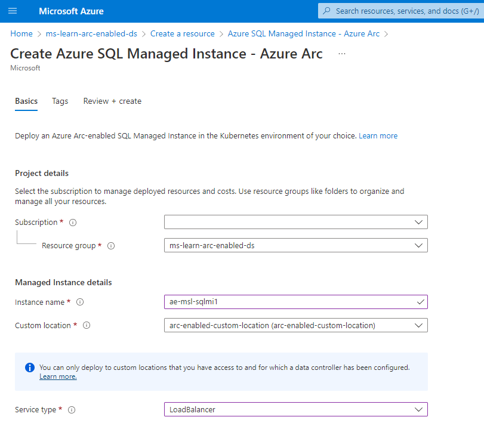

8. Click **Configure compute + storage**.
9. Choose your service tier.
10. Set the memory request in gigabytes.
11. Set the memory limit in gigabytes.
12. Set the CPU vCore request.
13. Set the CPU vCore limit.

    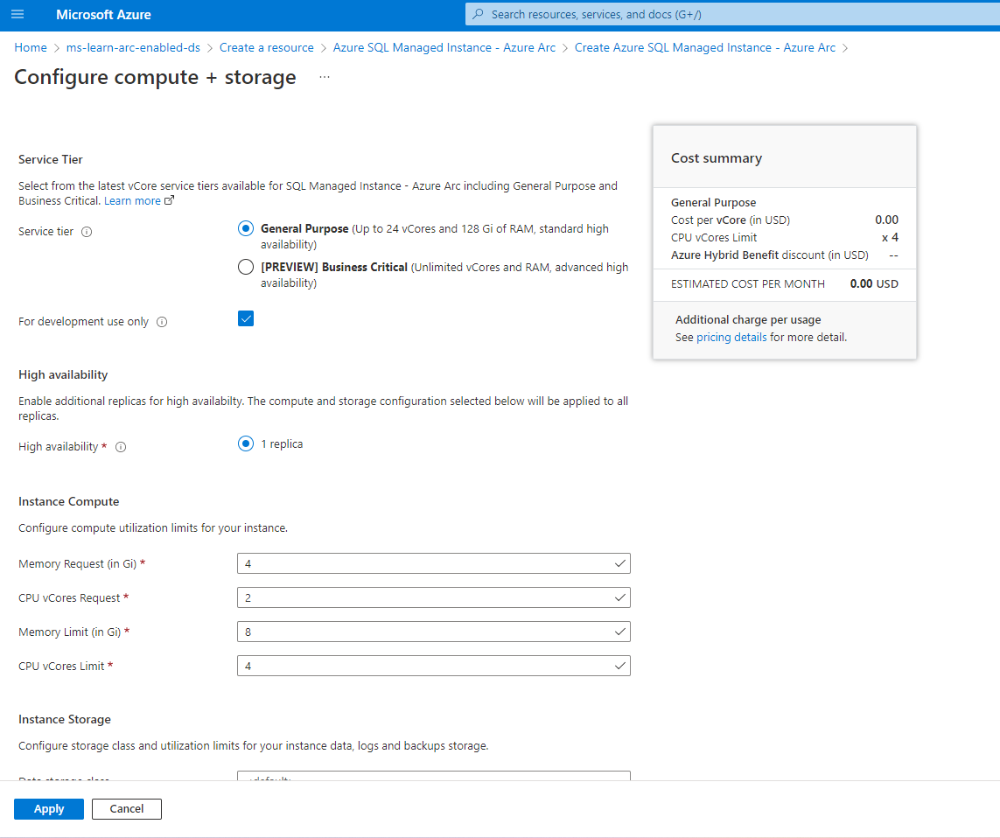

14. Enter *Default* for the data storage class. 
15. Set the data volume size in gigabytes.
16. Enter *Default* for the datalogs storage class.
17. Set the datalogs (transaction log files) volume size in gigabytes.
18. Enter *Default* for the logs storage class.
19. Set the logs volume size in gigabytes.
20. Your backup storage class needs to be ReadWriteMany (RWX) capable.
21. Set the backup volume size in gigabytes.
22. Select **I already have a SQL Server License** if you have [Azure Hybrid Benefits](/azure/azure-sql/azure-hybrid-benefit?view=azuresql&preserve-view=true&tabs=azure-portal).
23. Click **Apply**.

    

24. Set the admin username for the Arc-enabled SQL Managed Instance.
25. Set the admin user password for the Arc-enabled SQL Managed Instance. 

    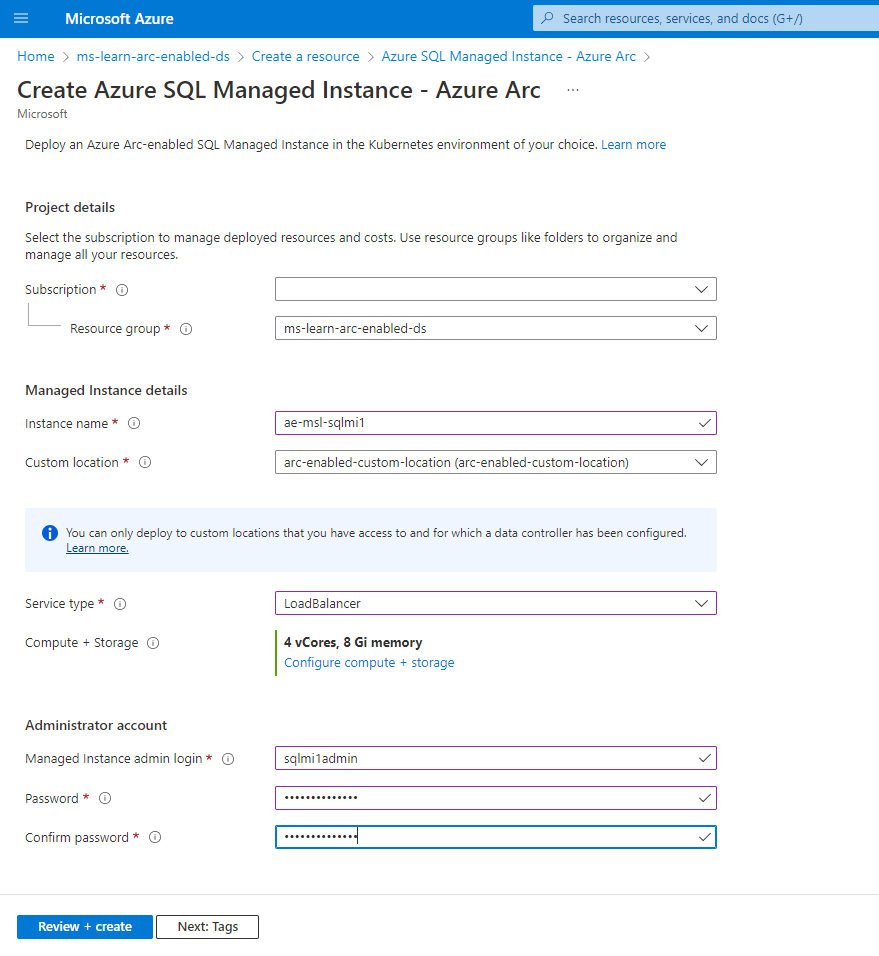 

26. Select **Next: Tags**.

    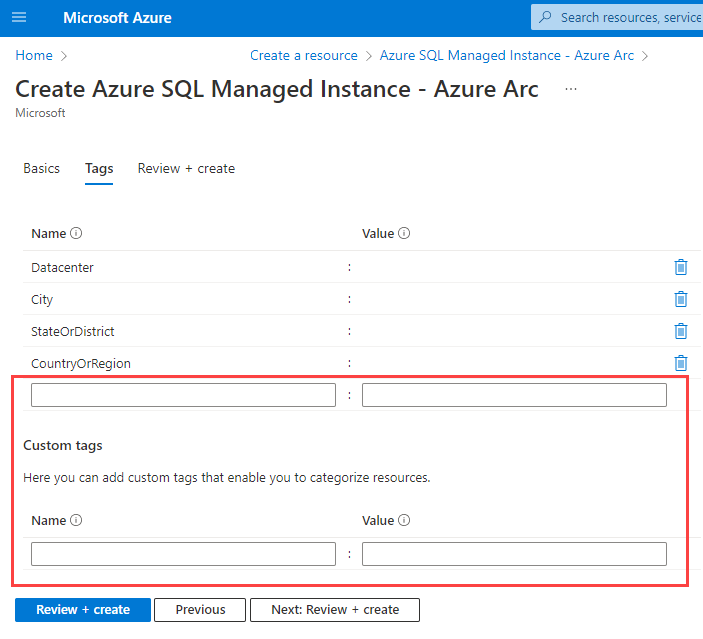 

27. Add your appropriate tags.
28. Select Next: Review + Create

29. Review your configurations and select Create.

      

30. Confirm your Arc-enabled Azure SQL Managed Instance deployment.

    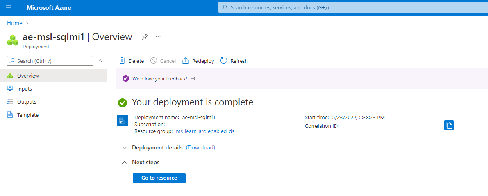

    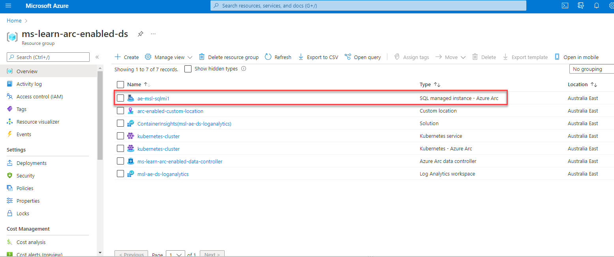

    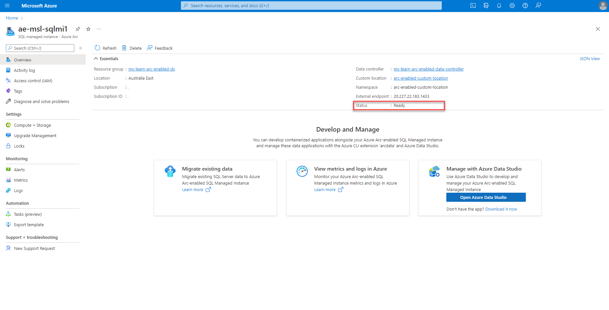

31. In Azure Data Studio, expand the Connection tab. Right-click on your Arc data controller and click refresh. Right-click on your Arc data controller and click manage. You can now manage your Arc-enabled SQL Managed Instance from Azure Data Studio.

       

## Option 2: Azure Data Studio GUI deployment

This option is available with environments configured in either the directly or indirectly connected mode.

1. In Azure Data Studio, Right-click on your Arc data controller and select Manage.
2. Select New Instance.
3. Select Azure SQL Managed Instance.

    

4. Review and accept the EULA.

    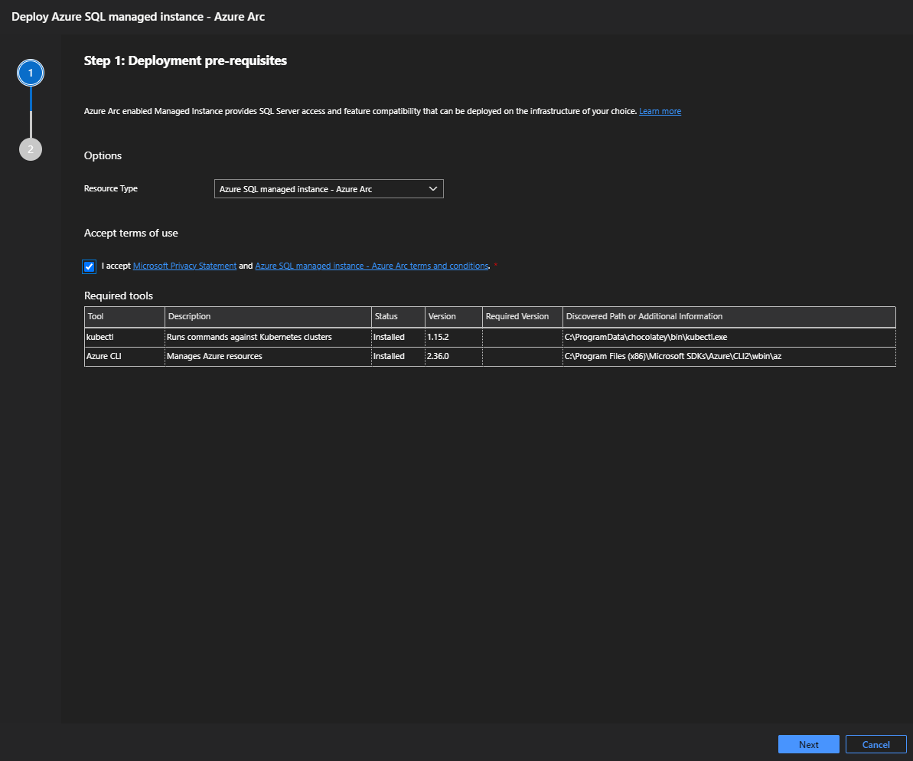

5. Enter a name for your new Arc-enabled SQL Managed Instance.
6. Set the Admin username for the Arc-enabled SQL Managed Instance.
7. Set the Admin user password for the Arc-enabled SQL Managed Instance.
8. Choose your Service tier.
9. Select 'I already have a SQL Server License' if you have [Azure Hybrid Benefits](/azure/azure-sql/azure-hybrid-benefit?view=azuresql&preserve-view=true&tabs=azure-portal).

    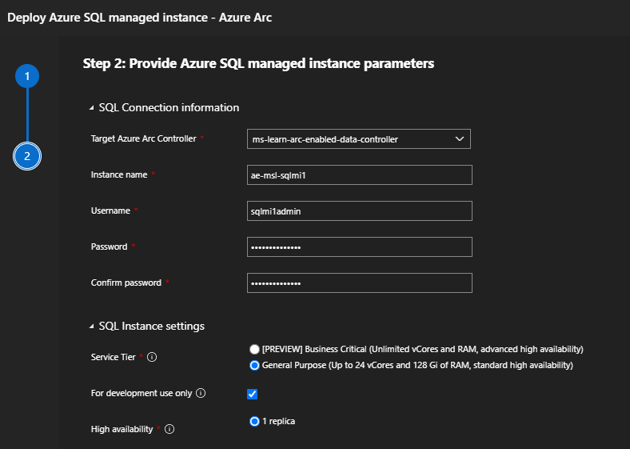

10. Select  *Default* for the data storage class. 
11. Set the data volume size in gigabytes.
12. Select  *Default* for the datalogs storage class.
13. Set the datalogs (transaction log files) volume size in gigabytes.
14. Select  *Default* for the logs storage class.
15. Set the logs volume size in gigabytes.
16. Your backup storage class needs to be ReadWriteMany (RWX) capable.
17. Set the backup volume size in gigabytes.
18. Set the CPU vCore request.
19. Set the CPU vCore limit.
20. Set the memory request in gigabytes.
21. Set the memory limit in gigabytes.
22. Click **Deploy**.

   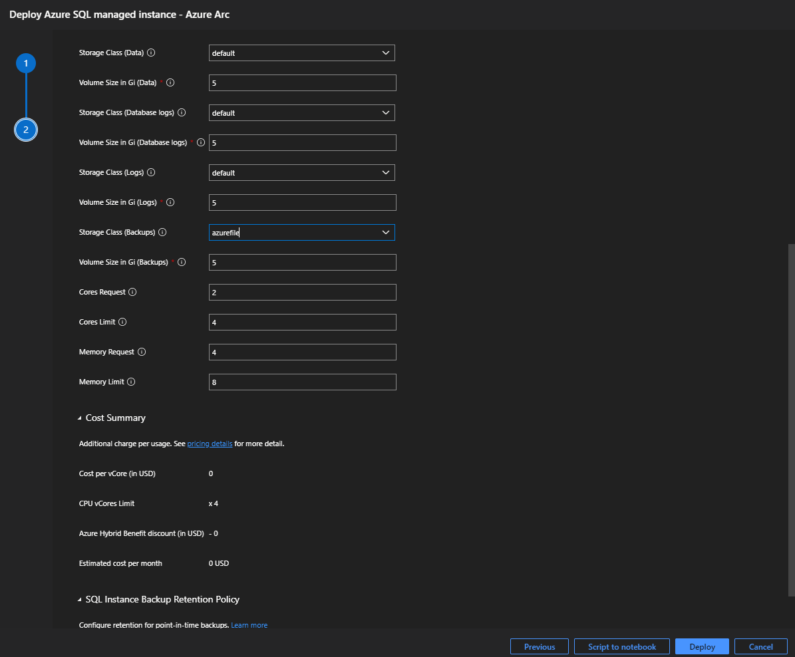

  The deployment opens up a notebook called deploy.sql.existing.arc, which will automatically start executing each of the cells. Once the deployment has completed, refresh the Arc data controller dashboard window.

23. Confirm your Arc-enabled Azure SQL Managed Instance deployment.

   

   

24. In Azure Data Studio, expand the Connection tab. Right-click on your Arc data controller and click refresh. Right-click on your Arc data controller and click manage. You can now manage your Arc-enabled SQL Managed Instance from Azure Data Studio.

 

## Option 3: Azure portal Cloud Shell deployment

This option is only available with environments configured in the directly connected mode.

1. In the Azure portal open Cloud Shell.
2. Prepare your Arc-enabled SQL Managed Instance creation parameters:

    ```PowerShell
    $Env:MyResourceGroup = 'enter your resource group name here'
    $Env:MyCluster = 'enter your kubernetes cluster name here'
    $Env:Mylocation = 'enter your location here'
    $Env:MyCustomlocation = 'enter your custom location name here'
    $Env:ServiceTier = 'enter General Purpose or Business Critical here>'
    $Env:DevUse = 'true'  ## only if the evironment is not production
    $Env:Replicas = '1'   ## Values (1,2,3) based on the tier level chosen
    $Env:SQLLicenseType = 'enter BasePrice or LicenseIncluded'  ##based on you having Azure Hybrid Benefits
    $Env:sql-managed-instanceName = 'enter your arc-enabled sql managed instance name here>'
    $Env:sql-managed-instanceAdminUser = 'enter your sql mi admin account name here>'
    $Env:DataStorageClass = 'default'
    $Env:DataLogsStorageClass = 'default'
    $Env:LogsStorageClass = 'default'
    $ENV:BackupsStorageClass = 'azurefile' ## requires to be RWX capable`
    $Env:BackupRetentionDays = ''
    $Env:DataVolumeSize = '5Gi' ## Adjust your volume size appropriately in gigabytes
    $Env:DatalogsVolumeSize = '5Gi' ## Adjust your volume size appropriately in gigabytes
    $Env:LogsVolumeSize = '5Gi' ## Adjust your volume size appropriately in gigabytes
    $Env:BackupsVolumeSize = '5Gi' ## Adjust your volume size appropriately in gigabytes
    $Env:CoresRequest = '2' ## Set the number of cores to start with
    $Env:CoresLimit = '4' ## Set the maximum number of cores
    $Env:MemoryRequest = '4Gi' ## Set your memory limit appropriately in gigabytes
    $Env:MemoryLimit = '8Gi' ## Set your maximum memory limit appropriately in gigabytes
    ```

     

3. Execute the following `az sql mi-arc create` command:

    ```PowerShell
    az sql mi-arc create --name $Env:sql-managed-instanceName `
        --resource-group $Env:MyResourceGroup `
        --location $Env:Mylocation `
        --custom-location $Env:MyCustomlocation `
        --replicas $Env:Replicas `
        --cores-request $Env:CoresRequest `
        --cores-limit $Env:CoresLimit `
        --memory-request $Env:MemoryRequest `
        --memory-limit $Env:MemoryLimit `
        --storage-class-data $Env:DataStorageClass `
        --storage-class-datalogs $Env:DataLogsStorageClass `
        --storage-class-logs $Env:LogsStorageClass `
        --storage-class-backups $ENV:BackupsStorageClass `
        --volume-size-data $Env:DataVolumeSize `
        --volume-size-datalogs $Env:DatalogsVolumeSize `
        --volume-size-logs $Env:LogsVolumeSize `
        --volume-size-backups $Env:BackupsVolumeSize `
        --tier $Env:ServiceTier `
        --dev `
        --license-type $Env:SQLLicenseType `
        --cores-limit $Env:CoresLimit
    ```

4. Enter your Arc-enabled SQL Managed Instance admin account and password when prompted.
5. Confirm your Arc-enabled SQL Managed Instance deployment.

    

    

6. In Azure Data Studio, expand the Connection tab. Right-click on your Arc data controller and click refresh. Right-click on your Arc data controller and click manage. You can now manage your Arc-enabled SQL Managed Instance from Azure Data Studio.

## Option 4: Azure Data Studio terminal deployment

This option is available with environments configured in either the directly or indirectly connected mode.

1. In the Azure portal open Cloud Shell.
2. Prepare your Arc-enabled SQL Managed Instance creation parameters:

    ```PowerShell
    $Env:MyResourceGroup = 'enter your resource group name here'
    $Env:MyCluster = 'enter your kubernetes cluster name here'
    $Env:Mylocation = 'enter your location here'
    $Env:MyCustomlocation = 'enter your custom location name here'
    $Env:ServiceTier = 'enter General Purpose or Business Critical here>'
    $Env:DevUse = 'true'  ## only if the evironment is not production
    $Env:Replicas = '1'   ## Values (1,2,3) based on the tier level chosen
    $Env:SQLLicenseType = 'enter BasePrice or LicenseIncluded'  ##based on you having Azure Hybrid Benefits
    $Env:sql-managed-instanceName = 'enter your arc-enabled sql managed instance name here>'
    $Env:sql-managed-instanceAdminUser = 'enter your sql mi admin account name here>'
    $Env:DataStorageClass = 'default'
    $Env:DataLogsStorageClass = 'default'
    $Env:LogsStorageClass = 'default'
    $ENV:BackupsStorageClass = 'azurefile' ## requires to be RWX capable`
    $Env:BackupRetentionDays = ''
    $Env:DataVolumeSize = '5Gi' ## Adjust your volume size appropriately in gigabytes
    $Env:DatalogsVolumeSize = '5Gi' ## Adjust your volume size appropriately in gigabytes
    $Env:LogsVolumeSize = '5Gi' ## Adjust your volume size appropriately in gigabytes
    $Env:BackupsVolumeSize = '5Gi' ## Adjust your volume size appropriately in gigabytes
    $Env:CoresRequest = '2' ## Set the number of cores to start with
    $Env:CoresLimit = '4' ## Set the maximum number of cores
    $Env:MemoryRequest = '4Gi' ## Set your memory limit appropriately in gigabytes
    $Env:MemoryLimit = '8Gi' ## Set your maximum memory limit appropriately in gigabytes
    ```

    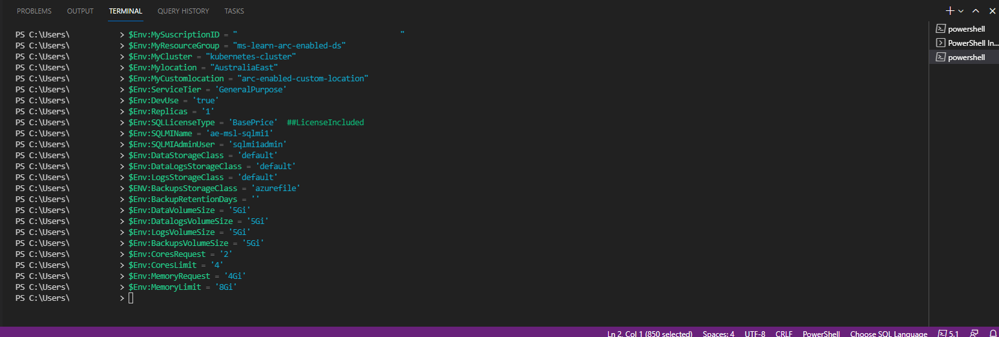 

3. Execute the following `az sql mi-arc create` command:

    ```PowerShell
    az sql mi-arc create --name $Env:sql-managed-instanceName `
        --resource-group $Env:MyResourceGroup `
        --location $Env:Mylocation `
        --custom-location $Env:MyCustomlocation `
        --replicas $Env:Replicas `
        --cores-request $Env:CoresRequest `
        --cores-limit $Env:CoresLimit `
        --memory-request $Env:MemoryRequest `
        --memory-limit $Env:MemoryLimit `
        --storage-class-data $Env:DataStorageClass `
        --storage-class-datalogs $Env:DataLogsStorageClass `
        --storage-class-logs $Env:LogsStorageClass `
        --storage-class-backups $ENV:BackupsStorageClass `
        --volume-size-data $Env:DataVolumeSize `
        --volume-size-datalogs $Env:DatalogsVolumeSize `
        --volume-size-logs $Env:LogsVolumeSize `
        --volume-size-backups $Env:BackupsVolumeSize `
        --tier $Env:ServiceTier `
        --dev `
        --license-type $Env:SQLLicenseType `
        --cores-limit $Env:CoresLimit
    ```

4. Enter your Arc-enabled SQL Managed Instance admin account and password when prompted.
5. Confirm your Arc-enabled SQL Managed Instance deployment.

    

    

6. In Azure Data Studio, expand the Connection tab. Right-click on your Arc data controller and click refresh. Right-click on your Arc data controller and click manage. You can now manage your Arc-enabled SQL Managed Instance from Azure Data Studio.
