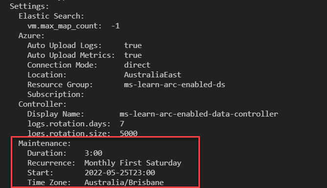
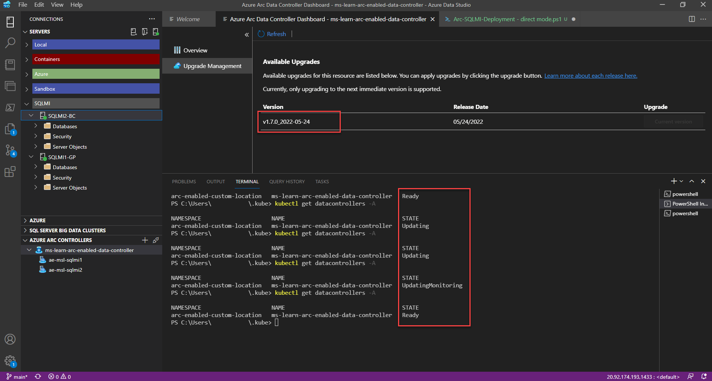
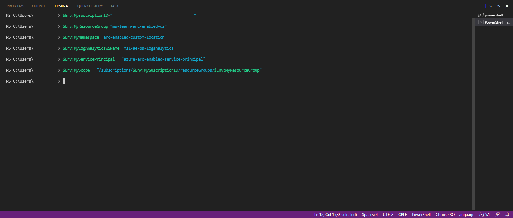

## Exercise 1: Scale up/down your SQL Managed Instance resources

The number of resources required for your operational Arc-enabled SQL Managed Instance will be dependent on the tier chosen and the number of available resources available on your Kubernetes cluster. To scale up or down the resources (CPU/memory), we can use Azure Data Studio or [`az sql mi-arc update`](/cli/azure/sql/mi-arc?view=azure-cli-latest&preserve-view=true#az-sql-managed-instance-arc-update) commands for our directly connected or indirectly connected mode Arc-enabled SQL Managed Instance environments. We can use the Azure portal, Azure Data Studio, or the `az sql mi-arc update` command in directly connected mode.

## Option 1 - Azure Data Studio GUI deployment

This option is available with environments configured in either the directly connected or indirectly connected modes.

1. In Azure Data Studio, expand your Arc data controller to display your Arc-enabled SQL Managed Instance environments.
2. Right-click on your Arc-enabled SQL Managed Instance and select **Manage**.
3. Select **Compute + Storage**.

    

4. Increase your CPU request value from 2 to 4
5. Click **Save**.

    

## Option 2 - Azure Data Studio CLI deployment

This option is available with environments configured in either the directly connected or indirect connected modes.

1. In the Azure Data Studio terminal window configure your resource limit parameters:

    ```PowerShell
    $Env:MyNamespace= 'enter your arc-enabled namespace here'
    $Env:sql-managed-instanceName= 'enter your arc-enabled sql managed instance name here'
    $Env:CoresRequest = '4' ## Adjust your core requirements
    $Env:CoresLimit = '4' ## Maximum number of cores
    $Env:MemoryRequest = '4Gi' ## Adjust your volume size appropriately in Gigabytes
    $Env:MemoryLimit = '8Gi' ## Adjust your volume size appropriately in Gigabytes
    ```

2. Execute the following `az sql mi-arc` update command:

    ```PowerShell
    az sql mi-arc update --cores-limit $Env:CoresLimit `
       --cores-request $Env:CoresRequest `
       --memory-limit  $Env:MemoryLimit `
       --memory-request $Env:MemoryRequest `
       -n $Env:sql-managed-instanceName `
       --k8s-namespace $Env:MyNamespace `
       --use-k8s
    ```

    

3. Execute the following command and search for the results as shown below:

    ```PowerShell
    az sql mi-arc show -n $Env:sql-managed-instanceName --k8s-namespace $Env:MyNamespace --use-k8s
    ```

    

## Exercise 2: Enable SQL Agent

The SQL Agent allows you to create and schedule jobs that can run periodically against one or many databases to perform various actions, including maintenance tasks. The SQL Agent isn't enabled on your Arc-enabled SQL Managed Instance by default. 

To enable SQL Agent on your Arc-enabled SQL Managed Instance, follow these steps:

1. In either the Azure portal Cloud Shell or Azure Data Studio terminal, prepare your CLI parameters:

    ```PowerShell
    $Env:sql-managed-instanceName = 'enter your arc-enabled sql managed instance name here'
    $Env:MyNameSpace = 'enter your namespace where your SQL Managed Instance is deployed here'
    $Env:MyResourceGroup = 'enter your resource group name here'
    ```

2. Execute the following command to view the current configuration: 

    ```PowerShell
    az sql mi-arc show --name $Env:sql-managed-instanceName --resource-group $Env:MyResourceGroup
    ```

3. Search for `sqlagent` in the output. It should include results like this example:
    
    ```
    "sqlagent": {
        "enabled": "false"
        }
    ```

4. Execute the following command:
    
    ```PowerShell
    az sql mi-arc update --name $Env:sql-managed-instanceName `
        --k8s-namespace $Env:MyNamespace `
        --use-k8s `
        --agent-enabled true
    ```

5. Execute the following command to view the new configuration: 

    ```PowerShell
    az sql mi-arc show --name $Env:sql-managed-instanceName --resource-group $Env:MyResourceGroup
    ```

6. Search for `sqlagent` in the output. It should show the following:
    
    ```
    "sqlagent": {
        "enabled": "true"
        }
    ```

## Exercise 3: Configure Maintenance Window

The maintenance window setting on the Arc data controller is essential to allow upgrades to be applied, allowing for the evergreen environment. To configure the maintenance window, follow these steps:

1. In either the Azure portal Cloud Shell or Azure Data Studio terminal, prepare your CLI parameters:

    ```PowerShell
    $Env:MyNameSpace = 'enter your namespace where your SQL Managed Instance is deployed here'
    $Env:MaintDateTime = "2022-05-25T23:00"
    $Env:MaintDuration = "3:00"
    $Env:MaintRecurrence = "Monthly First Saturday"
    $Env:Timezone = 'enter your time zone ID here'
    ```

2. Execute the following command:
    
    ```PowerShell
    az arcdata dc update --maintenance-start $Env:MaintDateTime `
        --maintenance-duration $Env:MaintDuration `
        --maintenance-recurrence $Env:MaintRecurrence `
        --maintenance-time-zone $Env:Timezone `
        --k8s-namespace $Env:MyNamespace `
        --use-k8s
    ```

3. Execute the following command to view the new configuration:

    ```PowerShell
    kubectl describe datacontroller -n <your resource group>
    ```

    

4. Execute the following command to set the desired-version allowing for automatic patching:
    
    ```PowerShell
    az sql mi-arc upgrade --name $Env:sql-managed-instanceName `
        --desired-version auto  `
        --k8s-namespace $Env:MyNamespace `
        --use-k8s
    ```

5. Execute the following command to view the new configuration: 

    ```PowerShell
    az sql mi-arc show --name $Env:sql-managed-instanceName --resource-group $Env:MyResourceGroup
    ```

6. Search for desired-version in the output. It should return results like this example:
    
    ```
    "update": {
        "desiredVersion": "auto"
        }
    ```

## Exercise 4: View available data controller upgrades

1. Open Azure Data Studio. Navigate to your Arc Data Controller.
2. Right-click on your Arc data controller and select **Manage**. Click **Upgrade Management**

    

3. Choose the version you would like to upgrade to and select **Upgrade**.

    

4. In the terminal window, execute the following to track the status of the upgrade:

   ```console
   kubectl get datacontrollers -A
   ```

    

5. The upgrade process upgrades the data controller first and then upgrades the monitoring stack. The status of the upgrade changes as follows:

       

You've successfully upgraded the data controller to the latest version.

## Exercise 5: Export & Upload Metrics, Logs & Usage details

A Service Principal is required to upload metric and usage data to your Azure Subscription. In this exercise, you'll upload the data to your Azure subscription.

In directly connected mode, usage data for billing purposes is automatically uploaded. You also have the option to automatically or manually upload metrics and log data.

In indirectly connected mode, you must manually upload usage data regularly for billing purposes. Optionally, metrics and log data  may be manually uploaded as well.

## Create and assign a Service Principal

You can execute the steps for this exercise with any of the following options:

- Azure portal Cloud Shell
- Azure Data Studio Terminal window
- Azure CLI window

All statements have been executed in the Azure Data Studio Terminal window for this exercise.

1. Register the `Microsoft.AzureArcData` resource provider with the following command:

    ```PowerShell
    az provider register -n Microsoft.AzureArcData --wait
    ```

2. Prepare your CLI parameters:

    ```PowerShell
    $Env:MySuscriptionID = 'enter your subscription id here'
    $Env:MyNameSpace = 'enter your namespace where your SQL Managed Instance is deployed here'
    $Env:MyResourceGroup = 'enter your resource group name here'
    $Env:MyServicePrincipal = 'enter your service principal name here'
    $Env:MyScope = "/subscriptions/$Env:MySuscriptionID/resourceGroups/$Env:MyResourceGroup"
    ```

     

3. Execute the following command:

    ```PowerShell
    az ad sp create-for-rbac --name $Env:MyServicePrincipal `
        --role Contributor `
        --scopes $Env:MyScope
    ```

      

4. Take the appId from the create command results in the previous step. Execute the following commands:

    ```PowerShell
    $Env:Assignee = 'Enter appid here'
    az role assignment create --assignee $Env:Assignee `
        --role "Monitoring Metrics Publisher" `
        --scope $Env:MyScope
    ```

      

5. Verify the Service Principal role with the following command:

    ```PowerShell
    az role assignment list --scope $Env:MyScope -o table
    ```

## Export & Upload Logs, Metrics or Usage Data

The following example uploads usage data from an Arc data controller in indirectly:

```PowerShell
az arcdata dc export --type usage `
    --path usage.json `
    --k8s-namespace $Env:MyNamespace `
    --use-k8s azdata_verify_ssl=no

## Copy your exported usage.json file to a location with access to your Azure subscription.

az arcdata dc upload --path usage.json
```

The following steps configure automated metrics data upload from an Arc data controller in directly connected mode:

1. Assign role to data controller custom location extension:

    ```PowerShell
    $Env:MyCluster='enter your cluster name here'
    $Env:MyCustomlocationExtension='enter your custom location extension name here'

    $Env:MSI_OBJECT_ID = '
        (az k8s-extension show --resource-group $Env:MyResourceGroup `
                                --cluster-name $Env:MyCluster `
                                --cluster-type connectedClusters `
                                --name $Env:MyCustomlocationExtension | convertFrom-json).identity.principalId

    az role assignment create --assignee $Env:MSI_OBJECT_ID `
        --role 'Monitoring Metrics Publisher' `
        --scope $Env:MyScope
    ```

2. Enable Automatic uploads of metrics:

    ```PowerShell
    $Env:MyDataController='enter your data controller name here'
    az arcdata dc update --name $Env:MyDataController `
        --resource-group $Env:MyResourceGroup `
        --auto-upload-metrics true
    ```

Execute the following commands to upload metrics data from your Arc data controller in indirectly connected mode:

1. Export the metrics data:

    ```PowerShell
    az arcdata dc export --type metrics `
        --path metrics.json `
        --k8s-namespace $Env:MyNamespace `
        azdata_verify_ssl=no
    ```

2. Set environment variables in preparation for the metric data upload:

    ```PowerShell
    az ad sp credential reset --name $Env:MyServicePrincipal
    $Env:SPN_Authority='https://login.microsoft.online.com'
    $Env:PSN_CLIENT_ID = 'enter appID here'
    $Env:SPN_CLIENT_SECRET = 'enter password here'
    $Env:SPN_Tenant_ID='enter tenant here'
    ```

3. Upload metric data:

    ```PowerShell
    az account set --subscription $Env:MySuscriptionID
    az arcdata dc upload --path metrics.json
    ```

The following steps configure automated log data upload from your Arc data controller in directly connected mode:

1. Prepare environment variables with log analytics workspace details:

    ```PowerShell
    $Env:WorkSpace_ID='enter customerID here'
    az monitor log-analytics workspace get-shared-keys `
        --resource-group $Env:MyResourceGroup `
        --workspace-name $Env:MyLogAnalyticsWSName

    $Env:WorkSpace_Shared_Key = 'enter primary shared key here'
    ```

2. Enable Automatic uploads of metrics:

    ```PowerShell
    $Env:MyDataController='enter your data controller name here'
    az arcdata dc update --name $Env:MyDataController `
        --resource-group $Env:MyResourceGroup `
        --auto-upload-logs true
    ```

The following commands Upload logs data from your Arc data controller in indirectly connected mode:

1. Export the log data:

    ```PowerShell
    az arcdata dc export --type logs `
        --path logs.json `
        --k8s-namespace $Env:MyNamespace `
        azdata_verify_ssl=no
        ```

2. Prepare environment variables with log analytics workspace details:

    ```PowerShell
    $Env:WorkSpace_ID='enter customerID here'
    az monitor log-analytics workspace get-shared-keys `
        --resource-group $Env:MyResourceGroup `
        --workspace-name $Env:MyLogAnalyticsWSName
        
    $Env:WorkSpace_Shared_Key = 'enter primary shared key here'
    ```

3. Upload metric data:

    ```PowerShell
    az account set --subscription $Env:MySuscriptionID
    az arcdata dc upload --path logs.json
    ```
