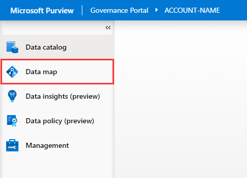
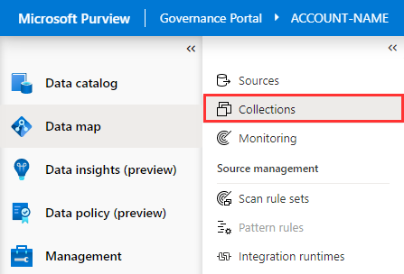
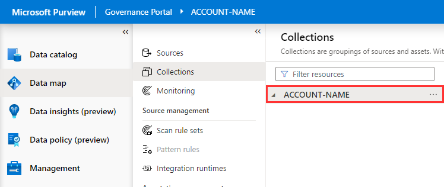
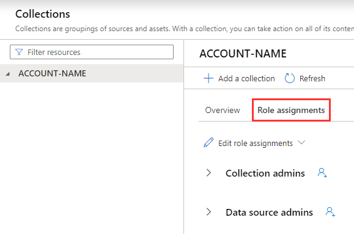
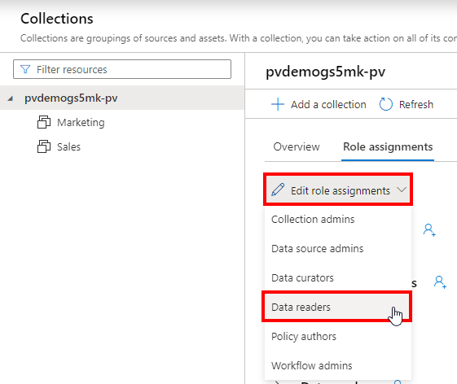
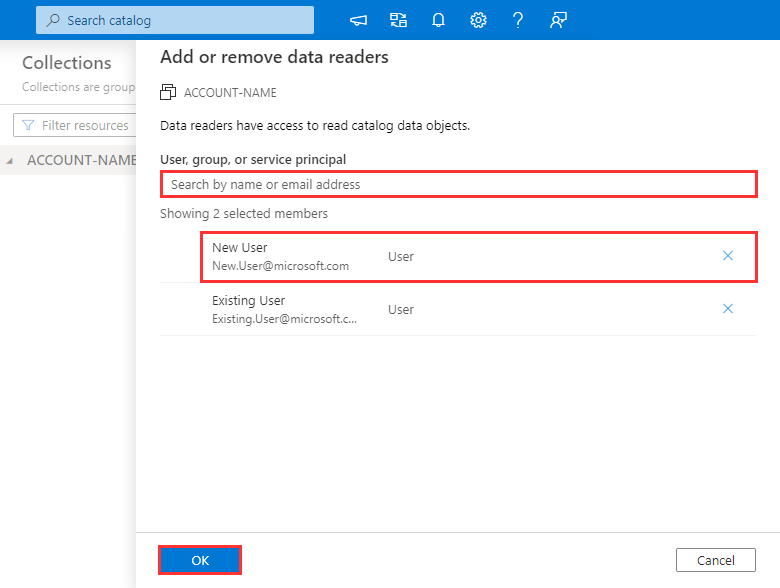

In this unit, you will use the Microsoft Purview Studio to provide a user within your Azure Active Directory read access to the data catalog.

1. On the left-hand size of Microsoft Purview Studio, navigate to **Data map**.  

2. Select **Collections**.  

3. Select the root collection.  

4. Select **Role assignments**.  

5. Open the **Edit role assignments** menu and select **Data readers**.  

6. Search for another user within your Azure Active Directory, select their account, click **OK**.  

