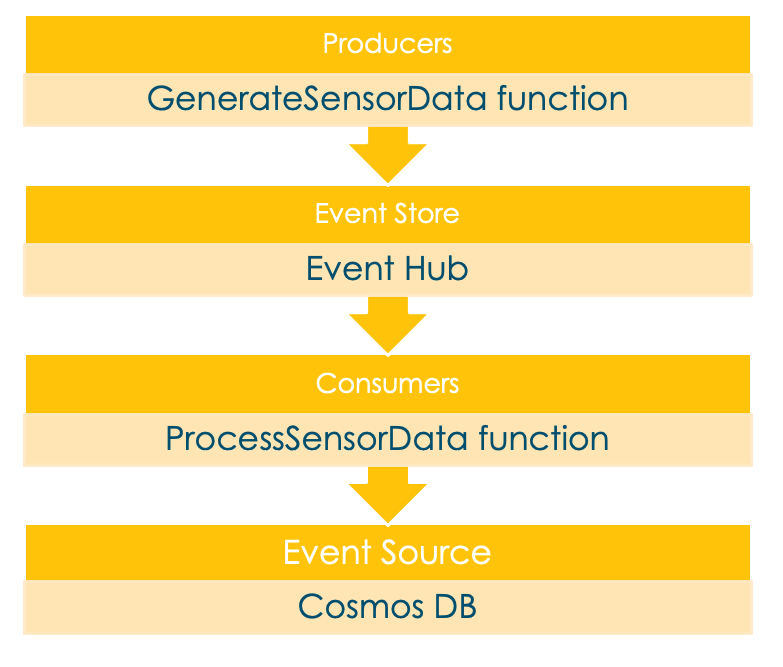

For our example, we use event sourcing. Let's build a function that's simulating telemetric data and send it to an event hub. Later, another function can listen to this event and process and store it in a database created with Azure Cosmos DB.



## Prepare your environment

Let's define some environment variables to keep the following commands as short and understandable as possible. Define the `<value>` placeholders, and paste and run the following commands in your terminal or command-line tool:

```bash
RESOURCE_GROUP=<value>
EVENT_HUB_NAMESPACE=<value>
EVENT_HUB_NAME=<value>
EVENT_HUB_AUTHORIZATION_RULE=<value>
COSMOS_DB_ACCOUNT=<value>
STORAGE_ACCOUNT=<value>
FUNCTION_APP=<value>
LOCATION=<value>
```

> [!NOTE]
> To set the LOCATION variable, you can check the `az functionapp list-consumption-locations` command and use the closest location.

## Create the required components

Provisioning the resources on Azure takes some time. Let's start with the component creation as early as possible to avoid long waits later on.

### Create a resource group

It's always a good idea to bind all the resources of a training, proof of concept, or a prototype in one resource group. That way you can conveniently clean up all used services with one command. To create a resource group in the specified location, run the following command in your terminal:

``` bash
az group create \
    --name $RESOURCE_GROUP \
    --location $LOCATION
```

### Create and configure an event hub

For the event hub, it's necessary to specify the namespace it should listen to. Also, you need to configure the authorization rule to `Listen` and `Send`.

``` bash
az eventhubs namespace create \
    --resource-group $RESOURCE_GROUP \
    --name $EVENT_HUB_NAMESPACE
az eventhubs eventhub create \
    --resource-group $RESOURCE_GROUP \
    --name $EVENT_HUB_NAME \
    --namespace-name $EVENT_HUB_NAMESPACE \
az eventhubs eventhub authorization-rule create \
    --resource-group $RESOURCE_GROUP \
    --name $EVENT_HUB_AUTHORIZATION_RULE \
    --eventhub-name $EVENT_HUB_NAME \
    --namespace-name $EVENT_HUB_NAMESPACE \
    --rights Listen Send
```

### Build, configure, and deploy the Azure function

To make this example as realistic as possible, create an Azure function and simulate telemetric data. You could also bind an IoT device to your Azure function, which would then take real data. Because this function is the event-producing one, let's add a *p* or *-p* flag.

``` bash
az storage account create \
    --resource-group $RESOURCE_GROUP \
    --name $STORAGE_ACCOUNT"p" \
    --sku Standard_LRS
az functionapp create \
    --resource-group $RESOURCE_GROUP \
    --name $FUNCTION_APP"-p"\
    --storage-account $STORAGE_ACCOUNT"p" \
    --consumption-plan-location $LOCATION \
    --runtime java \
    --functions-version 4
```

> [!NOTE]
> Use functions-version 4 as 2 and 3 were deprecated in December 2022.

When the `az functionapp create` command creates your function application, it also creates an Application Insights resource with the same name. We use that resource later for our monitoring.

To retrieve the connection strings for the storage account and the event hub, use the following commands to save them in environment variables, and then display them with the `echo` command.

```bash
AZURE_WEB_JOBS_STORAGE=$( \
    az storage account show-connection-string \
        --resource-group $RESOURCE_GROUP \
        --name $STORAGE_ACCOUNT"p" \
        --query connectionString \
        --output tsv)
echo $AZURE_WEB_JOBS_STORAGE
EVENT_HUB_CONNECTION_STRING=$( \
    az eventhubs eventhub authorization-rule keys list \
        --resource-group $RESOURCE_GROUP \
        --name $EVENT_HUB_AUTHORIZATION_RULE \
        --eventhub-name $EVENT_HUB_NAME \
        --namespace-name $EVENT_HUB_NAMESPACE \
        --query primaryConnectionString \
        --output tsv)
echo $EVENT_HUB_CONNECTION_STRING
```

To store the connection strings in the application settings of your Azure Function account, run the following command in your terminal:

```bash
az functionapp config appsettings set \
    --resource-group $RESOURCE_GROUP \
    --name $FUNCTION_APP"-p" \
    --settings \
        AzureWebJobsStorage=$AZURE_WEB_JOBS_STORAGE \
        EventHubConnectionString=$EVENT_HUB_CONNECTION_STRING
```

Now, your Azure resources event hub and Azure function are created and configured to work properly together.

Next, create a local functions project with Maven.

``` bash
mvn archetype:generate --batch-mode \
    -DarchetypeGroupId=com.microsoft.azure \
    -DarchetypeArtifactId=azure-functions-archetype \
    -DappName=$FUNCTION_APP"-p" \
    -DresourceGroup=$RESOURCE_GROUP \
    -DappRegion=$LOCATION \
    -DappServicePlanName=$LOCATION"plan" \
    -DgroupId=com.learn \
    -DartifactId=telemetry-functions-producer
```

This command generates several files inside a `telemetry-functions-producer` folder:

- The `pom.xml` build file with predefined Azure dependencies.
- The `local.settings.json` file to hold the application settings for local deployment and manual testing.
- A `host.json` file that enables the Azure Functions Extension Bundle.
- A `Function.java` file that includes the default HTTP trigger function.
- A few test files that this Learn module doesn't use.

We don't touch the test files in this Learn module, so feel free to delete them.

``` Bash
cd telemetry-functions-producer
rm -r src/test
```

For local execution, the application settings need to be retrieved and stored at the `local.settings.json` file. You can do that automatically by running the `fetch-app-settings` command.

``` Bash
func azure functionapp fetch-app-settings $FUNCTION_APP"-p"
```

Next, open the `Function.java` file and replace the content with the following code:

``` Java
package com.learn;

import com.microsoft.azure.functions.annotation.EventHubOutput;
import com.microsoft.azure.functions.annotation.FunctionName;
import com.microsoft.azure.functions.annotation.TimerTrigger;
import com.microsoft.azure.functions.ExecutionContext;
public class Function {

    @FunctionName("generateSensorData")
    @EventHubOutput(
        name = "event",
        eventHubName = "", // blank because the value is included in the connection string
        connection = "EventHubConnectionString")
    public TelemetryItem generateSensorData(
        @TimerTrigger(
            name = "timerInfo",
            schedule = "*/10 * * * * *") // every 10 seconds
            String timerInfo,
        final ExecutionContext context) {
            context.getLogger().info("Java Timer trigger function executed at: " + java.time.LocalDateTime.now());
            double temperature = Math.random() * 100;
            double pressure = Math.random() * 50;
        return new TelemetryItem(temperature, pressure);
    }
}
```

The `generateSensorData` function simulates a sensor that sends temperature and pressure readings to the event hub. A timer trigger runs the function every 10 seconds, and an event hub output binding sends the return value to the event hub.

When the event hub receives the message, it generates an event.

The data used by this function is stored using a class called TelemetryItem, which you need to implement. Create a new file called TelemetryItem.java in the same location as Function.java and add the following code:

``` Java
package com.learn;

public class TelemetryItem {

    private String id;
    private double temperature;
    private double pressure;
    private boolean isNormalPressure;
    private status temperatureStatus;
    static enum status {
        COOL,
        WARM,
        HOT
    }

    public TelemetryItem(double temperature, double pressure) {
        this.temperature = temperature;
        this.pressure = pressure;
    }

    public String getId() {
        return id;
    }

    public double getTemperature() {
        return temperature;
    }

    public double getPressure() {
        return pressure;
    }

    @Override
    public String toString() {
        return "TelemetryItem={id=" + id + ",temperature="
            + temperature + ",pressure=" + pressure + "}";
    }

    public boolean isNormalPressure() {
        return isNormalPressure;
    }

    public void setNormalPressure(boolean isNormal) {
        this.isNormalPressure = isNormal;
    }

    public status getTemperatureStatus() {
        return temperatureStatus;
    }

    public void setTemperatureStatus(status temperatureStatus) {
        this.temperatureStatus = temperatureStatus;
    }
}
```

## Run locally

When you run Azure functions locally, they're already streamed all over the world! Also, you can review them in your Azure portal.

``` Bash
mvn clean package
mvn azure-functions:run
```

After some build and startup messages, you'll see output similar to the following example for each time the functions run:

``` Output
[2021-01-19T16:25:40.005Z] Executing 'Functions.generateSensorData' (Reason='Timer fired at 2021-01-19T17:25:40.0044630+01:00', Id=fcf567a3-03ec-4159-9714-aa4449861b30)
[2021-01-19T16:25:40.011Z] Java Timer trigger function executed at: 2021-01-19T17:25:40.009405
[2021-01-19T16:25:40.013Z] Function "generateSensorData" (Id: fcf567a3-03ec-4159-9714-aa4449861b30) invoked by Java Worker
[2021-01-19T16:25:40.048Z] Executed 'Functions.generateSensorData' (Succeeded, Id=fcf567a3-03ec-4159-9714-aa4449861b30, Duration=43ms)

```

> [!NOTE]
> Before you deploy and run your function in the Azure cloud, you can send events from your local machine all over the world! That is very useful for developing, debugging, and local testing.

## Deploy to Azure

Trigger the deployment on Azure by running the `mvn azure-functions:deploy` command and continue.

``` Bash
mvn azure-functions:deploy
```
