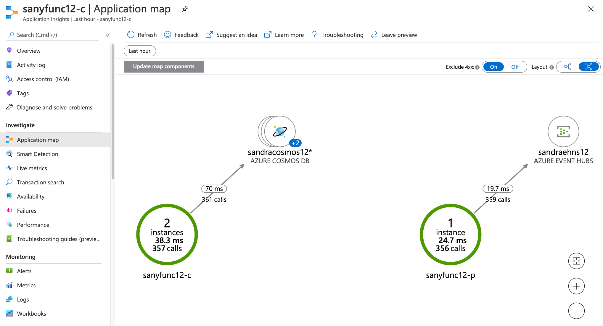
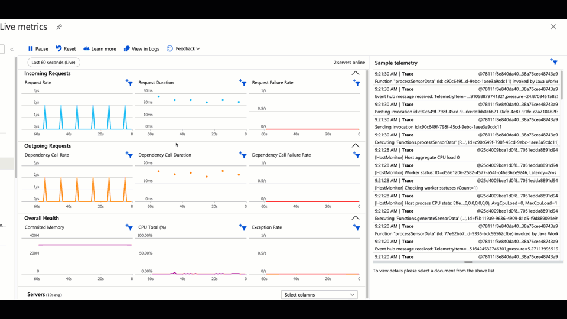
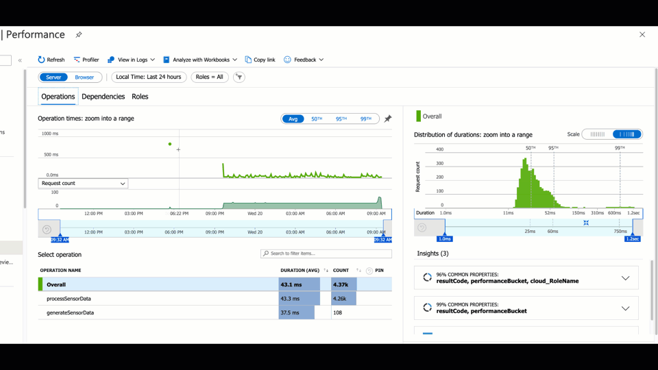
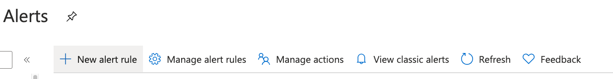
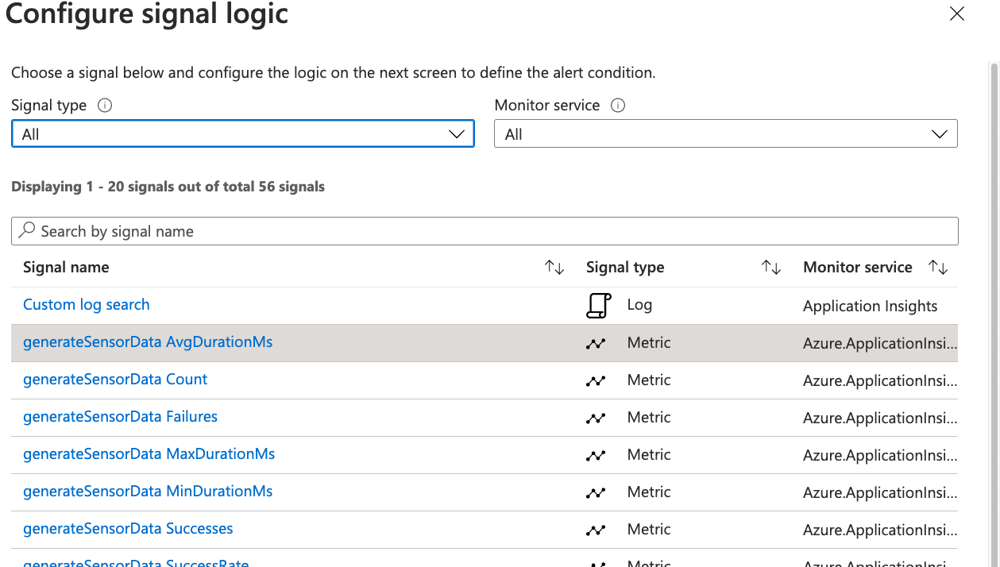

Let's have a look at the metrics in Application Insights to measure the performance and identify potential bottlenecks.

## Check metrics on the Azure portal

Your functions now run in Azure and continue to accumulate data in the database you created with Azure Cosmos DB. You can view your deployed function apps in the Azure portal and view app telemetry through the connected Application Insights resource, as shown in the following screenshots:

**App map**

The Application map gives you an idea how dependent your services are with each other. As you can see, the consumer function is bound with the database created with Azure Cosmos DB, but not with the other function. Also, the consumer function is loosely coupled with the Azure event hub. The producing function is bound with the event hub but not with the consuming function or the database.

**Live metrics stream**

**Performance**

To investigate the performance of the application stack, you can have a closer look at `Operations`, `Dependencies`, or `Roles`. Each of them allow you to dive even deeper.

## Set alerts

You always want to be sure that your system is up and running correctly. If something goes wrong or the behavior indicates that something might go wrong, you want to receive an automatic alarm. Alerts are the solution. Set and review alerts for your services on the **Alerts** tab under **Monitoring**.

Select **New alert rule**, check the **Scope**, and choose the **Condition**. You can either choose a specific log by using **Custom log search** or you can use one of the smart predefined ones.

For the performance, the duration time is important. Think about what's more important to you. Is the average duration enough or is it important that every request is in time and you need an alert for outliers as well? You can create as many alerts as needed. After you choose the condition, specify the action. For easier maintenance, you can organize them in action groups.
