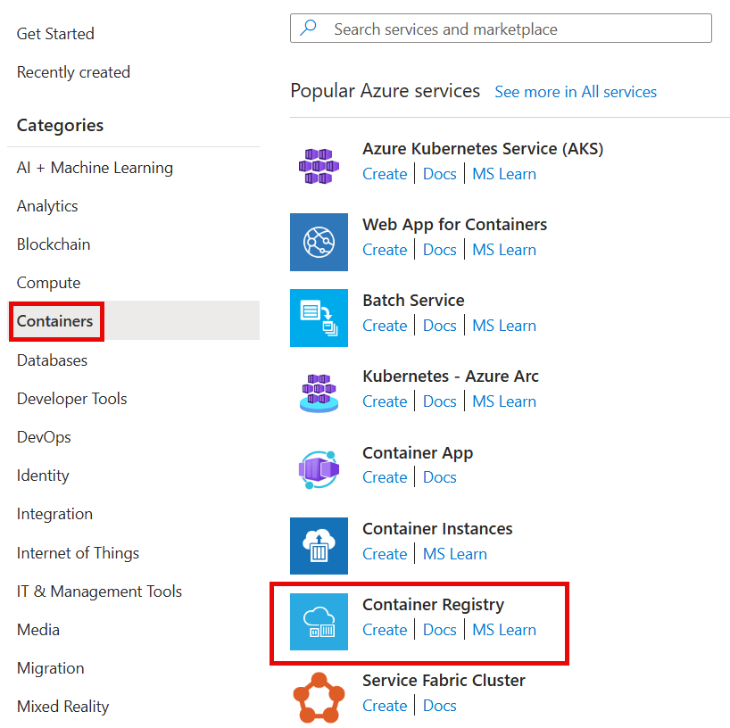
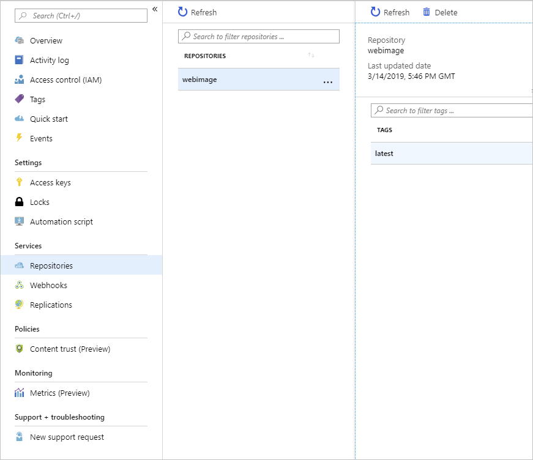

Azure Container Registry provides storage for Docker images in the cloud.

In the example scenario, the team needs to create a registry to store the images for their web apps.

In this unit, you'll use the Azure portal to create a new registry in Azure Container Registry. You'll build a Docker image from the source code for a web app and upload it to a repository in your registry. Finally, you'll examine the contents of the registry and the repository.

[!include[](../../../includes/azure-exercise-subscription-prerequisite.md)]

## Create a registry in Azure Container Registry

1. Sign in to the [Azure portal](https://portal.azure.com/learn.docs.microsoft.com?azure-portal=true) with your Azure subscription.

1. Select **Create a resource**, then select **Containers**, and then select **Container Registry**.

   

1. Specify the values in the following table for each of the properties:

   | Property | Value |
   |---|---|
   | Registry name | Enter a unique name and make a note of it for later. |
   | Subscription | Select your default Azure subscription in which you are allowed to create and manage resources. |
   | Resource Group | Create a new resource group with the name **learn-deploy-container-acr-rg** so that it will be easier to clean up these resources when you're finished with the module. If you choose a different resource group name, remember it for the rest of the exercises in this module. |
   | Location | Select a location that is close to you. |
   | SKU | **Standard** |

1. Select **Create**. Wait until the container registry has been created before you continue.

## Build a Docker image and upload it to Azure Container Registry

1. In the Azure Cloud Shell in the portal, run the following command to download the source code for the sample web app. This web app is simple. It presents a single page that contains static text and a carousel control that rotates through a series of images.

   ```bash
   git clone https://github.com/MicrosoftDocs/mslearn-deploy-run-container-app-service.git
   ```

::: zone pivot="csharp"

2. Move to the source folder:

   ```bash
   cd mslearn-deploy-run-container-app-service/dotnet
   ```

::: zone-end

::: zone pivot="javascript"

2. Move to the source folder:

    ```bash
    cd mslearn-deploy-run-container-app-service/node
    ```

::: zone-end

3. Run the following command. This command sends the folder's contents to Azure Container Registry, which uses the instructions in the Docker file to build the image and store it. Replace `<container_registry_name>` with the name of the registry you created earlier. Take care not to leave out the `.` character at the end of the command.

   ```bash
   az acr build --registry <container_registry_name> --image webimage .
   ```

The Docker file contains the step-by-step instructions for building a Docker image from the source code for the web app. Azure Container Registry runs these steps to build the image, and as each step completes a message is generated. The build process should finish after a couple of minutes without any errors or warnings.

## Examine the container registry

1. In the [Azure portal](https://portal.azure.com/learn.docs.microsoft.com?azure-portal=true), navigate to the Overview page for your container registry.

2. Under **Services**, select **Repositories**. You'll see a repository named `webimage`.

3. Select the `webimage` repository. It contains an image with the `latest` tag. This is the Docker image for the sample web app.

  

 The Docker image that contains your web app is now available in your registry for deployment to App Service.
