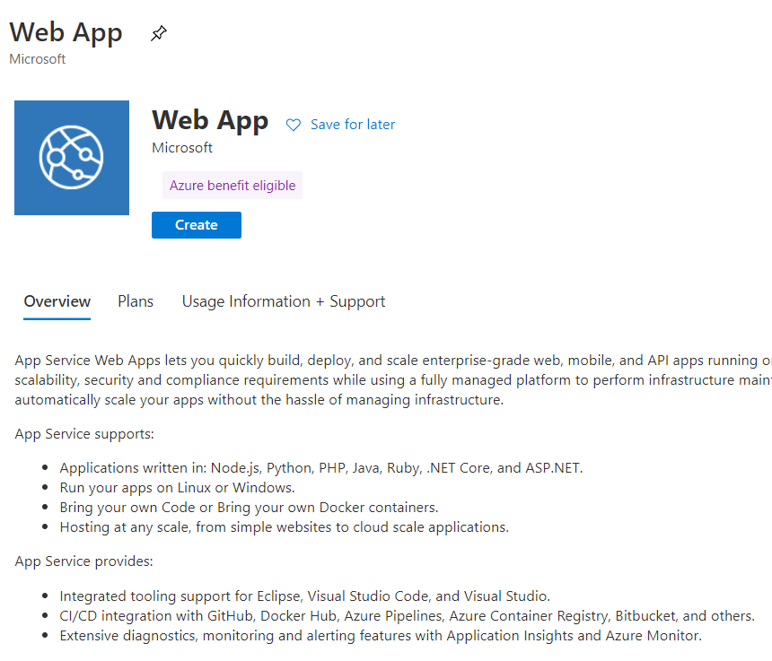
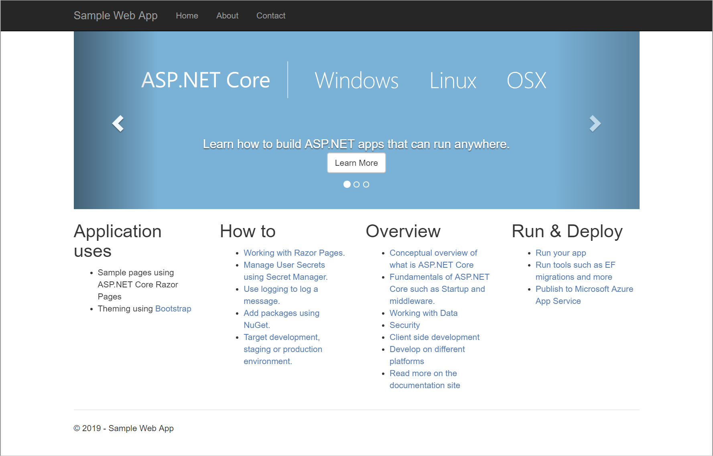

App Service provides the hosting environment for an Azure web app. You can configure App Service to retrieve the image for the web app from a repository in Azure Container Registry. 

In the example scenario, having uploaded the image for the web app to Azure Container Registry, the team are now ready to deploy the web app.

In this unit, you'll create a new web app using the Docker image stored in Azure Container Registry. You'll use App Service with a predefined App Service plan to host the web app.

## Create a web app

1. Sign in to the [Azure portal](https://portal.azure.com/learn.docs.microsoft.com?azure-portal=true).

1. Select **Create a resource** > **Web** > **Web App**.

    

1. Specify the following settings:
    
    | Property         | Value                                                               |
    |------------------|---------------------------------------------------------------------|
    | Name             | Enter a unique name and make a note of it for later.                |
    | Subscription     | Concierge Subscription                                              |
    | Resource Group   | Use the existing resource group <rgn>[Sandbox resource group]</rgn> |
    | OS               | Linux                                                               |
    | Publish          | Docker Image                                                        |
    | App Service plan | Leave default                                                       |

1. Click **Configure container**.

1. In the **Configure Container** window, select the **Single Container** tab. For the image source, select **Azure Container Registry**, and then enter the following settings:

    | Property     | Value                |
    |--------------|----------------------|
    | Registry     | Select your registry |
    | Image        | webimage             |
    | Tag          | latest               |
    | Startup File | *Leave empty*        |

1. Click **Apply**, and then on the **Web App** page, click **Create**. Wait while the web is deployed before continuing.

## Test the web app

1. Use the **All resources** view in the Azure portal to navigate to the Overview page of the web app you just created. Click the **Browse** button to open the site in a new browser tab.

1. After the cold start delay of your app's Docker image loading and starting up, you should see a page similar to this one:

    

1. Click the arrows in the carousel control at the top of the page. The content should rotate through three pages.

 App Service is now hosting the application from your Docker image.