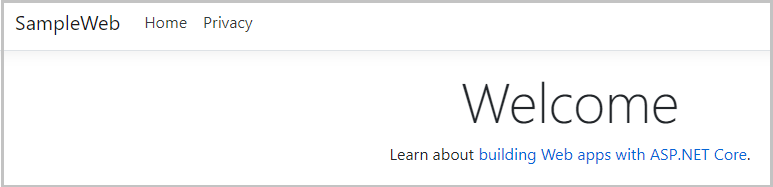
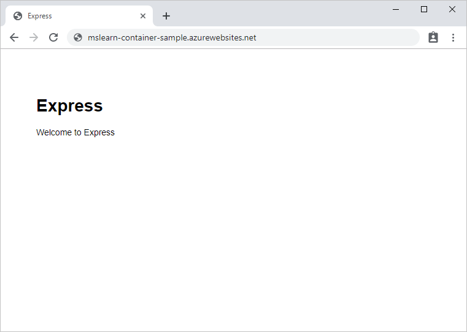

Azure App Service provides the hosting environment for an Azure-based web app. You can configure App Service to retrieve the image for the web app from a repository in Azure Container Registry. 

In the example scenario, the team has uploaded the image for the web app to Azure Container Registry and is now ready to deploy the web app.

In this unit, you'll create a new web app by using the Docker image stored in Azure Container Registry. You'll use App Service with a predefined App Service plan to host the web app.

## Enable Docker access to the Azure Container Registry

You'll use Docker to log in to the registry and pull the web image that you want to deploy. Docker needs a username and password to perform this action. The Container Registry enables you to set the registry name as the username and the admin access key as the password to allow Docker to log in to your container registry.

1. Sign in to the [Azure portal](https://portal.azure.com/?azure-portal=true), and go to **All resources**. The **All resources** pane appears.

1. Select the container registry you created earlier to go to its Overview page.

1. In the left menu pane, under **Settings**, select **Access keys**. The **Access keys** pane appears for your container registry.

1. Set the **Admin user** option to **Enabled**. This change saves automatically.

You're now ready to create your web app.

## Create a web app

1. Go back to the [Azure portal](https://portal.azure.com/?azure-portal=true) home page, and under **Azure services**, select **Create a resource**. The **Create a resource** pane appears.

1. In the left menu pane, select **Web**, and under *Popular Azure services*, select **Web App**.

    :::image type="content" source="../media/5-search-web-app-annotated.png" alt-text="Screenshot that shows the Azure Marketplace with Web App selected.":::

    The **Create Web App** pane appears.

1. On the **Basics** tab, enter the following values for each setting.

    | Setting | Value |
    |---|---|
    | **Project Details** |
    | Subscription | Select your default Azure subscription in which you're allowed to create and manage resources. |
    | Resource Group | From the dropdown list, select the existing resource group **learn-deploy-container-acr-rg**. |
    | **Instance Details** |
    | Name | Enter a unique name and make a note of it for later. |
    | Publish | **Docker Container** |
    | Operating System | **Linux** |
    | Region | Select the same location that is close to you from previous exercise. |
    | **Pricing plans** |
    | Linux plan | Use the default. |
    | Pricing plan | Use the default. |
    | **Zone redundancy** |
    | Zone redundancy | Use the default. |

1. Select **Next: Docker**.

1. On the **Docker** tab, enter the following values for each setting.

    | Setting | Value |
    |---|---|
    | Options | **Single Container** |
    | Image Source | **Azure Container Registry** |
    | **Azure container registry options** |
    | Registry | Select your registry. |
    | Image | `webimage` |
    | Tag | `latest` |
    | Startup Command | Leave this setting empty. |

1. Select **Review and create**, and then select **Create**. Wait until the web app has been deployed before you continue.

## Test the web app

1. After deployment succeeds, select **Go to resource** to see the web app you just created. Your **App service** pane appears for your web app.

2. In the top menu bar, select **Browse** to open the site in a new browser tab.

::: zone pivot="csharp"

3. After the cold-start delay while your app's Docker image loads and starts, you'll see a page like the following image:

    

::: zone-end

::: zone pivot="javascript"

3. After the cold-start delay while your app's Docker image loads and starts, you'll see a page like the following image:

    

::: zone-end

App Service is now hosting the app from your Docker image.
