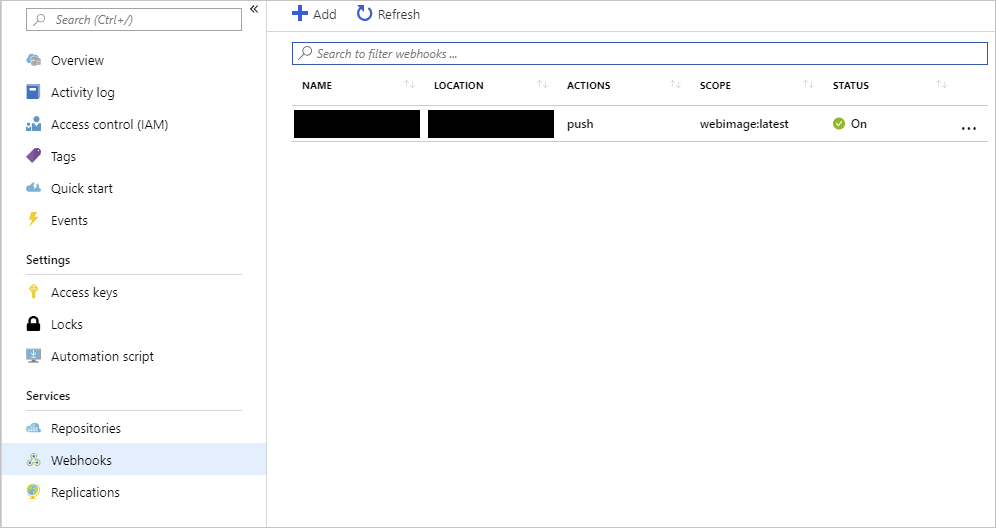
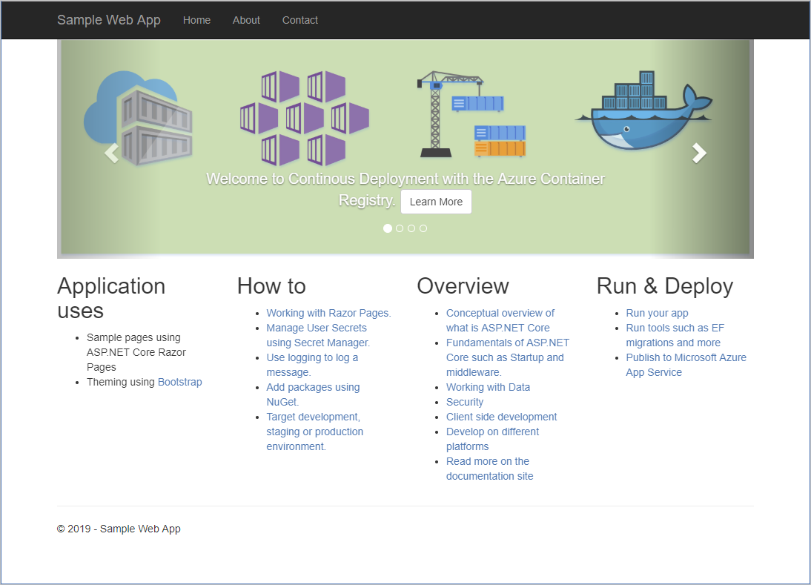

In this unit, you'll configure continuous deployment for the web app and create a webhook that links to the registry that contains the Docker image. Then, you'll make a change to the source code for the web app and rebuild the image. You'll visit the website that hosts the sample web app again and verify that the newest version is running.

> [!NOTE]
> This exercise does not create an Azure Container Registry task. Instead, you'll manually rebuild the Docker image for the sample app. The webhook will fire when the new Docker image is created.

## Configure continuous deployment and create a webhook

1. Return to the [Azure portal](https://portal.azure.com/learn.docs.microsoft.com?azure-portal=true) and go to the **Container settings** page of your web app.

1. Set **Continuous Deployment** to **On**, and then select **Save**. This setting configures a webhook that Container Registry uses to alert the web app that the Docker image has changed.

    

    If you went to the **Webhooks** page for your container registry, you'd see the newly configured webhook:

    
  
## Update the web app and test the webhook

1. In the Azure Cloud Shell, go to the SampleWeb/Pages folder. This folder contains the source code for the HTML pages that are displayed by the web app:

    ```bash
    cd ~/mslearn-deploy-run-container-app-service/dotnet/SampleWeb/Pages
    ```

1. Run the following commands to replace the default page in the web app (Index.cshtml) with a new version that has an additional item in the carousel control. These commands simulate continued development on the app and add a new page to the carousel.

    ```bash
    mv Index.cshtml Index.cshtml.old
    mv Index.cshtml.new Index.cshtml
    ```

1. Run the next set of commands to rebuild the image for the web app and push it to Container Registry. Replace `<container_registry_name>` with the name of your registry. Don't forget the `.` at the end of the second command.

    ```bash
    cd ~/mslearn-deploy-run-container-app-service/dotnet
    az acr build --registry <container_registry_name> --image webimage .
    ```

1. Go to the **Webhooks** page of your container registry in the Azure portal and select the single webhook in the list.

1. At the bottom of the page, note that there's a record of the webhook that just fired in response to the build and push you ran.

    

## Test the web app again

1. Go back to your web app in the browser. If you closed the tab for it earlier, you can go to the Overview page of the app in the Azure portal and select **Browse**. There will be a cold-start delay while the web app loads the new image from Container Registry.

1. Review the items in the carousel control. Note that the control now contains four pages. The new page looks like the following:

    

The web app has been updated and redeployed automatically based on the new image. The webhook service in your registry notified your web app that the container image had been modified, triggering an update.
