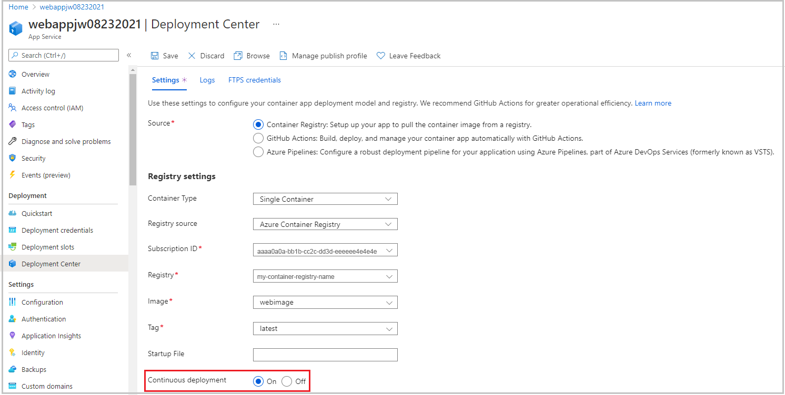
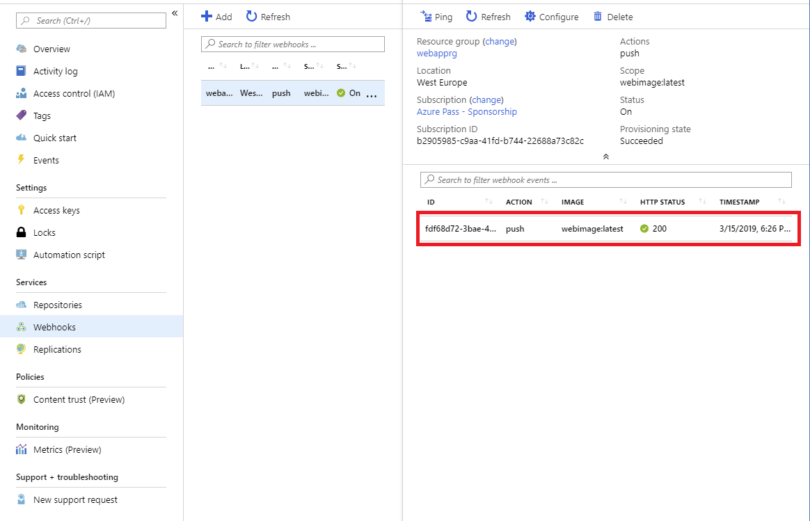
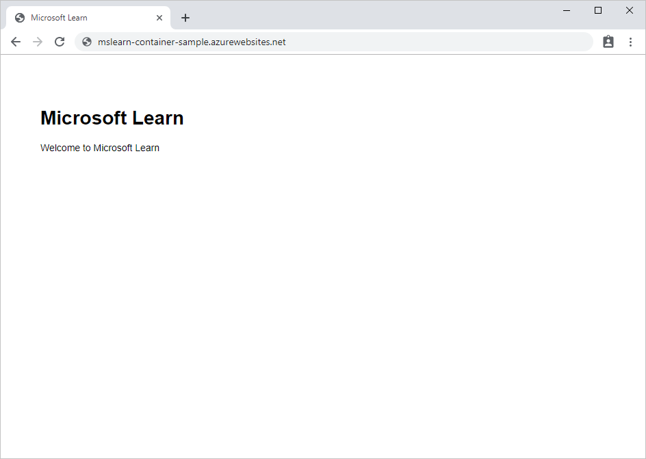

In this unit, you'll configure continuous deployment for the web app and create a webhook that links to the registry that contains the Docker image. Then, you'll make a change to the source code for the web app and rebuild the image. You'll visit the website that hosts the sample web app again and verify that the newest version is running.

> [!NOTE]
> This exercise does not create an Azure Container Registry task. Instead, you'll manually rebuild the Docker image for the sample app. The webhook will open when the new Docker image is created.

## Configure continuous deployment and create a webhook

1. Return to the [Azure portal](https://portal.azure.com/?azure-portal=true) and select your web app. Your **App service** pane appears for your web app.

1. In the left menu pane, under **Deployment**, select **Deployment Center**. The **Deployment Center** pane appears for your app service (web app).

1. On the **Settings** tab, under **Registry settings**, set **Continuous Deployment** to **On**,  then select **Save** in the top menu bar. This setting configures a webhook that Container Registry uses to alert the web app that the Docker image has changed.

    

## Update the web app and test the webhook

::: zone pivot="csharp"

1. In Azure Cloud Shell, go to the dotnet/SampleWeb/Pages folder. This folder contains the source code for the HTML pages that are displayed by the web app.

    ```bash
    cd ~/mslearn-deploy-run-container-app-service/dotnet/SampleWeb/Pages
    ```

1. Run the following commands to replace the default page in the web app (Index.cshtml) with a new version that has an additional item in the carousel control. These commands simulate continued development on the app, and add a new page to the carousel.

    ```bash
    mv Index.cshtml Index.cshtml.old
    mv Index.cshtml.new Index.cshtml
    ```

1. Run the next set of commands to rebuild the image for the web app, and push it to Container Registry. Replace `<container_registry_name>` with the name of your registry. Don't forget the `.` at the end of the second command. Wait for the build to complete.

    ```bash
    cd ~/mslearn-deploy-run-container-app-service/dotnet
    az acr build --registry <container_registry_name> --image webimage .
    ```

1. Return to the Azure portal **home page**, and under **Recent resources**, select your container registry. Your **Container registry** pane appears.

1. In the left menu pane, under **Services**, select **Webhooks**. The **Webhooks** pane appears for your container registry.

1. Select the single webhook in the list. Your **Container registry webhook** appears.

1. Notice the record of the webhook that just fired in response to the build and push you ran.

    

## Test the web app again

1. Go back to your web app in the browser. If you closed the tab for it earlier, you can go to the Overview page of the app in the Azure portal, and select **Browse**. There will be a cold-start delay while the web app loads the new image from Container Registry.

1. Review the items in the carousel control. Note that the control now contains four pages. The new page looks like the following image:

    

The web app has been updated and redeployed automatically based on the new image. The webhook service in your registry notified your web app that the container image had been modified, triggering an update.

::: zone-end

::: zone pivot="javascript"

1. In Azure Cloud Shell, go to the node/routes folder. This folder contains the source code that generates the pages that are displayed by the web app.

    ```bash
    cd ~/mslearn-deploy-run-container-app-service/node/routes
    ```

1. Open `index.js` in Cloud Shell editor.

    ```bash
    code index.js
    ```

1. In the editor, modify the code to change the value of the `title` property passed to the view from `Express` to `Microsoft Learn`.

    ```javascript
    ...
    res.render('index', { title: 'Microsoft Learn' });
    ...
    ```

    Make sure to save the file when you're finished.

1. In Cloud Shell, run the next set of commands to rebuild the image for the web app, and push it to Container Registry. Replace `<container_registry_name>` with the name of your registry. Don't forget the `.` at the end of the second command. Wait for the build to complete.

    ```bash
    cd ~/mslearn-deploy-run-container-app-service/node
    az acr build --registry <container_registry_name> --image webimage .
    ```

1. In the left menu pane, under **Services**, select **Webhooks**. In the **Webhooks** pane of your container registry, and select the single webhook in the list.

1. Notice that there is a record of the webhook that just fired in response to the build and push you ran.

    

## Test the web app again

1. Go back to your web app in the browser. If you closed the tab for it earlier, you can go to the *Overview* page of your web app in the Azure portal, and in the top menu bar, select **Browse**. There will be a cold-start delay while the web app loads the new image from Container Registry.

1. Note that the contents of the page have changed to reflect the updates made to the container image.

    

The web app has been updated and redeployed automatically based on the new image. The webhook service in your registry notified your web app that the container image had been modified, triggering an update.

::: zone-end
