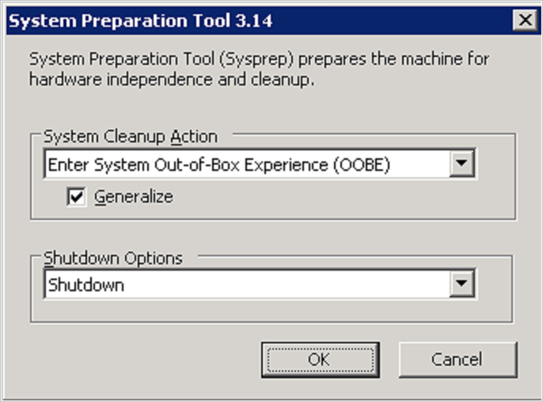

You've learned about Azure images, how you can use a generalized image to build pre-configured virtual machines (VMs), and how you can use a specialized image as a snapshot of a virtual machine at a point in time.

In the sample scenario, you need to create generalized images for a variety of virtual machines. Some of these virtual machines will run Windows. Others will require Linux.

In this unit, you'll learn how to customize an image, and then generalize this image so you can use it to deploy virtual machines. The tools and techniques for building a generalized image vary according to the operating system.

## Generalize a Windows virtual machine

If you're building a Windows image, you'll use the **Sysprep** tool to prepare a virtual machine for generalization. Sysprep removes server-specific information from the image, such as the host name, user sign-in information, and logs. Sysprep also removes any machine-specific identifiers that Windows uses internally.

> [!IMPORTANT]
> Running Sysprep is a destructive process, and you can't easily reverse its effects. Back up your virtual machine first.

To generalize a Windows VM, follow these steps:

1. Sign in to the Windows virtual machine.
1. Open a command prompt as an administrator.
1. Browse to the directory **\windows\system32\sysprep**.
1. Run **sysprep.exe**.
1. In the **System Preparation Tool** dialog box, select the following settings, and then select **OK**.

    | Property  | Value  |
    |---|---|
    | **System Cleanup Action** | **Enter System Out-of-Box Experience (OOBE)** |
    | **Generalize** | Select  |
    | **Shutdown Options** | **Shutdown** |

    

After the virtual machine has been shut down, you must deallocate it while it's in this clean state. If you're using PowerShell, run the following command:

```powershell
Stop-AzVM -ResourceGroupName <resource group> `
    -Name <virtual machine name> `
    -Force
```

If you're using the Azure CLI, run the following command instead:

```azurecli
az vm deallocate \
    --resource-group <resource group> \
    --name <virtual machine name>
```

You can then use the following commands for PowerShell or the Azure CLI to generalize the VM:

```powershell
Set-AzVM -ResourceGroupName <resource group> `
    -Name <virtual machine name> `
    -Generalize
```

```azurecli
az vm generalize \
     --resource-group <resource group> \
     --name <virtual machine name>
```

## Generalize a Linux virtual machine

If you're building a Linux image, you'll use the **waagent** tool to prepare a virtual machine for generalization. The waagent tool performs tasks like deleting the most recently created user account, removing public SSH keys, resetting the host name and other machine-specific details, and cleaning log files.

To generalize a Linux virtual machine, sign in to the machine and run the following command:

```bash
waagent -deprovision+user
```

You'll receive a series of warning messages similar to the following. In this example, *azureuser* is the name of the user account that was created when the virtual machine was built.

```text
WARNING! The waagent service will be stopped.
WARNING! Cached DHCP leases will be deleted.
WARNING! root password will be disabled. You will not be able to login as root.
WARNING! /etc/resolv.conf will be deleted.
WARNING! azureuser account and entire home directory will be deleted.
```

You should then disconnect from the virtual machine.

Finally, you must deallocate and generalize the virtual machine while it's in this clean state. If you're using PowerShell, run the following series of commands:

```powershell
Stop-AzVM -ResourceGroupName <resource group> `
    -Name <virtual machine name> `
    -Force

Set-AzVM -ResourceGroupName <resource group> `
    -Name <virtual machine name> `
    -Generalize
```

If you're using the Azure CLI, use the following commands to deallocate and generalize a virtual machine:

```azurecli
az vm deallocate \
    --resource-group <resource group> \
    --name <virtual machine name>

az vm generalize \
    --resource-group <resource group> \
    --name <virtual machine name>
```
