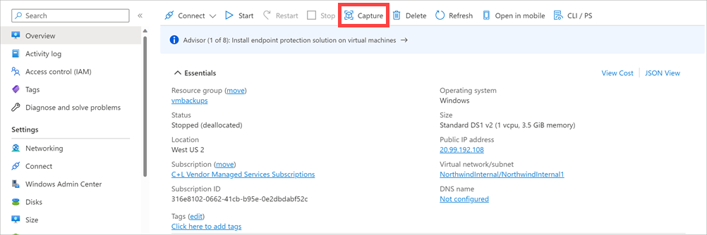
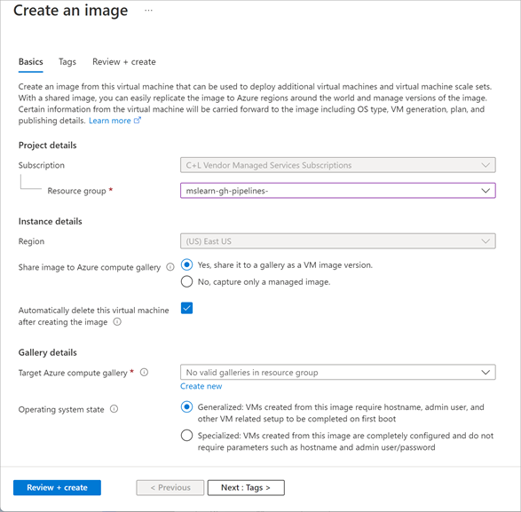
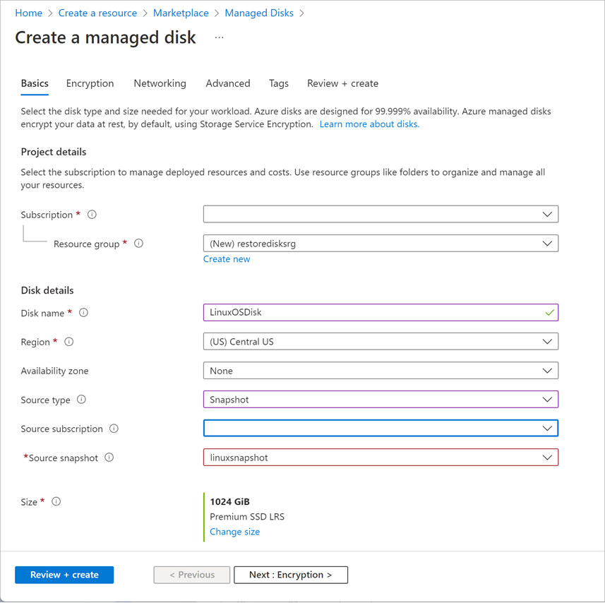

After you've generalized the virtual machine, you can create an image. The image will include all of the disks associated with the virtual machine. You can create an image from the generalized virtual machine by using the Azure portal, the Azure CLI, or PowerShell.

To create an image in the Azure portal, go to the page for the virtual machine and select **Capture**:



On the **Create an image** page that follows, specify a resource group in which to store the image. You can optionally select to automatically remove the virtual machine after the image is created.



> [!IMPORTANT]
> When you create a virtual machine image in this way, the original virtual machine becomes unusable. You can't restart it. Instead, you must create a new virtual machine from the image, as described later in this unit.

If you're using PowerShell or the Azure CLI, you can create a virtual machine image from a generalized and deallocated virtual machine by using the following commands. In both examples, the image will be created in the same resource group as the original virtual machine:

```powershell
$vm = Get-AzVM -ResourceGroupName <resource group> `
    -Name <generalized virtual machine>

$image = New-AzImageConfig -SourceVirtualMachineId `
    $vm.ID -Location<virtual machine location>

New-AzImage -Image $image `
    -ImageName <image name> `
    -ResourceGroupName <resource group>
```

```azurecli
az image create \
    --name <image name> \
    --resource-group <resource group> \
    --source <generalized virtual machine>
```

## Create a new virtual machine from a generalized image

You can build a new virtual machine by using your generalized image. The simplest way is to use the Azure portal. Go to the page for your image, and select **+ Create VM**. You'll be prompted for the machine-specific details, such as the virtual machine name, user account, virtual machine size, and network ports to open.

Alternatively, you can use the PowerShell `New-AzVm` command, or the Azure CLI `az vm create` command. The following examples illustrate the syntax:

```powershell
New-AzVm `
    -ResourceGroupName <resource group> `
    -Name <new virtual machine name> `
    -ImageName <image name> `
    -Location <location of image> 
```

```azurecli
az vm create \
    --resource-group <resource group> \
    --name <new virtual machine name> \
    --image <image name> \
    --location <location of image>
```

## Create a snapshot of a VHD

A virtual machine image contains an image of every VHD in the virtual machine. You can also create separate snapshot images of a VHD at any time. A snapshot is a read-only copy of a VHD. You can use a snapshot to restore a VHD to its state when the snapshot was taken.

If you're taking an image of a virtual machine that spans several VHDs, you must ensure that all disk activity has stopped and that you take a snapshot of every VHD. Failure to do so can result in inconsistencies if you need to restore the virtual machine from these snapshots. By stopping the virtual machine, you can ensure that there's no disk activity and that a successful snapshot is taken.

Unlike creating an image of a virtual machine, capturing a snapshot of a VHD is a non-destructive process. You can continue running virtual machines by using the VHD afterward.

## Create a virtual machine from VHD snapshots

Rebuilding a virtual machine from a set of VHD snapshots is a two-step process:

1. For each snapshot, create a new managed disk. Specify the snapshot as the source of the managed disk. The simplest way is to use the Azure portal, as shown in the following image:

   

1. Create the new virtual machine by using the managed disk. You can do this through PowerShell, the Azure CLI, or the Azure portal.
