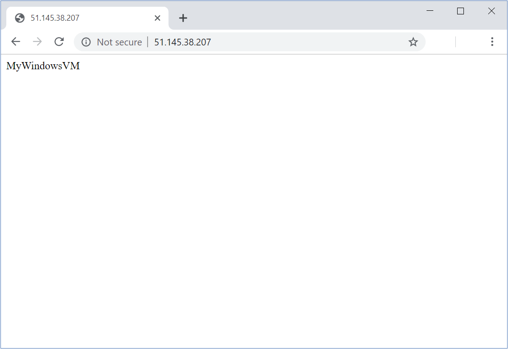
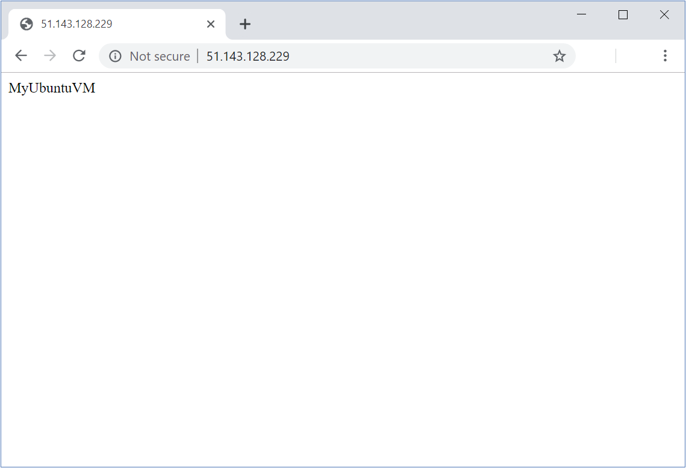

In the sample scenario, your organization is rolling out a new environment on Azure that uses virtual machines. You've already constructed a virtual machine that contains the software and tools required to support the organization's functions. You need to take this virtual machine and use it to generate a custom image that you can use to create new virtual machine instances.

In this exercise, you'll start with an existing virtual machine and generalize it. You'll create an image from the generalized virtual machine, and then use this image to create a further virtual machine.

## Create a virtual machine

In this task, you'll quickly create a virtual machine that runs a simple web app. The web app displays the name of the host machine. You'll use this virtual machine as the basis for the rest of the exercise.

::: zone pivot="windows-cloud"

1. In the Cloud Shell window on the right, run the following commands to create a Windows Server Datacenter virtual machine running IIS. When prompted for the *azureuser* password, enter a password of your choice.

    ```azurecli
    az vm create \
        --name MyWindowsVM \
        --resource-group <rgn>[Sandbox resource group name]</rgn> \
        --image Win2019Datacenter \
        --admin-username azureuser
    ```

1. Run the following command to install IIS and set up a default web page.

    ```azurecli
        az vm extension set \
        --name CustomScriptExtension \
        --version 1.9.4 \
        --vm-name MyWindowsVM \
        --resource-group <rgn>[Sandbox resource group name]</rgn> \
        --publisher Microsoft.Compute \
        --settings '{"commandToExecute":"powershell Add-WindowsFeature Web-Server; powershell Add-Content -Path \"C:\\inetpub\\wwwroot\\Default.htm\" -Value $($env:computername)"}'
    ```

1. Run the following command to open up port 80 to the web server.

    ```azurecli
        az vm open-port \
        --name MyWindowsVM \
        --resource-group <rgn>[Sandbox resource group name]</rgn> \
        --port 80
    ```

1. Run the following command to find the public IP address of the new virtual machine.

    ```azurecli
    echo http://$(az vm list-ip-addresses \
                 --resource-group <rgn>[Sandbox resource group name]</rgn> \
                 --name MyWindowsVM \
                 --query "[].virtualMachine.network.publicIpAddresses[*].ipAddress" \
                 --output tsv)
    ```

1. In the web browser, navigate to the public IP address of the virtual machine. Verify that a web page displaying the name of the virtual machine, *MyWindowsVM*, appears.

    

::: zone-end

::: zone pivot="linux-cloud"

1. In the Cloud Shell window on the right, run the following commands to create an Ubuntu Server virtual machine running Nginx. When prompted for the *azureuser* password, enter a password of your choice.

    ```azurecli
    az vm create \
        --name MyUbuntuVM \
        --resource-group <rgn>[Sandbox resource group name]</rgn> \
        --image UbuntuLTS \
        --generate-ssh-keys

    az vm open-port \
        --name MyUbuntuVM \
        --resource-group <rgn>[Sandbox resource group name]</rgn> \
        --port 80

    az vm extension set \
        --publisher Microsoft.Azure.Extensions \
        --version 2.0 \
        --name CustomScript \
        --vm-name MyUbuntuVM \
        --resource-group <rgn>[Sandbox resource group name]</rgn> \
        --settings '{"commandToExecute":"apt-get -y update && apt-get -y install nginx && hostname > /var/www/html/index.html"}'
    ```

1. Run the following command to find the public IP address of the new virtual machine.

    ```azurecli
    echo http://$(az vm list-ip-addresses \
                 --resource-group <rgn>[Sandbox resource group name]</rgn> \
                 --name MyUbuntuVM \
                 --query "[].virtualMachine.network.publicIpAddresses[*].ipAddress" \
                 --output tsv)
    ```

1. In the web browser, navigate to the public IP address of the virtual machine. Verify that a web page displaying the name of the virtual machine *MyUbuntuVM* appears.

    

::: zone-end

## Generalize the virtual machine

::: zone pivot="windows-cloud"

1. Sign in to the [Azure portal](https://portal.azure.com/learn.docs.microsoft.com?azure-portal=true) using the same account you activated the sandbox with.

1. In the menu pane on the left, click **Resource groups**, and then click the <rgn>[Sandbox resource group name]</rgn> resource group.

1. Click the **MyWindowsVM** virtual machine.

1. On the **MyWindowsVM** page, click **Connect**.

1. In the **Connect to virtual machine** window, click **Download RDP File**.

    

1. When the RDP file has downloaded, click it to open an RDP connection to the virtual machine.

1. In the **Remote Desktop Connection** dialog box, click **Connect**.

    

1. In the **Windows Security** dialog box, click **More choices**, and then click **Use a different account**.

1. Sign in with the username *azureuser*, and the Admin password you used when you created the original virtual machine.

1. In the **Remote Desktop Connection** dialog box, click **Yes** to proceed.

    

1. On the virtual machine, click the Search button in the bottom left-hand corner of the screen.

    

1. In the **Type here to search** box, type **Command Prompt**, but *don't* press Enter.

1. In the **Best match** window, right-click the **Command Prompt** app, and then click **Run as administrator**.

    

1. In the Command Prompt window, run the following command to execute the **Sysprep** utility.

    ```command
    C:\windows\system32\sysprep\sysprep
    ```

1. In the **System Preparation Tool** dialog box, select the following settings, and then click **OK**.

    | Property  | Value  |
    |---|---|
    | System Cleanup Action | Enter System Out-of-Box Experience (OOBE) |
    | Generalize | Check  |
    | Shutdown Options | Shutdown |

    

1. Wait for the sysprep utility to complete. The connection to the virtual machine will be terminated when sysprep has finished and shut down the virtual machine. In the **Remote Desktop Connection** message box, click **OK**.

    

1. In the Cloud Shell window, run the following command to deallocate the virtual machine.

    ```azurecli
    az vm deallocate \
        --resource-group <rgn>[Sandbox reource group name]</rgn> \
        --name MyWindowsVM
    ```

1. Run the following command to generalize the virtual machine.

    ```azurecli
    az vm generalize \
        --resource-group <rgn>[Sandbox reource group name]</rgn> \
        --name MyWindowsVM
    ```

::: zone-end

::: zone pivot="linux-cloud"

1. In the Cloud Shell window, run the following command to connect to the Ubuntu virtual machine. Replace `<ip address>` with the public IP address of the virtual machine, that you noted during the Setup task.

    ```bash
    ssh -o StrictHostKeyChecking=no <ip address>
    ```

1. Run the following command to prepare the virtual machine for generalization.

    ```bash
    sudo waagent -deprovision+user
    ```

    At the **Do you want to proceed (y/n)** prompt, type **y** and press Enter.

1. When the operation has completed, run the following command to close the connection to the virtual machine.

    ```bash
    exit
    ```

1. In the Cloud Shell, run the following command to deallocate the virtual machine.

    ```azurecli
    az vm deallocate \
        --resource-group <rgn>[Sandbox reource group name]</rgn> \
        --name MyUbuntuVM
    ```

1. Run the following command to generalize the virtual machine.

    ```azurecli
    az vm generalize \
        --resource-group <rgn>[Sandbox reource group name]</rgn> \
        --name MyUbuntuVM
    ```

::: zone-end

## Create a virtual machine image

::: zone pivot="windows-cloud"

1. Run the following command to create a virtual machine image named *MyVMImage* from the generalized virtual machine.

    ```azurecli
    az image create \
        --name MyVMIMage \
        --resource-group <rgn>[Sandbox reource group name]</rgn> \
        --source MyWindowsVM
    ```

::: zone-end

::: zone pivot="linux-cloud"

1. Run the following command to create a virtual machine image named *MyVMImage* from the generalized virtual machine.

    ```azurecli
    az image create \
        --name MyVMIMage \
        --resource-group <rgn>[Sandbox reource group name]</rgn> \
        --source MyUbuntuVM
    ```

::: zone-end

## Create a virtual machine using the new image

::: zone pivot="linux-cloud"

1. Run the following command to create a new virtual machine using the *MyVMImage* image.

    ```azurecli
    az vm create \
      --resource-group <rgn>[Sandbox reource group name]</rgn> \
      --name MyVMFromImage \
      --image MyVMImage \
      --admin-username azureuser \
      --generate-ssh-keys
    ```

1. Run the following command to open port 80 on the new virtual machine.

    ```azurecli
    az vm open-port \
        --name MyVMFromImage \
        --resource-group <rgn>[Sandbox resource group name]</rgn> \
        --port 80
    ````

1. Run the following command to find the public IP address of the new virtual machine.

    ```azurecli
    echo http://$(az vm list-ip-addresses \
                    --resource-group <rgn>[Sandbox resource group name]</rgn> \
                    --name MyVMFromImage \
                    --query "[].virtualMachine.network.publicIpAddresses[*].ipAddress" \
                    --output tsv)
    ```

1. In the web browser, navigate to the public IP address of the new virtual machine. Verify that a web page displaying the name of the virtual machine from which the image was built, *MyUbuntuVM*.

::: zone-end

::: zone pivot="windows-cloud"

1. Run the following command to create a new virtual machine using the *MyVMImage* image. Enter the *azureuser* password you used when you created the original virtual machine.

    ```azurecli
    az vm create \
      --resource-group <rgn>[Sandbox reource group name]</rgn> \
      --name MyVMFromImage \
      --image MyVMImage \
      --admin-username azureuser
    ```

1. Run the following command to open port 80 on the new virtual machine.

    ```azurecli
    az vm open-port \
        --name MyVMFromImage \
        --resource-group <rgn>[Sandbox resource group name]</rgn> \
        --port 80
    ````

1. Run the following command to find the public IP address of the new virtual machine.

    ```azurecli
    echo http://$(az vm list-ip-addresses \
                    --resource-group <rgn>[Sandbox resource group name]</rgn> \
                    --name MyVMFromImage \
                    --query "[].virtualMachine.network.publicIpAddresses[*].ipAddress" \
                    --output tsv)
    ```

1. In the web browser, navigate to the public IP address of the new virtual machine. Verify that a web page displaying the name of the virtual machine from which the image was built, *MyWindowsVM*.

::: zone-end