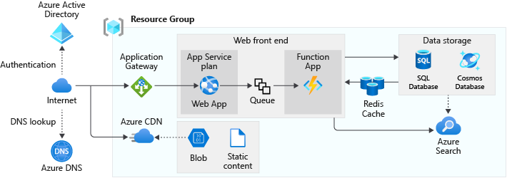
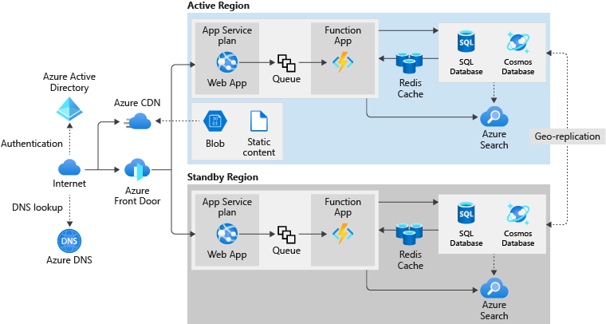

Azure is a global system. By designing an architecture that is present in more than one Azure region, we can build an application that is resilient to even region-wide disasters.

Your shipment tracking portal is scalable because it's built using a range of Azure resources that can scale. It's also resilient to many failures because its components can have multiple instances. However, your board of directors has become concerned that a large-scale disaster could cause an interruption because the portal is entirely contained in the East US Azure region. You want to propose a modified architecture that can fail over to a second region if East US fails.

Here, we learn how to adjust our application's architecture to support a geographically distributed application. We also see why such architecture is advantageous for business-critical applications.

## Original web app architecture

Let's have a look at how the tracking portal's architectural design, and the components used in the solution. After we understand how we use all the parts, we can investigate how to support each of these components in geo-redundancy scenarios.

The tracking portal's design is based on the reference architecture shown in the following diagram.

Notice how our application makes use of a single Azure resource group. This resource group enables us to group and manage all of our resources logically, and simplifies management. We chose to deploy this resource group to the East US region. Even though the resource group doesn't limit us to use the same Azure region for the included resources, we've decided to use the East US region for all resources deployed in our application.

Our application uses three categories of Azure resources. Let's have a look at each category, and see which resources are in use.

### Network components

The tracking portal uses the following networking services.

| Service | Description |
| ---| ---|
| **Azure DNS** | We've configured Azure DNS to host our DNS records in Azure. Azure DNS enables us to manage our DNS records using our Azure credentials in the Azure portal. |
| **Application Gateway** | We've configured the Application Gateway load balancer to balance traffic between multiple instances of the web front end. This service is localized to one Azure region. |
| **Azure CDN**  | We've configured Azure CDN to maximize the delivery of unsecured static content, such as graphics for our website's content. This global service caches static content at points of presence around the world. |
|||

### Application components

The tracking portal uses the following services to support code, cache, and intermediate storage requirements.

| Service | Description |
| ---| ---|
| **Microsoft Entra ID** | Users access the tracking portal using Microsoft Entra accounts. The directory and account are automatically replicated globally. |
| **Azure App Service** | The tracking portal uses two Azure App Services. The first runs a set of dynamic web pages, and the second a web API. |
| **Azure Function Apps** | The tracking portal uses Azure Function Apps to run all background tasks. Some of these tasks run on a regular schedule, and other tasks operate on the messages in a queue. |
| **Azure Storage Queues** | The tracking portal uses Azure Storage Queues with Azure Function Apps. The tracking portal places generated messages onto the queue from where the Function apps process these messages.  |
| **Redis cache** | The tracking portal uses a Redis cache between the front-end app service and the data storage systems to maximize the performance of queries. |
| **Azure Blob Storage** | Static content, such as graphics and video files, are kept as Binary Large Objects (Blobs) in an Azure Storage account, and are delivered through the Azure CDN. |
| **Azure Search** | We've enabled Azure Search on the tracking portal. Azure Search enables us to make all content searchable, and provide search suggestions and fuzzy search results to our users. |
|||

### Data storage components

The tracking portal uses the following persisted storage services.

| Service | Description |
| ---| ---|
| **Azure SQL Database** | We're storing relational data, such as order and customer details in Azure SQL Database. |
| **Cosmos DB** | We're storing semi-structured data, including our product catalog in Cosmos DB. |
|||

## Issues with the original architecture

The existing architecture for the tracking portal is designed to allow for scalability and availability.

For example, if demand is high, and responses to user web requests are slow, you can consider adding more instances of the front-end web app in the App Service. Here, the Application Gateway can route requests to these newly created instances.

However, there are scenarios in which our architectural design has challenges to overcome, or even fail. Let's have a look at each scenario to get a better understanding of the impact on the tracking portal.

### Regional failures

Some significant events have the potential to interrupt an entire Azure region. Azure datacenters are designed to be highly resilient, but a massive weather event, such as a hurricane or flood, can disrupt service from the region.

These events are unusual occurrences, and many companies feel they can sustain that risk. However, the consequence of a regional failure disabling the tracking portal is of such a high-risk the company's executive team has decided to eliminate the risk.

### Service Level Agreements

Most Azure services offer a Service Level Agreement (SLA) or a guarantee of uptime. When we design an application architecture consisting of multiple Azure services, we calculate the overall SLA for the app as a composite of all other services SLAs.

You calculate this SLA by multiplying together the SLAs of the component services. For example, assume our app consists of Azure App Service (99.95% SLA), and Microsoft Entra ID (99.9% SLA). The final calculated SLA is 99.85%.

If this percentage uptime isn't enough for our application, we can arrange for the application to fail over onto another region.

### Global, regional, and configurable components

In our design, some components are global by default and not vulnerable to a regional failure.

Some components are confined to a single region, for example, the Application Gateway. We have to select an alternate service for these types of components.

Some components can be configured to support multiple regions. For example, we can use the Geo-Redundant Storage (GRS) option in the Azure Storage account that stores static content. GRS replicates blobs to another region.

The following table shows which components are global, regional, and configurable.

| Component | Support for multiple regions | Comments |
| --- | --- | --- |
| Azure DNS | Global | No changes are necessary. |
| Application Gateway | Regional | Each instance of Application Gateway is located in a single region. |
| Azure CDN | Global | No changes are necessary, content is cached globally by default. |
| Microsoft Entra ID | Global | No changes are necessary. |
| Azure App Service | Regional | Each instance of the app is located in a single region. |
| Azure Function Apps | Regional | Each instance of the function app is located in a single region. |
| Azure Storage Queues | Configurable | You can choose to replicate an Azure Storage account to multiple regions. |
| Azure Redis Cache | Regional |  Each instance of the cache is located in a single region. |
| Azure Blob Storage | Configurable | You can choose to replicate an Azure Storage account to multiple regions. |
| Azure Search | Regional |  Each instance of the search service is located in a single region. |
| Azure SQL Database | Configurable | You can use geo-replication to synchronize data to multiple regions. |
| Azure Cosmos DB | Configurable | You can use geo-replication to synchronize data to multiple regions. |
| | |

## Proposed distributed architecture

After some investigation, you propose the architecture as shown in the following diagram.

In this design, there's an active region (East US) and a standby region (West US). The East US region handles all requests by the components under ordinary circumstances. If a disaster causes a regional failure, the application fails over onto the West US region.

Let's examine, at a high level, how you've modified the original architecture. We explore these changes in more detail in later units.

### Networking

Azure DNS and Azure CDN are by default global systems and already resilient to regional failures. We leave them in place.

When we create an Azure Application Gateway, we assign the service to a single region. We remove this vulnerability by replacing this service with Azure Front Door. Front Door can poll multiple App Services, and handle the App Service failover from the East US region to the West US region.

### Application services

Microsoft Entra ID is a global system, and needs no modification.

Azure Storage accounts can be configured to replicate content to multiple regions. We use one of the geo-redundant storage options to change our configuration.

The other components, which include the App Service, Function Apps, the Redis cache, and Azure Search, are regional. We create duplicate instances of these components in the West US region in our new architectural design. In this design, the new region can take over when a failover occurs.

### Data storage

Azure SQL Database and Azure Cosmos DB both support geo-replication of data to other regions. We configure these services to replicate East US data to the equivalent services in West US.

## Regional pairs

An Azure region is an area with a single geography that contains one or more Azure datacenters. All regions pair with other regions in the same geography. Within these pairs, updates and planned maintenance are done on only one region at a time. If there's a failure that affects multiple regions, at least one region in each pair is prioritized for rapid recovery.

The best practice is to place a two-region architecture for your app on the two regions in a regional pair. As an example, East US pairs with West US. Our proposed design uses East US for its active region, and West US for its standby region.
