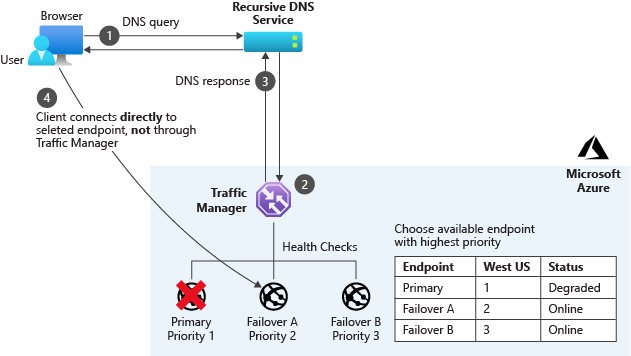

In a distributed app, it's essential to ensure that components can communicate reliably, and requests can route to a different component or region when there's a failure.

We've decided to rearchitect our shipping portal in Azure to reduce its vulnerability to regional failure. We want to ensure that the application fails over onto components in a secondary region when the primary region is unavailable. The failover should cause minimal disruption in service delivery to users. 

Here, we learn how Azure DNS, Traffic Manager, Front Door, and Azure CDN support our shipping company's app architecture.

## Azure DNS

Recall from earlier that we don't need any changes for our Azure DNS implementation. We use Azure DNS to host the domain name records that identifies our app.

Azure DNS provides name resolution entirely through the Azure infrastructure. This service is inherently multi-regional, and that's why there's no need to modify our existing Azure DNS configuration to support the feature in our new architectural design.

The Azure DNS SLA also has a 100% guarantee that valid DNS requests receive a response from at least one Azure DNS name server all the time.

## Choose a traffic router

We need a service that can load balance and redirect traffic across multiple regions with distributed web applications.

Azure provides several different services that can route traffic between front-end components. Recall that we need to replace our Azure Application Gateway as it's single region bound. If that region fails, there's nothing to do the routing.

There are two traffic routers in Azure that can do global routing between multiple regions, and aren't vulnerable to a single region outage:

- Azure Traffic Manager
- Azure Front Door

Let's examine these services in more detail so that we can choose the right router for our application.

### What is Azure Traffic Manager?

Azure Traffic Manager is a global load balancer that uses DNS records to route traffic to destinations in multiple Azure regions.

We can configure Traffic Manager to route all requests to our primary region, and monitor the responsiveness of the App Service in that region. If the App Service in the primary region fails, Traffic Manager automatically reroutes user requests to the App Service in the secondary region. This reroute executes the failover that ensures continuous service. We call this arrangement the **priority routing mode**.

Because Traffic Manager uses the DNS system to route traffic, it routes any protocol, not just HTTP traffic. However, Traffic Manager can't route or filter traffic based on HTTP properties, such as client country codes or user-agent headers. It also can't do Transport Layer Security (TLS) protocol termination, where the router decrypts requests and encrypts responses to take that load off the App Service virtual servers. If we need either of these features, we have to use Azure Front Door.

Traffic Manager uses highly configurable endpoint monitoring. For example, we can define the protocol, port, path, custom header settings, expected status code ranges, and tolerated number of failures. Endpoint monitoring gives us a continuous idea of the overall health of all parts of our application.

### What is Azure Front Door?

Like Traffic Manager, Azure Front Door is a global load balancer. Unlike Traffic Manager, it works at the network application layer, Layer 7, and uses HTTP and HTTPS properties to do filtering and routing.

With Front Door, we can do many types of routing that Traffic Manager doesn't support. For example, we can route traffic based on the browser's country code. Front Door also supports TLS protocol termination.

There is, however, an exception. If we want to route traffic for any protocol other than HTTP and HTTPS, we have to use Traffic Manager.

Front Door enables us to assign priorities to the various back ends that make up the tracking portal. These priorities enable Front Door to route requests as needed. We assign our primary region services with a top priority and our secondary region service with a lower priority.

Front Door implements health probes to monitor the health status of our services, and if there's a failure it can route traffic correctly. The priority routing mode and endpoint monitoring in Front Door is similar to those features in Traffic Manager, except that health probes always work over HTTP.

All the traffic for our shipping portal's web UI and its APIs are done over HTTPS and allows us to switch out Azure Traffic Manager with Front Door. We can also configure Front Door with priority back-end assignment.

## Azure CDN

In our single-region architecture, we used Azure CDN to cache static content from Azure Blob Storage. The Azure CDN service is a global network of servers that caches static content close to users. We don't need to modify this service for the multi-region architecture.  However, there are considerations regarding our Azure Storage account that we'll cover in the next unit.
